#

 Access to process data is fundamental to building an industrial `HMI` (Human Machine Interface). **Open Platform Communications (OPC)** is the interoperability standard for the secure and reliable exchange of data in the industrial automation space. The `OPC Classic` specifications are based on Microsoft Windows technology using the `COM/DCOM` (Distributed Component Object Model) for the exchange of data between software components. The specifications provide separate definitions for accessing process data, alarms and historical data. The use of the term `OPC` in this chapter references the `OPC Classic` specification. The `OPC XML-DA` (Data Access) specification builds on the `OPC Classic` data access specifications to communicate data in `XML` format. It incorporates `SOAP` and Web services  and it is not tied to Microsoft `COM/DCOM` as the other `OPC Classic` specifications are. `OPC XML-DA` servers can also present data from other data sources such as `Modbus` servers.

---
## Overview

**SmartWEB** can visualize data from `OPC XML` sources. The data is provided to the Web pages by so-called `OPC XML providers`. Each `Content Type`, respectively its `Content Items` (Web pages), can be connected to several data providers. The data providers are connected to `OPC XML gateways`. The gateway represents the connection to an `OPC XML` server that can supply data from different data sources. A gateway can serve more than one provider and there is no limit to the number of configured `OPC XML` gateways and providers in the system. The following picture illustrates these relationships.

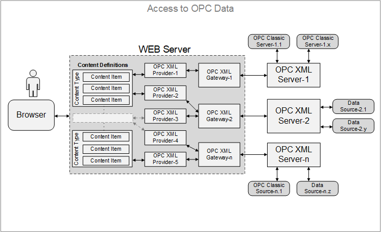

To understand the concept of `Content Type` and `Content Items` see chapter [Content Anatomy](/content-anatomy).

!!! attention "Attention"
    The **OPC Foundation** only provides a specification for `OPC XML-DA`. **Smartsys Ltd** is developing an **`Smart OPC XML Server`** that provides end points for both `OPC XML-DA` and `OPC XLM-HDA` (History Data Access). Data access part of this server is fully compatible with **OPC Foundation** specification, while `HDA` part was developed by **Smartsys Ltd** in a similar way to the `OPC XML-DA` specification and it provides data from `OPC HDA Classic` data sources in `XML` format. The company is also developing test clients for `OPC XML-DA/HDA` to facilitate configuration and setup. For additional information about installing and configuring **`Smart OPC XML Server`**, see the related documentation [here](/).

Configurations for `OPC XML-DA` and `OPC XML-HDA` in **SmartWEB** are discussed in separate sections later in this chapter.

---
## OPC XML-DA

To configure `OPC XML-DA` gateways and providers, you must first be logged into **SmartWeb** with administrative credentials. Navigate to the admin's `Dashboard`, as shown in the next picture.

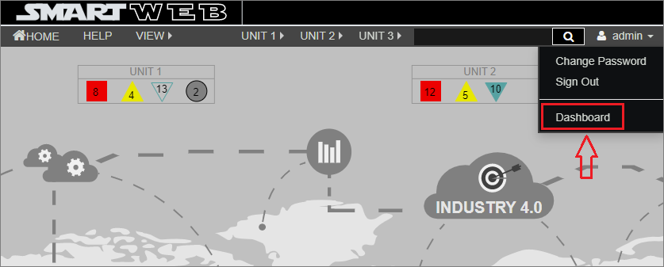

---
#### OPC XML-DA Gateways

To configure the `OPC XML-DA` gateway, follow the steps below, which are also illustrated in the next picture. 

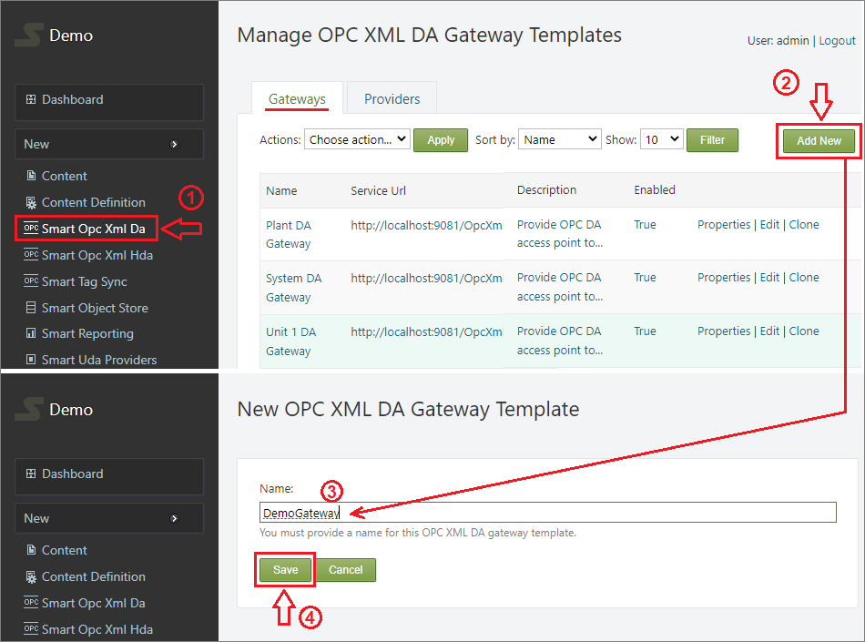

`(1)` - In the Administration Dashboard, click the `Smart Opc Xml Da` link. By default it will open a tab with the currently configured `OPC XML-DA` gateways.  
`(2)` - Click the button `Add New`. This will take you to a new page as shown in the picture.  
`(3)` - Type the name of your new gateway.  
`(4)` - Click the button `Save`.  

Your new gateway has been created in the system. The name of the new gateway can be changed later from the `Properties` link located on the right side opposite the gateway name in the gateway list. There are also links to `Edit`, `Clone` and `Delete` the gateway.

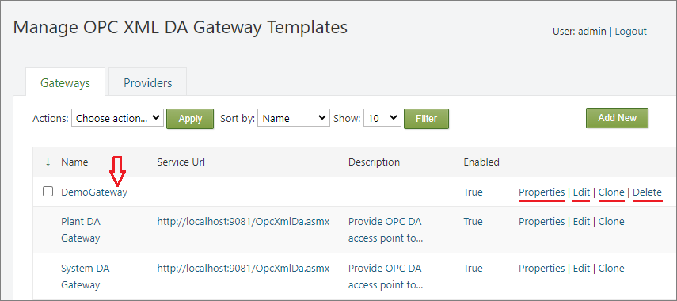

!!! attention "Attention"
      A gateway that has providers attached to it cannot be deleted. The `Delete` link is not available in this case. To delete such a gateway, you must first unlink all providers attached to it. 

Once you have created the gateway, you need to configure it. To do this click on the `Edit` link. This will open a new window where you can configure settings specific to that gateway. The next few pictures show the `OPC XML-DA` gateway settings, divided into groups. 

The first group of settings is shown in the next picture.
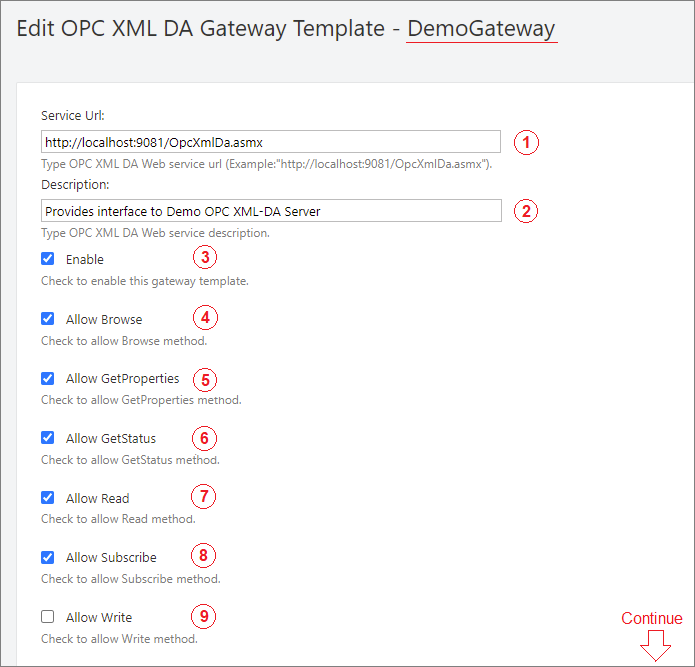

`(1)` - Enter the `URL` to the `OPC XM-DA` service. The `URL` that is shown in the example is for the **`Smart OPC XML Server`** when the service is installed on the same computer with **SmartWEB** application server and it is listening on `TCP` port 8091. The service can of course be installed on another computer and the port changed in the server configuration file. For more information on installing and setting up the **`Smart OPC XML Server`**, see the server documentation [here](/). If you are using `OPC XML` servers from other vendors see their documentation to set up the `URL` correctly. Use the **`Smart OPC XML-DA Client`** to verify the operability of each `OPC XML` server before setting up the `URL` in **SmartWEB**.  
`(2)` - Optionally, you can write a descriptor for this gateway here.  
`(3)-(9)` - These options enable or disable specific methods. See the `OPC XML-DA` specification for details related to the methods supported by the protocol.

The next group of settings are responsible for setting up authentication.
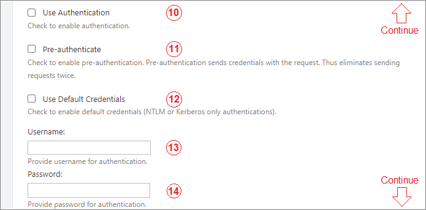

`(10)` - The `Use Authentication` option enables authentication communication between `OPC XML-DA` gateway and the `OPC XML-DA` server. When this option is selected, a username and password must be entered in their fields below. This option can only be used when the `OPC XML-DA` server supports authentication.  
`(11)` - When the `Pre-authenticate` option is enabled, then `OPC XML-DA` gateway which is in the client role will send the credentials along with the data request instead of waiting for the server to request them. This reduces requests twice and speeds up communication. Like the above option, this can only be used if the server supports this mode of communication.  
`(12)` - The `Use Default Credentials` option instructs `OPC XML-DA` gateway to use the default credentials. These are the credentials with which **SmartWEB** application authenticates itself to the operating system. In this case, the username and password can be omitted.  
`(13)` - The `Username` of the authentication account is entered here.  
`(14)` - The `Password` of the authentication account is entered here.  

The following settings are used for SSL communication with the `Smart OPC XML Server`.

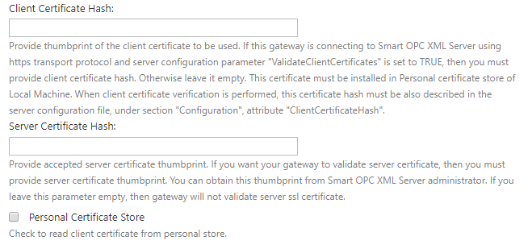

SSL can be used  by setting the URL of the service to start with
`https://` (if the server supports SSL communication). The server's certificate thumbprint can be checked via the provider
`Server Certificate Hash` field.

If а specific certificate has to be used to communicate with the 
OPC XML server (because the server also checks the thumbprint of the
client), provide the client certificate's thumbprint in the
`Client Certificate Hash` field. The used client certificate must be
installed on the machine where the **SmartWEB** application is running.
If the certificate is installed in the 
personal certificate store, the
`Personal Certificate Store` option must also be checked.

!!! note "Note:" 
      You will not be able to save the settings if the 
      `Client Certificate Hash` is provided and the certificate is not found on
      the machine.

!!! note "Note:" 
      When installing a client certificate, it is better to use
      `Local Machine` as a store location.

!!! warning "Warning:" 
      The Certificate thumbprint displayed in the MMC
      certificate snap-in has an extra invisible unicode character. Do NOT copy the 
      "extra space" that appears before the certificate thumbprint from the
      Richedit control. If you copy and paste the thumbprint with the extra
      (invisible) character, this will lead to errors like - unable to find
      client's certificate or unable to validate the server's certificate.

Three options are available for `Compression Type` -
`none`, `decompress`, and `gzip`. If `none` is chosen, no compression
algorithms are applied during conversation. The `Decompress` option means
requests are not compressed, but the server response may be. The 
`gzip` option (available only when communicating with the `Smart OPC XML Server`) means that requests and responses must be compressed with the `gzip`
algorithm.

The `Use Chunked Transfer` option enables chunked transfer encoding. The
data stream is divided into a series of non-overlapping chunks. This
allows a server to maintain an HTTP persistent connection for
dynamically generated content.

The `Max Connection Groups` option determines the maximum open sockets to
use when communicating with the server. The range is between 16 and
1024.

The next option is `Entry Point`. In order to use this option, the configuration  must first be saved. The server's address
space can then be browsed.

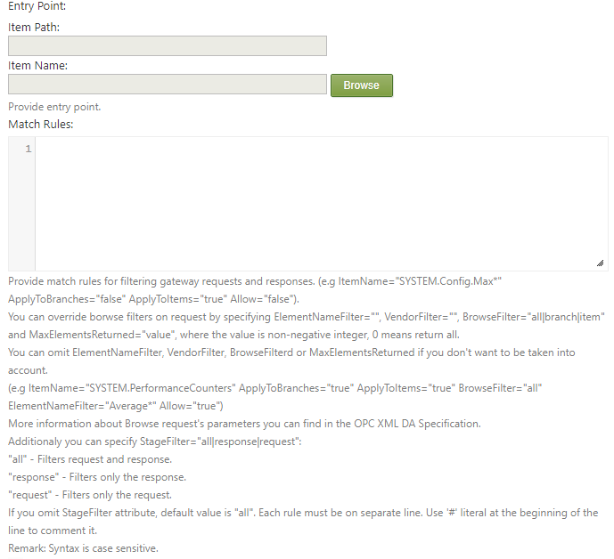

If the `Entry Point` is provided, browse requests will return this node as the 
root.

`Match Rules` are used to filter gateway browse requests and responses.
Each rule must be on a separate line. Literal `#` in the beginning of the
line is used to comment it. The available attributes are:

`ItemPath` - item path of the element to apply the rule.

`ItemName` - item name of the element to apply the rule.

!!! note "Note:"
     ItemPath and ItemName support wildcard expressions.

`ApplyToBranches` - if set to `true`, the rule is applied to branches.

`ApplyToItems` - if set to `true`, the rule is applied to items.

`Allow` - if `true`, the rule is to permit, `false` is to deny.

`BrowseFilter` - if set, overrides the browse filter for the specified rule.
Available values are `all`, `branch`, and `item`. More information on browse
filters can be found in the OPC XML DA specification.

`ElementNameFilter` - if set, overrides the element name filter of the
browse request. Supports wildcard expressions. More information on element name
filters can be found in the OPC XML DA specification.

`MaxElementsReturned` - a positive integer value, determining the
maximum elements that the server will return at once. More information on `MaxElementsReturned` can  be found in the OPC XML DA specification.

`StageFilter` - used to determine when a 
rule should be applied. The available options are - `all`, `response`, and `request`. These options are
self-explanatory.

!!! note "Note:"
If you omit the `StageFilter`, the default option will be - `all`,
which means requests and responses are matched against the rule.

!!! note "Note:" 
       The syntax is case sensitive.

The final section is `Permissions`.

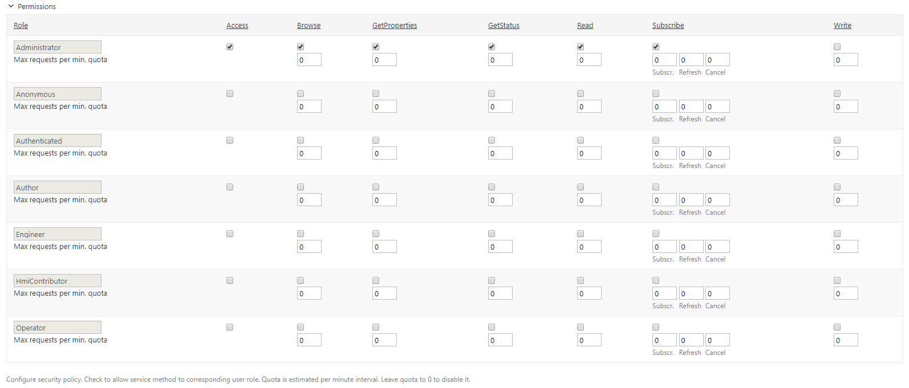

This section configures the security policy for the gateway. The roles are shown on the
left-most column of the table. The available actions, according to the OPC XML DA
specification, are placed in columns on the right side. If the `Access` column is not checked, the entire communication
via this gateway is forbidden for that role. Below each action there is
a checkbox that determines if the action is allowed or not. Below each
checkbox, there is a box for setting a quota. The quota represent how many
requests of a given type can be executed in a minute, after that the
gateway will reject the requests. 0 means no limitation. Only
the `Subscribe` column has 3 boxes for quotas - one for subscribe requests,
on for pool refreshes, and one for the cancel requests. For more
information about the subscribe mechanism, refer to the OPC XML DA specification.

Finally, save the last configuration. Press the
`Test connection` button to check if the gateway connects to the OPC XML
server.

If the connection succeeded, it will be indicated by green messages at the top of the
page.

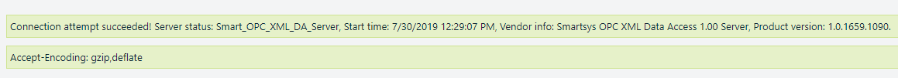

---
#### OPC XML DA Gateway Role Permissions

As well as the security policy for each gateway, there are role permissions for
the entire module, and all gateways. Navigate to the `Users` section on the admin dashboard, and click on the `Roles` tab.

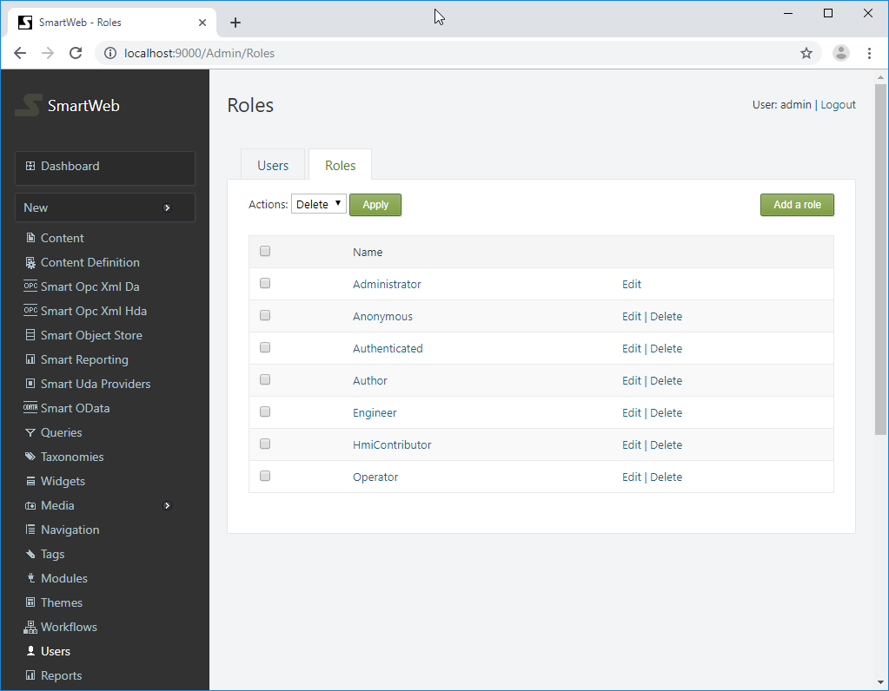

The available roles can be seen here. Click on the desired role and 
scroll down to the `Smartsys.OpcXmlDa.Gateway` permissions.

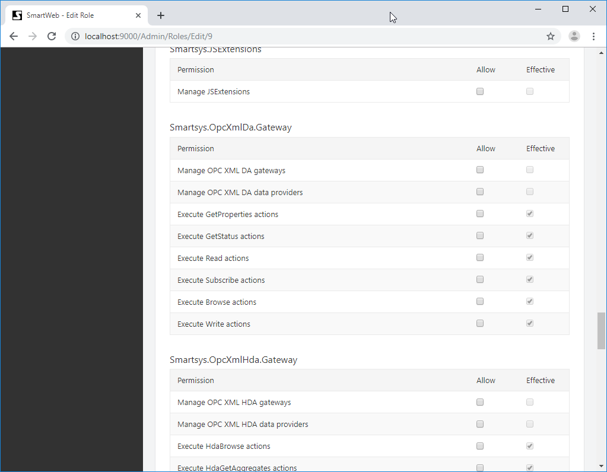

The available permissions are shown on the left side. There are 
two columns on the right side - `Allow` and `Effective`. The `Effective` column shows current
estimated permissions for that role. In the `Allow` column, role permissions can be given if they are not set. If a given role does not have permission over
a specified action, regardless of the security policy of the gateway, the user
that has that role will not be able to execute such requests.
**Manage permissions** must not be granted to regular users, they are only
for administering OPC XML DA gateways. In order for a given role to be able to administer
OPC XML DA gateways, **manage permission** must be granted to that role. The same
rule applies for managing OPC XML DA providers.

---

#### OPC DA Providers

HMI displays do not use OPC XML DA Gateways directly, instead 
they use OPC XML DA Providers. Each OPC XML DA Provider is connected to
one OPC XML DA Gateway. Providers have additional settings for
fine-graining conversation behavior with the OPC XML DA servers.

#### Creating OPC XML DA Provider Template

Click on the `Providers` tab (next to the `Gateways` tab).

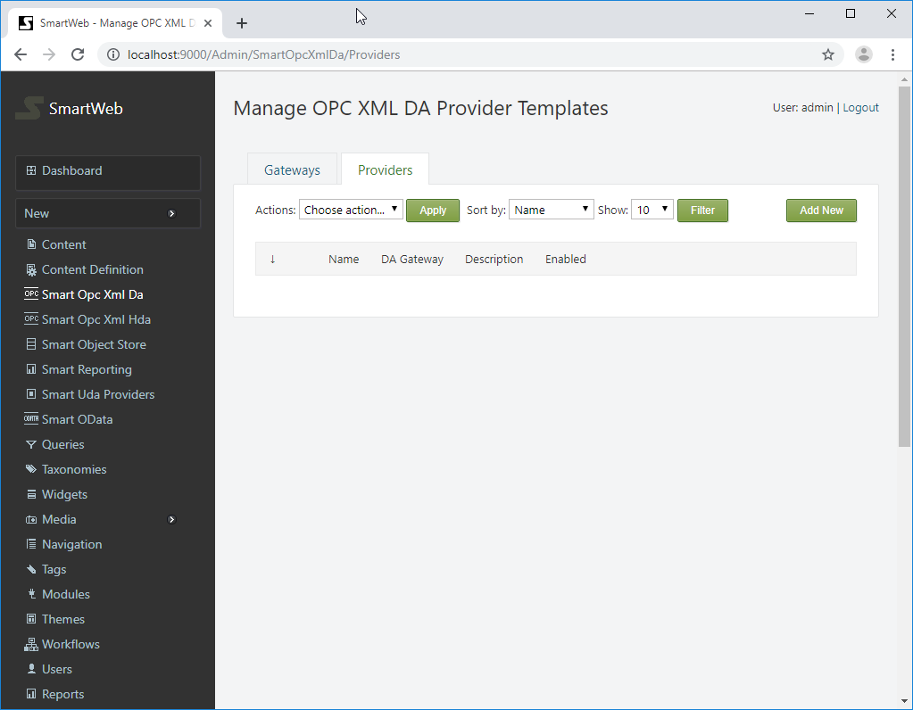

To add a new provider template, press the `Add New` button on the right
side. Provide a name and press the `Save` button to create the new provider template.

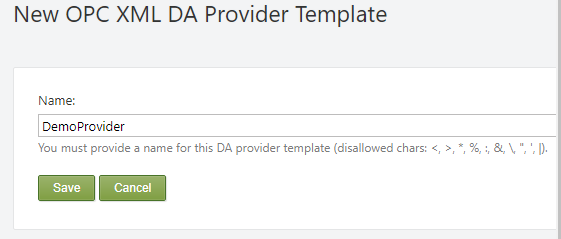

!!! note "Note:" 
       There are disallowed chars for provider name:
       <, >, *, %, :, &, \, ", ', |.

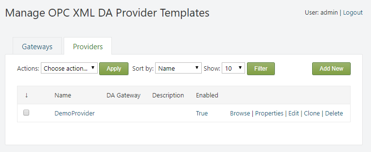

The name of the provider template can be edited from the `Properties` link on the right side. It can also be deleted via the `Delete` link, and cloned via the `Clone` link.

!!! note "Note:"
      The provider template can not be deleted if there are
       content types or items, which have providers that are using it.

Press `Edit` link to configure the provider template.

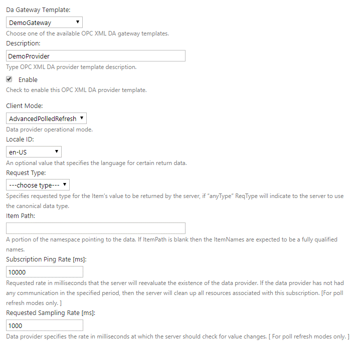

First, a gateway template must be attached to the OPC XML DA provider.
Available gateways can be chosen from the `Da Gateway Template` drop
down list. Optionally, a provider's description can be given. The `Enable` checkbox enables communication through this provider.
The `Client Mode` determines how data is delivered to the client. There are
three modes available - `Read`, `Basic Polled Refresh` and
`Advanced Polled Refresh`. When `Read` is selected, the client sends
`Read` requests to the server to get the data. When
`Basic Polled Refresh` is selected, the client sends poll requests, and the
server responds immediately - returning all value and/or quality changes
since the previous poll. When `Advanced Polled Refresh` is selected,
two additional parameters are used - `Hold Time` and `Wait Time`.

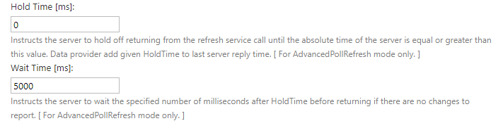

Both parameters are specified in milliseconds. `Hold Time` instructs the
server to hold off response, until the specified absolute server time is
reached. `Wait Time` instructs the server to wait a set amount of time
after the `Hold Time` is reached, before responding if there are no
changes to report. A change in one of the subscribed items, during this
wait period, will result in the server responding immediately, rather
than completing the wait time. More information on subscription architecture
can be found in the OPC XML DA specification.

`Locale ID` - This option is used by the client to tell the server the preferred
locale to be used. The server is not obligated to accept it. In that
case, the server will respond respond with a revised locale.

`Request Type` - Specifies the requested type for the item value that will be
returned by the server on `Read` requests.

!!! warning "Advice:"
       It is better to leave this option blank, and let the server return values as is.

`Item Path` - A portion of the namespace that is pointing to the data. If
`Item Path` is blank, then the requested item names are expected to
be a fully qualified names. For more information, refer to the OPC XML
DA specification.

`Subscription Ping Rate` - The requested rate (in milliseconds) at which the
server will reevaluate the existence of the client. If no communication between the server and the client has been established in the specified period, the server is
free to clean up all resources associated for this subscription. This
option is only applicable for basic or advanced polled refresh approaches.
For more information, refer to the OPC XML DA specification.

`Requested Sampling Rate` - The client specifies the rate (in
milliseconds) at which the server will check for value changes. This
option is only applicable for basic or advanced polled refresh approaches.

`Deadband` - Specifies the percentage of the full engineering unit range of
an item's value that must change prior to being returned in a response.
This option is only applicable for basic or advanced polled refresh
approaches.

`Max Age` - Indicates the requested age of the data in 
milliseconds. The data must be no older than this value. This option
is only applicable when the `Read` client mode is used.

`Request Deadline` - Indicates the time (in milliseconds) which the provider will add 
to the last server reply time, in order to form the specific absolute time (in UTC)
that the client wants to wait for the Server to process a response by,
either returning whatever data it might have, or confirm that there was
some error condition which prevents a successful response. This option
is only applicable when `Read` client mode is used.

`Delay Time` - The period (in milliseconds) in which the provider will make data
refresh requests to the server.

`Max Elements Returned` - The maximum amount of elements that will be returned at
once from server on `Browse` request. 0 means no limitation.

`Default Element Name Filter` - An expression used to filter element
names. This is applicable for `Browse` requests only. For more
information, refer to the OPC XML DA specification.

`Default Vendor Filter` - A vendor specific expression that will be
used to filter vendor specific information. This is applicable for
`Browse` requests only. For more information, refer to the OPC XML DA
specification.

`Timeout` - The maximum duration (in milliseconds) that the provider will wait for a
server response, after that, the request will be canceled, and the provider will
trigger a communication error. For the `Advanced Polled Refresh` mode,
the configured `Timeout` will be taken into account after the `Wait Time` (total
expire time = `Hold Time` + `Wait Time` + `Timeout`). If the value
is set to 0 or empty, then the `Timeout` value will be set as the default value,
calculated by one of the following equations:
`2*Requested Sampling Rate` for `Advanced Polled Refresh` mode, and
`2*Delay Time` for `Read` and `Basic Polled Refresh` modes (the lowest
acceptable value is 1000 milliseconds).

`Recovery Period` - The period (in milliseconds) after which the data provider
will try to recover the communication on error. If the `Recovery Period`
is 0 or empty, the recovery is disabled.

`Return Error Text` - If checked, the server will return an error
description.

`Return Diagnostic Info` - If checked, the server will return 
server specific diagnostic information that is relative to item specific errors. The server is required to return
specific diagnostic information, or a blank string if the diagnostic
information is not available.

`Return Item Time` - If checked, the server will return an item timestamp
in the response. Use this option when the provider delivers data to a live
updating trend component.

`Return Item Name` - If checked, the server will include the item name in
the response.

`Return Item ``Path `- If checked, the server will include the item path in
the response.

`Return Values On Reply` - If checked, the server will include item
values in the reply of the subscribe request. This option is only applicable
 for basic or advanced polled refresh approaches.

`Enable Buffering` - If checked, the client will request that the
server uses the `Requested Sampling Rate` to check for value
changes, and save all changes in a buffer, to be returned to the client at the
next subscription polled refresh request. This option is only applicable
for basic or advanced polled refresh approach.

`Return All Items` - If not checked, the server will only return the
changed items, since the last data refresh request. If checked, the server
will wait the `Hold Time`, but then return with all current values
(and any buffered values if `Enable Buffering`), ignoring the change
status of the items. The `Wait Time` is not considered under
this condition. This option is only applicable for basic or advanced
polled refresh approaches.

`Enable Statistics` - If checked, the data provider will generate statistics
information.

!!! note "Note:"
 If provider is attached to a `Content Type` or `Content
Item`, the corresponding buttons for related content will be green, and the 
`Delete` button will become gray. The provider must be detached from any `Content Types` or `Content
Items`, in order to be deleted.

#### Attaching OPC XML DA Provider to a Content Type

In order to be able to use an OPC XML DA provider, it must first be attached to a `Content Type` as a `Content Part`. Navigate to the 
`Content Definition` section in the admin panel. From the `Content Types` tab, find the appropriate `Content Type` and
click `Edit`.

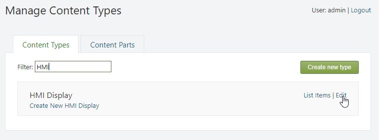

Press the `Add Parts` button. Find and select the
`Smartsys Opc Xml Da Data Providers` part, and press the `Save`
button at the bottom.

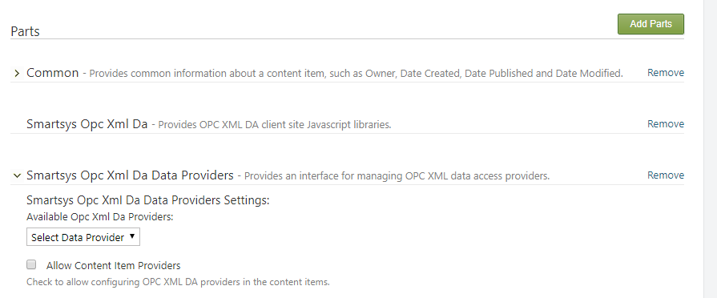

Expand the
`Smartsys Opc Xml Da Data Providers`. Available provider templates can be selected via the dropdown list. 
Selected provider templates 
will be added to the `Content Type` immediately. You can add more than one
provider.

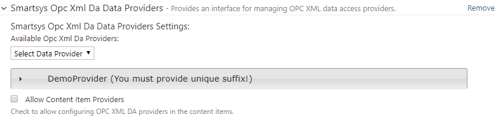

Expand the newly added provider to configure it.

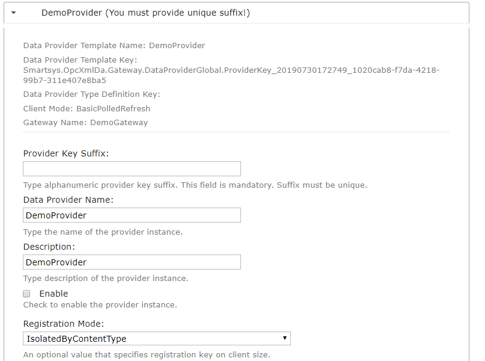

`Provider Key Suffix` - alphanumeric provider's key suffix. This field
is mandatory, and must be unique.

`Data Provider Name` - name of the provider instance.

`Description` - description of the provider instance.

`Enable` - must be checked, otherwise it will be disabled and will not
work on the page.

`Registration Mode` - defines how the provider is registered and how it is
shared across the page. There are four available registration modes:

`IsolatedByContentType` -  regardless of how many `Content Items`
of the same type are visualized together on the same page, there will be
only one registered data provider serving all of them.

`IsolatedByContentTypeAndContentItemId` - `Content Items`
of the same type  that are visualized together on the same page, will each have
an individually registered data provider, serving only it's particular
`Content Item`.

`IsolatedByProviderTemplate` - regardless of how many `Content Items` (regardless of type) are visualized together on the same
page, there will be only one registered data provider of a given
provider template.

`IsolatedByProviderTemplateAndContentTypeProviderName` - regardless of how many `Content Items` (regardless of type) are visualized together on the same
page, there will be only one registered data provider of a given
provider template, with the same
`Data Provider Name` that is specified in the `Content Type` definition.

These provider registration modes are used to share and minimize the
number of registered data providers on a page. Shared providers enlarge
subscription lists with data points from different `Content Items`, and
create one subscription for all of them. Thus, all items are refreshed with only 
one data refresh request, and client-server round-trips are considerably
reduced.

The next available settings are the same as those that were described in the OPC
XML DA Provider template creation segment. They are loaded from the used template
and can be overridden.

Below the added data providers, there is an `Allow Content Item Providers` check
box. If this option is checked, it will allow the addition of OPC XML DA data
providers in a particular `Content Item` of this type. 

!!! warning "Important:"
       Use
       this option carefully. If a data provider is created 
       for each `Content Item`, and subsequent changes to the provider
       settings need to be made, the user has to go through all of the   `Content Items` to make
       the necessary changes, so the recommendation is to stick to `Content Type`
       providers.

---

## OPC XML-HDA

#### Preconditions

1.  Administrator rights on the **SmartWEB** application.

---

#### OPC HDA Gateways

Sign in the **SmartWEB** site. Navigate to the admin's `Dashboard`.

Click on the `Smart Opc Xml Hda` link on the left side. The page for managing `OPC XML HDA Gateway Templates` will be displayed. Press the `Add New`
button to create a new one.

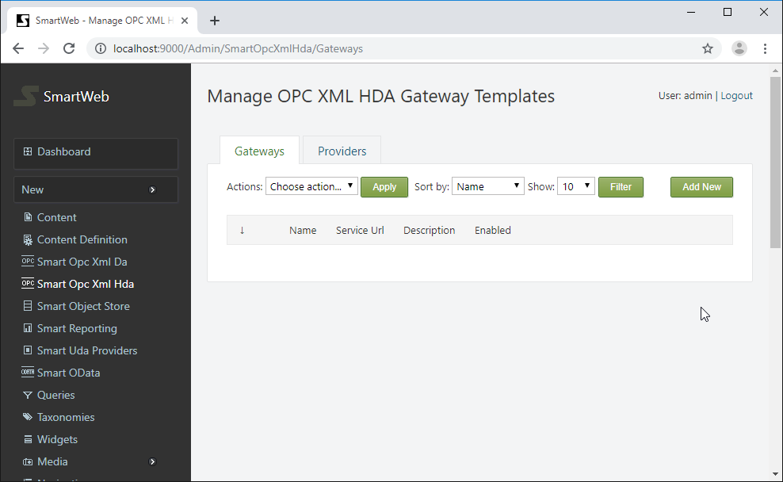

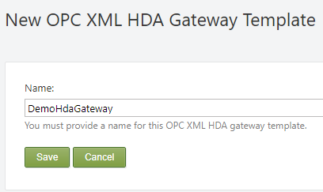

Provide a name of the gateway and press the `Save` button to create it..

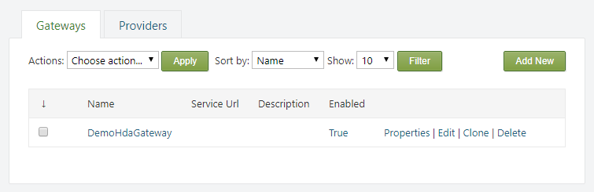

From the `Properties` link on the right side,
the name of the gateway can be edited. It can also be deleted via the `Delete` link, and cloned via the `Clone` link.

!!! note "Note:" 
     You cannot delete a gateway if there is an attached provider
     to it.

Press `Edit` link to configure the gateway.

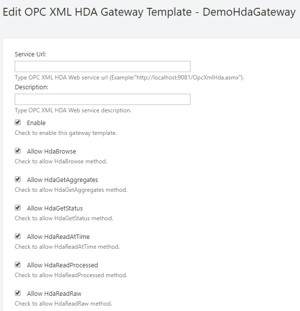

A service URL must be provided to the Smart OPC XML Server. Optionally, a description can be set. The `Enable` checkbox enables 
communication through this gateway. The next six checkboxes will toggle specific operations through this gateway.

The following settings are for configuring the authentication.

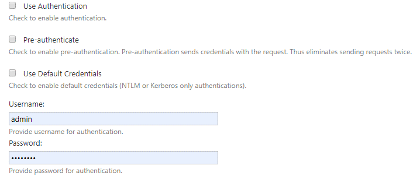

If `Use Authentication` is checked, a username and
password must be provided in their respective fields. Alternatively, the `Use Default Credentials` must be checked. In this case, the running
**SmartWEB** application credential will be used. Check the 
`Pre-authenticate` option to reduce client-server requests and fasten
the communication. When this option is enabled, the client will send the 
credentials with request, instead of waiting for the server to ask for them.

The following settings are used for SSL communication with the Smart OPC XML
Server.

SSL can be used  by setting the URL of the service to start with
`https://` (if the server supports SSL communication). The server's certificate thumbprint can be checked via the provider
`Server Certificate Hash` field.

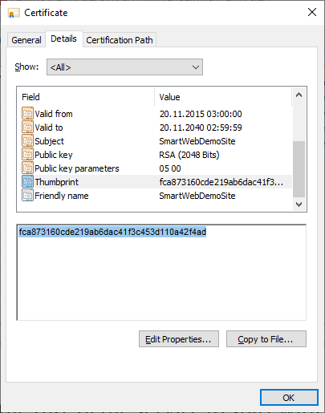

If а specific certificate has to be used to communicate with the
OPC XML server (because the server also checks the thumbprint of the
client), provide the client certificate's thumbprint in the
`Client Certificate Hash` field. The used client certificate must be
installed on the machine where the **SmartWEB** application is running.
If the certificate is installed in the 
personal certificate store, the
`Personal Certificate Store` option must also be checked.

!!! note "Note:" 
      You will not be able to save the settings if the 
      `Client Certificate Hash` is provided and the certificate is not found on
      the machine.

!!! note "Note:" 
      When installing a client certificate, it is better to use
      `Local Machine` as a store location.

Three options are available for `Compression Type` -
`none`, `decompress`, and `gzip`. If `none` is chosen, no compression
algorithms are applied during conversation. The `Decompress` option means
requests are not compressed, but the server response may be. The 
`gzip` option (available only when communicating with Smart OPC XML
Server) means that requests and responses must be compressed with the `gzip`
algorithm.

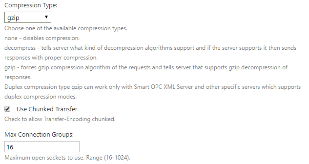

The `Use Chunked Transfer` option enables chunked transfer encoding. The
data stream is divided into a series of non-overlapping chunks. This
allows a server to maintain an HTTP persistent connection for
dynamically generated content.

The `Max Connection Groups` option determines the maximum open sockets to
use when communicating with the server. The range is between 16 and
1024.

The final section is `Permissions`.

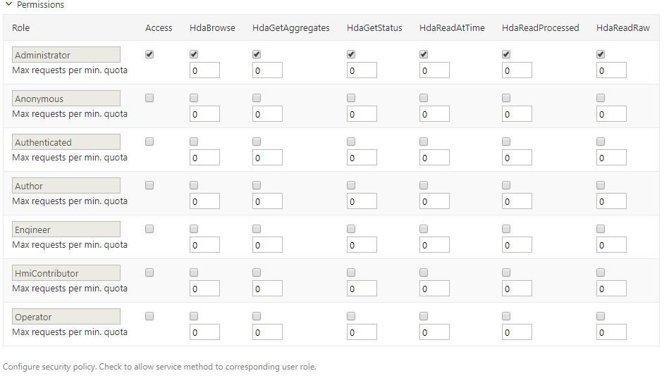

This section configures the security policy for the gateway. The roles are shown on the
left-most column of the table. The available actions are placed in columns on the right side. If the `Access` column is not checked, the entire communication
via this gateway is forbidden for that role. Below each action there is
a checkbox that determines if the action is allowed or not. Below each
checkbox, there is a box for setting a quota. The quota represent how many
requests of a given type can be executed in a minute, after that the
gateway will reject the requests. 0 means no limitation.

Finally, save the last configuration. Press the
`Test connection` button to check if the gateway connects to the OPC XML
server.

If the connection succeeded, it will be indicated by green messages at the top of the
page.

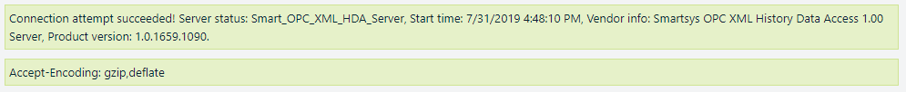

#### OPC XML HDA Gateway Role Permissions

As well as the security policy for each gateway, there are role permissions for
the entire module, and all gateways. Navigate to the `Users` section on the admin dashboard, and click on the `Roles` tab.

The available roles can be seen here. Click on the desired role and 
scroll down to the `Smartsys.OpcXmlHda.Gateway` permissions.

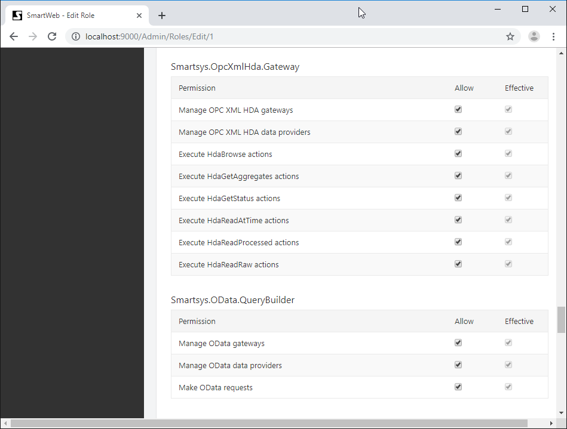

The available permissions are shown on the left side. There are 
two columns on the right side - `Allow` and `Effective`. The `Effective` column shows current
estimated permissions for that role. In the `Allow` column, role permissions can be given if they are not set. If a given role does not have permission over
a specified action, regardless of the security policy of the gateway, the user
that has that role will not be able to execute such requests.
**Manage permissions** must not be granted to regular users, they are only
for administering OPC XML HDA gateways. In order for a given role to be able to administer
OPC XML HDA gateways, **manage permission** must be granted to that role. The same
rule applies for managing OPC XML HDA providers.

---

#### OPC HDA Providers

HMI displays do not use OPC XML HDA Gateways directly, instead 
they use OPC XML HDA Providers. Each OPC XML HDA Provider is connected to
one OPC XML HDA Gateway. Providers have additional settings for
fine-graining conversation behavior with the OPC XML HDA servers.

####Creating OPC XML HDA Provider Template

Click on the `Providers` tab (next to the `Gateways` tab).

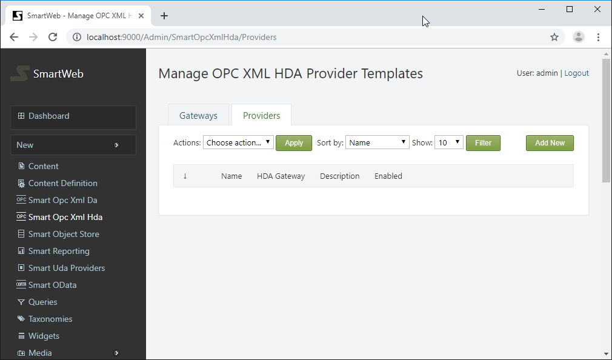

To add a new provider template, press the `Add New` button on the right
side. Provide a name and press the `Save` button to create the new provider template.

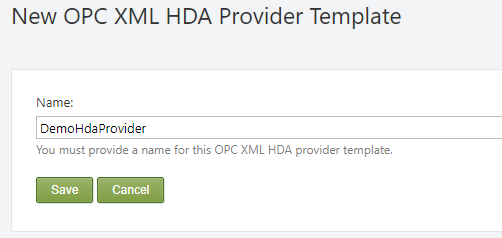

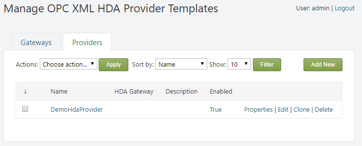

The name of the provider template can be edited from the `Properties` link on the right side. It can also be deleted via the `Delete` link, and cloned via the `Clone` link.

!!! note "Note:"
      The provider template can not be deleted if there are
       content types or items, which have providers that are using it.

Press the `Edit` link to configure the provider template.

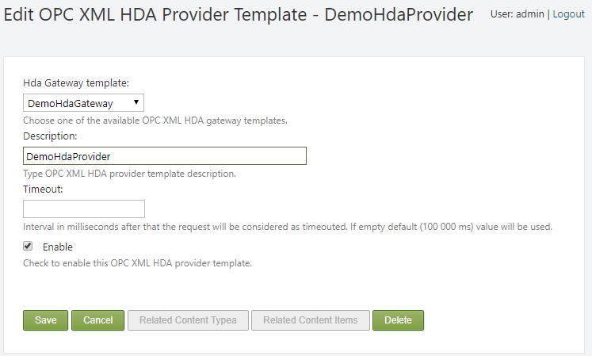

First, a gateway template must be attached to the OPC XML HDA provider.
Available gateways can be chosen from the `Hda Gateway Template` drop
down list. Optionally, a provider's description can be given. The `Enable` checkbox enables communication through this provider.

`Timeout` - the  maximum duration (in milliseconds) that the provider will wait for a
server response. After that, the request will be canceled, and provider will
trigger a communication error. If the value is empty, the default value of 100
000 milliseconds will be used.

#### Attaching OPC XML HDA Provider to a Content Type

In order to be able to use an OPC XML HDA Provider, it must first be attached to a `Content Type` as a `Content Part`. Navigate to the 
`Content Definition` section in the admin panel. From the `Content Types` tab, find the appropriate `Content Type` and
click `Edit`.

Press the `Add Parts` button. Select the
`Smartsys Opc Xml Hda Data Providers` part, and press the `Save` button
at the bottom.

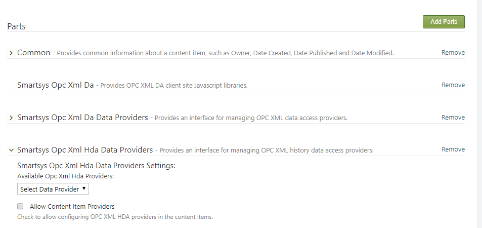

Expand the newly added `Smartsys Opc Xml Hda Data Providers` part. Available provider templates can be selected via the dropdown list. 
Selected provider templates 
will be added to the `Content Type` immediately. You can add more than one
provider. If a given provider template is already added, it is not
displayed in the drop down list.

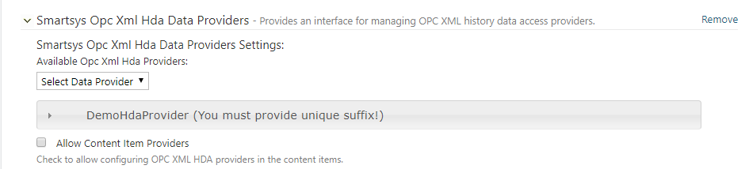

After adding a provider, it must be configured. Expand the newly added provider.

`Provider Key Suffix` - alphanumeric provider's key suffix. This field
is mandatory, and must be unique.

`Data Provider Name` - name of the provider instance.

`Description` - description of the provider instance.

`Enable` - must be checked, otherwise it will be disabled, and will not
work on the page.

Below added data providers there is `Allow Content Item Providers` check
box. If this option is checked, it will allow to add OPC XML HDA data
providers in a particular content item of this type. Be aware and use
this option carefully, because if you create particular data provider
for each content item and after that you need to change provider
settings, you will have to go through all of the content items to make
the necessary changes, so the recommendation is to stick to Content Type
providers.

Below the added data providers, there is an `Allow Content Item Providers` check
box. If this option is checked, it will allow the addition of OPC XML HDA data
providers in a particular `Content Item` of this type. 

!!! warning "Important:"
       Use
       this option carefully. If a data provider is created 
       for each `Content Item`, and subsequent changes to the provider
       settings need to be made, the user has to go through all of the `Content Items` to make
       the necessary changes, so the recommendation is to stick to `Content Type`
       providers.

---

## OPC Configuration Examples
