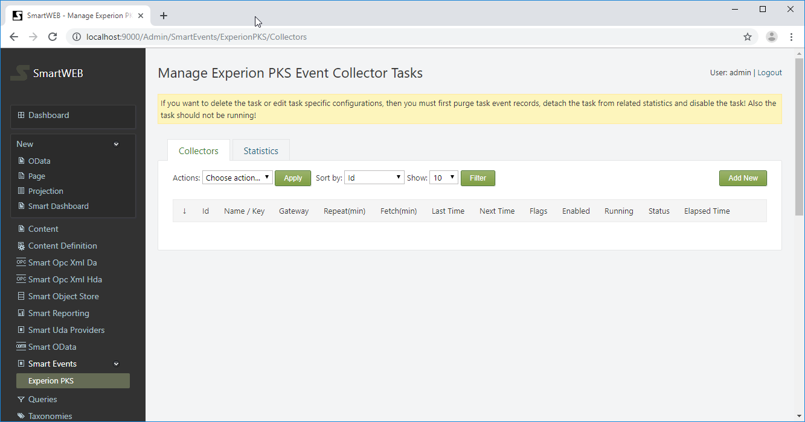
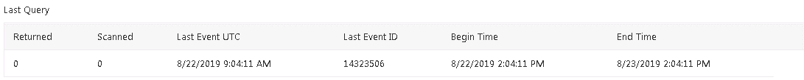
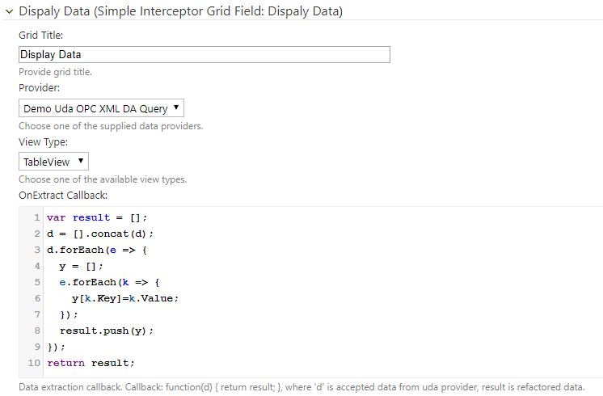

#

Access to relational data is an essential part of any **Content Management System (CMS)**. This type of data is stored into relational databases. A relational database is a type of database that stores and provides access to data points that are related to one another. Relational databases are based on the relational model, an intuitive, straightforward way of representing data in tables.  The **Open Data Protocol (OData)** is a data access protocol built on core protocols like `HTTP` and commonly accepted methodologies like `REST` for the Web.

---
## Overview

**SmartWEB** can visualize data from `OData` sources. The data is provided to the Web pages by so-called `OData` providers. Each `Content Type`, respectively its `Content Items` (Web pages), can be connected to several data providers. The data providers are connected to `OData` gateways. The gateway represents the connection to an `OData` server that can supply data from different relational databases. A gateway can serve more than one provider and there is no limit to the number of configured `OData` gateways and providers in the system. The following picture illustrates these relationships.


To understand the concept of `Content Type` and `Content Items` see chapter [Content Anatomy](../content-anatomy). 

!!! attention "Attention"
      **Smartsys Ltd** is developing an **Smart OData Server** which provides `OData` end point. The server supports connecting to many different relational databases simultaneously using plug-in technology. Any test client that supports `OData` protocol (like `LINQPad`) can be used to facilitate configuration and setup of `OData` end points. For additional information about installing and configuring **Smart OData Server**, see the related documentation [here](../).

---
## OData Gateways

To configure OData gateways, you must first be logged into **SmartWEB** with administrative credentials. Navigate to the admin's `Dashboard`, as shown in the next picture.


Click on the `Smart OData` link on the left side. The
page for managing `OData Gateway Templates` will now be open. Press the `Add New`
button to create a new one.


Provide name of the gateway and press the `Save` button to create the gateway.


The name of the gateway can be edited from the properties link on the right side. It can also be deleted via the `Delete` link.

!!! warning "Important:"
      You cannot delete a gateway if there is a provider attached 
      to it.

Press `Edit` link to configure the gateway.


A service URL has to be provided to the OData Server. A
description can be set. The `Enable` checkbox enables
communication through the gateway.

`Send Cookies ` - if checked, sends cookies with the request. (Used only
for self-hosted OData service)

`Allow Requests` - if checked, allows operations
through this gateway.

The following settings are for configuring authentication.


If the `Use Authentication` is checked, a username and
password must be provided in their respective fields. The `Use Default Credentials` option may also be selected (the running
**SmartWEB** application credentials will be used). Check the 
`Pre-authenticate` option to reduce client-server requests and fasten
the communication. With the `pre-authenticate` option enabled, the client sends
credentials with a request instead of waiting for the server to ask for them.

The following settings are used for SSL communication with the OData Server.


You can use SSL by just setting the beginning of the the URL of the service to `https://` (if the server supports SSL communication). 
If you want to check the server's certificate thumbprint, navigate to the 
`Server Certificate Hash` field.


If you want а specific certificate to be used to communicate with the
OData server (because the server also checks the thumbprint of the
client), provide the client certificate's thumbprint in the
`Client Certificate Hash` field. The used client certificate must be
installed on the machine where the **SmartWEB** application is running.
If the certificate is installed in the 
personal certificate store, the
`Personal Certificate Store` option must also be checked.

!!! note "Note:" 
      You will not be able to save the settings if the 
      `Client Certificate Hash` is provided and the certificate is not found on
      the machine.

!!! note "Note:" 
      When installing a client certificate, it is better to use
      `Local Machine` as a store location.

!!! warning "Warning:" 
      The Certificate thumbprint displayed in the MMC
      certificate snap-in has an extra invisible unicode character. Do NOT copy the 
      "extra space" that appears before the certificate thumbpint from the
      Richedit control. If you copy and paste the thumbprint with the extra
      (invisible) character, this will lead to errors like - unable to find
      client's certificate or unable to validate the server's certificate.

Two options are available for `Compression Type` - 
`none` and `gzip`. If `none` is chosen, no compression algorithms are
applied during conversation. The `gzip` option (available only when
communicating with Smart OData Server) means that requests and responses
must be compressed with the `gzip` algorithm.


The `Use Chunked Transfer` option enables chunked transfer encoding. The
data stream is divided into a series of non-overlapping chunks. This
allows a server to maintain an HTTP persistent connection for
dynamically generated content.

The `Max Connection Groups` option determines the maximum open sockets to
use when communicating with the server. The range is between 16 and
1024.

The `Request Timeout `option determines the timeout in milliseconds for each
request.

The final section is `Permissions`.


This section configures the security policy for the gateway. On the
left-most column of the table, the roles are shown . If the `Requests` column is
not checked, the communication via this gateway is forbidden for that
role.

Finally, save the last configuration. After that, press the
`Test connection` button to check if the gateway connects to the OData
server.

If the connection succeeded, you'll see green messages at the top of the
page.


####OData Gateway Role Permissions

As well as the security policy for each gateway, there are role permissions for
the entire module and all gateways. Navigate to the `Users` section via the navigation menu on the admin dashboard. Click on the `Roles` tab.


The available roles can be seen here. Click on the desired role and 
scroll down to the `Smartsys.OData.QueryBuilder` permissions.


The available permissions are shown on the left side. There are 
two columns on the right side - `Allow` and `Effective`. The `Effective` column shows current
estimated permissions for that role. In the `Allow` column, role permissions can be given if they are not set. If a given role does not have permission over
a specified action, regardless of the security policy of the gateway, the user
that has that role will not be able to execute such requests.
**Manage permissions** must not be granted to regular users, they are only
for administering OData gateways. In order for a given role to be able to administer
OData gateways, **manage permission** must be granted to that role. The same
rule applies for managing OData providers.

---

## OData Providers

The content does not directly use OData Gateways, it uses
OData Providers. Each OData Provider is connected to one OData Gateway.

####Creating OData Provider Template

Navigate to the `Providers` tab (next to the `Gateways` tab).


To add new provider template, press the `Add New` button on the right
side. Provide the name and press the `Save` button to create the new provider template.


The name of the provider template can be edited from the properties link on the right side. It can also be deleted via the `Delete` link.

!!! note "Note:"
      The provider template can not be deleted if there are
      content types or items, which have providers that are using it.

Press `Edit` link to configure the provider template.


First, a gateway template has to be attached to an OData provider. 
A gateway can be chosen from the `OData Gateway Template`
drop down list. A provider's description can be given, if it is necessary. The `Enable`
checkbox enables communication through this
provider.


!!! note "Note:"
       If the provider is attached to a `Content Type`, a yellow
       warning message will be shown at the top, the corresponding
       `Related content types` section will be shown, and the `Delete` button will
       become gray. In order to delete the provider, it must first be detached from any content types.

####Attaching OData Provider to a Content Type

In order to be able to use an OData provider, it must first be attached to a `Content Type` as a `Content Part`. Navigate to the 
`Content Definition` section in the admin panel. From the `Content Types` tab, find the appropriate `Content Type` and
click `Edit`.


Press the `Add Parts` button. Select the
`Smartsys O Data Providers` part, and press the `Save` button
at the bottom.


Expand the newly added `Smartsys O Data Providers` part. Available provider templates can be selected via the dropdown list. 
Selected provider templates 
will be added to the `Content Type` immediately. You can add more than one
provider. If a given provider template is already added, it is not
displayed in the drop down list.


After adding a provider, it must be configured. Expand the newly added provider.


`Instance Name` - name of the provider instance.

`Description` - description of the provider instance.

`Enable` - must be checked, otherwise it will be disabled, and will not
work on the page.

The `Smart O Data Query Builder` and
`Smartsys O Data Ng Grid` parts can now be used to show OData results from the
configured provider.

---

## EPKS Events

The **SmartWEB** application can collect **Experion PKS** alarms and events.
Data is collected through the **ODATA** service (provided by the **Smart ODATA
Server**) and stored in the application's database. A simple dataflow
diagram is shown below.


An `EPKS Event Collector Task`, reads and stores in `RDBMS`,
`Experion PKS` events through the `OData` service provided by
the `Smart OData Server`. The `Smart OData Server` maps `Experion PKS` events
data as `OData` entities.

####Preconditions


1.  **SmartWEB** with a Microsoft SQL Server's database (due to database
    limitations and negative performance impact consider using MS SQL
    Server Standard or higher editions).

2.  Administrator rights on the **SmartWEB** application.

3.  Enabled module `Smartsys OData QueryBuilder`.

4.  Enabled module `Smartsys Experion PKS Event Collector`.

5.  Configured **ODATA** gateway to the **Smart ODATA Server**.

####Creating EPKS Event Collector Task

To be able to collect `Experion PKS` events data, an
`Experion PKS Collector Task` must be configured.

Sign in the **SmartWEB** site. Navigate to the admin's `Dashboard`.

 

Expand the `Smart Events` and click on the `Experion PKS` link on the
left side. This will open the page for managing
`Experion PKS Event Collector Tasks`. Press the `Add New` button to
create a new one.

 

 

Provide the name of the task and press the `Save` button to create it.

 

From the properties link on the right side, the name of the task can be edited. It can also be deleted via the `Delete` link.

With the `Schedule Now` link, you can schedule the next run of the task.

!!! warning "Important:"
      Do not schedule the task until it is entirely configured,
      otherwise you will not be able to edit some configuration options.

With the `Synchronize` link, the `Synchronize` flag of the task can be set,
which means the scheduler will run the task to synchronize itself with the 
database, regardless if the task is scheduled or not.

With the `Purge` link, the `Purge` flag of the task can be set, which means
the scheduler will run the task to purge events until the retention policies
are satisfied, regardless if the task is scheduled or not.

With the `Terminate` link, the `Terminate `flag of the task can be set,
which means the scheduler will interrupt the task if is running, or the task will
not run at all if scheduled.

If a given flag is set, it can be unset by pressing the appropriate link
again. The `Purge` and `Synchronize` flags are unset automatically when the
operation completes, but the `Terminate` flag must be unset manually.

!!! note "Note:"
      Pressing `Schedule Now` link, schedules the task and
      clears all task flags!

!!! note "Note:" 
      If you want to delete or edit a task with protected
      parameters, the task event records must be purged first. This will detach the task
      from related statistics. The task should be disabled and should not be running!

Press the `Edit` link to configure the task.

 

First, a gateway to the
`Smart OData Server` must be provided. After setting the gateway, press the `Save`
button, but don't enable the task. Press the `Edit` link again to continue
configuring it.

`Enable` - Enables the task.

!!! note "Note:"
       Enable the task when everything else is configured.

`Repeat Interval (minutes)` - Specifies how often the task will 
get new data (5 minutes is a typical value). 0 means the task will
run only once, no repetitions.

`Query` - Specifies an ODATA query to be executed and collect events.
Different filters can be applied. Press the `View Entities` to see the
available ones. Copy and paste the desired one into the `Query` box.

 

`Event Categories` - Expand this option to configure the event categories. Each event is dispatched by its category to a
different table. Usually, the proposed default configuration is good enough, but it can be changed if needed.

 

!!! note "Note:"
      You will not be able to edit the `Query` or
      `Event Categories` if the task has event records, related
      statistics, is enabled, or is running!

`Fetch Interval [minutes]` - The default is 10 minutes. Specifies at what
time, portions of data will be fetched. If the interval is small there will
be many requests and data will be gathered very slowly. If the interval
is too big, requests will be much fewer, but large amounts of data will
be transferred and timeouts may occur. The interval also depends on how
fast the events occur. If the unit generates a huge amount of events for a
small period of time, then a small fetch interval will be more suitable
for use. Usually, the interval is between 60 and 1440 minutes, depending
of the frequency of the events.

`Request Timeout [ms]` - Timeout (in milliseconds) for each data fetch
request. The range is between (3000 and 600 000 ms). The default value is 60 000
ms (1 minute). Usually, it's enough. If you have a huge `Fetch Interval`,
consider revising the timeout.

`Sleep Between Requests [ms]` - Sleep interval (in milliseconds) between
two consecutive data fetch requests. 0 means no sleep. The default value is
0. Range is between 0 and 60 000 ms (1 minute). When the task
sends too many requests in a short amount of time, it's good practice
to provide time to "relax". In normal conditions it is not necessary.

`Retention Period [days]` - Amount of days that the events will be kept in the database. After that period, the events will be purged. The default value is 0, which means no limits, but it's good practice to provide it. If there are not many alarms on a daily basis, a long period (e.g. 365 days) can be set. If
there are a lot of generated events, the period should be kept short (e.g 30 days
or less).

!!! note "Note:"
      The speed of the queries will depend on the amount of events that are kept in the database.

`Retention Records` - How many records to keep in each table. If the
number of records in a given event's table becomes more than specified, the 
oldest records will be purged until the amount of remaining records is less than the limit. 0
means no limit.

!!! note "Note:" 
      An event is purged, regardless of which of the
      retention constraints is reached.

`Maximum Rows` - How many events to be fetched at once. The range is
between 10 and 30 000. The default and recommended value is 5 000.

`Collect Events After` - If specified, after that date, events will be
collected.

`Next Time` - Specifies when to run the task. After the task execution, the
field is cleared or the next execution time is set, depending on if the task has a  
configured `Repeat Interval`.

`Retry Attempts` - How many times an attempt will be made to fetch data on fail. The range
is from 0 to 10. The recommended value is 3.

`Save Retry Attempts` - How many times an attempt will be made to save data on fail.
The range is from 0 to 10. The recommended value is 3.

`Save Retry Attempts` - Interval (in milliseconds) between attempts to
save data on fail. The range is from 0 to 15000. The recommended value is
1000ms.

`Debug` - If checked, debug info will appear in the application log.

####EPKS Event Collector Task Details

At the bottom of the collector task configuration page, there are some
details.


The `Statistics`  table provides information about the current state of the task.

`Operation` - shows which operation is running at the moment (`Query`, `Purge` or `Synchronize`). When the task finishes, the last operation always remains. If the `Status` is empty, that means it was completed successfully.

The `Query` operation requests event data from the Smart OData server and processes it. The `Purge` operation deletes event data until the retention policies are satisfied. The `Synchronize` operation syncs the task state and counters, with the database.


`Status` - Available collector statuses are: `Pending`, `Processing`,
`Stuck`, `Failed`, `Terminated`, `Purging`, `Synchronizing`. A missing status indicates a successfully finished task.

A status is `Pending` when the task is started from the scheduler, but is still not processing. The `Processing` state means the task is running. The `Stuck` status indicates a missing heartbeat from the task (the task is probably "dead" and can be re-ran). The `Done` status indicates that the current task run is successfully completed. The `Failed` status indicates the task run is interrupted/failed. The `Terminated` status indicates the task is terminated by a user request. The `Purging` status indicates that the task is purging event data until the retention policies are satisfied. The `Synchronizing` status indicates that the task is synchronizing it's counters and state with the database.


`Queries` - how many queries are ran in the current task run.

`Total Returned` - the total returned from query events.

`Total Scanned` - total evaluated events ever for this task.

`Returned` - returned events from the last query.

`Scanned` - evaluated events from the last query.

`Elapsed time` - how long the current task run has been running.

`Processing UTC` - UTC time of updated data.

`Heartbeat UTC` - last UTC time reported from the task's heartbeat. If
there is no update for more than 5 minutes, the task is considered - stuck.

`Last Error` - last error seen during this task run. (If there is an
error, you may check the application logs for details).

The `Last Query` table provides details for the last completed query.


`Returned` - how many events are returned from the query.

`Scanned` - how many events are evaluated.

`Last Event UTC` - timestamp of the latest returned event.

`Last Event ID` - ID of the latest returned event.

`Begin Time` - begin time of the period for which events are requested.

`End Time `- end time of the period for which the events are requested.

The `Current Query` table provides details for the currently processed query.


`Returned` - how many events are returned from the current query.

`Scanned` - how many events are evaluated.

`Current Event UTC` - timestamp of the currently processed event.

`Current Event ID` - ID of the currently processed event.

`Begin Time` - begin time of the period for which the events are requested.

`End Time `- end time of the period for which the events are requested.

The `Event Table Statistics` provides some statistic counters about events
across the tables.


`Table` -  the table for which the related data is provided.

`Total Records` - shows how many events there are.

`Total Failed` - total events of that type that have failed and are not saved.

`Operation Created` - how many events are created on the current task run.

`Operation Failed` - how many events are failed on the current task run.

`Operation Purged` - how many events are purged on the current task run.

`Last Created` - how many events are created on the last completed query.

`Last Failed` - how many events are failed on the last completed query.

`Current Created` - how many events are created on the current query.

`Current Failed` - how many events are failed on the current query.

If there is related statistic task a table like below will be shown.


#### Creating EPKS Event Statistics Task

The `EPKS Event Statistics Task` provides simple statistics for the events collected by an `EPKS Event Collector Task`. It aggregates by event source,
priority and specified aggregation interval, which may be 1, 2, 4, 6, 8,
12 or 24 hours. The result may be used later in reports (Smartsys Query
Builder) and charts (Smartsys NVD3 Charting).

On the `Manage Experion PKS Event Collector Tasks` page, navigate to the
`Statistics` tab. Press the `Add New` button to create a new statistics task.


Provide a name for the task and press the `Save` button.


From the properties link on the right side, the name of the task can be edited. It can also be deleted via the `Delete` link.

Via the `Schedule Now` link,  the next run of the task can be scheduled.

!!! note "Note:"
     Do not schedule a task until it is entirely configured,
     otherwise you will not be able to edit some configuration options.

Via the `Synchronize` link, the `Synchronize` flag of the task can be set.
This means the scheduler will run the task to synchronize itself with the
database, regardless if the task is scheduled or not.

Via the `Purge` link, the `Purge `flag of the task can be set. Thich means 
the scheduler will run the task to purge events until retention policies
are satisfied, regardless if the task is scheduled or not.

Via the `Terminate` link, the `Terminate` flag of the task can be set,
This means the scheduler will interrupt the task if it is running, or the task will
not run at all if it is scheduled.

If a given flag is set, it can be unset by pressing the appropriate link
again. `Purge` and `Synchronize` flags are unset automatically when the
operation is complete, but the `Terminate` flag must be unset manually.

!!! note "Note:"
     The `Schedule Now` link schedules the task and
     clears all task flags!

!!! warning "Important:" 
     If you want to delete or edit a task with protected
     parameters (`Event Collector` `Task`, `Event Table`, `Aggregation` or
      `Offset`), you must first purge the task event records to disable it.
     It should not be running!


Press the `Edit` link to configure the task.


First, an event collector task must be chosen.

`Event Table` – provides the table from which the events will be processed.

`Enable` - The `Enable` checkbox enables the task.

!!! note "Note:" 
     Enable the task when everything else is configured.

`Repeat Interval (minutes)` - Specifies how often the task will become active to
get the new data (5 minutes is a standard value). 0 means the task will
run only once, no repetitions.

`Retention Period [days]` - how many days the events will be kept in the 
database, before they are purged. The default value is 0. This means there is no
limit, but it's good practice to provide one. The aggregated data is much
less than the raw collected events. If there are not many events on a daily basis, a long period (e.g. 3650 days - 10 years) can be set for 24 hour
aggregations, and a short one for 1 hour aggregations (e.g. 365 days - 1
year).


!!! note "Note:"
     The amount of records that are kept in the database will determine the speed of the queries.

`Estimate After` - If specified, after the set time, events will be
estimated.

`Next Time` - Specifies when to run the task. After the task execution, the
field is cleared. If the task has a
configured `Repeat Interval`, the next execution time is set.

`Aggregation` - defines the aggregation interval. Events are aggregated by
source, priority and aggregation interval, which may be 1, 2, 4, 6, 8, 12
or 24 hours.

`Offset` - By default, the accounting period is considered from midnight.
You can shift the beginning of that period by setting an offset from
midnight in minutes.

####EPKS Event Statistics Task Details

At the bottom of the statistics task configuration page, there are some
details.


The `Statistics`  table provides information about the current state of the task.

`Operation` - shows which operation is running at the moment (`Query`, `Purge` or `Synchronize`). When the task finishes, the last operation always remains. If the `Status` is empty, that means it was completed successfully.

The `Estimate` operation processes event data collected from the
`EPKS Event Collector Task`. The `Purge` operation deletes data until the 
retention policies are satisfied. The `Synchronize` operation syncs the task state
and counters, with the database.

`Status` - Available collector statuses are: `Pending`, `Processing`,
`Stuck`, `Failed`, `Terminated`, `Purging`, `Synchronizing`.

A status is `Pending` when the task is started from the scheduler, but is still not processing. The `Processing` state means the task is running. The `Stuck` status indicates a missing heartbeat from the task (the task is probably "dead" and can be re-ran). The `Done` status indicates that the current task run is successfully completed. The `Failed` status indicates the task run is interrupted/failed. The `Terminated` status indicates the task is terminated by a user request. The `Purging` status indicates that the task is purging event data until the retention policies are satisfied. The `Synchronizing` status indicates that the task is synchronizing it's counters and state with the database.

`Total  Records` - Total records in the database from this task.

`Total Processed Events` - Total evaluated events ever for this task.

`Created Records` - Created records since the last run.

`Updated Records` - Updated records since the last run.

`Processed Events` - Processed events since the last run.

`Elapsed Time` - The amount of time for which the current task has been running.

`Record ID` - Currently processed event record ID.

`Event ID` - Currently processed event EPKS ID.

`Event Time` - Currently processed event time.

`Processing UTC` - UTC time of updated data.

`Heartbeat UTC` - Last UTC time reported from the task's heartbeat. If
there is no update for more than 5 minutes, the task is considered - stuck.

`Last Error` - The last error seen during this task run. (If there is an
error, you may check the application logs for details).

If there is a related collector task, the following table will be visible.


####EPKS Event Collector Settings

Navigate to the admin's dashboard. 
Expand she `Settings` menu item, and click on `EPKS Event Collector`. The 
`EPKS Event Collector Settings` form will be displayed. The form below
is filled with high throughput values for the MS SQL Server.


`SQL Command Timeout [ms]`- Timeout (in milliseconds) for a SQL
command. Range [0 to 2^31]. Set it to 30000ms (30 sec) if high
throughput values are used for other options. **Not supported for SQL CE, leave
it 0**.

!!! note "Note:" The tenant must be restarted in order for changes to take
effect. If the tenant is only one (Default), then the site application pool
must be restarted.

`Batch Size` - How many records to be inserted with one batch. Range
[0 to 10000]. If 0, no batches are used. Typical values are 50, 100,
1000 (10000 for high throughput). **Not supported for SQL CE, leave it
0**.

`Max Inserted Records at Once ` - Maximum records inserted with one
transaction. Range [10 to 30000]. The SQL Server typical value is 1000
(5000 for high throughput). **Recommended value for SQL CE is 100,
higher values lead to lock timeout**.

`Max Deleted Records at Once ` - Maximum records deleted with one
transaction. Range [10 to 60000]. The SQL Server typical value is
range [1000 to 30000] (30000 for high throughput). **Recommended value
for SQL CE is 1000, higher values lead to lock timeout**.

!!! warning "Warning:"
       Due to database limitations, SQL CE is not
       supported for that module.

`Max Returned Records` - Maximum amount of records fetched by the 
OData service at once. 0 means no restrictions. Range [0 to 2^31].

The final section is `Permissions`. The `EPKS Event Collector` module
allows collected and estimated events data to be queried via the OData
service. These permissions specify which roles have **read** access.


The roles are shown with their respective checkboxes. The checkbox determines if the **read** action is allowed
for that role.

The OData service url is [site base
url]/Smartsys.Epks.EventCollector/OData/.

####Role Permissions

There are role permissions to enable management of the module. Navigate
to the `Users` on the left side navigation menu of the admin dashboard.
After that on the right side click on the `Roles` tab.


Here you see available roles. Click on the desired role and after that
scroll down to the `Smartsys.Epks.EventCollector`` `permissions.


On the left side are shown available permissions. On the right side
there are two columns `Allow` and `Effective`. `Effective` shows current
estimated permissions for that role. In the `Allow` column you can give
role permissions if not set. Manage permissions must not be granted to
regular users, they are only for managing current module. To be able
given role to administer `Experion PKS Event Collector` module, manage
permission must be granted to that role.

---

##Safety Historian
The **SmartWEB** application can collect **Safety Historian** events. Data
is collected through the **ODATA** service (provided by the **Smart ODATA
Server**) and stored in the application's database. A simple dataflow
diagram is shown below.


The `Safety Historian Event Collector Task` reads and stores 
`Safety Historian` events in `RDBMS` through the `OData` service that is provided by
the `Smart OData Server`. The `Smart OData Server` maps `Safety Historian`
events data as `OData` entities.

#### Preconditions
 

1.  **SmartWEB** with Microsoft SQL Server's database (due to database
    limitations and negative performance impact, consider using MS SQL
    Server Standard or higher editions).

2.  Administrator rights on the **SmartWEB** application.

3.  Enabled module `Smartsys OData QueryBuilder`.

4.  Enabled module `Smartsys Experion PKS Event Collector`.

5.  Enabled module `Safety Historian Event Collector`.

6.  Configured **ODATA** gateway to the **Smart ODATA Server**.

####Creating Safety Historian Event Collector Task


To be able to collect `Safety Historian` events data, a
`Safety Historian Event Collector Task` must be configured.

Sign in the **SmartWEB** site. Navigate to the admin's `Dashboard`.

 

Expand the `Smart Events` menu item and click on the `Safety Historian` link on
the left side. This will open the screen for managing
`Safety Historian Event Collector Tasks`. Press the `Add New` button
to create a new one.

 

 

Provide a name for the task and press the `Save` button.

 

From the properties link on the right side, the name of the task can be edited. It can also be deleted via the `Delete` link.

Via the `Schedule Now` link,  the next run of the task can be scheduled.

!!! note "Note:"
     Do not schedule a task until it is entirely configured,
     otherwise you will not be able to edit some configuration options.

Via the `Synchronize` link, the `Synchronize` flag of the task can be set.
This means the scheduler will run the task to synchronize itself with the
database, regardless if the task is scheduled or not.

Via the `Purge` link, the `Purge `flag of the task can be set. Thich means 
the scheduler will run the task to purge events until retention policies
are satisfied, regardless if the task is scheduled or not.

Via the `Terminate` link, the `Terminate` flag of the task can be set,
This means the scheduler will interrupt the task if it is running, or the task will
not run at all if it is scheduled.

If a given flag is set, it can be unset by pressing the appropriate link
again. `Purge` and `Synchronize` flags are unset automatically when the
operation is complete, but the `Terminate` flag must be unset manually.

!!! note "Note:"
     The `Schedule Now` link schedules the task and
     clears all task flags!

!!! warning "Important:" 
     If you want to delete or edit a task with protected
     parameters, you must first purge the task event records to disable it.
     It should not be running!

Press the `Edit` link to configure the task.

 

First, a gateway to the
`Smart OData Server` must be provided. After setting the gateway press the `Save`
button, but don't enable the task. Press the `Edit` link again to continue
configuring it.

`Enable` - The `Enable` checkbox enables the task.

!!! note "Note:" 
     Enable the task when everything else is configured.

`Repeat Interval (minutes)` - Specifies how often the task will become active to
get the new data (2 minutes is a standard value). 0 means the task will
run only once, no repetitions.

`Query` -- Specifies an ODATA query to be executed to collect events. Different filters can be applied. Press `View Entities` to see the
available entities. Copy and paste the desired one into the `Query` box.

 

`Fetch Interval [minutes]` - 10 minutes by default. Specifies at what
time portions of data will be fetched. If the interval is small there will
be many requests and data will be gathered very slowly. If the interval
is too big, requests will be much fewer, but large amounts of data will
be transferred and timeouts may occur. The interval also depends on how
fast the events occur. If the unit generates a huge amount of events for a
small period of time, then a small fetch interval will be more suitable
for use. Usually, the interval is between 60 and 1440 minutes (depending
of the frequency of the events).

`Request Timeout [ms]` - Timeout in milliseconds for each data fetch
request. The range is between (3000 and 600 000 ms). The default value is 60 000
ms (1 minute). Usually it's enough. If you have a huge `Fetch Interval`,
consider revising the timeout.

`Sleep Between Requests [ms]` - The sleep interval in milliseconds between
two consecutive data fetch requests. 0 means no sleep. The default value is
0. The range is between 0 and 60 000 ms (1 minute).

`Retention Period [days]` - how many days the events will be kept in the 
database, before they are purged. The default value is 0. This means there is no
limit, but it's good practice to provide one. If there aren't many alarms on a daily basis, a long period can be set (e.g. 365 days), but if
there are many generated events, keep the period short (e.g. 30
days or less).

!!! note "Note:"
     The amount of events that are kept in the database will determine the speed of the queries.

`Retention Records` - How many records are kept in each table. If the
number of records in the event's table becomes more than number specified, the oldest
records will be purged until the amount of records that remain are less than the specified number(limit). 0 means no
limit.

!!! note "Note:"    
     An event is purged, regardless of which of the
     retention constraints is reached.

`Maximum Rows` - How many events will be fetched at once. The range is
between 10 and 30 000. The default and recommended value is 5 000. If the maximum of 30000 is set, revise the `Save Retry Attempts`
to 5 or more, and the `Save Retry Interval` to 3000 or more.

`Collect Events After` - If specified, events will be
collected after that date.

`Next Time` - Specifies when to run the task. After the task execution, the
field is cleared. If the task has a configured `Repeat Interval` - the next execution time is set instead.

`Retry Attempts` - How many times an attempt will be made to fetch data on fail. The range
is from 0 to 10. The recommended value is 3.

`Save Retry Attempts` - How many times an attempt will be made to save data on fail.
The range is from 0 to 10. The recommended value is 3.


`Save Retry Attempts` - The interval (in milliseconds) between attempts to
save data on fail. The range is from 0 to 15000. The recommended value is
1000ms.

`Debug` - If checked, debug info will appear in the application log.

#### Safety Historian Event Collector Task Details

At the bottom of the collector task configuration page, there are some
details.


The `Statistics` table provides information about the current state of the task.

`Operation` - shows which operation is running at the moment (`Query`,
`Purge` or `Synchronize`). When the task finishes, the last operation always
remains. If the `Status` is empty, that means it was completed
successfully.

The `Query` operation requests event data from the Smart OData server and
processes it. The `Purge` operation deletes event data until the
retention policies are satisfied. The `Synchronize` operation syncs the task state and
counters, with the database.

`Status` - Available collector statuses are: `Pending`, `Processing`,
`Stuck`, `Failed`, `Terminated`, `Purging`, `Synchronizing`. A missing
status indicates a successfully finished task.

A status is `Pending` when the task is started from the scheduler, but
is still not processing. The `Processing` state means the task is running.
The `Stuck` status indicates a missing heartbeat from the task (the task is probably 
"dead" and can be re-ran). The `Done` status indicates that the current task run is
successfully completed. The `Failed` status indicates the task run is interrupted/failed. The `Terminated` status indicates the task is terminated by a user request.
The `Purging` status indicates that the task is purging event data until the retention policies are satisfied. The `Synchronizing` status indicates that the task is synchronizing it's counters and state with the database.

`Queries` - how many queries are ran in the current task run.

`Total Returned` - the total returned from query events.

`Total Scanned` - total evaluated events ever for this task.

`Returned` - returned events from the last query.

`Scanned` - evaluated events from the last query.

`Elapsed time` - how long the current task run has been running.

`Processing UTC` - UTC time of updated data.

`Heartbeat UTC` - last UTC time reported from the task's heartbeat. If
there is no update for more than 5 minutes, the task is considered - stuck.

`Last Error` - last error seen during this task run. (If there is an
error, you may check the application logs for details).

The `Last Query` table provides details for the last completed query.

 

`Returned` - how many events are returned from the query.

`Scanned` - how many events are evaluated.

`Last Event UTC` - timestamp of the latest returned event.

`Last Event ID` - ID of the latest returned event.

`Begin Time` - begin time of the period for which events are requested.

`End Time `- end time of the period for which the events are requested.

The `Current Query` table provides details for the currently processed query.

 

`Returned` - how many events are returned from the current query.

`Scanned` - how many events are evaluated.

`Current Event UTC` - timestamp of the currently processed event.

`Current Event ID` - ID of the currently processed event.

`Begin Time` - begin time of the period for which the events are requested.

`End Time `- end time of the period for which the events are requested.

The `Event Table Statistics` provides some statistic counters about events
across the tables.

 

`Table` -  the table for which the related data is provided.

`Total Records` - shows how many events there are.

`Total Failed` - total events of that type that have failed and are not saved.

`Operation Created` - how many events are created on the current task run.

`Operation Failed` - how many events are failed on the current task run.

`Operation Purged` - how many events are purged on the current task run.

`Last Created` - how many events are created on the last completed query.

`Last Failed` - how many events are failed on the last completed query.

`Current Created` - how many events are created on the current query.

`Current Failed` - how many events are failed on the current query.

#### Safety Historian Event Collector Settings

The `Safety Historian Event Collector` uses the
`EPKS Event Collector` settings, described in the  
`Smartsys EPKS Event Collector` documentation.

#### Role Permissions


There are role permissions to enable management of the module. Navigate
to the `Users` section on the left side of the navigation menu of the admin dashboard.
Click on the `Roles` tab.


In this tab, the available roles can be seen. Click on the desired role and 
scroll down to the `Smartsys.SafetyHistorian` permissions.

 

The available permissions are shown on the left side. On the right side,
there are two columns - `Allow` and `Effective`. The `Effective` column represents the current
estimated permissions for that role. Role permissions can be given via the `Allow` column, if they are not set. **Manage permissions** must not be granted to
regular users, they are only for managing the current module. 
In order for a given role to be able to administer the `Safety Historian Event Collector` module, a 
**manage permission** must be granted to that role.

---

##Universal Data Access

**SmartWEB** `UDA` (`Universal Data Access`) is a model for unified data
delivery. The main parts of the model are - providers and interceptors.
Providers are responsible for delivering data. Interceptors are
responsible for accepting and displaying the data to the front end. Both interact through a common `UDA` framework, provided by the 
`Smartsys UDA Core` module. `Smartsys UDA OPC XML DA Providers` and
`Smartsys UDA SQL Providers` modules act as providers. They deliver
data from OPC XML DA sources and various SQL databases.
`Smartsys UDA Simple Interceptor` and `Smartsys NVD3 Charting` modules
act as interceptors and display data from providers on the front end.


Each provider delivers data in a different format. Interceptors
make the necessary data transformations, in order to visualize it on the front
end in a meaningful manner.

####Preconditions

1.  Administrator rights on the **SmartWEB** application.

####Creating Uda OPC XML DA Provider Template

Sign in the **SmartWEB** site. Navigate to 
`Dashboard>Modules`, and enable the
`Smartsys UDA OPC XML DA Provider`. This module depends on the 
`Smartsys UDA Core` module, so it will also be enabled.
Click on the `Smart Uda Providers` link on the left side. This will open
the page for managing `UDA OPC XML DA Provider Templates`. A preconfigured provider from the **SmartWEB** setup recipe may already exist.
Press the `Add New` button to create a new one.


Provide a name for the provider and press the `Save` button to create it.


From the properties link on the right side
you can edit the name of the provider. With `Delete` link you can delete
it.

!!! note "Note:" You cannot delete provider if there is a content item
that uses it.

Press `Edit` link to configure the provider.


A service URL must be provided to the `Smart OPC XML Server`. Optionally, a description can be set. The `Enable` checkbox enables the
provider.

The following settings are for configuring the authentication.


If `Use Authentication` is checked, a username and
password must be provided in their respective fields. Alternatively, the `Use Default Credentials` must be checked. In this case, the running
**SmartWEB** application credential will be used. Check the 
`Pre-authenticate` option to reduce client-server requests and fasten
the communication. When this option is enabled, the client will send the 
credentials with request, instead of waiting for the server to ask for them.

The next settings are used for SSL communication with the
`Smart OPC XML Server`.

The following settings are used for SSL communication with the Smart OPC XML
Server.


SSL can be used  by setting the URL of the service to start with
`https://` (if the server supports SSL communication). The server's certificate thumbprint can be checked via the provider
`Server Certificate Hash` field.


If а specific certificate has to be used to communicate with the
OPC XML server (because the server also checks the thumbprint of the
client), provide the client certificate's thumbprint in the
`Client Certificate Hash` field. The used client certificate must be
installed on the machine where the **SmartWEB** application is running.
If the certificate is installed in the 
personal certificate store, the
`Personal Certificate Store` option must also be checked.


!!! note "Note:" 
      You will not be able to save the settings if the 
      `Client Certificate Hash` is provided and the certificate is not found on
      the machine.

!!! note "Note:" 
      When installing a client certificate, it is better to use
      `Local Machine` as a store location.

!!! warning "Warning:" 
      The Certificate thumbprint displayed in the MMC
      certificate snap-in has an extra invisible unicode character. Do NOT copy the 
      "extra space" that appears before the certificate thumbprint from the
      Richedit control. If you copy and paste the thumbprint with the extra
      (invisible) character, this will lead to errors like - unable to find
      client's certificate or unable to validate the server's certificate.

Three options are available for `Compression Type` -
`none`, `decompress`, and `gzip`. If `none` is chosen, no compression
algorithms are applied during conversation. The `Decompress` option means
requests are not compressed, but the server response may be. The 
`gzip` option (available only when communicating with the `Smart OPC XML Server`) means that requests and responses must be compressed with the `gzip`
algorithm.


The `Use Chunked Transfer` option enables chunked transfer encoding. The
data stream is divided into a series of non-overlapping chunks. This
allows a server to maintain an HTTP persistent connection for
dynamically generated content.

The `Max Connection Groups` option determines the maximum open sockets to
use when communicating with the server. The range is between 16 and
1024.

Finally, save the last configuration. Press the
`Test connection` button to check if the provider connects to the OPC XML
server.

If the connection succeeded, it will be indicated by green messages at the top of the
page.


Related `Content Items`, that use
this provider, can be seen at the bottom of the screen.


!!! note "Note:"
       A provider can not be deleted if it is related to a 
       `Content Item`. If you want to delete the provider, you have
       to delete the queries that uses this provider in content items.

#### A Demo with UDA OPC XML DA Provider 

The following demo requires a running `Smart OPC XML Server` with
enabled `Simulation` OPC XML DA module, and configured
`Uda OPC XML DA Provider Template` pointing to that server.

For the demo, prepare a simple `Content Type` named `Demo Uda`, which
consists of the following parts: `Common`, `Autoroute`, `Identity`, and `Title`.
Leave the `Creatable` and `Draftable` boxes as set.

To be able to deliver data, the `Smartsys Uda Opc Xml Da Provider` must be
attached as a part to the `Content Type`.

Navigate to `Dashboard > Content Definition`. From the `Content Types`
tab, find the appropriate `Content Type` and click `Edit`.


Press the `Add Parts` button. Select the
`Smartsys Uda Core`, `Smartsys Uda Opc Xml Da Provider` parts, and
press the `Save` button.


 Each UDA module is dependent on
`Smartsys Uda Core`, that is why it must be added first.

To be able to visualize data to the front end, an interceptor is required. The 
`Smartsys Uda Simple Interceptor` module will be used for this
demo. It provides a part, as well as two fields that can be added to a `Content Type`. 

Press the `Add Field` button, and
add the `Simple Interceptor Grid Field` named - `Display Data`. Press the
`Save` button.


On the left menu of the admin dashboard, expand `New`, and click on
`Demo Uda` to create a new `Content Item`. Provide a meaningful title (it
will be used to create a permalink), and press the `Save` button. Expand the
`Smartsys Universal Data Access OPC XML DA Provider` node, and press the
`Create Query` button.


Re-expand the node to configure the new provider.


Choose the provider template from the dropdown list. Place a meaningful
name for the query, and set the request items as shown above. Don't forget
to enable the query.

The following options are according to the OPC XML DA specification. Refer to it for more
details. For the demo, check `Return Error Text`,
`Return Diagnostic Info`, `Return Item Time`, `Return Item Name `and
`Return Item Path`.


Set the refresh interval to 1000ms. It means that provider will try to
update the data each second. Set `Return Replied Items Only` and
`Return Only Quality Field`. These options reduce the amount of returned
data. For the fetch method - choose `Key-Value Pairs`, and set `Serializer`
to `Newtonsoft`.


Press the `Save` button. Expand the
`Smartsys Universal Data Access Core`. In the `Provider`, choose the
configured `Demo Uda OPC XML Da Query`, and press the `Test` button.

{width="6.5in" height="2.220138888888889in"}

The `Test result` will show the returned data and its format.

Expand the `Display Data` field to configure it.



Set the grid title, and set the provider to 
`Demo Uda OPC XML DA Query`. Set the `View Type` to `Table View`.
Interceptors are responsible for appropriate data transformations, and data visualization. `OnExtract Callback` makes some data transformations, in order to
make it understandable for `Table View`.


Finally, check `Call Provider` and `Enable`. Press the `Save` button,
navigate to the `Manage Content` page, and press the `Preview` button of the
`Demo Display`.

If `Call Provider` is checked, the interceptors trigger the provider to start
updating its data. If the provider's `Refresh Time` is set, after triggering,
it continuously updates the data.

!!! note "Note:" 
       It is possible to have more than one interceptor
       connected to a provider, but make sure that only one of them will call
       it, otherwise the provider will be triggered multiple times.


The following content will now be visible, and will be updated each second.


####UDA OPC XML DA Provider Query Options

`Provider Template`- The provider template that is used by the query.

`Query Name`- Name of the query.

`Enable`- If set, enables the query.

`Request Items`- The `UDA OPC XML DA Provider` makes `Read` operations to
get the requested data from the `OPC XML DA Servers`. This list specifies the 
requested item in the following format:

```
ItemPath="OPC" ItemName="SINEWAVE.PV" ClientItemHandle="SINEWAVE"
```

Each item must be placed on a new row.

`Client Request Handle`- According to the OPC XML DA specification, if
supplied by the client in the `Read` request, this value is echoed
back in the response.

`Locale ID`- An optional value that specifies the language for certain
return data. See OPC XML DA specification for details.

`Request Type` - Specifies the requested type for the item's value that will be
returned by the server. If it is set to `anyType`, this will tell 
the server to use the canonical data type (see the OPC XML DA specification
for details).

`Item Path`- A portion of the namespace pointing to the data.
According to the OPC XML DA specification, all requested items with omitted
item paths will be considered to have this path. If `ItemPath` is blank,
then the `ItemName` is expected to be a fully qualified name.

`Max Age`- Indicates the requested age of the data in 
milliseconds. The data should be no older than this value.

`Return Error Text` - If set, the server will return an error
description.

`Return Diagnostic Info` - If set, the server will return 
server specific diagnostic information that is relative to item specific errors.

`Return Item Time` - If set, the server will include a value timestamp
in the response.

`Return Item Name` - If set, the server will include the item name in the
response.

`Return Item Path` - If set, the server will include the item path in the
response.

`Refresh Interval`- The interval in milliseconds that the provider will use to continuously refresh the data. If the refresh interval is 0, the data will only be refreshed when the provider is triggered.

`Return Replied Items Only`- Reduces the amount of returned data 
by returning an array of the replied items. Applicable only for
`Key-Value Pairs` or `Native Key-Value Pairs` fetch methods.

`Return Only Quality Field`- Reduces the amount of returned
data by returning the quality field, instead of whole quality structure.
Applicable only for `Key-Value Pairs` or `Native Key-Value Pairs` fetch
methods.

`Fetch Method`- Four methods are available- `Raw`,
`Key-Value Pairs`, `Native Raw`, and `Native Key-Pairs`.

`Raw`- Returns serialized data, using a specified JSON `Serializer`.

`Key-Value Pairs`- Transforms data objects to key-value pairs, and
serializes the result, using a specified JSON `Serializer`.

`Native Raw`- Returns a serialized result, using a native JSON
`Serializer`.

`Native Key-Value Pairs`- Transforms data objects to key-value pairs,
and returns the result, using a native JSON `Serializer`.

`Serialzier`- A set of supported JSON `Serializers`. Applicable only for
`Key-Value Pairs` and `Native Key-Value Pairs` fetch methods.

####Creating Uda SQL Provider Template

The `Smartsys UDA SQL Provider` module, in conjunction with
`NHibernate` (an object-relation mapper), enables  the **SmartWEB**
application to connect to various SQL databases.

Sign in the **SmartWEB** site. Navigate to 
`Dashboard>Modules`, and enable the
`Smartsys UDA SQL Provider`. This module depends on the 
`Smartsys UDA Core` module, so it will also be enabled.
Click on the `Smart Uda Providers` link on the left side. Navigate to the `Sql` tab. In this tab, the 
`UDA Sql Provider Templates` can be managed. Press the `Add New` button to
create a new one.


Provide a name for the provider and press the `Save` button to create it.


The name of the provider can be edited from the `Properties` link on the right side. It can also be deleted via the `Delete` link.

!!! note "Note:"
       You cannot delete a provider if there is a `Content Item`
       that is using it.

Press the `Edit` link to configure the provider.


`Description` - An optional description of the provider.

`Authentication`- If set, enables the provider.

The next four fields configure the connection to the SQL source.

`Provider Type` - A list of available connection providers.

`Driver Type` - A list of available database drivers.

`Dialect Type` - A list of supported SQL dialects.

`Connection String` - A database provider's connection string.

!!! note "Note:"
       If the last four fields are empty, the provider
       will use the database connection of the **SmartWEB** application!

Related content items, that use
this provider, can be seen at the bottom of the screen.


!!! note "Note:"
        The provider cannot be deleted if there are any related `Content Items`. In order to delete it, the queries that use this provider in `Content Items` must be deleted beforehand.

#### UDA SQL Provider Demo

The following demo requires the  
`Smartsys UDA OPC XML DA Provider` demo to be done first. Create a new
`Uda Sql Provider Template` with the name `DemoUdaProviderSql`, and do not
set the connection fields. This will cause the provider to use **SmartWEB**'s connection to the database. Open the `Demo Uda` content definition and add the 
`Smartsys Uda Sql Provider` part. Add a second
`Simple Interceptor Grid Field` with the name `Display Data 2`.


Open the existing `Demo Uda` content item. Expand the
`Smartsys Universal Data Access Sql Provider`, and press the 
`Create Query` button.


Follow the configuration that is shown above. Expand the `Display Data 2` field, and follow the configuration that is shown below.


Save the content item and preview it. The following result is expected:


####UDA SQL Provider Query Options

`Provider Template` -  The SQL provider template that the query uses.

`Query Name` - Name of the query.

`Query String `- The SQL statement to be executed.

`Enable` - If set, enables the query.

`Fetch Method` - Four methods are available - `Raw`,
`Key-Value Pairs`, `Native Raw`, and `Native Key-Pairs`.

`Raw` - Returns serialized data, using a specified JSON `Serializer`.

`Key-Value Pairs` - Transforms data objects to key-value pairs, and
serializes the result, using a specified JSON `Serializer`.

`Native Raw` - Returns a serialized result, using a native JSON
`Serializer`.

`Native Key-Value Pairs` - Transforms data objects to key-value pairs,
and returns a result, using a native JSON `Serializer`.

`Serialzier` - A set of supported JSON `Serializers`. Applicable only for
`Key-Value Pairs` and `Native Key-Value Pairs` fetch methods.

`Timeout` - Query execution timeout in milliseconds. If empty or 0, the 
default value is used.

####NVD3 Chart Demo

The `Smartsys NVD3 Charting` **SmartWEB** module delivers a part and a
field that act as a UDA interceptor. The following demo requires the  `Smartsys UDA OPC XML DA Provider` demo to be done first. Enable the  `Smartsys NVD3 Charting` module. Go to the `Demo Uda` content
definition, and add a `Smartsys NVD3 Chart Field` with the name
`Chart`.

Open the previous `Demo Uda` content item. Expand the
`Smartsys Universal Data Access OPC XML DA Provider`, and press the
`Create Query` button.


Expand the new query and configure it as shown above (set the
provider template to `DemoUdaProvidetOpcXml`, set the query name to
`Chart`, enable the query, configure the request items as shown on the
picture above, set the return item time and item name options, set the refresh interval of data to 1000ms (1sec), chose the `Raw` fetch method, and
`Newtonsoft` serializer). Press the `Save` button.

Expand the `Chart` (`Smartsys NVD3 Chart`) field. Navigate to the
`Line Chart` tab, and check the `Use Demo Data` and
`Load Demo Settings` options. These options will load preconfigured line chart demo settings. Press the `Save` button and preview the `Content Item`.


Go back to the edit page for the `Content Item`. To set data from a real provider, expand the `Chart` field in the `Common Settings` tab. Enter the following in `X-axis Data Extraction Callback`:


Press the `Line Chart` tab. Set the `X-Axis label` to Time and
`Y-Axis label` to `Value`. Change the `X-Axis Tick Format` as shown
below. Remove the check from `Use Demo Data`.


Navigate to the `Series` tab. Set the first series name to `Sinewave`.
Set the `Uda Provider` to `Chart`. Check the
`Call Provider`. Set `Max Points` to 100. Enter the following in  
`Data Extraction Callback`:


Open the second series. Set the name to `Sawtooth`. Choose the `Chart`
UDA provider. Set `Max Points` to 100. Enter the following in `Data Extraction Callback`:


Open the third series. Set the name to `Rectangular`. Uncheck `Area`.
Choose the `Chart` UDA provider. Set `Max Points` to 100. Enter the following in `Data Extraction Callback`:


Press the `Save` button. Preview the `Content Item`.


!!! note "Note:" 
      The series here are created by the demo. If you disable
      a series, it will disappear. In order to have a permanent number of series, which you can configure, navigate to the `Content Type`.
      Expand the `Chart` field, and go to the `Series` tab. Create the required number of series that you want to be able to configure.

---

## OData Configuration Examples