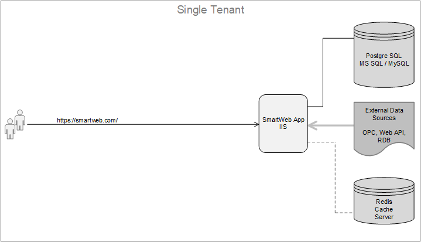
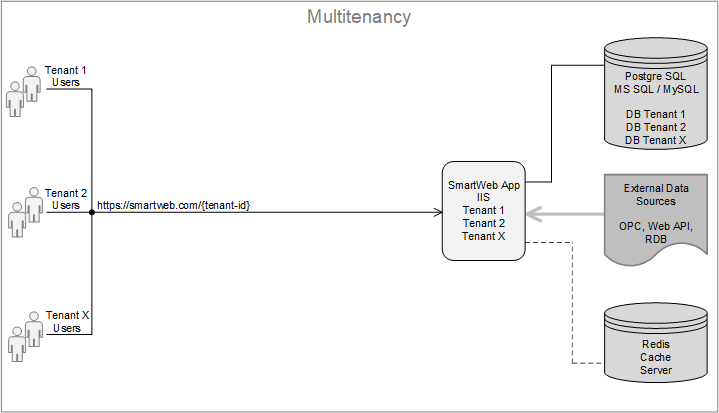

#

**SmartWEB** can operate in single instance mode and also in multiple instances mode, or what is known as a `Multitenancy` mode. In `Multitenancy` mode several `WEB` sites can be launched in one **SmartWEB** server, all using the same binaries, but their data is isolated. The different architectures and data flows to external data sources are illustrated later in this chapter.  

---

## Single Tenant Architecture
This is the simplest architecture, consisting of an instance of the **SmartWEB** application, a database and optionally a `Redis Cache` for caching the rendered content. All components can be installed on the same or separate servers. This architecture does not provide redundancy and is suitable for hosting non-critical applications and also for testing purposes.  

---

## Multitenancy Architecture

Again, this architecture does not provide redundancy, but it does make the best use of hardware resources. Here we have one instance of the **SmartWEB** application and separate databases for each tenant. All components can be installed on a single server or on separate servers and the `Redis Cache` server is optional.

A `tenant` is a self-contained functioning **SmartWEB** site. All tenants running under the same instance of the **SmartWEB** application use the same `binary code`, but their data is isolated. There are two ways to isolate data for individual tenants.  

> -  A separate database is created for each tenant.  
> -  A separate set of tables is created for each tenant with the tenant name as a prefix to the original table names, but all tables for all tenants are stored in a single database.  

We recommend using the first option as the database is better structured and easier to manage. If the tenants are in separate databases, it can be very easy to back up the individual databases. Using such a backup, the relevant **SmartWEB** sites can easily be moved to another server. Also, if a tenant needs to be deleted, we only need to delete the corresponding database on the database server, not the tables in the shared database. The following figure shows the architecture of this mode of operation with separate databases for each tenant.  

In `Multitenancy` mode, the base tenant `URL` is formed by adding `url-prefix` as an additional segment to the base `URL` of the **SmartWEB** application. There is no limit to the number of tenants running on the **SmartWEB** application server. It depends on the performance of the hosting server and the load of the tenants.    

!!!note "Note" 
    In `Multitenancy` mode, the tenant that is accessed with the base application `URL` is called the `Default` tenant. No user content is normally created or users configured in this tenant. It is only used to manage the other tenants and only the `Super User` has access to it.  

This architecture also provides upgrade convenience, as all sites use the same `binary code`. The downside is that when an application server is taken down for an upgrade or other maintenance, all sites hosted as tenants on a particular application server are taken down. The architecture is suitable for hosting multiple non-critical cloud-based applications because it optimises the resources used, resulting in reduced costs. A detailed description of the configuration and management when running **SmartWEB** in this architecture can be found in the [Multitenancy](/multitenancy) chapter.  

---

## Load Balancing

For `mission critical` applications, **SmartWEB** provides an architecture that implements redundancy. This is done by using a `Load Balancer` to route traffic to the different servers in the farm. The following diagram shows an architecture using a `Load Balancer` in combination with `Multitenancy` running on three application servers.

There is no limit to the number of servers that can be included in such a redundant architecture. These are usually `cloud-based` systems running on virtual machines. This is a typical architecture that provides redundancy while making good use of server resources. At any point in time, any server can be removed from the system for maintenance activities and this is transparent to users, as the remaining servers continue to serve them. In this architecture the `Redis Cache` server is a mandatory component, unlike the other two modes we discussed above. The servers use `Redis Cache` for synchronisation. For example, if you create a new tenant on one of the application servers, that tenant will automatically appear on the other servers in the schema. The same tenants running on different servers use the same relational database, and the `Load Balancer` uses the rules to route user requests to tenants on the different application servers.  

!!!attention "Imortant" 
    It is important to note that all requests for a given user session must always be directed to the same tenant. Therefore, the `Load Balancer` must support `Client Affinity` mode.  

---

#### Summary

This chapter has introduced the basic architectures for running **SmartWEB**. Everything in this documentation applies to both single-tenant and multi-tenant sites, unless a feature is explicitly discussed for the specific architecture. The [Multitenancy](/multitenancy) chapter describes the configuration and management of tenants, when the system is running in `Multitenancy` mode. The [Load Balancing](/load-balancing) chapter describes the configuration and management when the system is running with a `Load Balancer` at the front.