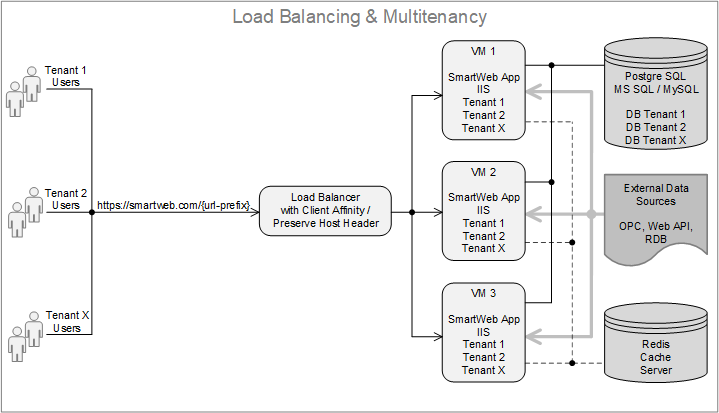

#

**SmartWEB** can operate in single instance mode and also in multiple instances mode, or the so called `Multitenancy Mode`. In multitenancy mode multiple WEB sites can be launched in one web server, all using the same binaries, but their data is isolated. More about multitenancy mode can be found in the chapter [Multitenancy](/multitenancy). The different architectures and data flows to external data sources are ilustrated further in this chapter. 

---

## Single Tenant Architecture

---

## Multitenancy Architecture

---

## Load Balancing

---

#### Summary

In this chapter, we have introduced the basic architectures of **SmartWEB** operation. Everything in this documentation is valid for both single tenant and multitenant sites, unless some feature is explicitly discussed for the corresponding architecture. The [Multitenancy](/multitenancy) chapter describes the configuration and management of the tenants, when the system is running in multitenancy mode. The [Load Balancing](/load-balancing) chapter describes the configuration and management when the system is working with `Load Balancer` at the front.   