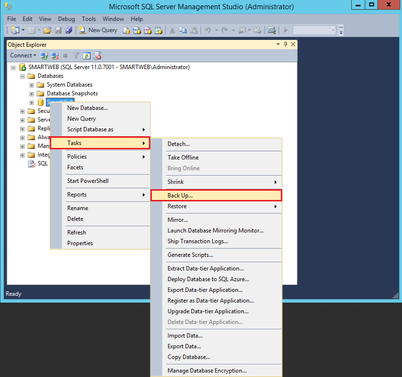
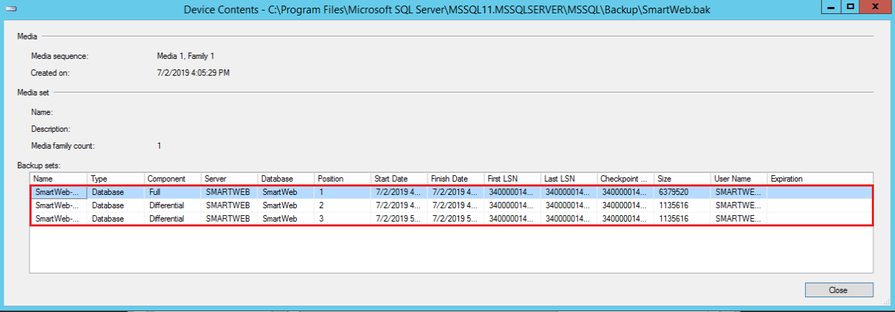
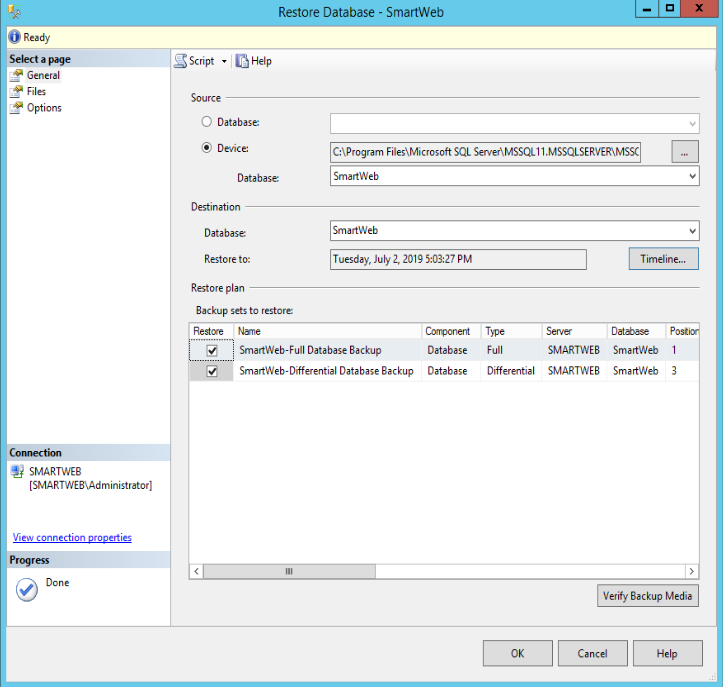
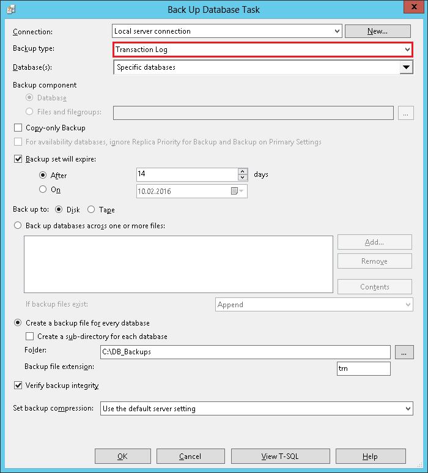
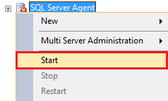

#

SmartWEB uses a Microsoft SQL Database. The following segment will explain and guide you trough the necessary steps, needed to backup databases, as well as restore them.

##Preconditions

In order to create a backup copy  
of the database the following is required:

*  Administrator rights on the operating system that the database is running on.

*  Administrator rights on the database.

*  Have the Microsoft SQL Server
    Management Studio app installed on the server.

<!-- -->

##  Connecting to the MS SQL Server
    

Start Microsoft SQL Server Management Studio.


* `Server type` field - select the `Database Engine` option. 
* `Server name` field - enter the name of the server.
* `Authentication` field select `Windows Authentication`(IF you have  
`SQL Server Authentication` already set up and you want to use it to access the database, you can select it instead, 
and enter the username and password in their respective fields, i.e. the `Username` field and the `Password` field).
* Click the `Connect` button. 


After you have connected to the Microsoft SQL Server, there should 
be a panel to the left named  `Object Explorer` in which 
elements are located in a structure, resembling that of a tree. The name of the server you are connected to as well, as the username that was used to sign in, should be at the  top of the `Object Explorer` panel. Click on the `+` symbol (situated on the left side of the element `Databases`) with the left mouse button.


Under the `Databases` element the following sub-elements should be visible:

-   System Databases

-   Database Snapshots


The databases of the respective server are situated under these two sub-elements.


## Creating a Full Backup
       

Select the database that you want to backup, by right-clicking
on it. On the context menu navigate to `Tasks`\>`Backup`.




The following screen should now be visible:


* The `Database` field points to the database that you are about to backup. 
* In the `Backup type` field select `Full`(full backup copy of the database). 
* In the `Backup component` field, the `Database` option must be selected. 
* In the `Destination`\>`Back up to` field the  `Disk` option must be selected. 
* Under the `Back up to` option, the path where the copy of the database will be saved is shown.

!!!attention
    Make sure that:

    1.  There is enough free space on the device on which you want to save the copy of the database.

    2.  There is no file with the same name in the specified path location(if there is it needs to be renamed or moved to a different location).

If the specifield path of the backup copy needs to be changed, you can use the `Remove` button on the default path. You can then use the `Add` button to add a new path to the location you want to save the backup copy to.


In the `Destination on disk`\>`File name` field the full path can be entered, or click the `...` button to select it manually.

!!!attention
     Don't forget to specify the name of the file in the `File name` field, otherwise the `OK` button will not become active.


If you are ready, to start the procedure you have to click the `ОК` button on the **Back Up Database** screen.

After the process is complete, the following message should appear:


The created file of the backup copy of the database should be relocated by changing its name in a way that it's meaningful. It's good practice for the name to contain the date it was created on. Usually, files with the `bak` extension take up a lot of room, therefor it's better to compress them.(For instance 7Zip or WinRar can be used).

##Creating a Differential Backup

The Microsoft SQL Server also allows the creation of differential backup copies (`Differential Backup`). The different between a `Full Backup` and a `Differential Backup` is that the full backup creates a complete mirror image of the database to the point of its creation, while the differential backup only records the differences from the initial full backup copy.

!!!attention 
      Before the differential backup copies of the database can be created, there must be a full backup copy made beforehand.
      The resulting `bak` file from the full backup copy is used to store the differential backup copies of the database.

The advantage of using differential backup copies is that they take up less room. This allows for more frequent use of the partial backup copies.

!!!note "For example:"
     If a full backup copy is made once a week, a differential backup copy can be made for each of the days of that week. This allows the state of the database to be restored for an interval of a day, while a full backup copy will restore the state of the database for an interval of a week.

In order to use differential backup copies of the database, the initial full backup copy file must not be moved or compressed after it's created. The reason for this is so that the database can use it to create the differential backup copies. Only after a new full backup copy is created, the older file can be moved or compressed, while also sticking to the practice of giving it a meaningful name.

The process of creating a differential backup copy is the same as creating a full backup copy, with the exception of not needing to delete or move the existing file of the backup copies.


Select the `Differential` option in the `Backup type` field.
By default, the system provides a path where the file of the backup copies can be saved. If you want to change the location, you must make sure that the file indeed exists. This can be done by clicking on the `Contents` button, but not before a destination is selected.


As shown, there must be atleast one full backup copy that can be seen in the `Component` column with the value `Full`. There should also be a column with the name `Type` with the value `Database` located on the same row.

Click the `Close` button to return to the previous screen and click the `OK` button.

After the process is complete the following message should appear:


Continue by calling the `Backup Database` screen via the context menu (`Tasks`\>`Back Up`) and click the `Contents` button.


A second row containing the the information of the newly created differential copy should now be visible and it will only contain the changes in the full backup copy up to the moment of the differential copy's creation.

At the end of the week, when a new full backup copy of the database is created, the old file is given a meaningful name, compressed and moved to a different location.

Normally it's possible for a backup copy file to contain a number of consecutive differential backup copies but that will make the file too big, which will make the process of storing it inconvenient. The interval of creating new copies may vary depending on the specific company's policies.


##Restoring from a Full Backup


Recovering the database from a full backup copy means that the database will be restored in its entirety, in the state that was saved in the backup copy. The process of restoring the database can be done in the case of an absent or and existing instance of a specific database.

####Recovery in the case of an absent instance

The absent instance of a database means that the Database management system is available but the database of interest is not available. This can occur when the database in question is deleted or was never created in the first place.


Connect to the Microsoft SQL Server and make sure that the database you are going to restore is available on the server. If the database is available on the server it will be shown in the `Object Explorer`\>`Databases` tab. Right-click on the `Databases` directory.


On the context menu select the `Restore Database...` option.  

The following screen should appear:


At the top of the window there should be a `No backupset selected to be restored` message. That means that there is no backup copy selected from which to execute the recovery. Select the `Source`\>`Device` option and click the `...` button to the right of the text box.  

The following screen should appear:


In the `Backup media type` field, select `File` from the list and click on the `Add` button.

The following screen will appear, allowing you to choose the backup copy from which the recovery of the database will be executed:


After the file is selected, click the `ОК` button. In the `Backup media` field on the screen you should be able to see the name of the file that you have selected.


To view the contents of the file select it with the left mouse button and click the `Contents` button.




In this case the selected file contains three backup copies. The first one is a full backup copy and the other two are differential backup copies. Click the `Close` button to return to the previous screen and click the `ОК` button.




The selected file is loaded and information regarding its contents is displayed. 

* `Device` field - shows the full path to the file that is about to be restored. 
* `Database` field - shows the name of the database. 
* `Restore to` field - shows when the last backup copy was made.
* `Backup sets to restore` table - shows the available backup copies. (In the example the first element is a full backup copy and the second one is the latest differential backup copy).
* `Restore` column - the copies that we want restored are chosen via the checkbox.
* `Timeline` button - shows a statistic of when the last backup copies were made.(The filled-in triangles represent the full backup copies, while the ones that are not filled represent the differential backup copies).

Using the `Timeline` option allows for more precise selection of the interval of recovery and allows you to choose between all available copies, as opposed to the `Restore` option, which only allows you to choose between full backup copies and their last differential backup copies. 


The `Backup Timeline` option allows you to define the moment of recovery. By default, the  
 `Last backup taken` is selected, but if the recovery is required to be done from a different moment in time, the `Specific date and time` option needs to be selected. After that, with the help of the slider, located under the time scale, specific moments in time, which contain a backup copy of some sort, can be selected.  A more precise time interval, the `Time interval` field can be used, where the options to choose between 1 hour (`Hour`), 6 hours (`Six Hours`), a day -- 24 hours
(`Day`) and a week (`Week`) are available. In the example there are three backup copies. The first one is a full backup copy and the following two are differential backup copies. Since we want to make a recovery from the full backup copy, well choose the filled-in triangle by using the left mouse button on it or moving the slider to the required copy. The selected backup will have a red line on it. The date and time of the copy, from which the recovery will be done, can be viewed to make sure that the correct moment in time is chosen. Click the `ОК` button to confirm the changes.

The `Backup sets to restore` table visualizes only the copies that will be restored. In this case only the full copy. If the goal was to restore the first differential copy,then the full backup copy would be displayed, and the differential copy, that would be used for recovery, would come after it. This is done because the differential copies require the full copy ,from which they originated, to be restored first.


Click the `Verify Backup Media` button to check the file of the copies for mistakes. If everything is in order, the `Backup media verified successfully` will be displayed at the top of the screen.


!!!attention
     It's important to note that the database management system will try to recover the database from the backup copy, but it will also want to save the file paths of the specific database. It's possible there isn't a device with the same letter on the server where we want to execute the recovery or the database is required to be placed somewhere else.

In that case navigate to `Restore Database` and select `Files` on the **Select a page** menu.     
The following screen should appear:

  


To change the location of recovery, the `Relocate all files to folder` checkbox must be selected, after that the directories, where the files of the database are stored, can be changed.


There are two types of files - data files and logs. Their paths are defined according to what is written in the `Data file folder` and `Log file folder` fields. The paths can be changed by correcting the specific text fields or by using the `...` buttons to select them manually.


It's good practice for them to be stored in the same location. In this case we won't change their location so we will uncheck the `Relocated all files to folder` option. Using the `Select page` panel in the `Restore Database` screen, select `General` to go back. The recovery process will start after clicking the `OK` button.


If the recovery is successful, the following message will appear:


The newly restored database should be located under the `Databases` tab.


After restoring the database from a backup copy, a resynchronization of the account access is required. In order for the resynchronization to be done, the usernames that need to be restored and are used by the system need to be known. Click the `+` to the left of the restored database in the `Object Explorer` and navigate to the `Security>Users` tab.


Look for users that are not part of the following: dbo, guest,
INFORMATION\_SCHEMA, sys.

After the specific users are known, right-click on the restored database and select `New Query`.


A new panel will appear to the right of the screen. Its role is to send requests to the selected database. 

!!!attention
     Be careful not to select a different database!

!!!note
       Hover over the name of the panel with your mouse to check which database the panel is connected to.


In the example, the user that needs to be resynchronized is `smartweb`. Write the following command in the panel to the right:

```
EXEC sp_change_users_login 'Auto_Fix', 'smartweb', NULL,' smartwebtester'
```

and press the `Execute` button.


The last argument of the command is `smartwebtester`. It represents the password of the user that is going to be created. If this user already exists, the password will be ignored.

You can view the newly created user by navigating to
`Security\>Logins`, located under the `Databases` tab.


Right-click on the user and go to `Properties`. The following screen should appear:


Make sure that the `Enforce password expiration` option is disabled.
Otherwise, the user will be prompted to change his password after a certain period, and will not have access to the database until the password is changed.

The last step is to check if the synchronized user has access to the restored database.


Navigate to the `File` menu and select `Connect Object Explorer`.


Complete the following steps:

* `Server type` field - select `Database Engine`.
* `Server name` field - enter the name of the server you want to connect to or select it via the drop-down list. 
* `Authentication` field - select `SQL Server Authentication`. 
* `Login` and `Password` fields - enter the name and password of the user.
* Click the `Connect` button.


In the `Object Explorer` under the server connection element at the top, there should be a new element. This element represents the synchronized user's connection to the database. Navigate to the  `Databases` tab, if the elements under the restored database tab can be reached, the process is successful and the user has access to the database.


!!!attention
      In order to use the `SQL Server Authentication`,
      the Database Management System of the Microsoft SQL Server needs to be set to `SQL Server and Windows Authentication mode`, which is set following or during the server installation.

When restoring a database, the user in question may need to be re-mapped manually.
This is done with the help of the following command:

```
USE {database};
ALTER USER {user} WITH login = {login}
```
**Example:**

```
USE SmartWeb;
ALTER USER smartweb WITH login = smartweb
```

In the case where this method proves inefficient, navigate to the following directory:

```
C:\inetpub\SmartWeb\App_Data\Sites\Default\Settings.txt 
```


From here, the password of the user can be seen on the sixth row - `ID=smartweb;Password=smartweb;`.
It can then be changed via **SQL Server Management Studio** by navigating the the user in the `Security\>Logins` directory.


####Recovery in the case of an existing instance


The process of restoring the database in the case of an existing instance is the same as the one used for restoring it from an absent instance with a few peculiarities:

1.  When a database is being restored from an existing instance, it is necessary that all systems that are currently using the database, temporarily stop working with the database or are disabled. In the case of `SmartWEB`, the system must be disabled.


2.  After connection with the Database Management System has been established, from the `Object Explorer`, navigate to the `Databases` tab and right-click on the database that you want restored. From the following context menu select `Tasks\>Take offline`. The database will then be disabled and can't be used by any system.


If the database is successfully disabled, the following screen will appear:


Click the `Close` button.

Right click on the offline database. From the context menu, navigate to `Tasks\>Restore\>Database`.


On the `Restore Database` screen, from the `Select a page` panel, go to `Options` and enable the `Overwrite the existing database (WITH REPLACE)` option.


From the `Select a page` panel, navigate to `General`. From there, the procedure is the same as with the full backup copy segment.

##Restoring from a Differential Backup 


Restoring the database from a differential backup copy is the same as restoring it from a full backup copy with the following 
peculiarity. Prior to restoring a differential backup copy, the full backup copy, from which it is derived, must be restored beforehand. This is done automatically via the `Microsoft SQL Server Management Studio`, when the differential backup copy is selected in the  
`Backup Timeline` screen.


## Configuring an Automatic, Scheduled Database Backup

When the transaction log overflows, `Microsoft SQL Server DBMS`
reports an `error 9002`. The log can overflow when the database
is active (`online`) or in recovery mode
(`recovery`). If a log overflows while the database is active, the database remains active in `read-only` mode. If the log overflows in the process of recovery, the `Microsoft SQL Server DBMS` marks the database with the `RESOURCE PENDING` flag. In both cases, human intervention is required
to provide space in the transaction log.


For a `FULL` or `"BULK-LOGGED` database recovery model, one of the reasons for the overflow of the transaction log is
the absence of a timely backup of the log. If a backup was never made, two backups must be created in order for
the database to be able to clear the log up to the last backup.
Clearing the log creates space for new entries. New backups of the transaction log must be created periodically to keep the log from overflowing. These backups can be done manually (like in the 
`Backup Type` field, where the `Transaction Log` is selected, as shown
in the figure below).


or they can be set to be done automatically.

Create a folder named  `C: \\ DB \ _Backups` in the file system, 
which will store the backups of the the database.


Connect to the `Microsoft SQL Server DBMS` using
`SQL Management Studio`. From the left navigation panel, expand
`Management` and right-click `Maintenance Plans`. Select `New Maintenance Plan ... ` from the context menu.


If you see an error message about the `Agent XPs` component,
then you need to execute several `T-SQL` requests to enable the
advanced settings and `Agent XPs` component.


Open a new query window by clicking on `New Query` from the toolbar, as shown in the figure below.
Type the following commands in the query window:

```
sp\_configure \'show advanced options\', 1;

GO

RECONFIGURE

GO

sp\_configure \'Agent XPs\', 1;

GO

RECONFIGURE

GO
```


Press the  `Execute` button to execute the entered commands
After enabling the `Agent XPs` component, we proceed with step - `New Maintenance Plan`.


#### Creating a sub-plan for a complete database backup


Press the `OK`  button to confirm the name, after which, a screen with the `MaintenancePlan` will show up. 
There will also be a `Subplan` with the name `Subplan_1`.


Double-click `Subplan_1` with the left mouse button. The screen shown in the figure below will appear.


Rename the plan (`Name` field) to
**SmartWebFullDbBackup**. In the description (`Description` field) write
**SmartWeb Weekly Database Full Backup**. Click the calendar from
`Schedule` as shown in the figure below:


Configure the settings as shown in the figure below:


Press the `OK` button to confirm the changes. The task is now set to be performed once a week on Sunday at 1am.


Press the `OK` button again to confirm the changes. To add the plan with the changes thus far, you have to save the changes by pressing the respective button from the toolbar. If the process is successful, the asterisk in the panel name should disappear.


Once you have saved the plan, select the order of the sub plan that
we created by clicking on it once. Select `Toolbox` from the left side.


From the tools, select `Backup Up Database Task` and drag it to
the empty space under the sub-plan.


From the popup menu that appears, right-click on a task that was just started. Select `Edit`(Depending on the version
`SQL Management Studio` screens may differ).


In the `Backup Type` field, select  `Full`, under `Databases` select
the desired database, in this case - `SmartWeb`.


Configure how long the backup copy will be kept. This depends on
the free space you have. To do this, check the `Backup set will expire:` option, select `After` and enter the number
`14`, i.e. the copy will not be overwritten for 14 days. If 14 days does not seem sufficient, the time interval can be increased, but consider 
how much free space is available.

Under `Create a backup file for every database`, in the `Folder` field,
select the folder we created to save the copies to
(`C: \\ DB \ _Backups`). Check `Verify backup integrity` to look for any errors in the backup.
Press the `OK` button when you're done.

Save again (the toolbar diskette or from the menu -
`File` > `Save`). The asterisk from
the name of the plan should disappear, if it is still visible, that means the plan has
unwritten changes - save them.

With what we have shown so far, we have created a support plan **SmartWebBackups** in which there is a sub-plan with a name
**SmartWebFullDbBackup**, which will run every Sunday at 1 a.m. In this sub-plan, there is a task to create a 
full backup of the **SmartWEB** database that will be kept 14
days without being overwritten.


#### Creating a sub-plan for a transaction log backup


The next step is to create a sub-plan for a transaction log backup. To do this, click on the  
`Add Subplan` button in 
maintenance plan toolbar.


Enter a name and description as shown in the figure below.


Set the time of execution by selecting the calendar from `Schedule`, as shown in the figure below.


The plan will be executed from Monday to Sunday at 2 a.m.,
as there is a full backup scheduled on Sunday at 1 a.m.

Press the `OK` button, then save the plan (`File` \>  `Save`). After successfully saving the plan,
the asterisk in its name should disappear. Similarly to
the previous sub-plan we created, select the order of the new sub-plan. From the `Toolbox` drag  `Back Up Database Task` into
the empty space under the plan.


Right-click on the task that was just created -
`Backup Database Task`, and select `Edit` from the context menu.





In the `Bacкup Type` field, select `Transaction Log`. In the 
`Databases` field, select the database you want, in this case - **SmartWeb**.


Set the amount of time that the backup copy will be kept for. This will depend on the amount of free space on the machine. To do this, check the `Backup set will expire:` option.   Select  `After` and enter the number `14`, i.e. the copy will not be overwritten for 14 days. If 14 days does not seem sufficient, the time interval can be increased, but consider 
how much free space is available.

Under `Create a backup file for every database` in the `Folder` field
select the folder we created to save the copies to
(`C: \\ DB \ _Backups`). Check `Verify backup
integrity` to look for any errors in the backup.
Press the `OK` button when you're done.

Save again (the toolbar diskette or from the menu -
`File` \> `Save`). The asterisk from
the name of the plan should disappear, if it is still visible, that means the plan has
unwritten changes - save them.


We've added a sub-plan named **SmartWebFullDbBackup** that will be executed every 
day at 2 a.m., and this sub-plan has the task of creating a transaction log backup of the 
**SmartWeb** database. This backup will be kept for 14 days, without being overwritten.

Once you have saved the maintenance plan, right-click on `Maintenance Plans` in the `Object Explorer` to see the newly created plan.


Right-click on `SQL Server Agent` in the context menu, select `Start` to start the
the agent.



If you see a screen similar to the one below, press the 
`Yes` button.


When you see a screen similar to the one below, press the 
`Yes` button.


The  `SQL Server Agent` should now work. You can go to `Jobs` and see
the tasks that are configured.


Double-click `Job Activity Monitor` (or right-click and select `View Job Activity`) to view the status of
tasks.


To run one (or more) tasks to test, 
right-click on the task and select `Start Job Step ... `.


Start the `Job Activity Monitor` again to see the status of
the task that was just started.


The backup files can be viewed in the `C: \\ DB \ _Backups` folder.


The final step is to make sure that the `SQL Agent Service` will
always be started. Open `Services` from the `Control Panel` (via
`services.msc` from the console, or from  
`Administrative Tools`>`Services`).


Scroll-down until you reach `SQL Server Agent (...)`. The `Startup Type` is set to  `Manual` by default.
Right-click on the service and select `Properties`. Then set the `Startup Type` to `Automatic`.


This way the service should start automatically, regardless if the server is restarted.

`DBCC SQLPERF (logspace)` is a useful command that is used to check
the status of the transaction log.


The next step is to create a sub-plan for cleaning up the obsolete
database backups and logs. To do this, press the `Add Subplan` button from the support plan toolbar.

####Creating a sub-plan to delete old database backups and logs


Enter a name and description, as shown in the figure below.


Set the time of execution by selecting the calendar from `Schedule`, as shown in the figure below.


The plan will be executed daily at 3 a.m.

Press the `OK` button, then save the plan (`File` \>  `Save`). After successfully saving the plan,
the asterisk in its name should disappear. Similarly to
the previous sub-plan we created, select the order of the new sub-plan. From the `Toolbox` drag  `Maintenance Cleanup Task` into
the empty space under the plan. Then drag `History Cleanup Task` under it.


Right-click on the task that was just created - `Maintenance Cleanup Task`, and select `Edit` from the context menu.


In the `Folder` field,
select the folder we created to save the copies to
(`C: \\ DB \ _Backups`). In the `File extension` field, enter `*.*` for all files.

Set the time interval to delete files.  To do this, check the `Delete files based on the age of the file at task run time` option, and set the `Delete files older than the following` option to 3 weeks, i.e. all files older than 3
weeks will be deleted. You can increase it time, but take into account how much free space you have. Press
`OK` button when you're done.

Right-click on the task that was just created - `History Cleanup Task`, and select `Edit` from the context menu.
Set the time interval to delete logs. To do this, set the `Remove historical data older than` option to 3 weeks, i.e. all logs older than 3 weeks will be
deleted.


Press the `OK` button when you're done. The last thing left
is to connect the two tasks. To do this, drag and drop the tip of the green arrow to the second task and drop it, as shown in the figure below.


Save again (the toolbar diskette or from the menu -
`File` \> `Save`). The asterisk from
the name of the plan should disappear, if it is still visible, that means the plan has
unwritten changes - save them.

We've added a sub-plan named `SmartCleanUp` that will be executed every 
day at 3 a.m. This sub-plan will perform two tasks -  deletion of backups and logs of the **SmartWeb** database that are older than 3 weeks.

