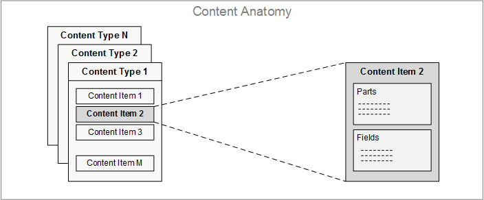
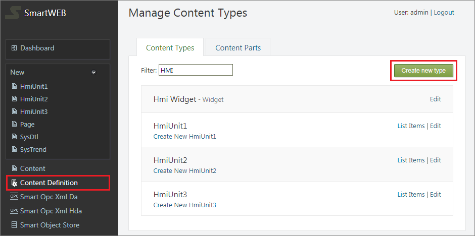
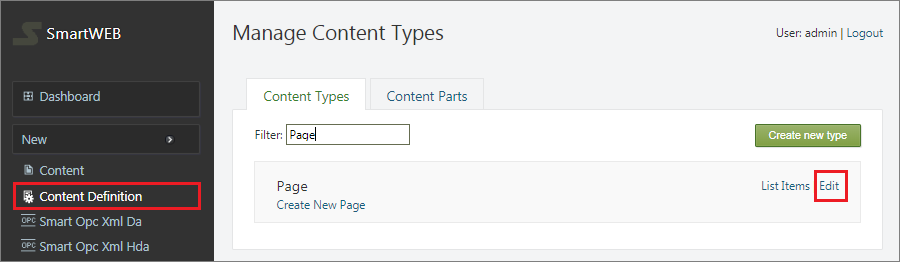
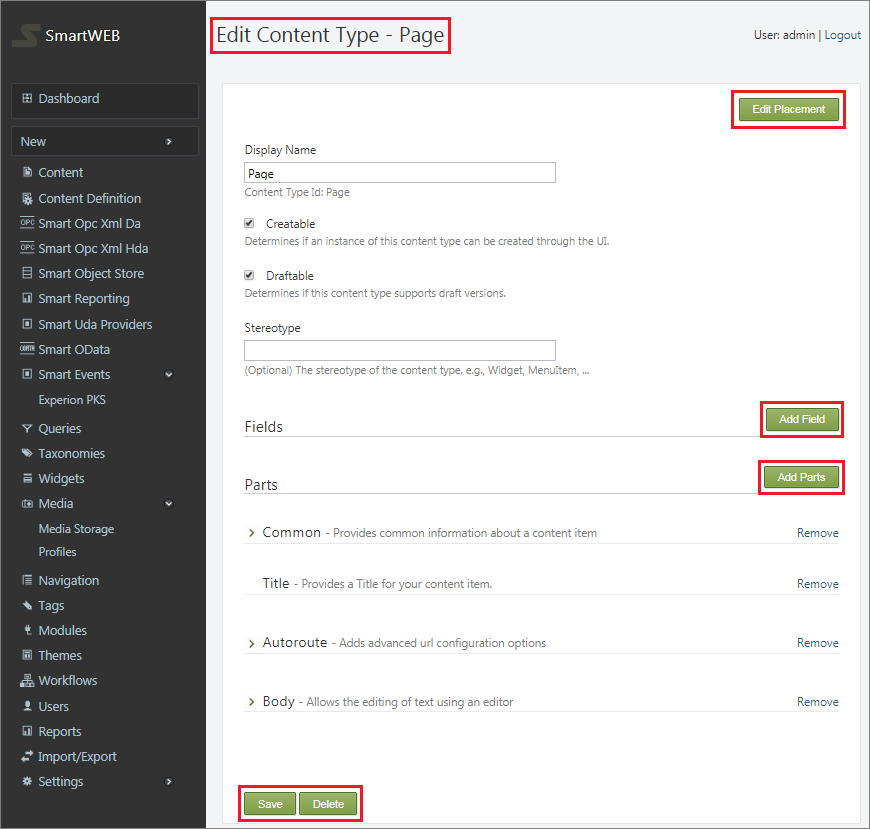
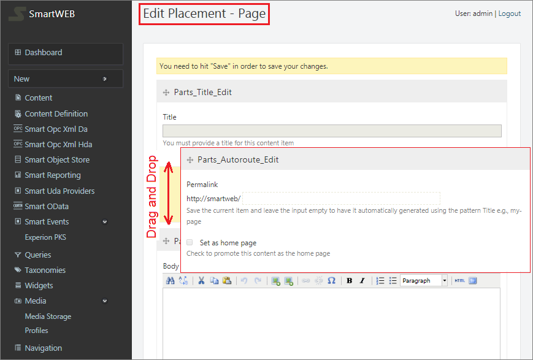
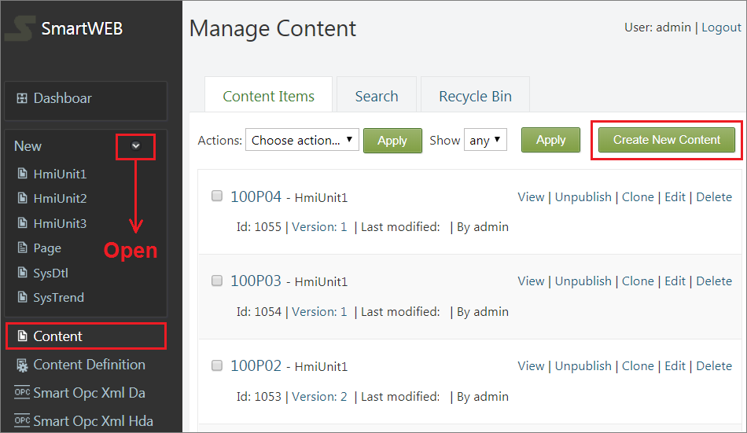
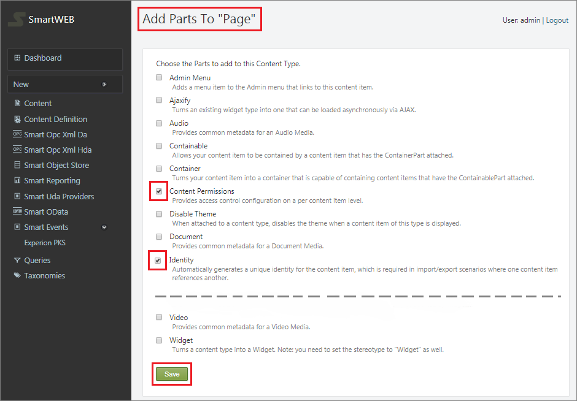
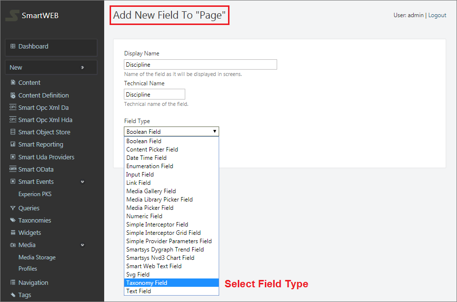

#

**SmartWEB** is a CMS-based Web application whose main purpose is to help users build websites from existing elements. These elements have different shapes and perform specific functions. To work productively with them, they need to be well understood. This chapter go through these pieces and explains their purpose and behavior.  

---

## Overview
The **Content Anatomy** of SmartWeb consists of the following components:  

> - `Content Types` - Defines metadata and behaviors for building specific content.  
> - `Content Items` - A single piece of content derived from a **Content Type**.  
> - `Content Parts` - Builds specific behavior that can be reused across content types.  
> - `Content Fields` - Pieces of information that can be added to a content type.  

These components come together to form a dynamic and flexible way of managing content at runtime.  

---

## Content Type
A `Content Type` can be seen as a category of contents. It represents what a `Content Item` is. The core of the notion here is in words **`is a`**. if you can say that a given content item is **something**, that **something** probably is the `Content Type` of the `Content Item`. Contents are managed under an dynamic type system. To enrich `CMS` flexibility, contents must be composed on the fly at runtime and reflect the concerns of content management.  

---

#### Content Type Example
SmartWEB is delivering with several content types. The users can use these types, customize them, as well as create new content types. Creating new **content types** is done by navigating to the the `Content Definition` tab on the `Admin Menu`. From there, you'll be taken to the `Manage Content Types` page. To add a new content type, click the `Create new type` button.   
   
  

This will take you to the `New Content Type` page, where the display and technical names can be set and click `Create`.  
  
!!! attention "Attention"
    The technical name of the `Content Type` is better left in the state generated by default unless you have a reason to change it.  
   
To customize the newly created content type head to the `Manage Content Types` page and click the `Edit` link on the new content type. From the following `Edit Content Types` page the content type can be altered and saved.   

   

From the following `Edit Content Type` page the content type can be altered, saved and deleted.  

   

The `Content Item` structure can be edited and changed to have a different appearance. By clicking on the `Edit Placement` button in the top-right corner, you'll be taken to the `Edit Placement` page where each page element can be seen. The elements are structured on top of eachother and their placement corresponds to how they will be shown on the `Edit Content Item` page. Changing the position of an element can be done by simply holding down the left mouse button on an element and draging it over or under the elements its supposed to be adjacent to.  
  
 

---

## Content Item
A `Content Item` is a single piece of content, often associated with a unique URL (address) on the site.
Content items are instances of `Content Types`. They store all the data needed to handle and display. An item is a concept that is close to an entity but more focused around the idea of contents. An item can appear in a list, but will also typically has own page on the site.  

!!!tip "Example"
     Imagine the `Content Item` as a `PHD Report` or `HMI Web Page`.  

To create a `Content Item`, navigate to the `Content` tab on the admin menu, and click the  `Create New Content` button in the top-right corner. You'll be taken to the `Create New Content` page where a content type can be selected for the content item. Another way to create content is from section `New` of the admin panel, directly select the content type. Afterward, the option to `Save` will become available.  

 

!!!attention "Attention" 
    It's important to note that the `Save` button will allow you to save your work without having it appear on the site as opposed to the `Publish Now`, which will display your changes immediately on the front-end.  

---

## Content Parts  
A `Content Part` is a feature that can enrich any existing `Content Type` without prior knowledge of the content part by the content-type or by the content type from the content part. Content types are built from smaller parts, that are conveniently called content parts. Content parts are atoms of content that are enough to create a specific coherent behavior, and that can be reused across content types.  

Clicking the `Edit` option on a content type opens up the `Edit Content Type` page. From there, the opportunity to add content parts is available. By adding content parts, the content items will automatically gain behavior and attributes. Add the content parts to the content type by selecting the appropriate checkboxes and clicking `Save`.  
  
 
  
After saving parts to the content type, you’ll be taken to a page where you can choose to add fields or additional parts or click `Save`.  

---

## Content Fields  
Content fields are pieces of information that can be added to a content type. Content fields have a name and a type and are specific to a content type.  

!!!note "Note"
    There can be several of each field type on any given content type!  
  
Content types initially lack fields for capturing information such as pictures, taxonomy links, and other characteristics. To add a field navigate to the `Content Definition` menu option and click the `Edit` button on a content type.  That will open up the `Edit Content Type` page.  
  
Clicking `Add Field` will open a form for creating a new field for the template. Several types of fields are available by default. Set the `Display Name` (used for labels).  Let the `Technical Name` (used in code and styling) default to the display name and click `Save`. New fields are available for existing content items.  
  
  

---

#### Summary 
In this chapter, we have learned about the basic building blocks of the content. To fully understand the whole process of designing and creating front-end webpages, read the chapters [Manage Content](/manage-content) and [Widgets](/widgets). The [Navigation and Menus](/navigation-and-menus) chapter explains how to create site navigation and improve user experience.  