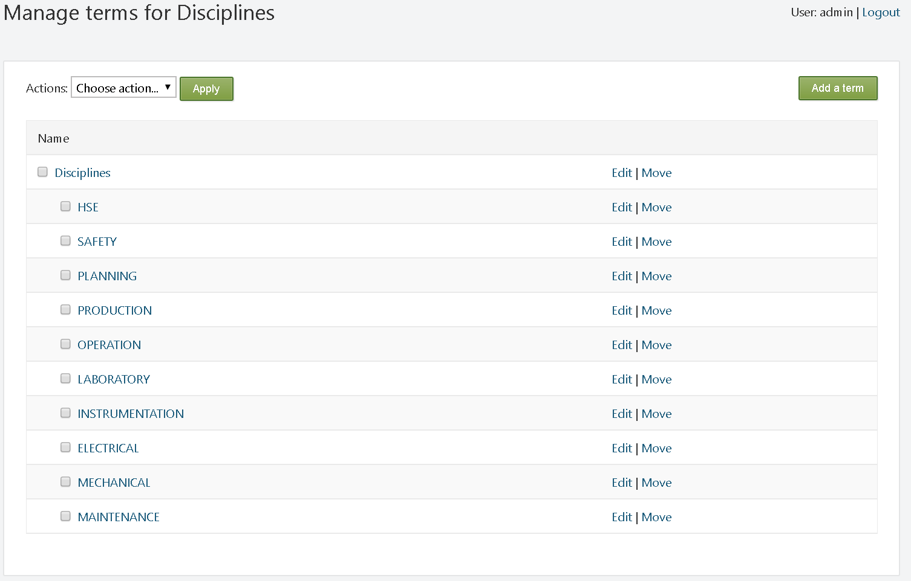

#

**SmartWEB** has different content that can be classified by different criteria for different purposes. Content classification is the process of assigning tags and/or taxonomies to content that can then be used to create `navigations`, `search forms` and others.

---
## Taxonomies

Taxonomies represent the formal structure of classes or types of objects. They organize content by using references, making the process of finding related information easier. A taxonomy must:

-   Follow a hierarchic format and provide names for each object in  relation to other objects.
-   Have specific rules to classify or categorize any object.
-   Inherit all the properties of the class above it, but can also have additional properties.

Taxonomies are a hierarchical set of terms used to classify content. They differ from tags, as they are controlled, whereas tags can be freely defined. The `Orchard Taxonomies module` adds a way to manage taxonomies, and assign them to specific [content types](../content-anatomy), thus allowing content classification and filtering.

Taxonomies can be added to a site by enabling the `Taxonomies` module from `Dashboard`>`Modules` (if it is not already enabled). Once enabled, you can create taxonomies and terms, as well as associate the terms to the `Content Types` by using a `Taxonomy Field`.

---
#### Creation and editing Taxonomies and Terms

To manage taxonomies, navigate to the `Taxonomies` section via the admin dashboard. A list with all available taxonomies (if any are created) will be presented. To create a taxonomy, press the  
`Add a taxonomy` button.

The following options will be available: 

`(1)` - Enter an appropriate title for the taxonomy.  
`(2)` - Specify the `URL` for this taxonomy item. If it is left empty, then the `URL` will be generated automatically.  
`(3)` - Check box to set this taxonomy as the home page of the web site.  
`(4)` - If this option is selected, access rights can be configured. This will determine which users ( with their respective roles) are allowed to see and edit the taxonomy. For more information see chapter [Users and Roles](../users-and-roles).  
`(5)` - The user name of the taxonomy creator is automatically filled in here.  

Once the taxonomy is configured, press the `Save` button to create it.

The next step is to create terms for the taxonomy.
The options for each taxonomy consist of: `Edit`, `Terms`, `Delete`, and `Import`.

Click the `Terms` option, then click `Add a term` in the upper right corner. The following options will be available:

(1) `Title` - title of the term.

(2) `Permalink` - the URL of the term.

(3) Checkbox to set the term as home page.

(4) `Selectable` - uncheck if the user should not be able to select this
    page.

(5) `Weight` - this is the weight for the sort criteria.

(6) `Owner` - creator of the term.

!!!tip "Example"
        The taxonomy (Disciplines) is now created. It consists of one term (with the
        same name - Disciplines) that has ten sub-terms, which are shown on the picture
        below. A taxonomy can have multiple terms. Each 
        term can also have its own terms. The position of the terms does not
        depend on their name, but on their `weight`. The term with the highest `weight` value is displayed at the top of the tree
        structure.

Once a `taxonomy` has been created, in order to classify different content, it must
be added to the corresponding `Content Type`. This is done using `Fields`. When creating or editing a `Content Type`, click the `Add Field`
button. Enter an 
appropriate `Display Name` for the field (displayed on the front-end). Enter a
suitable unique identifier (if left empty, the system does it automatically). Finally, select the `Taxonomy Field` option from the drop-down 
menu (`Field Type`).

Once the `Taxonomy Field` is added to the `Content Type` - expand it. The following options will be available:

(1) - Add the content of this field to the selected index.

(2) - Select a taxonomy.

(3) - Restrict selectable elements to leaves (parent/ child terms)
    only.

(4) - Allow only one term to be selected.

(5) - Check if the field is required.

(6) - Enable auto complete.

(7) - Allow new terms to be created.

(8) - The help text is written under the field when authors are editing
    the `Content Item`.

The following image represents how the taxonomy looks on the 
`Content Item` configuration page. The author is free to select one or more disciplines if they are applicable to the `Content Item`. Alternatively, the author may decide not to select a discipline.

The newly created taxonomy can now be used in the creation of [navigation menus](../navigation-and-menus). The following image represents how a taxonomy is represented on the front-end:

To remove/delete a `taxonomy`, select it via its respective checkbox, select `Remove` from the `Actions` drop-down list at the top, and click `Apply`.

---
#### Embedded taxonomies

**SmartWEB** has two built-in taxonomies that are readily available for the classification of different `Content Items`.

!!! note "Reminder:"
        To be able to classify the `Content Item`, the taxonomy must be added to
        the `Content Type` via a `taxonomy field`.

Each of these two `taxonomies` has a subset of terms for the classification
of different `Content Items`. The terms of the `Disciplines` taxonomy can be seen in the image below:

The `Enterprise` taxonomy has one term - `Plant`. This term has three sub-terms (`Unit 1`, `Unit 2`, `Unit 3`).

---
## Tags

Tags are small keywords that can be attached to content, and act like
labels to tell the website browsers what the content is about. Tags are
similar to taxonomies, but they may not be predefined. 

---
#### Create and edit tags

To create a tag, navigate to `Dashboard`>`Tags`. Content with already
created tags, and other respective options, will then be presented. The `Apply`
and `Add Tag` buttons are among these options. One way of creating tags is by entering the name for the new tag in the `New Tag Name` field, and pressing the `Add Tag` button.

The other way is by adding a `Tags part` in the `Content Type`.
Subsequently, when a `Content Item` of this `Content`
`Type` is created, there will be a field where the name of the required tag can be entered. Once the `Content Item` is created, the tag's name will automatically appear in the `Tags` section (`Dashboard` > `Tags`). Two or more tags can be created at the same time 
by separating the tag names with a comma. If a tag is already created,
the `Content Item` will be attached to it.

The following image provides an example of what the `Tags` section will look like, after a few tags have been created.
Each tag in this list has a corresponding checkbox. These checkboxes are used for the selection of one or several tags. Once selected, they can
be deleted via the `Delete` option from the drop-down menu (`Actions:`), and its execution via the `Apply` button.

