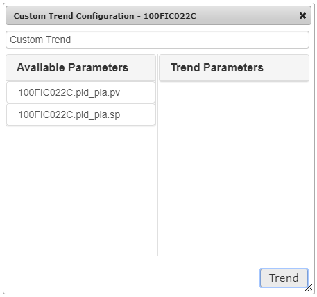

#
The trend is a major tool in **SmartWEB** for monitoring archived values ​​of technological parameters.

---

##Features

To access the Dygraph Trend of a dynamic element in a display, simply right click on the specific element. The resulting context menu will provide specific trend options that the user can then use.

The trend screen contains a multitude of options which provide better user experience, as well as a more detailed view of the trend.


1. `EU/Pct` - Switch between engineering units and percentages.

2. `Relative` - Scales the traces from 0 to 100 in relative units, calculated on the basis of the minimum and maximum values ​​for each trend trace. For example, if the minimum and maximum values ​(on the graph) of a trace are 70 and 90, then 70 will be equal to 0 relative units and 90 will be equal to 100 relative units. The calculation of the relative units is given by the formula:

     ```
     R = (Yc - Ymin) * 100 / (Ymax - Ymin)  
     ```

     `Ymax`, `Ymin` and `Yc` are respectively the maximum, minimum and current values ​​for a traces.


     If the trend is in relative scaling mode and a parameter name in the legend is chosen, then the name of that parameter in the legend will be emphasized, the trend graph will be thickened, and information labels will be displayed with the minimum and maximum value of the parameter. 

3. `Full Range` - Prevents the trend from automatically scaling according to its numerical values.

4. `Range Selector` - Displays the controls for the visible time frame below the trend chart.

5. `Hair Line` - Provides a vertical line that runs throughout the chart and moves with the mouse.

6. `Export` - Export trend data in Excel format.

7. `Snapshot` - Export of the chart shown in the trend in PNG format.

8. `Time Frame` - Select the time frame.

9. `Sample Rate` - Select the period of trend data sampling.

10. `Reload` - The user can load trend data for a predefined time frame with absolute start and end times. These times are set in the legend dialogue.

11. `Precise`- When data is downloaded over a large period of time and then the visible time frame is reduced by scaling - the magnifier can become active. This means that the trend suggests that more detailed data is available for the visible time frame.

12. `Legend` - Provides a legend for the observed parameters.

13. `Full screen` - Display the trend if full screen.

14. `Backward` - Move back in time by an interval equal to the current time frame. 

15. `20% Backward` - Move back in time by an interval equal to 20% of the current time frame.

16. `20% Forward` - Move forward in time by an interval equal to 20% of the current time frame.

17. `Forward` - Move forward in time by an interval equal to the current time frame.

18. `Start/Stop` - Start and stop real-time data acquisition.

The trend legend is called with the toolbar button (12.). As a result, a legend will appear on the trend.

Unlike the custom trend, new parameters cannot be added, because the parameters are pre-configured, but some of them can be excluded from the preview.

There is a box to the left of each parameter in the legend. If unchecked, the parameter will not be displayed on the trend. The units are displayed according to the option that was  selected from the toolbar (engineering or relative- [%]). 

If a parameter name in the legend is selected, it will be highlighted and the trend parameter graph will be thickened. This can be done with more than one parameter. Re-selecting the parameter that is underlined will return the parameter graph to its normal state.

The following example is done using a `Mini Trend`:


!!!tip "Mini Trend"
     The Mini Trend lets the user scale certain areas of the visible area. This is done by holding down the left mouse button on the trend graph and moving the mouse left or right. A gray background can then be seen on the section that was marked. After the mouse button is released, the trend will scale the chart in the selected area. If the magnifier becomes active in the toolbar, it means that the trend can provide more detailed data for the visible time frame.

!!!note "Note:"
     Under the name of each parameter in the legend - the engineering units are displayed.


The `Times` field can be seen above the parameter list. Selecting it will provide two fields where the start and end of the observation period can be specified. This is done by selecting the appropriate field and the desired time from the calendar that appears after the field is selected.


Once the beginning and the end of the period has been defined, the trend data has to be loaded via the button in the toolbar (10.). If only the beginning of the period is set, the trend will automatically calculate the end of the period based on the specified time window. If only the end of the period is set, the trend will also automatically calculate the start time based on the selected time window.


#### Custom Trend

The custom trend uses a `Mini Trend` as a basis, but allows the user to create his own set of parameters. These parameters are called from the context menu of dynamic elements by selecting `Custom Trend`. 



At the top of the dialog - a title field is presented where the user can enter a title for the custom trend. The left part of the dialog shows the available parameters provided by the respective dynamic element. When a parameter from the `Available Parameters` list is selected - it will then be transferred to the `Trend Parameters` list and will be displayed.


If the user clicks on the parameter name from the `Trend Parameters` list again, it will be transferred to the `Available Parameters` list and will not be submitted to the trend for visualization. By pressing the `Trend` button, the system will load a custom trend that will visualize the parameter selected by the user. If more parameters have to be added to the trend, the user can select another dynamic element and select `Custom Trend` from the context menu.


In this case the parameters from the previous dynamic element that were placed in the  
`Trend Parameters` list have been saved, and the parameter provided by the newly selected dynamic element is displayed in the `Available Parameters` list. The new parameter can then also be moved to the `Trend Parameters` list. After pressing the `Trend` button - a trend that represents both new and old parameters will be visualized.

!!!attention "Important:"  
     Attention: The maximum number of parameters that can be set in `Trend Parameters` is eight. If the list is full and a new parameter must be added, one of the current parameters must be removed.

In conclusion, the custom trend saves the list of trend parameters. This allows the user to add new parameters for visualization of various dynamic elements, including various mnemonics. The parameters stored in the configuration of the custom trend can also be used when creating custom web pages.

---

##Configuration

The system allows users who have the necessary rights to create their own trend web pages. 

Navigate to `Dashboard` > `New`. The Web pages for the user's specific role are displayed. From this menu the trend page option can be selected in order to create a trend. If the list is blank, the specific role does not have the required permissions to create pages. For more information on permissions visit the [Users and Roles](../users-and-roles) chapter.


!!!warning "Important:"
      The look of the admin panel as well as the site is generally different for different users, depending on their roles.


The trend title is entered in the `Title` field. Based on the title, the system will automatically generate a trend access address - `Permalink`.


The settings of a trend are divided into several groups:

`Data` - Trend leaders and data providers.

`UI` - Trend view in the user interface.

`X-axis` - X-axis settings.

`Y-axis` - Y-axis settings.

`Y2-axis` - Y2 axis settings.

`Traces` - Setting up individual traces (monitoring parameters).
 

####Data Settings

The data setup menu is accessed via the `Data` tab.


1. `Time Frame`  - Defines the time frame (range) displayed in trend. After loading the trend, the user can change the length of the range.


2. `Y Axis Units` - Determines the units of measurement on the Y axis after the trend is initially loaded. The user can choose between engineering units and percentages.

3. `Full Range` - If enabled, scales along the Y axis from the minimum to the maximum of the range when initially loaded. If the range is selected in engineering units, then the Y-axis of the trend will be scaled from the minimum to the maximum value obtained by the engineering units of each parameter. If the range is selected as a percentage, then the scaling will be from 0 to 100%. After initially loading the trend, the user can switch between the two options.


4. `Default Mode` - Determines the trending behavior of the bootloader. The following options are available:

     * `Idle` - When booting, the trend will not load any archive data or subscribe to real-time data. The user must manually initiate the acquisition of data using the toolbar.

     * `Da` - When booting, the trend will not load archive data, but will subscribe to real-time data.

     * `HdA` - When booting, the trend will load and preview archived data, but will not subscribe to real-time data. The user can manually initiate subscription for real-time data.


     * `HdaDa` - When booting, the trend will load and visualize data and subscribe to receive data in real time.


####Advanced Data Settings

The advanced data settings are located underneath the basic data settings.


1. `Regex Trace Name` - Provide a regular expression for resolving the `Trace Name` using a  
`DA Item Name`.

2. `Use Persistent Object Store` - If checked, the trend will use trace properties from the persistent object store.

3. `Maximum Realtime Frame` - Provide a maximum timeframe (in minutes) for the real time mode. When the user is interacting with the canvas using a timeframe greater than this value and a switch to real-time mode is initiated - the trend will automatically track the timeframe to this limit prior to presenting the canvas in real-time mode.

4. `Quality` - Specifies which values will be added to the trend.

     There are three options:

     * `Good` - only values with good quality will be added.

     * `Uncertain` - only values with good or uncertain quality will be added.

     * `Bad` - all values will be added regardless of their quality. 

5. `OPC XML DA Provider` - Select one of the configured `OPC XML Data Access Providers`.

6. `Short Term HDA Provider` - Select one of the configured `History Data Access Providers` for the short term history.

7. `Long Term HDA Provider` - Select one of the configured `History Data Access Providers` for the long term history.

8. `Use Item Path` - When enabled, allows the use of the `Item Path`, otherwise all parameters linked with the `Item Path` will be invisible on the `Content Item` configuration interface. This option should only be selected when the data servers support - `Item Path`. 

9. `Enable STH Provider` - Enables the short term `HDA` provider. If the short term provider is disabled - all data requests will be redirected to the long term history provider.

10. `Max Raw Data Timeframe From STH` - The maximum timeframe in which raw data can be fetched via the short term history provider. If `HDA` requests are coming from a timeframe that is larger than the set value  - the trend will use the `ReadProcessed` data method. If requests are coming from a timeframe that is smaller than the set value - the `ReadRaw` data method will be used.

11. `Regex STH ItemName` - Provide a regular expression for resolving short term history via the  
`DA Item Name`.

12. `Enable LTH Provider` - Enables the long term `HDA` provider. If the long term provider is disabled - all data requests will be redirected to the short term history provider.

13. `Max Raw Data Timeframe From LTH` - The maximum timeframe in which raw data can be fetched via the long term history provider. If `HDA` requests are coming from a timeframe that is larger than the set value  - the trend will use the `ReadProcessed` data method. If requests are coming from a timeframe that is smaller than the set value - the `ReadRaw` data method will be used.

14. `Regex LTH ItemName` - Provide a regular expression for resolving long term history via the    
`DA Item Name`.

15. `Max STH Timeframe` - If requests are coming from a timeframe that is larger than the set value - the requests will be redirected to the long term history data provider. 

16. `Most Old STG Time` - If the following inequality is satisfied - all requests coming from the current timeframe will be redirected to the long term history data provider.

#####UI Settings

The UI setup menu is accessed via the `UI` tab.


1. `Chart Title` - Text that will appear directly above the area where the traces are drawn. In addition to plain text - HTML syntax, styles, and CSS classes can also be used here.

2. `Chart Height` - The height of the trend image in pixels. If the trend container has a fixed size, this setting will be ignored. The range is 100-1080px.

3. `Chart Width` - The width of the trend image in pixels. If the trend container has a fixed size, this setting will be ignored. The range is 100-1920px.

4. `Background Color` - The background of the trend. The button on the right side of the text box will provide a color palette from which a color can be selected.

5. `Range Selector` - If enabled, a control for the visible time range will be displayed under the trend after the initial loading of the page. The user can turn off this feature after loading the trend, but it will always be active after the page is initially loaded.

####X-axis Settings

The X-axis is adjusted via the `X-axis` tab. 


1. `Axis Label` - Text to be displayed under the X-axis. HTML syntax, styles and CSS classes can be used.

2. `Axis Label Color` - Color of the x-axis labels.

3. `Axis Line Color` - Color of the x and y axis lines.

4. `Grid Line Color` - Color of the grid lines.


5. `Digits After Decimal` - Number of  digits after the decimal separator. The smaller significant figures will be rounded to this value.

6. `Draw Grid` - If checked, horizontal dividing lines will be displayed on the trend at regular intervals.

####Y-axis Settings

The Y-axis of the trend can be adjusted via the `Y-axis` tab.


1. `Axis Label` - Vertically spaced text that will be displayed next to the Y-axis. HTML syntax, styles and CSS classes can be used.

2. `Axis Label Color` - The color of the label text. The colors are selected from the color palette.

3. `Axis Line Color` - Axis Line Color. The colors are selected from the color palette.

4. `Grid Line Color` - The color of the horizontal lines of the trend grid. The colors are selected from the color palette.

5. `Digits After Decimal` - Number of significant digits after the decimal point. Smaller digits will be rounded to this value.

6. `Draw Grid` - If enabled, the trend will display vertical dividing lines at regular intervals.

7. `Labels KMB` - If enabled, the trend will display `K` (Kilo) for thousands, `M` (Mega) for  millions, `B` (Billion) for billions, at a base of 10.

8. `Labels KMG2` – If enabled, the trend will display `K` (Kilo) for thousands, `M` (Mega) for  millions, `G` (Giga) for billions, at a base of 2.

9. `Log Scale` - If enabled, the trend will show the values ​​in a log scale.


!!!note "Y2-axis:"
     The Y2-axis of the trend can be adjusted via the `Y2-axis` tab and the procedure is the same as with with `Y-axis`.


####Trace Settings

To enter the trace setup menu, select the `Traces` tab. A settings panel will then be available.


The maximum number of trend parameters is configured by the system administrator for each trend type. In this case, we have a maximum of eight parameters. Each trace has its own Advanced Configuration panel.


The detailed settings of the trace are divided into several groups - `General`, `History`, `Components`, `Format` and `Advanced`. Generally, the user won't need to adjust anything other than the name of the parameter from which the data traces will be formed. This can be done in one of three ways:


* Via the `Item Name` text box.

* Via the `Browse` function.

* Transfer of parameters from a `Custom Trend`.


After pressing the `Set` button, the parameters will be transferred automatically to the traces. This option also allows the user to change the order of the traces in already configured trends. The rest of the traces settings and their effect on functionality are described below.

Access to the general settings of the trace is done by selecting `General`.

1. `Visibility` – If the option is enabled, after initial loading, the trace data will be displayed on the trend.

2. `Trace Mode` - The visualization mode of the trace. Two options are available:

     * `Hda Trace` - Trace visualization received from the server values.

     * `Virtual Trace` - Trace visualization calculated from formula values.

3. `Edit Trace Name` – If this option is enabled, the `Trace Name` can be edited. The name of the trace must be unique to the trend. If the option is disabled, the trend will automatically generate the trace name using the name of the associated parameter - `Item Name`.

4. `Item Name` – Name of the parameter that is being observed from the address space of the data source.

5. `Stroke Color` - Select a color from the color palette.

If the virtual trace mode is selected (2.) - the following options in the `General` tab will be changed.


1. `Add` - Up to ten traces can be added. They are indexed automatically and can then be used in the formula field (2.).

2. `Formula`- The items that were added above (1.) can be set as arguments for the function. The formula field can then be used to calculate trace values.

3. `Edit Trace Name` - Edit trace name.

4. `Trace Name` - Provide a unique trace name.


#####Browser

The browser of the data provider's address space can help the user locate the necessary parameter that is intended to be observed on the trend. In the upper left corner, under `Browse`, there a drop-down list of data providers associated with the given trend. The option to configure the following filters is also available.


1. `Browse Filter` - Drop-down list with three options: `all`,` branches` and `items`:

     *  all – The operation returns all elements in the address space.

     *  branches – The operation will return only elements that are branches in the address space.

     *  items –  The operation will return only elements that are parameters in the address space.

2. `Element Name Filter` – Filter by element name, supports "wildcards".

3. `Vendor Filter` – Specialized filter of the manufacturer.

4. `Max Elements Returned` – Maximum number of returned items. If the value is zero, no restrictions will be applied. Any number greater than zero will limit the number of returned items.

!!!attention "Important:"
     It is not recommended to use `Max Elements Returned` = 0, because in flat address spaces with hundreds of thousands of elements, the operation can take a very long time.

When the name of the branch is selected, the system requests from the data provider to retrieve the items from the address space located below the selected branch.

There are four buttons located under the browser – `Add`, `Close`, `Get Properties`, `Help`.


They provide the following functionalities:

1. `Add` – The selected parameter will be inserted into the batch configuration. The `Item Name` and `Trace Name` fields will be filled in automatically.

2. `Close` – Closes the dialogue.

3. `Get Properties` – Displays a screen with the properties of the selected parameter.

4. `Help` – Provides a short description.


#####History Settings

Setting the trace history is done via the `History` tab.


When a parameter is selected using the address space browser, the `STH Item Name` and `LTH Item Name` fields are automatically filled in. These two fields contain the names of the parameters in the address spaces of the short term (`OPC Xml Da`) and long term (`OPC Xml Hda`) data providers. These names can be changed by checking, respectively, the `Edit STH Item` (short term history) and `Edit LTH Item` (long term history) options.


#####Component Settings
The component settings of the traces are adjusted via the `Components` tab.


The settings for the components are as follows:

1. `Engineering Units` - Engineering Units.

2. `Description` - Description.

3. `Range Low` - Lower range limit.

4. `Range High` - Upper range limit.

These parameters can be configured in two ways depending on the option that was selected from the drop-down list:


`ItemProperties` – The trend will acquire the settings from the data provider using parameter properties.

`CustomValues` – The trend will use the manually entered data for each of the settings.

Once the `Update Trace Components` button is clicked, depending on the selected mechanism, the trend will try to load the data for these settings.

!!!note "Note:"
     If the system administrator has set up a trend type to use a specialized database (Object Store) in order to acquire the settings, then the trend will look for the settings in the database first. If the settings are not found in the database, then the trend will use the values ​​configured here.


The trace formatting settings are accessed via the `Format` tab.


The available trace formatting settings consist of:

`Trace Value Formatting` – If a certain value from one trace has to be replaced with another, this can be done the following way:

```
string:'MAN', numeric:'0'

string:'AUTO', numeric:'1'
```

When the value of the parameter is zero, then it will be replaced with `MAN`, and it will appear in the trend legend. Similarly, when the value is equal to one, `AUTO` will appear in the trend legend. For any value other than zero and one - the original value that was acquired from the data provider will be displayed in the legend.

`Trace Axis` – Drop down list that will allow the user to chose the axis that the trace will work with (`Y` or `Y2`).

`Step Plot` – If enabled, two adjacent points will be connected using two straight lines, If disabled, the two points will be connected via a straight line between them.

`Fill Graph` – If enabled, the space between the trace chart and the axes will be filled with the trace color.

`Draw Points` – If enabled, the trend will place markers on each of the chart values.


#####Advanced Settings (Trace)

The advanced trace settings are accessed via the `Advanced` tab.


These settings allow for deeper customization of the visual aspect of the trace and consist of:

1. `Stroke Border Color` - The color of the stroke border.

2. `Highlight Circle Size` - The size (in pixels) of the highlight circle (drawn over highlighted points).

3. `Point Size` - The size of the dot that is drawn on each point (in pixels). A dot is always drawn when a point is *isolated* i.e. there is a missing point on either side.

4. `Stroke Border Width` - The width of the border that is situated around graph lines in order to make them more distinguishable.

5. `Stroke Pattern Draw` - The value (in pixels) for the drawable part of a dashed trace.

6. `Stroke Pattern Hide` - The value (in pixels) for the hidden part of a dashed trace.

7. `Stroke Width` - The width of the lines connecting data points.


####Advanced Settings

The trends in **SmartWEB** are added to `Content Items` as `Content Parts` (Visit the [Content Anatomy](../content-anatomy) chapter for more information.). The advanced section is visible only in the `Content Type` of the trend and it determines if the advanced settings for each settings type will be enabled in the `Content Items`.

The advanced settings consist of:


1. `Advanced Data Settings Mode` - Provides Advanced Data Settings behavior in the content item editor.

2. `Advanced UI Settings Mode` - Provides Advanced UI Settings behavior in the content item editor.

3. `Advanced X-axis Settings Mode` - Provides Advanced X-axis Settings behavior in the content item editor.

4. `Advanced Y-axis Settings Mode` - Provides Advanced Y-axis Settings behavior in the content item editor.

5. `Advanced Y2-axis Settings Mode` - Provides Advanced Y2-axis Settings behavior in the content item editor.

6. `Advanced Trace Settings Mode` - Provides Advanced Trace Settings behavior in the content item editor.
