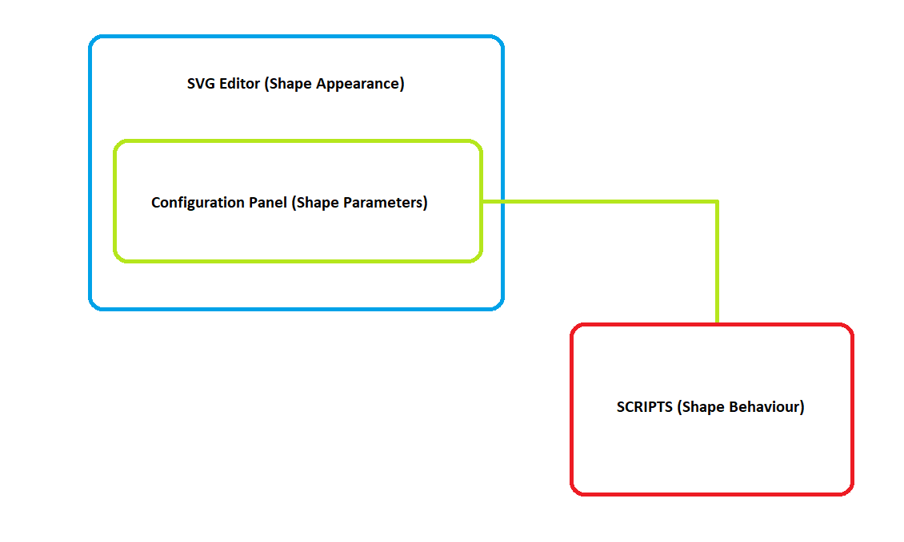

#

Shapes are graphical components designed to visualize data, elements of
the control system, and more. In essence, they can be divided into two categories: static and dynamic. Static shapes do not display data and will not be the focus of this chapter. They are used as an indication of an item that is part of the system but is not required to be monitored. Dynamic shapes are the primary source of information on a display. They represent data and important events such as alarms and more. Simple `svg` elements and *AngularJS* directives are the basic building blocks that determine the composition, configuration and functionality of the shape. The functionality can then be customized even further through the use of *JavaScript*. Each shape can be used multiple times in a display to visualize different data.

##Introduction

The shape creation process begins in the `Media Library`, which can be accessed through the `Media` menu item in the admin `Dashboard`.


The `Media Library` is the place where all shapes are built and configured. The following image represents the layout of the page as well as the different options that it provides.


`(1)` Import external shape files.

`(2)` Edit the name of the selected folder.

`(3)` Create a new folder.

`(4)` Create a new shape file.

`(5)` Filter through files based on file type and order them based on title or recent status.

`(6)` Available directories that contain media files.

`(7)` Available (created/imported) shape files.

`(8)` Test Stand (allows shapes to be tested outside of displays).

`(9)` Meta data for the **selected** shape file.

`(10)` Edit the [`Content Item`](../content-anatomy) of the shape.

`(11)` Open the shape file in the `SVG Editor` (this is where the graphical part and configuration of the shape are created). 

`(12)` Delete the selected shape/s.

The shape creation process begins by selecting a directory (`6`) in which the new shape files will be created. The target directory will be highlighted upon selecting it with the left mouse button. A new shape file can then be created by pressing the `Create Shape` button, which will allow the user to provide a name for the new shape. Pressing the `Save` button will create the new shape file in the selected directory.


The next step in the creation of a shape is to construct its graphical (or visual) part and provide a configuration that will determine the features it will include and the data it will represent. This process is explained in detail in the next section.

## Graphical part

The graphical (visual) aspect of the shape is what the user sees when data is being presented on the page. This part of the shape also contains a configuration, which allows the user to implement different features and determines the point data that will be presented on the page. The process of building the graphical part is done in the [`SVG Editor`](../hmi-editor-mastering).

The graphical part of the shape is comprised of basic `svg` elements and custom  directives that are provided by **SmartWEB**. The directives can be split into two separate categories. The first category of directives will be referred to as `Base Components`. These are pre-built components with specific behaviour. They are intended to be used as building blocks in the construction of the shape, as they provide specific functionality and can be used multiple times in a single shape. Example of such `Base Components` are the `Alphanumeric`,  
the `Parameter Container`, the `Alarm Basic`, the `Indicator Bar`, and many more. The other type of directives that are used in shape building are the directives that are combined with basic `svg` elements or groups of elements. This category of directives will be referred to as `Directives`, located in the `Directives Tab` in the element `Item Configuration` panel.
Basic `svg` elements that are intended to have dynamic behaviour are assigned the  
`Base Element` directive. Elements such as these will be referred to as `Base Elements`. 

!!!tip "Directives, Base Components, and Item Configuration:"
     More information on `Directives`, `Base Components`, and the `Item Configuration` panel can be found in the [HMI Editor Mastering](../hmi-editor-mastering) chapter of the **SmartWEB** documentation.

Different shapes are built for different purposes. They represent different data and have different behaviours. The type of the shape is determined by the data that it has to represent. In this section we will go through the process of creating a shape with the help of an example. 

#### Creating an example shape: Scada Data Acquisition

We will first need to create a shape file, as shown in the introduction section of this chapter, and open the file in the `SVG Editor`.

The first shape element we will create for this example is the "RecFrame" `base element`, which will act as the background for our shape. To do this, we will use the `Rectangle` option in the toolbar on the left, marked as `(1)` in the image below.


In order for this `svg` element to become a `base element` it needs to be assigned a `Base Element` directive from the `Directives Tab` in the `Item Configuration` panel. Steps `(2)`, `(3)`, and `(4)`, shown in the image above, represent the process of selecting a directive.

* Step `(2)` - `Item Configuration` panel
* Step `(3)` - `Directives Tab`
* Step `(4)` - `Base Element` directive

 Once the directive is selected, the appropriate action needs to also be selected from the adjacent drop-down list. Clicking the `Add` button will then assign the directive to the `svg` element and it will become visible in the `Directives Tab`. In this case, the directive we used will allow us to provide the `Base Element` with an appropriate name, as shown in the image below.


!!!error "Theme Support:"
     If the new shape is intended to support theming, all `base elements` need to include the   
     `i-ng-class` directive. The directive supports the `ApplyNgTheme()` function. It takes one argument, which is the name of the css class (example: 'RecFrame') that we want our `svg` element to have. The following image provides an example of the `i-ng-class` directive.


The next step in the creation of our example data acquisition shape will require the use of   
`Base Components`. In this case we will use the following four components: 

* `Alphanumeric` `(1)`
* `Alarm Basic` `(2)`
* `TxtNameEu` `(3)`
* `Custom Selection Box` `(4)`


The components and elements can be moved around and arranged to achieve the required design. After this is done they need to be grouped. This is achieved by selecting the elements/components (step `(1)` in the image below) and grouping them with the `Group Elements` button (step `(2)` in the image below).    


!!!error "Important"
     If there are two or more `base components` with the same `Item Substitution` present - their  
     `Item Substitution` fields should be modified so that they are different, before the elements are grouped. This field is unique for each 
     `base component`. Two components must not have the same `Item Substitution`. The following images present the correct way of configuring the  
     `Item Substitution` field.


!!!error "Important:"
     Shapes can't contain other shapes. This means that after the elements have been grouped once, that group can't be grouped again with a new element. Grouping should only be done once, after all of the required elements have been created/added. If you forget to group the elements, it will be done automatically after pressing the `Save` button.


The body of our example data acquisition shape is now formed. The next step is to configure it.
The configuration will determine the features that the shape provides as well as the behaviour that will represent data changes. The shape has its own `Item Configuration` panel, comprised of three different tabs.


* `Properties Tab` `(1)` - enables the user to assign a data source for each `base component` that requires data, and provides advanced options for the shape (this tab becomes available after the shape is implemented in a display)
* `Directives Tab` `(2)` - enables the user to assign directives to the shape that provide various functionalities 
* `Components Tab` `(3)` - enables the user to configure each `base component`

!!!tip "Configuration"
     Visit the [HMI Editor Mastering](../hmi-editor-mastering) chapter for more information on the `Item Configuration` panel.

For now, we will turn our attention to the `Directives Tab` and the `Components Tab`, because they are relevant to the shape creation process. The first part of the configuration begins in the   
`Directives Tab`. Our example shape will contain three directives, which are present in the majority of shape designs:

* `ng-init` `(1)` - enables the initialization of data parameters as variables
* `epks_context_menu` `(2)` - provides a context menu with various options
* `name` `(3)` - provides a name attribute for the shape


The `ng-init` directive initializes the point parameters which the shape will represent as variables that can be used by the shape's `base components` and scripts.

The image below represents the custom parameters for our example data acquisition shape. Each row consists of two columns. The first column contains the variable name, while the second column contains the point parameter, the value of which will be used by the `base components` and the shape script. In this case, as shown in the image below, the first four variables `(1)` will be used by the `base components` directly. They will not be used in our script because the `base components` have built-in behaviour which will represent the data without external logic. The other three variables `(2)` will be used in our script, because they will allow our shape to have additional behaviour that is not handled by a `base component`.


The following image represents the custom parameters after they have been added to  
`base components`. The parameters are specified in a specific way (syntax). They must be surrounded by curly brackets _{ }_ and a percent sign _%_ - . Assigning a point parameter to a custom parameter (`ng-init` variable) also provides flexibility in cases where multiple components use the same point parameter. Changes to the custom parameter in the `Directives Tab` will result in changes in all `base components` that use that parameter. 


The `epks_context_menu` and `name` directives will not be explained in this chapter. Visit the [HMI Editor Mastering](../hmi-editor-mastering) chapter for more information on directives.


Calling the shape-specific script is the last step in the configuration process. It enables the user to implement custom behaviour and and functionality for the shape by calling a custom *JavaScript* function. The function call itself is done with the help of specific `base components` or with the help of specific directives.

!!! note "Function calls through directives:"
     Calling a function through a directive is usually done in cases that require the function to be executed only once. This approach is relevant for shape types such as Navigations or Matrixes etc. Standard shapes represent data on an *on-update* basis, which demands the use of  
     `base components`.

Examples of `base components` that allow functions to be called:

* `Alphanumeric`
* `Parameter Container` 
* `Indicator Bar`
* `User Input`

Each of these components contains a `Function` field that will call the custom function when there is new data (on an *on-update* event) or when a specific event is triggered. This field has a specific syntax that begins with square brackets _[ ]_. The data between these brackets is in *JSON* format. The first property (_action_) defines the action that, when triggered, will call the function. The second property (_function_) defines the name of the function that will be called.

!!!error "Important:"
     It is good practice to have one custom function per shape event, and it should have the same name as the shape, followed by an underscore ( _ ) and the event name (*_OnUpdate* etc.). 
     
     Example: *Scd_DataAcq_Example_OnUpdate*.

     The custom function can be called from any of the respective `base components`. When an update event occurs - each 
     `base component` is updated. Even if there are multiple components of the same type. It is good practice to call the function just once per event. The function call should be done from the last component in the directives tab that supports this functionality, unless it already has a function set (the function should **not** be called by each component). 


After the graphic part has been constructed and configured, the shape needs to be saved. The `Save` button is located under the editor, as shown in the image below:


!!!note "Testing shapes outside of displays:"
     Each new shape can be tested outside of a display. Instead, it can be loaded into the `Test Stand`. In order to load the new shape in the `Test Stand`, data must be provided for each component. After initially saving the shape, opening it again in the `SVG Editor` will create fields for every parameter that requires a data source. These fields are located under the editor zone, as shown in the image below:

     

     In **SmartWEB**, data is usually accessed through `ItemName`, but there is also the option to access data through `ItemPath`. After the parameters have been assigned with a data source, the shape can then be saved again, and loaded into the `Test Stand` through the `Go To Test Stand` button in the `Media Library`.

 

##Custom Functions

Custom functions are a vital part of the shape creation process. They determine the way the data is processed and presented. Essentially, they determine the behaviour of the shape. 

Custom functions in **SmartWEB** are written in *JavaScript (.js)*, with additional functionality provided by *jQuery* and *AngularJS*. The files containing the scripts are located in the following directory: 

```
..\inetpub\SmartWeb\Modules\Smartsys.OpcXmlDa\Scripts
```

All custom functions must be created as methods for the `epksCustomFunctions` object.

```
epksCustomFunctions.Scd_DataAcq_Example_OnUpdate = function () {

}
```


Individual shape behaviour is based on the shape configuration (shape parameters).



The data that the scripts access can be divided into two categories:

* dynamic data that is obtained from *EPKS* point parameters through `OPC XML Providers`
* static data that is obtained from custom variables (`ng-init`) 

!!!tip "OPC XML Providers"
     Visit the [Access to OPC Data](../access-to-opc-data) chapter of the **SmartWEB** documentation for more information on OPC Data.

*EPKS* data (point parameters etc.) can be accessed with the use of `base components`. When a parameter is added to a `base component` - each time an `on-update` event occurs the *EPKS* value for that parameter will be updated in **SmartWEB**. The value can then be accessed with the help of specific functions.

The following function will return an object that includes the value of the *EPKS* parameter as well as other properties. If the parameter does not exist, the returned value will be **Null**:
```
var base_component_name = "alphanumeric1";
var parameter = "cp_pv";
this.DataValueObj(base_component_name, parameter);
/*
we want the js object for the cp_pv parameter, 
which was added to the alphanumeric1 base component
*/
```

Returned object:
```
ChildItem: "pv"
ClientItemHandle: "0_alphanumeric1_2"
ContinuousParameter: true
ItemName: "OPC.Server./ASSETS/SS_TEST/SS01/DATAACQS_SCADA.pv"
ItemPath: ""
OPCError: false
OPCErrorText: null
ParentItem: "alphanumeric1"
Quality: "good"
SnapshotParameter: false
Timestamp: "2022-06-24T16:32:23.5016762+03:00"
Usable: true
ValueType: "double"
value: "12"
valuesArray: [{…}]
```

The following function will return the value of the *EPKS* parameter. If the parameter does not exist, the returned value will be **Null**:
```
var base_component_name = "alphanumeric1";
var parameter = "cp_pv";
this.DataValue(base_component_name, parameter);
/*
we want the EPKS value for the cp_pv parameter, 
which was added to the alphanumeric1 base component
*/
```
Returned value:

```
'12'
```

Static data (`ng-init` variables) can be accessed by using the regular *JavaScript* square brackets property access syntax:
```
var parameter = this["cp_pv"];
/*
we want the value of the ng-init variable, not the EPKS parameter value
*/
```

Returned value for "parameter":
```
'pv'
```

Accessing different `svg` elements is vital for providing dynamic behaviour for the shape. The following function will return a specified element, which can then be altered by the code:
```
var base_element_name = "RecFrame";
this.GetObject(base_element_name);
```

Returned element:
```
-> jQuery.fn.init [rect.r500.hmiclassic.recframe, prevObject: jQuery.fn.init(1), context: g#svg_4]
/*
the result is a jQuery selector that contains the different properties of the element
*/
```

!!!error "Base Elements:"
     This function returns a specified `svg` element based on the name that it was provided by the `Base Element` directive. For this reason, it is good practice to provide each element with a name, so it can then be accessed in the shape script in a convenient way.

The scope that the shape script has access to is the scope of the component that it was called from. In some cases, scopes of other components need to be accessed in order to achieve the desired shape behaviour. To do so, the following function can be used:

```
var base_component_name = "alphanumeric1";
this.GetScope(base_component_name);
```
Returned scope object:
```
-> ChildScope {$$childTail: null, $$childHead: null, $$nextSibling: ChildScope, 
$$watchers: Array(7), $$listeners: {…}, …}
/*
the object that is returned contains a multitude of properties 
from the scope of the desired component
*/
```

In terms of styling (*.css*), the following four **SmartWEB** functions are available:
```
var base_element_name = "RecFrame";
var base_element = this.GetObject(base_element_name);

SetClass(base_element, css_class);
/*clears all currently applied classes and sets a new css_class*/

AddClass(base_element, css_class);
/*applies a css_class if it is not already applied*/

RemoveClass(base_element, css_class);
/*removes a css_class*/

RemoveAllClasses(base_element);
/*removes all applied css_classes*/
```

Additionally, *jQuery* (or vanilla javascript) can be used:
```
var base_element_name = "RecFrame";
var base_element = this.GetObject(base_element_name);

/*sets the value of a css property of the base element*/
$(base_element).css(css_property, property_value)

/*sets a value of an attribute of the base element*/
$(base_element).attr(attr_name, attr_value)

$(base_element).text(new_text)
/*sets the text of a element <text>*/
```

The following two basic examples of shape scripts represent the common uses for the functions and methods explained above. The first example will change the state of a shape (fan) based on data. It is intended to represent the general idea behind the behaviour of discrete shape types (pumps, motors, louvers, fans etc.).

```
epksCustomFunctions.Discrete_Fan_OnUpdate = function () {
    var pvObj = this.DataValueObj("parameterContainer", "cp_pv");
    var base_element = this.GetObject("OvlBody");

     if (this.CommError || this.ForbiddenError) {
          $(base_element).css("fill", "#0000ff");
          /*
          Indicates that there is a communication or forbidden error.
          */
     } else if (!pvObj || (!pvObj.value && pvObj.value != 0) || 
                               pvObj.Quality.indexOf("bad") == 0) {
          $(base_element).css("fill", "#000000");
          /*
          Indicates that the quality of the data is bad.
          */
     } else {
          $(base_element).css("fill", this["cp_styleForPV" + pvObj.value] ? 
                                        this["cp_styleForPV" + pvObj.value] : "");
          /*
          The above line of code provides colors for, in this case, states 1, 2 and 3, if they exist:
          cp_styleForPV1 = "#808080"
          cp_styleForPV2 = "#c0c0c0"
          cp_styleForPV3 = "#ffffff"

          Any other states that do not have colors provided for them in the ng-init
          will not be indicated, and the shape will return to its default color 
          (the color it was initially given in the SVG editor).
          */
     }   
}

```

Script Results:


!!!note "Other means of applying styles:"
     The above example could be done in different ways, including classes. In that case, instead of *jQuery*, the script would utilize the functions provided by **SmartWEB**:

     * SetClass(base_element, css_class);
     * AddClass(base_element, css_class);
     * RemoveClass(base_element, css_class);
     * RemoveAllClasses(base_element);


A slightly different approach is used when theming is required. The most common way to manipulate a `base element` that supports theming is to use a variable that is added as a parameter for the `ApplyNgTheme()` function in the `i-ng-class` directive. 

```
Example: ApplyNgTheme(cp_ovlBodyClass)
```

The variable can then be accessed in the code, which will allow the custom function to change the class of the element in regard to the state, while the process of changing the class in regard to the theme will be done automatically. In this case, the function above will be written the following way:

```
epksCustomFunctions.Discrete_Fan_OnUpdate = function () {
    var pvObj = this.DataValueObj("parameterContainer", "cp_pv");
    var base_element = this.GetObject("OvlBody");

     var opt = this.$parent;
     if (this.CommError || this.ForbiddenError) {
          if (opt["cp_styleForCommError"]) {
               opt["cp_ovlBodyClass"] = "OvlBody_" + opt["cp_styleForCommError"];
          }
     } else if (!pvObj || (!pvObj.value && pvObj.value != 0) || pvObj.Quality.indexOf("bad") == 0) {
          if (opt["cp_styleForBad"]) {
               opt["cp_ovlBodyClass"] = "OvlBody_" + opt["cp_styleForBad"];
          }
     } else {
          if (opt["cp_styleForPV" + pvObj.value]) {
               opt["cp_ovlBodyClass"] = "OvlBody_" + opt["cp_styleForPV" + pvObj.value];  
          }
     }  
}
```

In this version of the script, the styles are applied through classes. The existence
of the required class variable is checked. If it exists, the code tries to apply
a class that consists of a prefix (`OvlBody_` in this case) and the value of the variable.

The next example will showcase how to access the scope of other `base components`. This technique is usually done in shapes that have some sort of analog data presentation, but there may be exceptions. The shape that the following script belongs to has two `Alphanumeric` components (alphanumeric1 and alphanumeric2). The function is called from alphanumeric2, which is important because the execution of each `base component` is done one after the other. This means that if the function is called on a previous component and tries to change something in the one after it, the code of the function will be overwritten by the built-in code of the next component. The task of the next example is to get the scope of alphanumeric1 and change the value, in this case - double it.

```
epksCustomFunctions.Analog_OnUpdate = function () {
     var value = this.DataValue("alphanumeric1", "cp_pv");
     /*
     Get the current value of alphanumeric1
     */
     var scope = this.GetScope("alphanumeric1");
     /*
     Get the scope of alphanumeric1
     */
	
     scope.SetValue(parseFloat(value)* 2);
     /*
     We are doubling the value by accessing a function
     that is unique to the alphanumeric component. 
     */
}
```


#### Example shape script: Scada Data Acquisition

As a final example for this chapter, we will create the custom function for our example data acquisition shape. This is a production-grade shape used at a professional level. Most of the functionality in this case is handled by the built-in code of the `base components`. Formatting the value and providing an alarm frame for the shape is the only additional behaviour required.

```
epksCustomFunctions.Scd_DataAcq_Example_OnUpdate = function () {
    epksCustomFunctions.UpdateByTextPvFormat_r500(this, this["cp_pvformat"]);
    /*modular function that formats the value*/

    var recAlm = this["cp_almObjName"];
    var roundness = this["cp_roundness"];
    /*custom parameters that are required by the function below*/

    if (recAlm) {
        epksCustomFunctions.UpdateRecAlarm(this, recAlm, null, roundness);
        /*modular function that creates the alarm frame for the shape*/
    }

};
```

!!!note "Modular functions:"
     Modular functions are, in essence, reusable code. They provide an optimal and efficient way of producing new custom functions.
     These functions are available inside the standard **SmartWEB** script files, located in the following directory:
     `..\inetpub\SmartWeb\Modules\Smartsys.OpcXmlDa\Scripts`.


The text formatting is done with the help of a modular function, which accepts the scope of the component that must be modified as well as a number that will determine how many numbers after the decimal point are shown. In this case, the number is obtained through a static  
value in the `ng-init` directive (**this["cp_pvformat"]**). 

The alarm frame of the shape is created with the help of another modular function. The parameters it receives are the scope of the component that called the function, the `this["cp_almObjName"]` parameter that will determine if an alarm frame is required, the `ItemSubstitution` (optional), and the `this["cp_roundness"]` parameter that will determine the roundness of the alarm frame (optional).

---

In this chapter we went through the process of creating an example shape in **SmartWEB**, the common and recommended practices, shape structure and configuration.  

