#
## Installing

**SmartWEB**'s installation is a straightforward process that requires a number of steps to be taken beforehand, such as a Microsoft SQL Server readily available.

**SmartWEB** uses a Microsoft SQL Server for optimal functionality and compatibility. This allows the system to complete processes fast, as well as have enough space to store all the necessary data. 

There are other possible alternatives such as:

* SqlCe - **SmartWEB** has built-in support for SqlCe, but it has limited capability compared to a MS SQL Server, and some of the modules may not work properly (Smartsys Epks Event Collector). Using SqlCe is only recommended for small scale operations and tests, where larger database services are not required, since its lack of storage capacity makes it difficult to store data from elements such as event collectors. SqlCe will store the data in a file in the `App_Data folder`. This makes it convenient for demonstration purposes, since the data will not be lost if the program directory is changed.

* Microsoft SQL Server Express Edition - highly limited in regards to speed and database capacity, with a maximum database size of 10 GB. The processing power is limited to 4 cores. This means that the memory may not be used in its entirety. This edition of a MS SQL Server is only recommended for use in small systems, where the data that is being stored is not a large amount.

!!!note "Before you install:"
     **SmartWEB**'s installation scripts come complete with `Internet Information Services (IIS)` and `.NET Framework`. They will be installed along with the system, and do not require setup prior to that, unless a different version is needed.

The following chapter will explain and guide you trough the necessary steps, needed to install **SmartWEB**, including the installation of a MS SQL Server, as well as the preconditions required to complete the setup successfully.
The system will run on all versions of Microsoft SQL Server that are 2008 or higher. For this example we will use a Microsoft SQL Server 2012 Standard Edition.

#### Preconditions

To install **SmartWEB** the following is required:

* Windows 7 x64 operating system or higher.

* Administrator rights on the operating system that **SmartWEB** is being installed on.

* Microsoft SQL Server 2008 database or higher.

* Administrator rights on the database.

*  `Optional:` IIS 7.0 or higher (automatically installed by **SmartWEB**'s installation scripts).

*  Web Deploy 3.5 or higher

*  `Optional:` .NET Framework 4.5 or higher (requires manual installation if it's not part of the operating system).

####Installing a Microsoft SQL Server

If you already have a MS SQL Server installed you can skip this step, but make sure that the `Mixed Mode (SQL Server authentication and Windows authentication)` option is enabled. Also, make sure that the account you are using has administrator rights on the server.

Once you have started the SQL Server installation the following screen will become available:

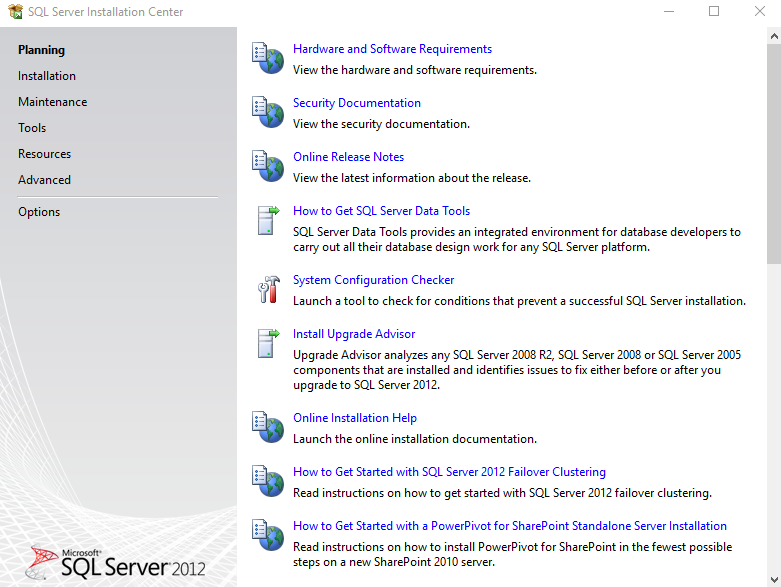

Navigate to **Installation** element, in the menu to the left, and select **New SQL Server stand-alone installation or add features to an existing installation**.

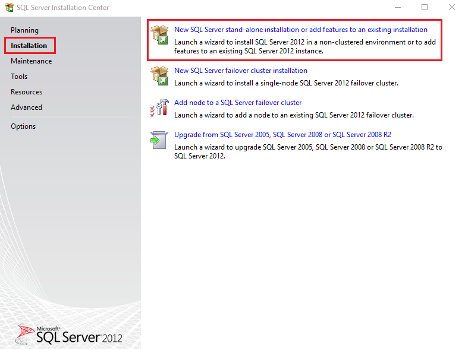

Enter the product key if it is required:

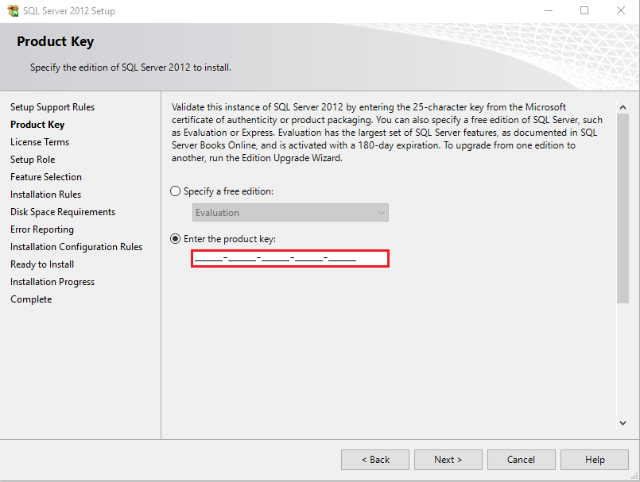

When you have reached the **Setup Role** window, select the `SQL Server Feature Installation` option.

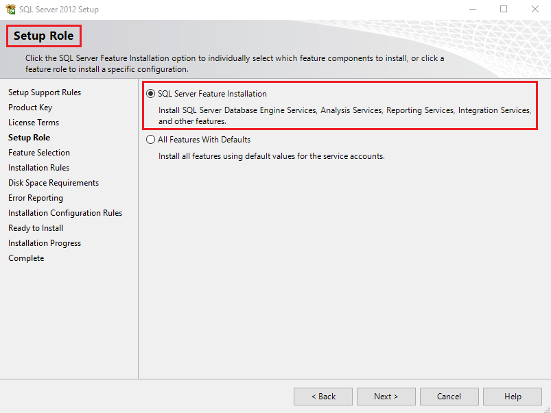

Select the features you want to install, with the bare minimum being - `Database Engine Service` and `Management Tools - Basic`.

Depending on your license you can select additional options - `SQL Server Replication`,  
`Full-Text and Semantic Extractions for Search`, and `Management Tools Complete` for example.

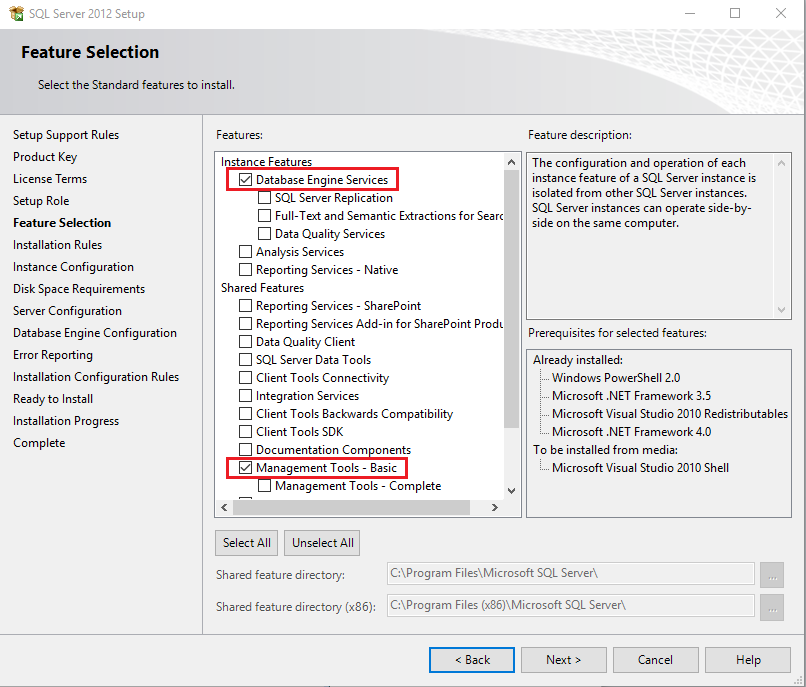

Select the `Mixed Mode (SQL Server authentication and Windows authentication)` option in the _Authentication Mode_ section, as shown on the screen below, and enter the password for the administrator of the database in the `Enter password` and `Confirm password` fields. You can add the Windows account that is currently being used as an administrator by clicking on the `Add current User` button in the _Specify SQL Server administrators_ section.

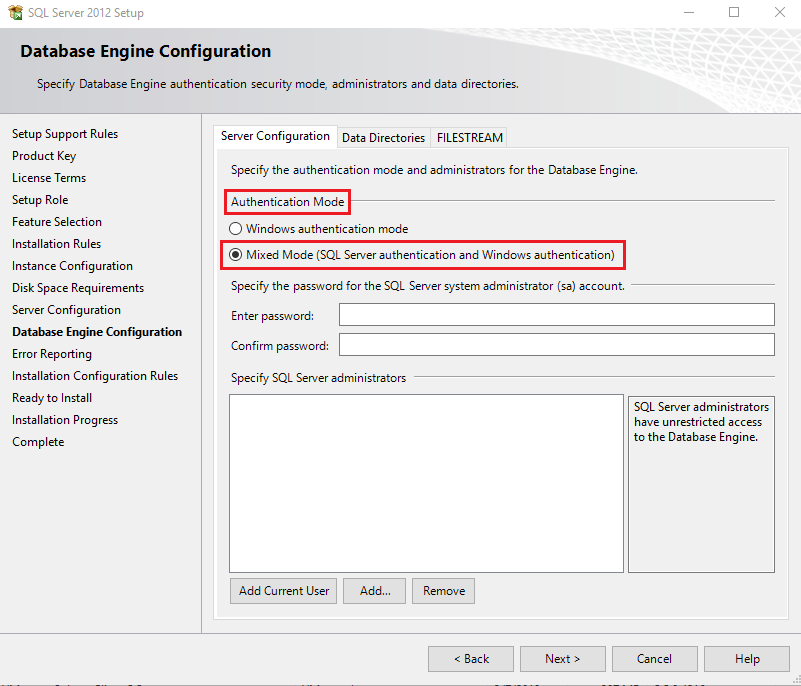

After the installation is complete the operating system (Windows in this case) must be restarted. 

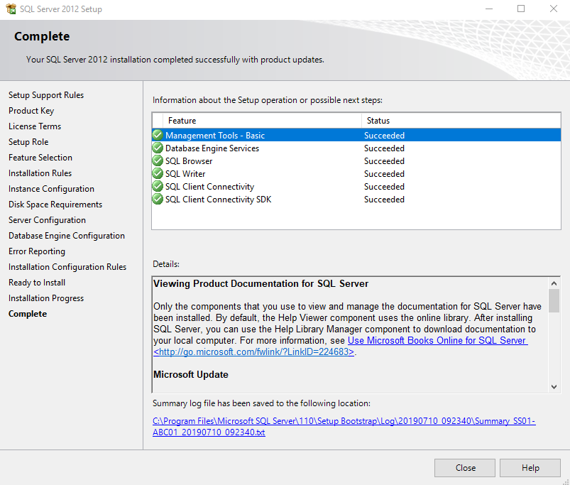

After the restart is complete, go to the start menu and open `Microsoft SQL Server Management Studio`.

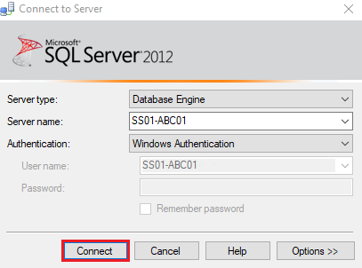

Leave the default settings and click the `Connect` button. If everything is in order, and you have successfully managed to connect to the database, the following screen will appear: 

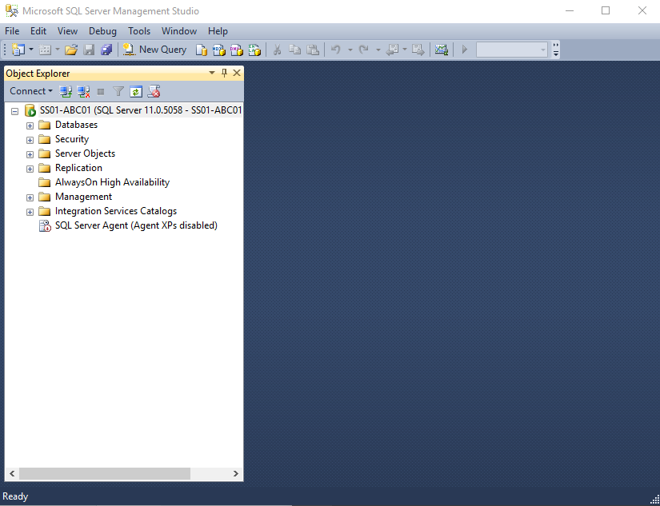

####Installing Web Deploy

!!!note "Note:"
      If you already have Web Deploy installed, you can skip this step.

Go to the distribution package. Find  the **WebDeploy_amd64_en-US.msi** installation package and run it.

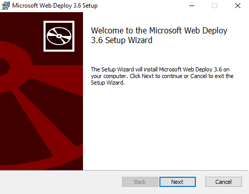

Click `Next`.

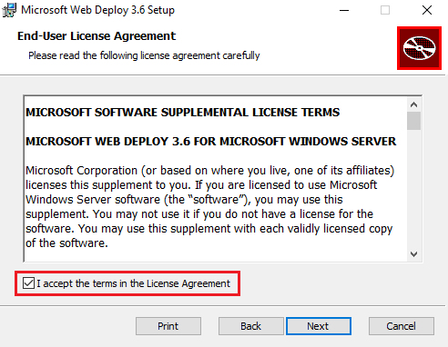

Check the `I accept the terms in the License Agreement` box and click `Next`.

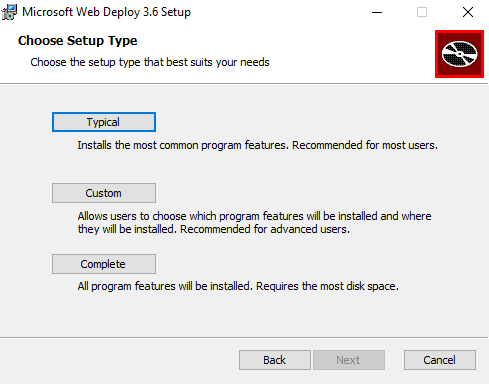

Select the `Typical` setup type.

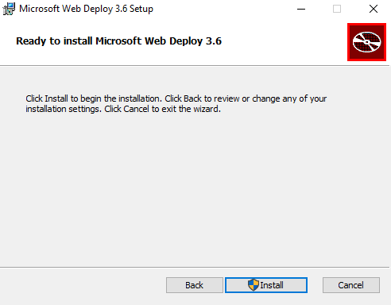

Click the `Install` button.

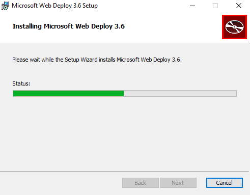


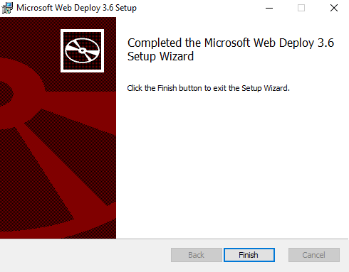

Click `Finish`.
The installation package for Web Deploy's extension for `IIS` can also be found at:  
[http://www.iis.net/downloads/microsoft/web-deploy](http://www.iis.net/downloads/microsoft/web-deploy).

####	Installing .NET Framework 

!!!note "Note:"
      Skip this step if your operation system is Microsoft Windows Server 2012 or higher.

!!!note "Note:"
      **SmartWEB** uses `.NET Framework 4.5`, but a newer version can be installed.

The installation for the `.NET Framework` is straightforward.
Go to the distribution package. Locate the **NDP451-KB2858728-x86-x64-AllOS-ENU** file and go trough the intuitive installation process. Alternatively, it can also be downloaded here: [http://www.microsoft.com/en-us/download/confirmation.aspx?id=40779](http://www.microsoft.com/en-us/download/confirmation.aspx?id=40779).

#### Registering the .NET Framework ASP .NET installation in IIS.

!!!note "Note:"
      Skip this step if your operation system is Microsoft Windows Server 2012 or higher.


!!!note "Note:"
     If the `.NET Framework` package is installed after the `IIS` installation, you can skip this step.

Go to the `Command Prompt` and run it as **Administrator**. Run the following command:

```
C:\Windows\Microsoft.NET\Framework64\v4.0.30319\aspnet_regiis –i
```
#### Installing Redis Cache as Windows Service


`Redis` is an open source (BSD licensed), in-memory data structure
store, used as a database, cache and message broker. It also provides
persistence of data. It is highly recommended to use `Redis` cache
service when using **SmartWEB**. We recommend `Redis` and **SmartWEB**
to be on the same machine.

You can download **MSOpenTech**'s release 3.2.100 for 64-bit `Windows`
from here
<https://github.com/microsoftarchive/redis/releases/tag/win-3.2.100>

Run the `MSI` package and follow the instructions.

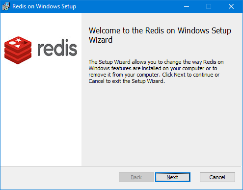

Press `Next`.

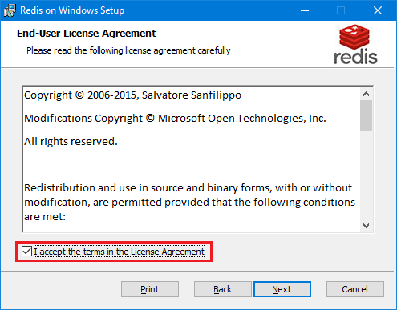

Accept the license agreement and press `Next`.

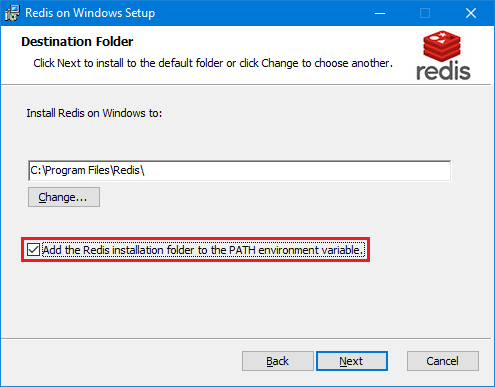

Check
`Add the Redis installation folder to the PATH environment variable` and
press `Next`.

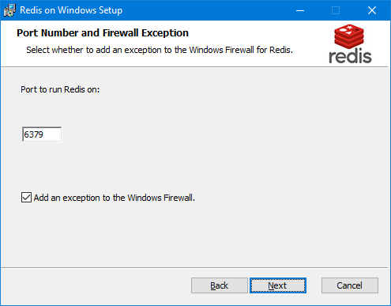

Leave the defaults as shown above and press `Next`.

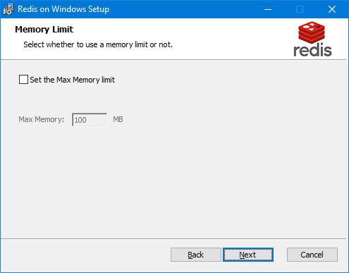

The `maxmemory` configuration directive is used in order to configure
`Redis` to use a specified amount of memory for the data set. It is
possible to set the configuration directive using the
`redis``.windows``.conf` file, or later using the `CONFIG SET` command
at runtime. Leave the defaults (without memory limit constraint) and
press `Next`.

!!! warning "Warning:" 
        If `maxmemory` is set and the specified amount of
        memory is reached, it is possible to lose data depending on chosen
        eviction policy. Some of the **SmartWEB** data is persistently stored in
        `Redis` and evicting it will lead to unwanted behavior. However if you
        want to set limit, ensure it is enough (e.g. 2GB or more).

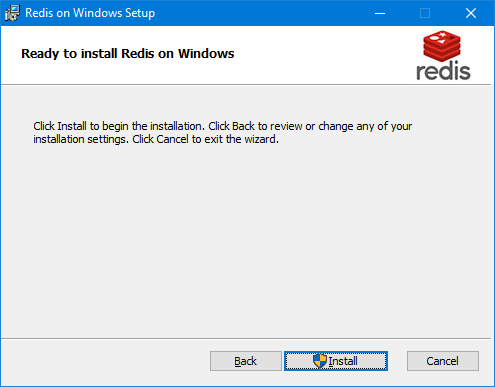

Press `Install` and wait.

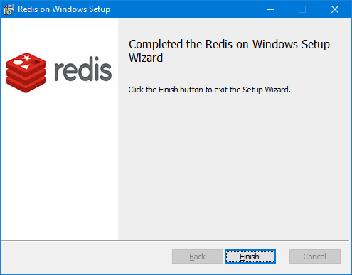

Press `Finish`.

Now `Redis` cache service is installed and running.

!!! note "Note:"
        The proposed Redis release is **MSOpenTech**'s port for
        Windows based on antirez/redis <https://github.com/antirez/redis>, but
        you are not limited to it. If you use Redis cache on other
        platform/machine ensure that memory limit is big enough and network
        latency is small.

More information about you can find here
<https://github.com/microsoftarchive/redis/tree/3.2> and here
<https://redis.io/>

**SmartWEB** modules like `Smartsys Cachin``g`, `Smartsys Output Cache`,
`Smartsys User Space Cache`, `Smartsys Tag Sync` benefits from `Redis`
cache.

Enable the following **SmartWEB** modules in order to benefit from
`Redis`: `Smartsys Redis`,` ``Smartsys Redis Output Cache`,
`Smartsys Redis Data Cache`, `Smartsys Redis Object Cache`,
`and Smartsys`` Redis User Cache`.

By default, `Redis` listens on port **6379** and no password is required
to connect. The `Redis` connection configuration of **SmartWEB** is in
the `Web.config` file of the module `Smartsys Redis`.

In `connectionStrings` section, you will find for each provider
connection string to the Redis cache server like:

`<add name="Smartsys.Redis.OutputCache" connectionString="localhost:6379, syncTimeout=10000" providerName="0"/>`

`syncTimeout``={int}` - Time (ms) to allow for synchronous operations

`password``=``{string}`` `- Password for the `R``edis` server

`connectTimeout``={int}` - Timeout (ms) for connect operations

`abortConnect={bool`} - If `true`, Connect will not create a connection
while no servers are available

`ssl={bool}` - Specifies that SSL encryption should be used

`noCertCheck=``{bool} `-- If true and ssl is enabled then server
certificate will not be checked.

Endpoints without an explicit port will use 6379 if ssl is not enabled,
and 6380 if ssl is enabled.

**SmartWEB** uses `StackExchange``.``Redis` client, so more about
connection options you can find here
<https://stackexchange.github.io/StackExchange.Redis/Configuration>

`providerName="``{number from 0 to 1``5``}``"` - Specify which database
instance of Redis to be used. By default, `Redis` server starts with 16
database instances. Distribute provider connections across instances.

!!! note "Note:"
         Changing connection settings requires restart of the
         **SmartWEB** application pool in order changes to take effect.

####Installing SmartWEB

SmartWEB's installation scripts will automatically install(if they are located on the system):

* IIS
* .NET Framework 4.5 (for Windows Server 2012 operating system or higher)

Take the `Smart Web Site Deployment.rar` file, from the installation package, and copy it into a temporary folder on the hard drive. Extract it in the same directory. There should be a subfolder named `Smart Web Site Deployment`. Inside, there should be various files, as well as a specific file named `setparams.cmd`. Right-click on the `setparams.cmd` file and select **Edit**.

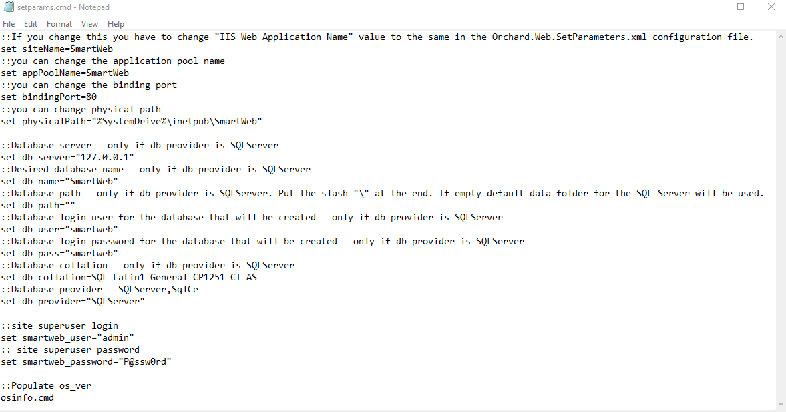

Optionally, you can change the following elements:

* `siteName` - the name of the site in IIS (If you change the name of the site, you have to change the value of `IIS Web Application Name` with the name you have entered in the configuration file `Orchard.Web.SetParameters.xml`).

* `appPoolName` - the name of the pool that the application will work with.

* `physicalPath` - the path where **SmartWEB** will reside. 

* `smartweb_user` - the username of the **SmartWEB**'s administrator.

* `smartweb_password` - the password of the **SmartWEB**'s administrator.

* `bindingPort` - the port of the Web server that **SmartWEB** will work on.

* `db_provider` - the type of the database that will be used - `SqlCe`, `SQLServer`.

The following settings will only be viable if the `dp_provider` is `SQLServer`.

* `db_path` - the path where the database file will reside.

* `db_user` - the username that is used to connect to the database of **SmartWEB**.

* `db_pass` - the password that is used to connect to the database of **SmartWEB**.

* `db_collation` - database collation (**SmartWEB** uses an **ORM** module - **NHibernate**, which can only work with **CI**(Case Insensitive) collations. If you are using a Cyrillic keyboard the best option is to set it to - `SQL_Latin1_General_CP1251_CI_AS`. If you are only using a Latin keyboard, you can set it to `SQL_Latin1_General_CP1252_CI_AS`).

Save the file after you have performed the necessary changes and run the `install.cmd` file.

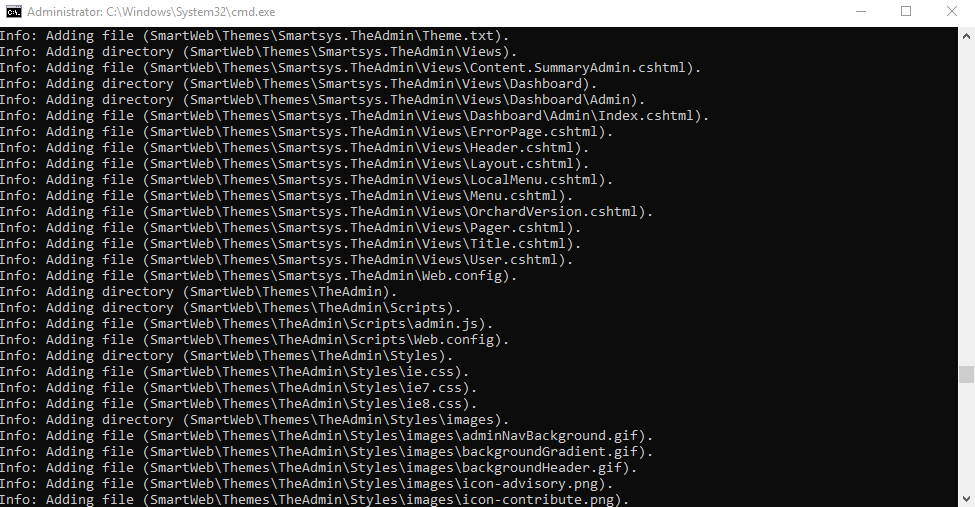

After the installation is finished, the **SmartWEB** homepage will open in the browser. If the installation is unsuccessful, you can view the `install.log` file.

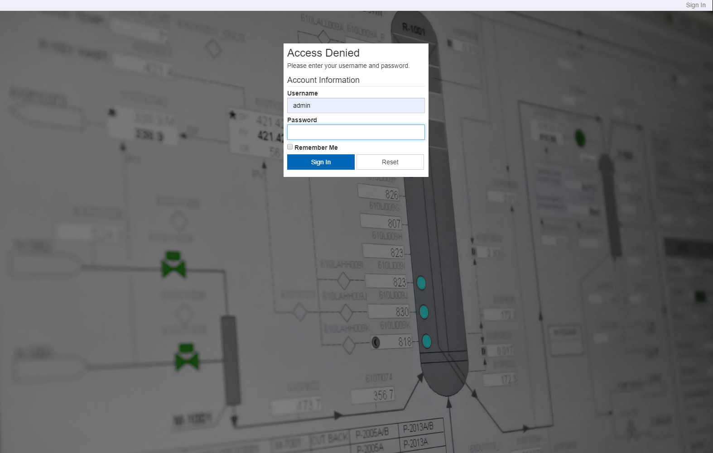

Enter the credentials of the admin account and click the `Sign In` button. If the login was successful, the following screen should be visible:

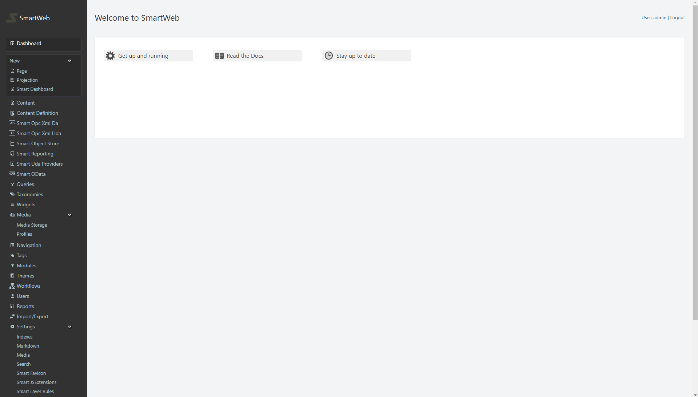

!!! warning "Warning:"
     If you run the installation script over a working installment of the system, the script will automatically delete the database and recreate it.

    
In regards to productivity, **SmartWEB**'s `Web.config` contains commented sections - `Performance optimization`, which can be enabled if you are working on a Microsoft Windows Server operating system. Some of the settings need to be authorized by `Machine.config`. The comments contain instructions on what to do.

---
##Upgrading

---
##Run in N Steps