#
**SmartWeb** offers a built-in WEB-based graphical editor for creating and editing `SVG` vector graphics. With the help of the data provided by `Opc Xml Data Providers`, vector graphics can be animated, thus presenting the data-driven graphics on web pages. This feature allows for a Web HMI (Human Machine Interface) design that has the same appearance and functionality as the HMI used in control room operator stations. This chapter describes how to create and manage your graphical displays and create a dynamic visual presentation of process data by utilizing the shape library. The next picture is an example of a data-driven WEB graphical page.

**SmartWeb** offers a built-in WEB-based graphics editor for creating and editing `SVG` vector graphics. These graphics are part of WEB pages. Using the data provided by the `Opc Xml Data Providers`, the vector graphics can be animated. This feature enables the design of an `HMI` (Human Machine Interface) that has the same appearance and functionality as the HMI used in operator stations in the control room. This chapter describes how to create and manage graphical displays, thereby achieving a dynamic visual representation of the process. Components from the SmartWEB dynamic shape library are used to represent common HMI elements such as valves, motors, regulators, etc. The following picture is an example of a data-driven HMI WEB graphic page.

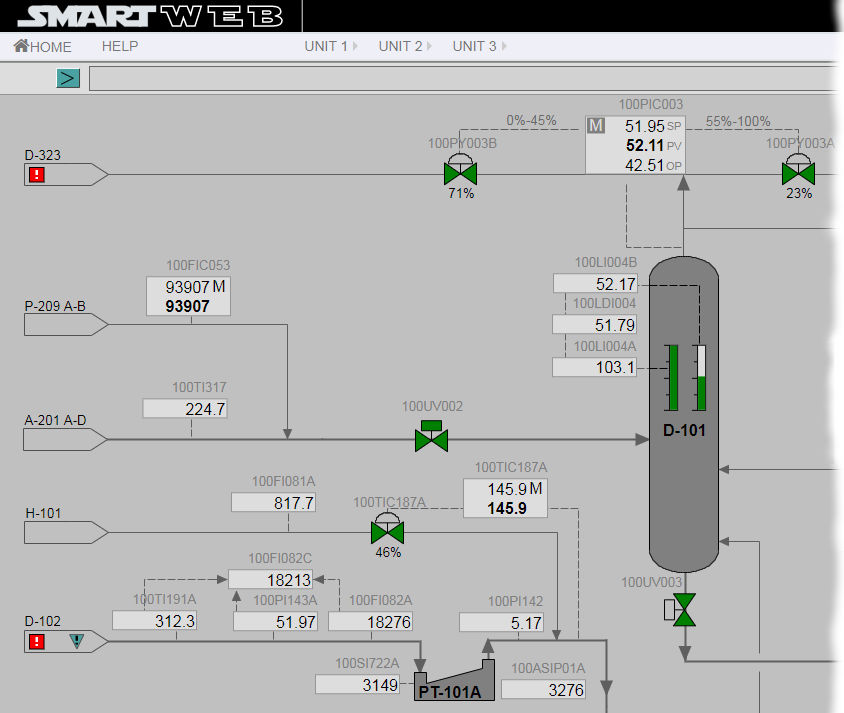

The graphical editor is also used for the development of dynamic elements (shapes). The system comes equipped with pre-built shapes that are ready to use, but you can also create new, custom shapes that meet specific project requirements and extend the built-in library. The [Dynamic Shapes Development](/dynamic-shapes-development) chapter describes how to create custom shapes.

---

## Editor Features

The `Smartsys Svg Editor` module provides a graphical editor. The module brings a new `Content Field` to the fieldset that can be attached to every `Content Type`. The following image shows the configuration of a `Content Type` with an embedded `Svg Field`. Visit the [Content Anatomy](/content-anatomy) chapter for additional information on `Content Types`, `Content Parts`, and `Content Fields`.

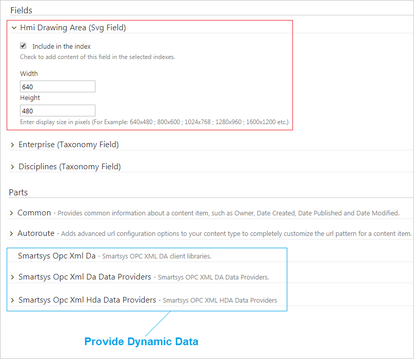

There are a number of `Svg Field` configurations available on the `Content Type` page. The user can set the default dimensions of the drawing area and select whether the `SVG` content needs to be indexed. The default size of the drawing area for each `Content Item` can be changed at a later time. Indexing will allow the user to search for items inside the graphical content.

!!!note "Note:"
      Note that there are three vital parts added to the `Content Type`. Two for `Opc Da access` and  
      `Opc Hda access` and one is a common `Opc Xml` client library. The web page is animated, thanks to the data provided by these parts. The [Access to OPC Data](/access-to-opc-data) chapter covers `Opc Da` and `Opc Hda` data providers.

Now, let's see how the graphical editor looks inside the `Content Item` configuration and walk through the tools provided by the editor. The following image shows the editor, along with loaded graphical content in its canvas.

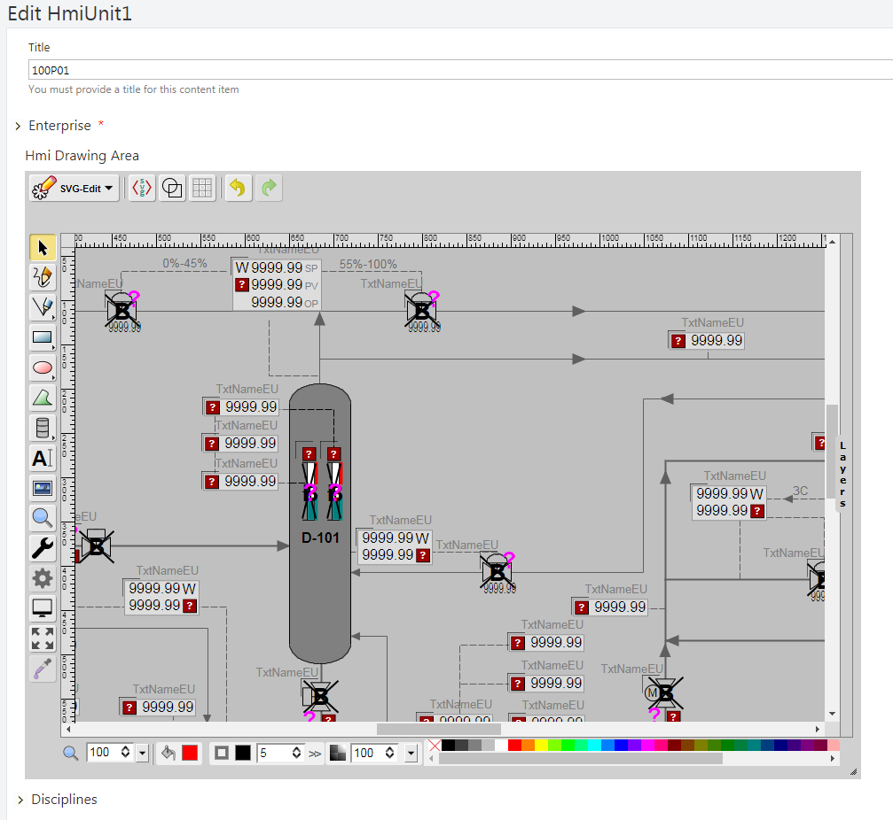

---

#### Menu Edit

- The `SVG-Edit` button, in the top left corner of the editor, displays a drop-down menu with several options.

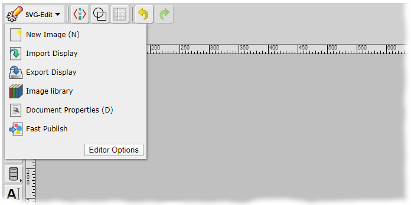

- `New Image` - Create a new document.

- `Import Display` - Upload a `SVG` document to canvas area.

- `Export Display`- Download the current `SVG` document.

- `Image Library` - Access the library with available shapes. The shapes are organized in folders according to their purpose. The following example shows a few of the default analog shapes included in **SmartWEB**.

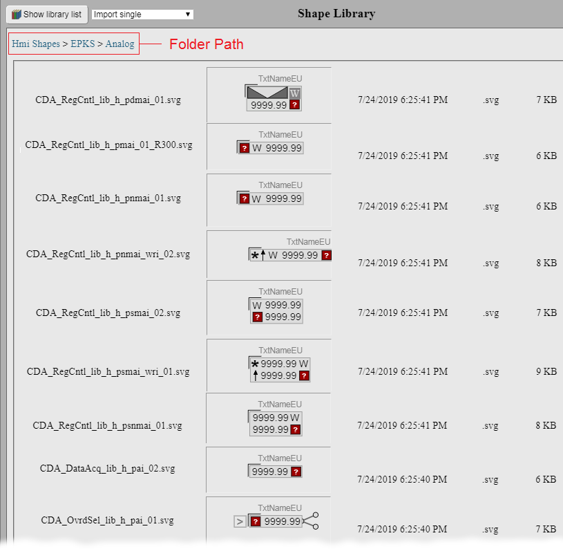

- `Document Properties` - By default, the new display inherits the canvas dimensions from its `Content Type` configuration. This option allows the user to change the  width and height of the drawing area.

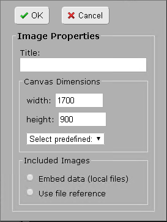

- `Fast Publish` - Executes `Unpublish` and `Publish Now` for the current `Content Item` sequentially. This way, the `Content Item` is published with one operation without updating its version. The chapter [Manage Content](/manage-content) provides a complete explanation of content publishing and content versioning.

---

#### Basic Tools

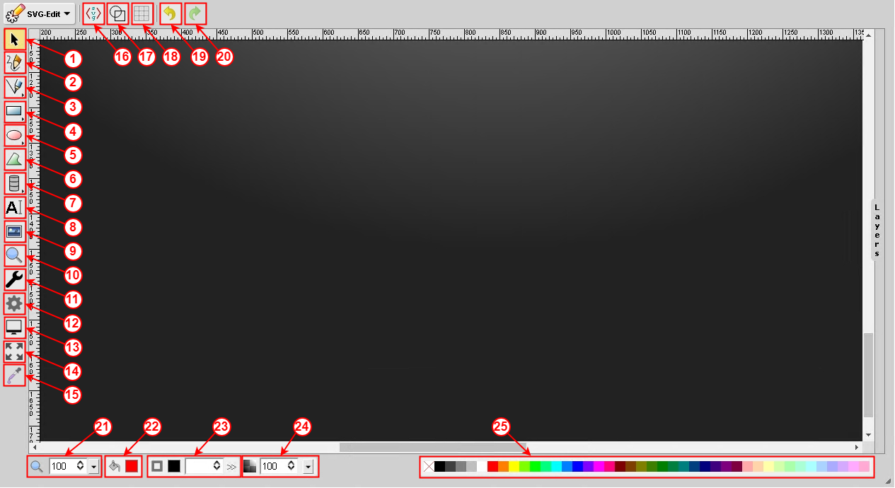

`(1)` - **Selection Tool** - Used to select and move items in the editor. The user has the ability to select several items by marking them (Hold Shift + Click).

`(2)` - **Pencil tool** - Allows the user to draw a custom figure. The size and color of the stroke are adjustable via the `Color Platte Tools` (21-25).

`(3)` - **Line tool / Connect two objects** - Holding down the left button on the icon will allow the user to select one of two modes. The first tool (Line tool) provides the ability to draw a straight line from point A to point B. The second tool (Connect two objects) allows the connection of two objects with a straight line.

`(4)` - **Rectangle / Square / Free hands rectangle** - By holding down the left mouse button on the icon, a submenu with three different options will appear - `Rectangle`, `Square`, and `Free hands rectangle`. The first two options allow the user to draw a rectangle and a square. The third option (Free hands rectangle drawing) allows the user to draw any shape, which will be redrawn by the SVG-Editor as a rectangle (according to the height, width, and position of the shape).

`(5)` - **Ellipse / Circle / Free hands ellipse** - By holding down the left mouse button on this icon, a submenu with three different options will appear - `Ellipse`, `Circle`, and `Free hands ellipse`. The first two options allow the user to draw an ellipse and a circle. The third option (Free hands ellipse) allows the user to draw any shape, which will be redrawn by the SVG-Editor as an ellipse (according to the height, width, and position of the shape).

`(6)` - **Path tool** - Allows the user to draw Free hands shapes.

`(7)` - **Static Shape Library** - Add static shapes from the library. The shapes in the library are organized by type.

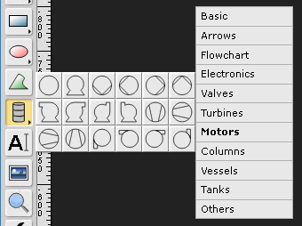

`(8)` - **Text tool** - Allows the user to place text on the canvas.

`(9)` - **Image tool** - Allow the user to insert an image (pnt, jpeg, jpg, and more).

`(10)` - **Zoom tool** - Allows the user to zoom in on a certain area.

`(11)` - **Diagnostic** - A tool for analyzing dynamic elements.

`(12)` - **Item Configuration** - Provides the user with the ability to edit the parameter settings of dynamic elements.

`(13)` - **Display behavior Configuration** - Provides the user with the ability to configure the long and short term `Opc Xml HDA Providers`, as well as the `Background Color` of the document.

`(14)` - **Full Screen** - This tool switches the editor to full-screen mode.

`(15)` - **Eye dropper tool** - Provides the user with the color of the selected element.

`(16)` - **Edit Source** - This button invokes a popup window that contains the source code of the elements that are present in the canvas.

`(17)` - **Wireframe Mode** - Render the element frames in black and white mode.

`(18)` - **Show / Hide Grid** - Toggle the `Grid`.

`(19)` - **Undo** - Reverse the last action.

`(20)` - **Redo** - Reverse the last undo action.

`(21)` - **Change Zoom Level** - Change the page Zoom Level.

`(22)` - **Change fill color** - Provides the user with a color palette.

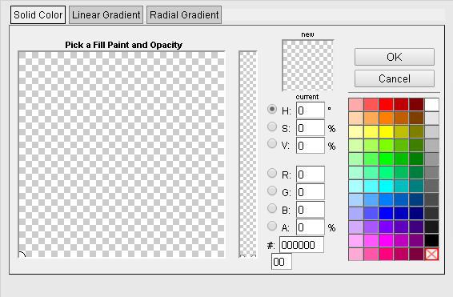

`(23)` - **Change stroke color** - This tool changes the size, style, and color of the stroke/border if the element.

`(24)` - **Change selected item opacity** - This tool changes the transparency of the selected element.

`(25)` - **Default color palette** - Provides the user with a default color palette.

Upon selection of an element, a toolbar with additional instruments will appear at the top of the editor, as shown on next picture.

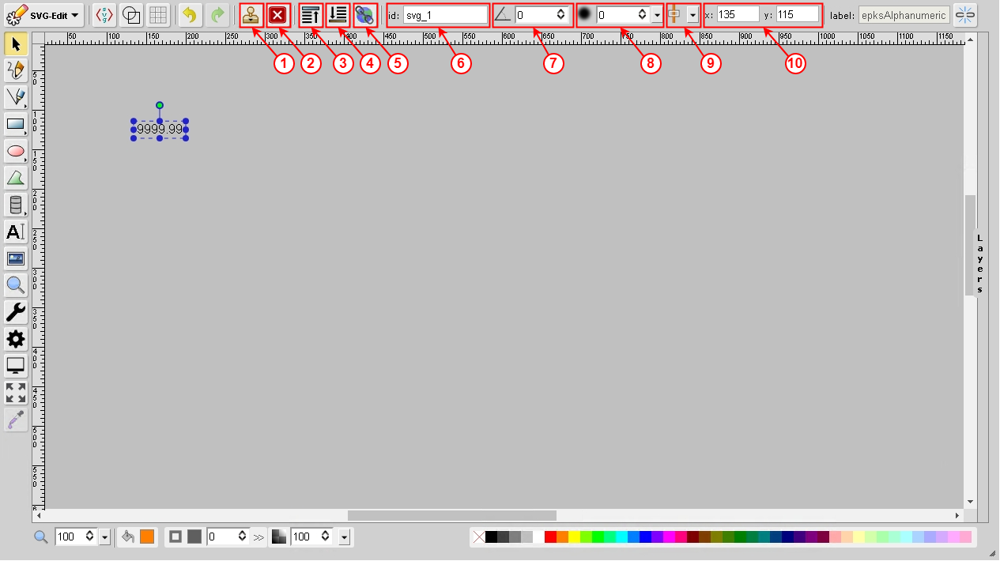

`(1)` - **Duplicate Element**- Duplicate all selected elements on the page.

`(2)` - **Delete Element** - Delete all selected elements on the page.

`(3)` - **Bring to front** - Bring the selected element to the front.

`(4)` - **Bring to back** - Bring the selected element to the back.

`(5)` - **Hyperlink** - Provides the user with the ability to create a link to an external resource.

`(6)` - **ID** - Each page element has a unique identifier (ID). This tool allows the user to change the ID of the element.

`(7)` - **Change rotation angle** - Allows the user to change the rotation angle of the selected element.

`(8)` - **Change Gaussian blur value** - Allows the user to change the blur of the selected element.

`(9)` - **Align element to page** - This tool provides several options which allow the user to align the selected item to the page.

`(10)` - **X and Y** - Allows the user to change the horizontal and vertical coordinates of the selected element.

When two or more items on a page are selected, the following tools will appear at the top of the editor.

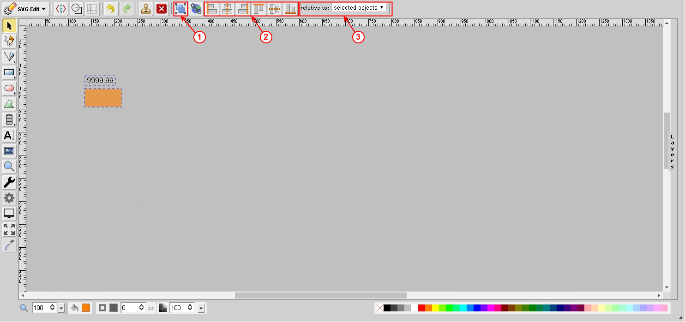

`(1)` - **Group Elements** - Group all selected elements.

`(2)` - **Align Manu** - This set of tools provide the user with the ability to align the selected elements.

`(3)` - **Relative to** - Allows the user to configure the `Align Menu` (selected objects, largest object,
smallest object, page).

---

## Data Presentation

The next screenshot presents a dynamic WEB page that was created with the use of the SVG-Editor.

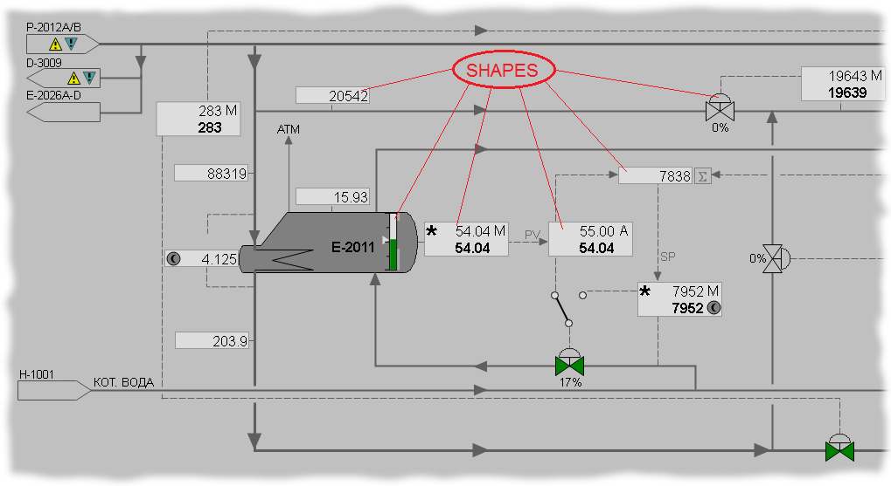

The following block diagram shows the interaction between the components that create the dynamics inside the SVG content in a WEB page.

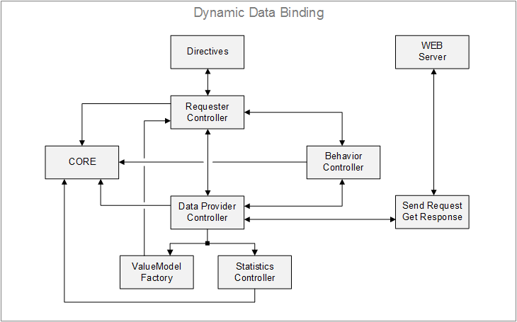

The `AngularJS` framework is an integral part of the front-end. Its functions include bootstrapping HTML, application data delivery, and binding HTML elements to the data model.

The `CORE` block contains references to all dynamic elements. These elements are registered in the following controllers: `Requester Controller`, `DataProvider Controller`, `Statistics Controller`, `Display behavior Controller`. The `CORE` is also responsible for data requests that are sent from the page to the WEB server. It has the ability to enable or disable such requests.

The `Requester Controller` block is an `AngularJS` controller (JavaScript controller-type function with specific syntax). On the front-end, all dynamic elements that are configured in the SVG-editor are registered in this controller. The primary purpose of the `Requester Controller` is to make sure that the application data is  displayed appropriately on the page. When an element is registered in the controller, the `Initialize` method is called. This method registers every reference in the `CORE` block. The items are then packed and prepared for data requests.

The `Directives` block contains `AngularJS` directives (alphanumeric, parameter container, etc.) and takes care of their behavior and visualization. Working with the directives is explained later in this chapter.

The `Display behavior Controller` is a controller that takes care of the following display functionality:

- `RefreshOnFocusOnly` - If the browser supports the `Page Visibility API`, this method checks whether the browser tab is in focus. When the user switches to another tab, the page will stop sending data requests, resulting in faster response times and reducing the number of requests that are sent to the server. The data requests will resume when the user returns to the tab. This functionality can be switched on and off via the SVG-Editor **Display Configuration**, which was discussed earlier in this chapter.

The `DataProvider Controller` takes care of the communication with the server. The controller sends requests and receives responses in a format according to the `OPC XML Specification DA 1.0.` Practically every SVG page in **SmartWEB** is a full, functional `Opc Xml client` that is written in JavaScript. The `DataProvider Controller` formats the request and submits it to the  
`Sent Request / Get Response` block. The only purpose of the block is to send the request to the server and wait for a response. Once the response is received, it is sent back to the `DataProvider Controller`. This updates the `Value Model`, which is located in the `ValueModel Factory` block. After the model values update, the `OnDataChange` event is triggered. This event is monitored by the `Requester Controller`, which then updates all directives in its scope.

The `Statistics Controller` takes care of communication statistics. Tracks response times, number of requests per every method, etc.

---

#### Shape Library

The SVG-editor contains dynamic base components (directives), which are used as the **basic building blocks** for rendering dynamic information. Each of these base components can work entirely independently, but several of them can also be grouped into one element (Shape), which utilizes their separate functionalities. By consolidating the base components, different shapes can be built that vary in features and complexity. The [Dynamic Shapes Development](/dynamic-shapes-development) chapter explains the development process of such custom shapes.

---

## Shape Configuration

This section covers all the details you need to know about configuring and customizing existing shapes in your dynamic pages. The `Item Configuration` tool in the editor provides the user with the ability to change the configuration of the shapes. This tool is accessed via the cogwheel icon on the toolbar, and becomes available after an element is selected.

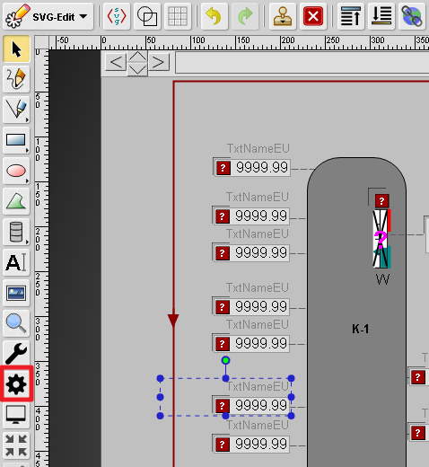

The configuration options are spread into three separate tabs in the configuration panel: 

* `Properties`
* `Directives`
* `Components`

---

#### Properties

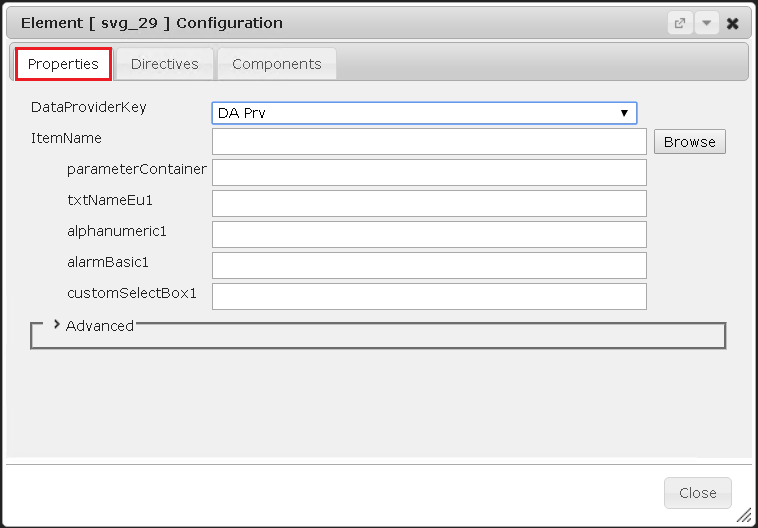

This tab contains the data reference parameters for the shape. From the `DataProviderKey` field, one of the available `Opc Xml Da Data Providers` can be selected. The providers that are available for the current page can be selected from the drop-down list. For more information - see chapters [Access to OPC data](/access-to-opc-data) and [Content Anatomy](/content-anatomy). For static elements and shapes, this field remains blank. When a `Data Provider` is not selected, all other fields in this tab remain hidden.

The `Opc Xml Item Name` is entered in the `ItemName` field, according to the  
`Opc Xml Da Specification 1.0`. This is how a specific point from the namespace of the server is accessed. Below the `ItemName` field, there are fields for each component of the shape that requires a data source. They can be assigned to separate `ItemNames`, allowing for data to be read from different address space entries. If the fields are left blank, the corresponding base components will use the default `ItemName` that was added at the top.

The `Browse` button, to the right of the `ItemName` field, opens an `Opc Xml Da Browser` window, allowing an item to be selected from the address space that corresponds to the chosen data provider. The selected item can automatically be added to the `ItemName` field via the `Add` button.

---

#### Directives

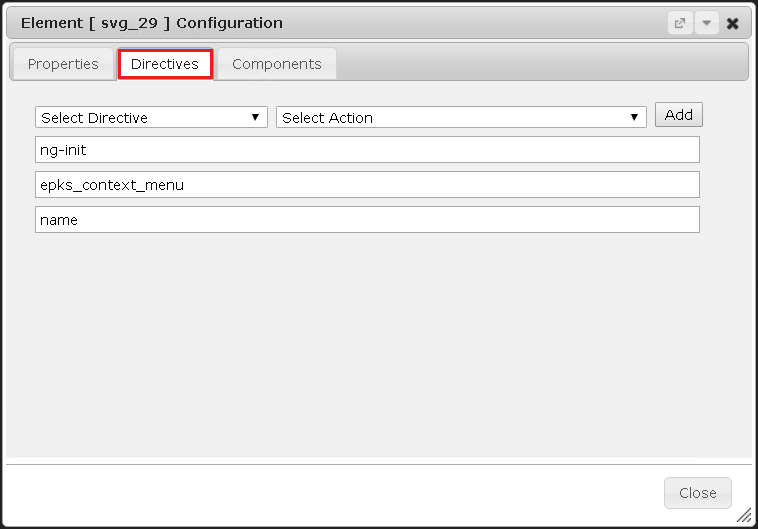

From the `Directives` tab, specific directives can be assigned to the shape. This allows the user to customize the behavior of the shape. The directives are added to the elements as `HTML attributes`, and used to extend the functionality of standard `HTML`. `AngularJS` analyzes and processes these attributes.

A directive is assigned to the shape via the `Select Directive` menu, where the following options are available:

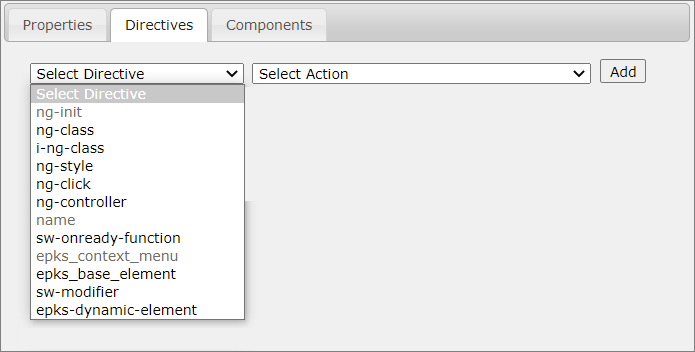

---

- `ng-init` - The values ​​of this directive are variables, allowing the scope of the respective controller to be extended with new fields (variables). This directive will activate when the element is registered during the page loading process, and will only activate once.

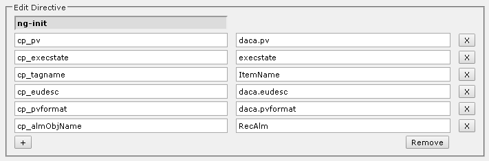

---

- `ng-class` - This directive is equivalent to the `class attribute` in `HTML`, and is, usually, used for styling. The difference is that `ng-class`, in addition to a class, can also contain a condition that will determine which class should be added.

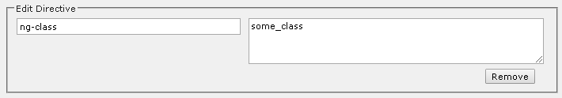

---

- `i-ng-class` - In **SmartWEB**, this directive provides a style with theming functionality to an element. It takes a function (`ApplyNgTheme()`) with one parameter - the name of the class that will be applied.

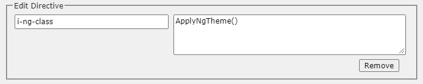

---

- `ng-click` - This directive is equivalent to the `onclick` event in `HTML`, and triggers when the user clicks on the shape.

```javascript
events.RedirectToPage("/unit1/hmi/100p01");
```

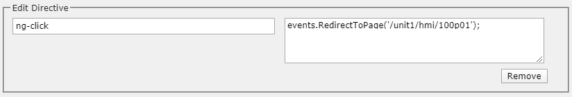


---

- `ng-controller` - The value of this variable is the name of the controller to which the item will be referenced.

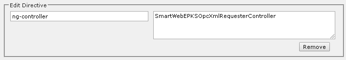

---

- `ng-style` - This directive allows the addition of standard `CSS` styles. The styles must be in the following syntax:

```javascript
{cursor: "pointer"}
```

```javascript
{css_property: "css_property_value"}
```

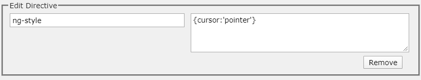

---

- `name` - Adds a standard `HTML` attribute to the element. It is, usually, used for shape naming, but it can also add other `HTML` attributes.

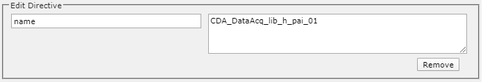

---

- `sw-onready-function` - The value of this directive is a function name. This function will be executed once the HTML has been loaded.

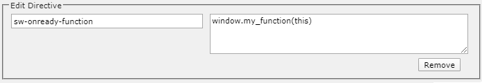

The following function declaration must be provided in the *JavaScript* source file -  
`smartsys-opcxmlda-custom-all-4xx.min.js`.  
This file is located in the following directory - `\Modules\Smartsys.OpcXmlDa\Scripts`.

```javascript

window.my_function = function (me) {
...
}

```

The [Dynamic Shapes Development](/dynamic-shapes-development) chapter discusses *JavaScript* custom functions.

---

- `epks_base_element` - This directive provides a unique name for the `svg` element within the shape scope and is usually used in shape development.

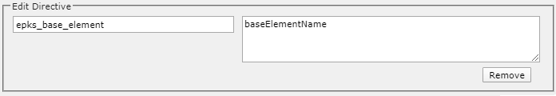

---

- `еpks_context_menu` - This directive creates the context menu of the shape. The user can choose how the context menu is invoked (`Left Click` or `Right Click`) as well as select the menu elements. The editor has a set of pre-created actions that can be added to the context menu with the `+` button.

**Trigger** - the event that will call the context menu. (`Right Click` or `Left Click`).

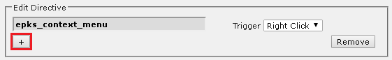

The following image illustrates how the context menu looks on the front-end.
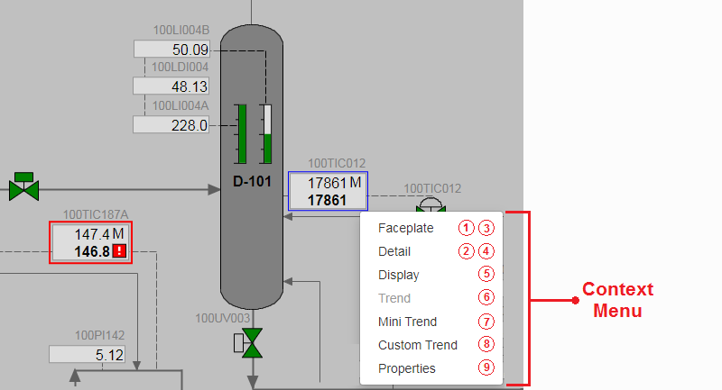

Now, let's take a look at a configuration of pre-created menu actions, which can be used in custom menus:

`(1)` - **Faceplate** - This action will open a popup window with essential information about the system entity behind the selected shape (Process measurement, PID Controller, Motor Control, etc. ). When this action is selected, the `Name` field contains a context menu label. In this example it is configured as `Faceplate`. The faceplate is an independent page in the CMS. The address of the system page is entered in the `Url` field, as it is shown on the next image.

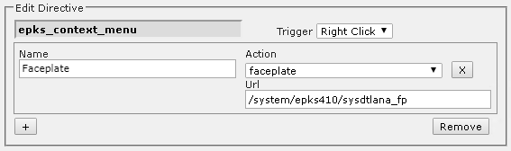

The following image presents an example faceplate for the Honeywell EPKS - **PID controller**.
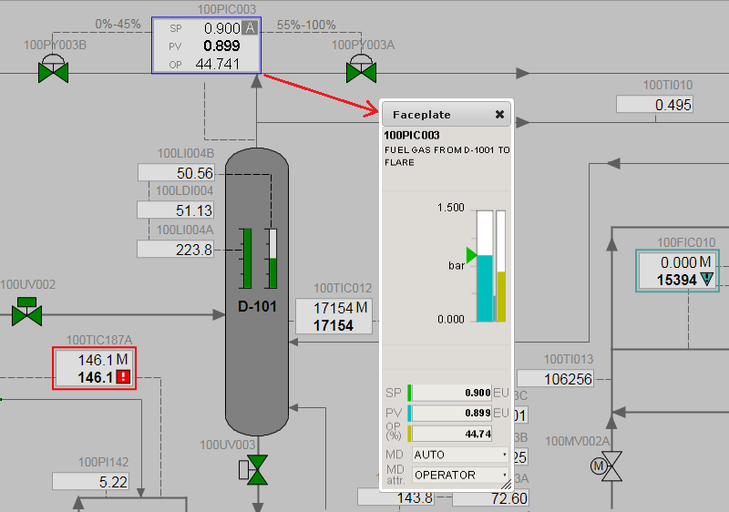

`(2)` - **Detail** - The configuration of the `detailDisplay` action is similar to that of a Faceplate, except that the URL in the `Url` field will point to a system page that will display the detailed entity information. Unlike the Faceplate, the Detail display opens on a new page.

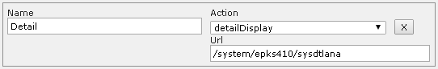

The following image presents an example detail display for the Honeywell EPKS - **PID controller**.
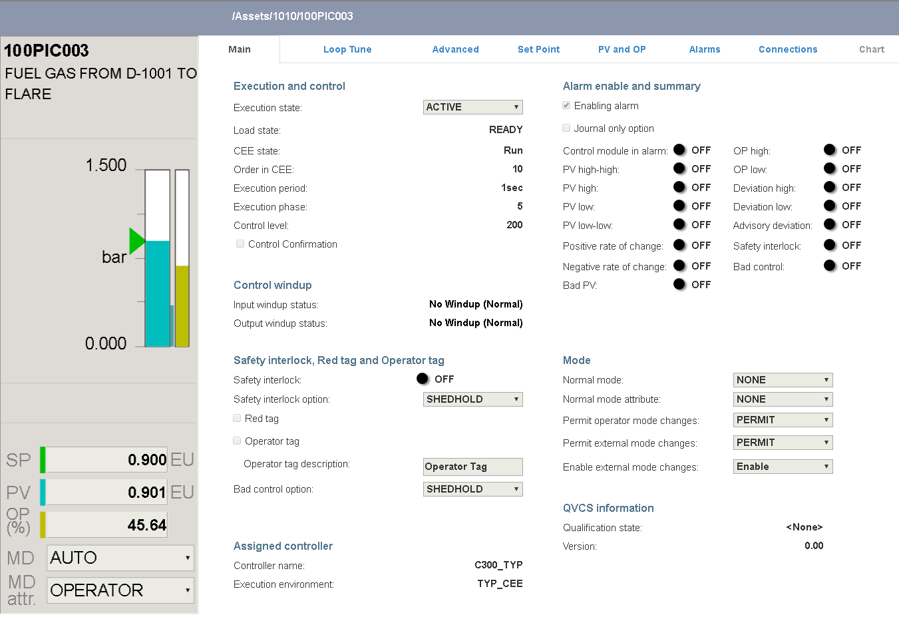

`(3)` - **Faceplate from ObjectStore** - This action has the same behavior as the faceplate option, with the exception that the address to the system page is not entered. It is stored in [Object Store](/object-store), and taken automatically by the system. If the entity does not exist in the `Object Store`, the menu link will be inactive.

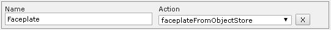

`(4)` - **Detail display from ObjectStore** - The behavior of this action is similar to the `Detail display` option, with the exception that the address of the system page is taken automatically from the `Object Store`.

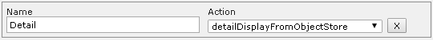

!!!note "Note:"
    The system is able to provide pre-built `Faceplates` and `Detail displays` for all entity types used in **Honeywell EPKS**. For other DCS, such system pages need to be additionally developed.

`(5)` - **Associated Displays** - This action will open a dialog box with a list of links to `content items` in which the selected entity is present. Two configuration fields become available when this option is selected. The address of a pre-created `Smart Search Template` is entered in the `Url` field. This template handles the indexing of `content items`, taking into account user permissions. In the `Parameter` field, the `ItemName` configured in the `Properties` tab is referred to by using `Item Substitution`. The [Site Settings](/site-settings) chapter provides a detailed explanation of `Smart Search Templates`.

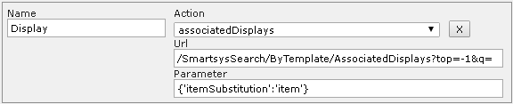

The dialog contains a list of links to **Associated Displays**.
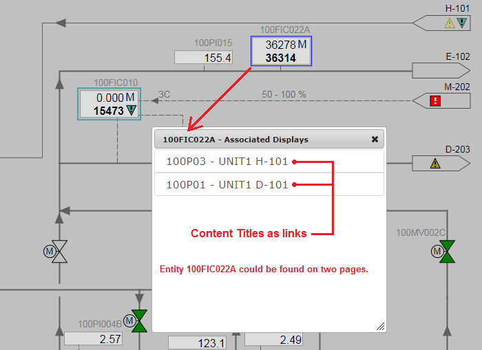

`(6)` - **Associated Trends** - The configuration and usage of this action are very similar to the **Associated Displays** option, with the difference that the system returns a list of associated trends instead of associated `content items`.

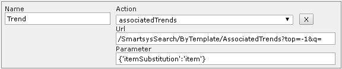

`(7)` - **Mini Trend** - This action invokes a popup window that visualizes a trend. The address of the trend `content item` is entered in the `Url` field. The trend will use the parameters that are provided in the `Parameters` field (in *JSON* format).

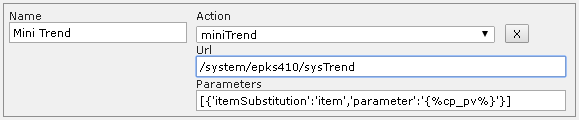

The [Dygraph Trend](/dygraph-trend) chapter describes the configuration and features of the trend.

!!!note "Mini Trend Example:"
        Now, let's take a look at an example. The image below shows how the `Mini Trend` looks on the front-end. In this example, the `ItemName` configured in the   `Properties` tab is: `VIRTUALIZE.PLANT.ASSETS.UNIT1.100PIC003`.
        In the `Directives` tab, the following custom parameters are configured inside the `ng-init` directive: `cp_pv -> pid_pla.pv` ; `cp_sp -> pid_pla.sp` ;   
        `cp_op -> pid_pla.op`.

        The following syntax is used to set the `miniTrend` Parameters: `[{'itemSubstitution':'item','parameter':''},{'itemSubstitution':'item','parameter':''},{'itemSubstitution':'item','parameter':''}]`

        The following configuration is also viable:  
        `[{'itemSubstitution':'item','parameter':'pid_pla.pv'},{'itemSubstitution':'item','parameter':'pid_pla.sp'},{'itemSubstitution':'item','parameter':'pid_pla.op'}]`  

        In this case, the trend will always trace the configured parameters, regardless of what is set in the `ng-init` directive.

        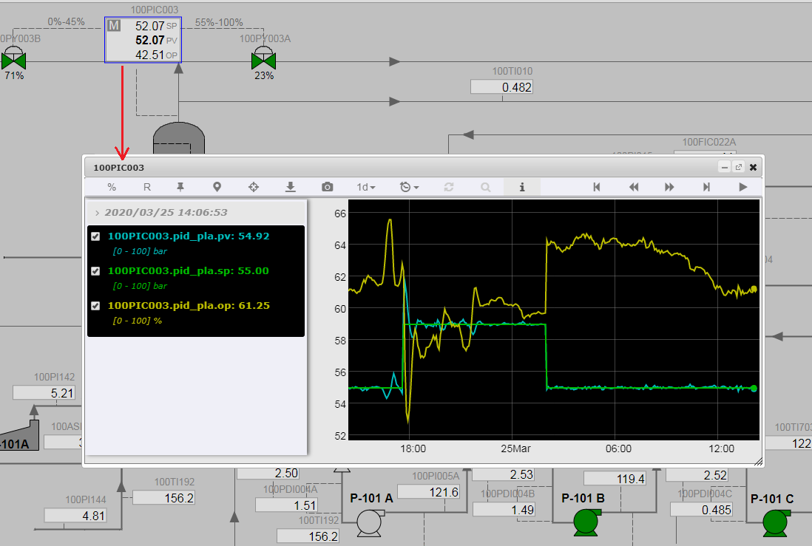

`(8)` - **Custom Trend** - This action invokes a popup window that allows the selection of individual trend parameters from different shapes and pages. The parameters configured for the **Mini Trends** (`pida.pv`, `pida.sp`, `pida.op`, `daca.pv`, etc.) are present in the list of parameters available for the customized trend. There are two configuration fields for this action. The address of the trend `content item` is entered in the `Url` field. Usually, the same trend content is used for both  `Mini Trends` and `Custom trends`. The second parameter in the `Configurator` field is the address of the system page for the custom trend configurator window.

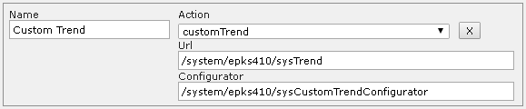

Custom trend configuration example:
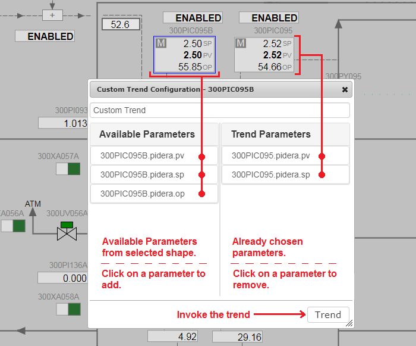

`(9)` - **Properties** - This action executes the `OPC XML DA - GetProperties` method for the `ItemName` and returns the result in a popup window. The result can be exported in *Excel* format.

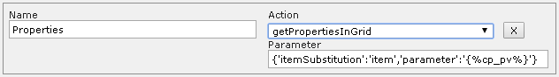

Properties popup window example:
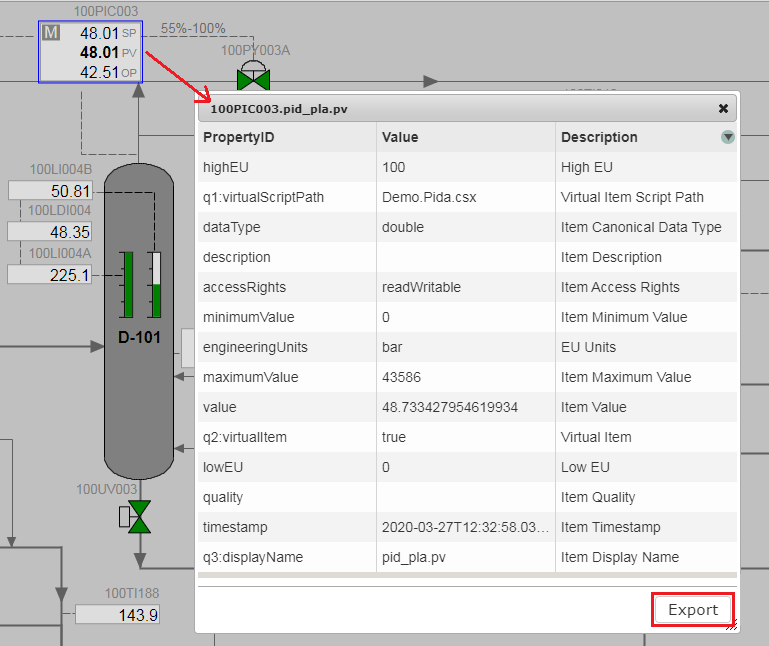

---
The directives tab also provides a way to edit the configuration of all `base elements` of the shape. Each `base element` is visible and can be accessed at the top of the tab, as shown in the following image:

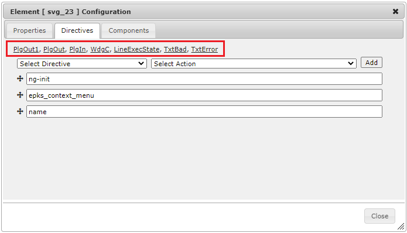

The selected element will be highlighted in *red* (`(1)` in the image below). Once the element has been selected, its configuration can be edited. To return to the main configuration of the shape, the `Root` option can be selected (`(2)` in the image below).

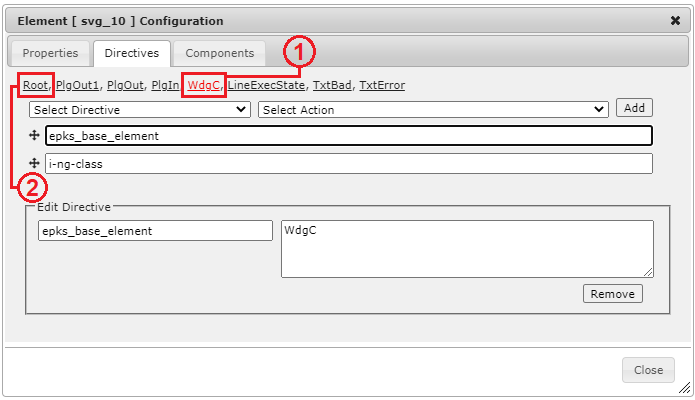

#### Base Components

Every `Shape` is a group of standard `svg` elements (line, polyline, rectangle, circle, etc.)  
and `Base Components`. Currently, in **SmartWEB**, there are two separate libraries. One for  
older `base components` and one for newer versions that support theming (EPKS release 500 and up) and may provide additional functionality.

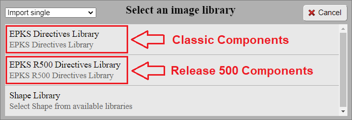

Each `Base Component` is configurable. The configuration of the individual components is done through the `Components` section. Each element has its own set of parameters.  
The `Base Components` are divided into four categories (`Alarm Components`, `Analog Components`,  
`Digital Components`, `Auxiliary Components`). Their respective configurations are explained below.


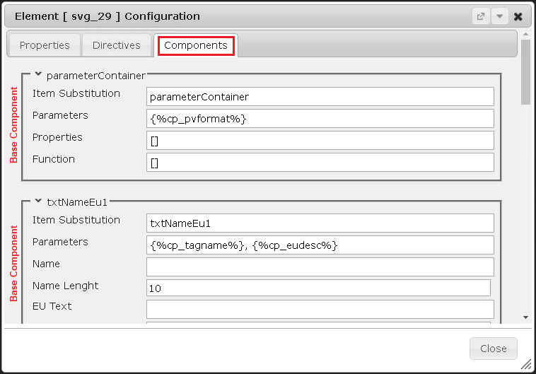

---

`(1)` - **Alarm Components** - The components from this category animate an alarm state.

- **Alarm Basic**

This `Base Component` represents a standard `Honeywell EPKS` alarm icon with three different priorities (`Urgent`, `High`, and `Low`), and two unacknowledged states for each property (`Active` and `Inactive`).

Image library view:
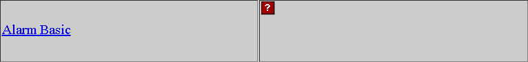

Component configuration view:
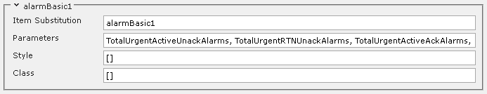

| Name              | Descriptor                                      |
| ----------------- | ------------------------------------------------|
| Item Substitution | Component name (unique to the shape).           |
| Parameters        | Dynamic parameters that provide animation data. |
| Style             | CSS styles used for direct styling.             |
| Class             | CSS classes used for styling via the theme.     |  
   
<br>
Style and class configuration has the following syntax:
```javascript
[{ style: "cursor", value: "pointer" }]
```

```javascript
[("class1", "class2")]
```

Front-end examples of the **Alarm Basic** component:
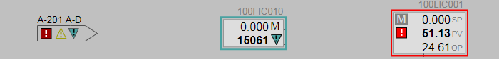

- **Alarm Basic R500**

Visually identical to the classic `Alarm Basic` component with the exception of provided theme support. In regards to functionality, the R500 version supports *critical* alarm priorities (`Critical`, `Urgent`, `High`, and `Low`). The `Class` and `Style` fields have been removed, and a new option for scaling has been added, which will keep the original size of the component or allow it to be stretched, depending on the setting.

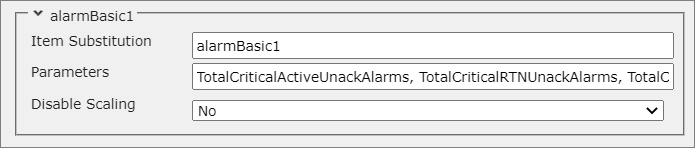

The final difference between the two variants is that with the updated R500 version, the order of the parameters does not matter, which makes the component easier to use.

- **Passive Alarm R500**

This is a unique R500 component and does not have an older predecessor. It is visually identical to the classic `Alarm Basic` component. The main difference comes from the functionality it provides. The `Alarm Basic` component depends on being provided a data source. It will then independently determine the best course of action based on its built-in code. The `Passive Alarm` is designed to work in conjunction with a custom function, where the alarm state will be set manually by the script based on specific logic.

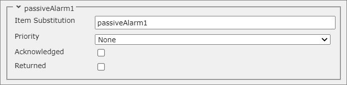

| Name              | Descriptor                                      |
| ----------------- | ------------------------------------------------|
| Item Substitution | Component name (unique to the shape).           |
| Priority          | The alarm priority that will be displayed.      |
| Acknowledged      | Determines whether the alarm is acknowledged or not.  |
| Returned          | Determines whether the alarm is returned or not.  |  

 <br>

- **Text Alarm**

This `Base Component` symbolizes a single priority alarm with two unacknowledged states for an `Active` and `Inactive` alert. The component also shows the number of active alarms from the configured priority.

Image library view:
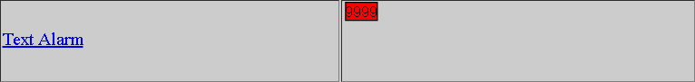

Component configuration view:
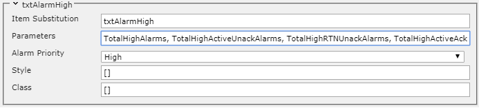

| Name              | Descriptor                                                                                                                                                 |
| ----------------- | ---------------------------------------------------------------------------------------------------------------------------------------------------------- |
| Item Substitution | Component name (unique to the shape).                                                                                                                      |
| Parameters        | Dynamic parameters that provide animation data. These parameters are consistent <br>with the type of alarm that is selected in the `Alarm Priority` field. |
| Alarm Priority    | Choose one of three priorities (Low, High, Urgent).                                                                                                        |
| Style             | CSS styles used for direct styling.                                                                                                                        |
| Class             | CSS classes used for styling via the theme.                                                                                                                |

<br>
Style and class configuration has the following syntax:
```javascript
[{ style: "cursor", value: "pointer" }]
```

```javascript
[("class1", "class2")]
```

Front-end examples of the **Text Alarm** component:
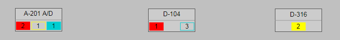

---

`(2)` - **Analog Components** - The components from this category animate an analog measurement and control entities.

- **Alphanumeric**

Alphanumeric is a `Base Component` that presents alphabetical and numerical characters. It is widely used in most shapes that present numerical or alphabetical variables.

Image library view:
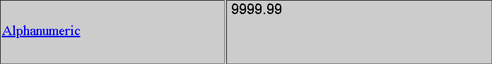

Component configuration view:
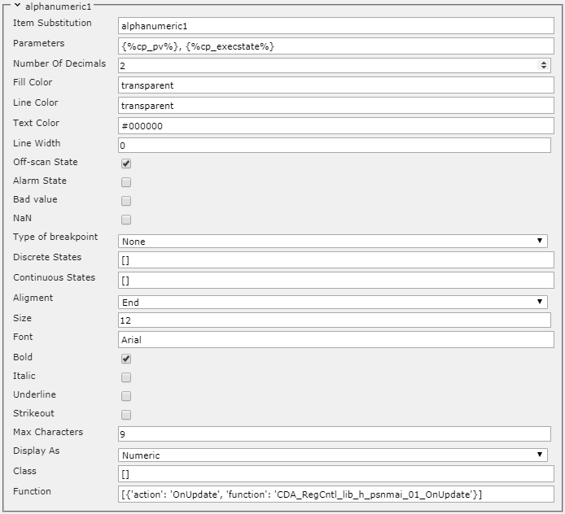


| Name               | Descriptor                                                                                                                                                                                                                                                                                                                                                         |
| ------------------ | ------------------------------------------------------------------------------------------------------------------------------------------------------------------------------------------------------------------------------------------------------------------------------------------------------------------------------------------------------------------ |
| Item Substitution  | Component name (unique to the shape).                                                                                                                                                                                                                                                                                                                              |
| Parameters         | Dynamic parameters used for visualization. The default values are <br>`['PV', 'OnScan']`. It is good practice to assign the parameters to a variable via <br>the `ng-init` directive (``, ``). The second parameter <br>is used in conjunction with the `Off-scan State` option, and is usually used to <br>animate the behavior of the `EXECSTATE` and `ONSCAN` parameters <br>(from `Honeywell EPKS`). |
| Number Of Decimals | The number of digits after the decimal point. Applicable for numeric values.                                                                                                                                                                                                                                                                                       |
| Fill Color         | Background color. The default value is `transparent`.                                                                                                                                                                                                                                                                                                              |
| Line Color         | Border color. The value must be a valid `HEX` color (example: #ff0000). <br>The default value is **transparent**.                                                                                                                                                                                                                                                  |
| Text Color         | Text color, the value must be a valid `HEX` color (example: #ff0000).                                                                                                                                                                                                                                                                                              |
| Line Width         | Border width.                                                                                                                                                                                                                                                                                                                                                      |
| Off-scan State     | This option instructs the component to animate the `Active/Inactive` state, <br>according to the value of the second dynamic parameter.                                                                                                                                                                                                                            |
| Alarm State        | Not used.                                                                                                                                                                                                                                                                                                                                                          |
| Bad value          | Not used.                                                                                                                                                                                                                                                                                                                                                          |
| NaN                | Not used.                                                                                                                                                                                                                                                                                                                                                          |
| Type of breakpoint | There are three available choices (Continuous, Discrete, None). <br>With this option, it is possible to add an additional animation, depending <br>on the value of the variable. The following two configuration options <br>(`Discrete States`, `Continuous States`), depending on the type of variable, <br>determine the type of the animation.                 |
| Discrete States    | If a `Discrete` value is selected for the `Type of breakpoint` option, <br>then the animation for several discrete states will be configured here e.g. <br>`[{ state: 0, color: '#ff0000', inverse: true }, { state: 1, color: '#0000ff', inverse: true }]`. Other discrete states can be described similarly.                                                     |
| Continuous States  | If `Continuous` is selected for the `Type of breakpoint` option, <br>then the animation characterization will be configured here e.g. <br>`[{ rangeFrom: 0, rangeTo: 50, color: '#ff0000' }, { rangeFrom: 50, rangeTo: 100, color: '#0000ff' }]`. The range can be divided into more intervals, providing <br>different animations.                                |
| Alignment          | This option provides three choices for text alignment (Start, Middle, End).                                                                                                                                                                                                                                                                                        |
| Size               | Text size.                                                                                                                                                                                                                                                                                                                                                         |
| Font               | Font family e.g. `Arial`, `Times New Roman`, etc.                                                                                                                                                                                                                                                                                                                  |
| Bold               | Apply a **bold** style to the text.                                                                                                                                                                                                                                                                                                                                |
| Italic             | Apply an _italic_ style to the text.                                                                                                                                                                                                                                                                                                                               |
| Underline          | Apply an `underline` style to the text.                                                                                                                                                                                                                                                                                                                            |
| Strikeout          | Apply a `strikethrough` style to the text.                                                                                                                                                                                                                                                                                                                         |
| Max Characters     | The maximum number of displayed characters, regardless of the length of the <br>variable.                                                                                                                                                                                                                                                                          |
| Display As         | Instructs the `Base Component` to display the value in a specific way: <br>(Numeric, Enumeration, Text).                                                                                                                                                                                                                                                           |
| Class              | CSS classes used for styling (through the theme).                                                                                                                                                                                                                                                                                                                  |
| Function           | Allows a custom function to be called when a certain event has occurred.                                                                                                                                                                              |


<br>
Function and class configuration has the following syntax:
```javascript
[{ action: "OnUpdate", function: "Some_Function" }]
```

```javascript
["class1", "class2"]
```

!!!note "Note"
    Currently, only the `OnUpdate` event is supported. The built-in custom functions can be located in the following source file - `smartsys-opcxmlda-all-4xx.min.js`. Additional custom functions with specific/custom behavior can be created in the second available file - `smartsys-opcxmlda-custom-all-4xx.min.js`. Both files are located in the following directory - `\Modules\Smartsys.OpcXmlDa\Scripts`.

Front-end examples of the **Alphanumeric** component:
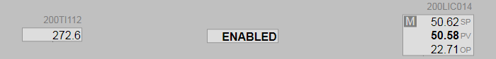

- **Alphanumeric R500** 

The new version of the `Alphanumeric` component supports theming and contains an additional field that provides the user with the ability to change the radius of the component.

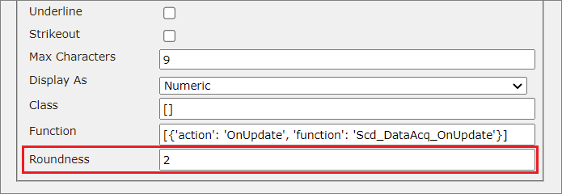

- **Indicator Bar**

This `Base Component` provides a graphical representation of a variable in a given range. There are a number of ways to present data graphically (horizontal, vertical, line pointer, triangular pointer).

Image library view:
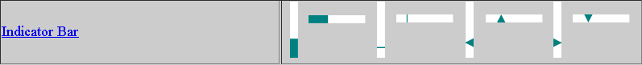

Component configuration view:
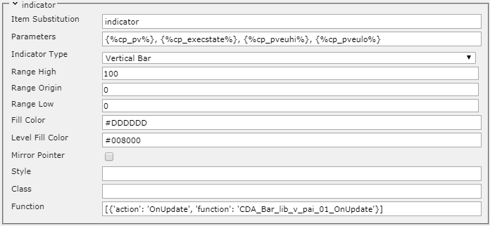

| Name              | Descriptor                                                                                                                                                                                                                                                                                                                                                                                                                                                                                                                                                             |
| ----------------- | ---------------------------------------------------------------------------------------------------------------------------------------------------------------------------------------------------------------------------------------------------------------------------------------------------------------------------------------------------------------------------------------------------------------------------------------------------------------------------------------------------------------------------------------------------------------------- |
| Item Substitution | Component name (unique to the shape).                                                                                                                                                                                                                                                                                                                                                                                                                                                                                                                                  |
| Parameters        | Dynamic parameters. The default values are `['PV', 'OnScan', 'EUHI', 'EULO']`. <br>It is good practice to assign the parameters to a variable via the `ng-init` directive <br>(``, ``, ``, ``). The value of the first <br>parameter will be animated on the bar. The second parameter is not mandatory <br>and can be omitted. This parameter is, usually used to animate the behavior of the <br>`EXECSTATE` and `ONSCAN` parameters (from `Honeywell EPKS`). The values ​​of the last <br>two parameters represent the upper and lower values (the range) of the bar. |
| Indicator Type    | Determine the appearance of the bar. The following options are available:<br>`Vertical Bar`, `Vertical Pointer`, `Vertical Line`, `Horizontal Bar`, <br>`Horizontal Pointer`, `Horizontal Line`. This option should be set during shape <br>development (before the components are grouped), and should not be changed in <br>the shape's component configuration tab.                                                                                                                                                                                                                                                  |
| Range High        | A default value of type `double` that acts as the highest value that can be <br>reached on the bar, when the third parameter (``) is not provided.                                                                                                                                                                                                                                                                                                                                                                                                                                                        |
| Range Origin      | A default value of type `double` that is considered the point from which the bar will <br>start to fill up. The bar will fill up starting from this origin position value to the <br>value of the first dynamic parameter (``). This option is only taken into <br>consideration when the `IndicatorType` option is set to `Vertical Bar` or <br>`Horizontal Bar`.                                                                                                                                                                                                                                                                                                     |
| Range Low         | A default value of type `double` that acts as the lowest value that can be <br>reached on the bar, when the fourth parameter (``) is not provided.                                                                                                                                                                                                                                                                                                                                                                                                                                                        |
| Fill Color        | Background color of the indicator. The value must be a valid `HEX` color.                                                                                                                                                                                                                                                                                                                                                                                                                                                                                              |
| Level Fill Color  | Fill color of dynamic part(the animated part that will visualize the bar being filled). <br>The value must be a valid `HEX` color.                                                                                                                                                                                                                                                                                                                                                                                                                                                                                                     |
| Mirror Pointer    | Applicable when the `Vertical Pointer` or `Horizontal Pointer` options are <br>selected for the `Indicator Type`. The pointer will be displayed in a mirrored <br>fashion.                                                                                                                                                                                                                                                                                                                                                                                                         |
| Style             | CSS styles used for direct styling.                                                                                                                                                                                                                                                                                                                                                                                                                                                                                                                                    |
| Class             | CSS classes used for styling via the theme.                                                                                                                                                                                                                                                                                                                                                                                                                                                                                                                        |
| Function          | Allows a custom function to be called when a certain event has occurred.                                                                                                                                                                                                                                                                                                                                                                                                                                                                            |
  
<br> 
Style, class, and function configuration has the following syntax:

```javascript
[{ style: "cursor", value: "pointer" }]
```

```javascript
[("class1", "class2")]
```

```javascript
[{ action: "OnUpdate", function: "Some_Function" }]
```

Front-end examples of the **Indicator Bar** component:
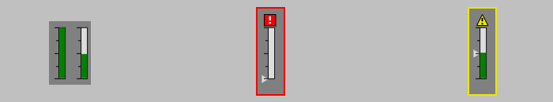


- **Indicator Bar R500**

Visually identical to the classic `Indicator Bar` component with the exception of provided theme support. In regards to functionality, the R500 version has a key difference from its R400 counterpart. The `Range High`,  `Range Origin`, and `Range Low` fields in the configuration panel of the component have a higher priority in the R500 version. Their values will be considered over the ranges provided in the `Parameters` field, whereas in the R400 version, it is the other way around.

!!!note "Note:" 
    It is a common practice to provide the range parameters as values for the `Range High`,  
    `Range Origin`, and `Range Low` fields when there are no custom ranges. That way, the functionality will be the same as the R400 version.


`(3)` - **Digital Components** - The components from this category animate discrete variables.

- **Txt Mode One Letter**

This `Base Component` represents the first letter of the operation mode abbreviation of DCS control entities. It is used in some of the built-in `Honeywell EPKS` shapes, which have the following abbreviations: `MAN`, `AUTO`, `CASC`, `COMP`, `S-MAN`, `S-AUTO`, `S-CASC`, `S-COMP`. The component also monitors the **normal mode** of the control entity, and represents the mode letter and mode letter background with different colors if the **normal mode** is active.

Image library view:
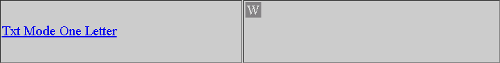

Component configuration view:
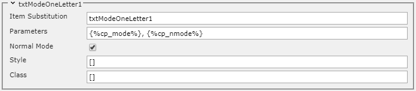

| Name              | Descriptor                                                                                                                                                                                                                                                           |
| ----------------- | -------------------------------------------------------------------------------------------------------------------------------------------------------------------------------------------------------------------------------------------------------------------- |
| Item Substitution | Component name (unique to the shape).                                                                                                                                                                                                                                |
| Parameters        | Dynamic parameters. The default values are `['Mode', 'NORMALMODE']`. It is good <br>practice to assign the parameters to a variable via the `ng-init` directive <br>(``, ``). The first parameter monitors the `MODE` of the control <br>entity. The second parameter monitors the `NORMAL MODE`. |
| Normal Mode       | When the checkbox is checked, the component takes into account the normal <br>mode parameter, and changes the colors of the letter and its background when <br>the mode value differs from the normal mode value.                                                                                                         |
| Style             | CSS styles used for direct styling.                                                                                                                                                                                                                                  |
| Class             | CSS classes used for styling via the theme.                                                                                                                                                                                                                      |


  
<br> 
Style and class configuration has the following syntax:

```javascript
[{ style: "cursor", value: "pointer" }]
```

```javascript
[("class1", "class2")]
```

Front-end examples of the **Txt Mode One Letter** component:
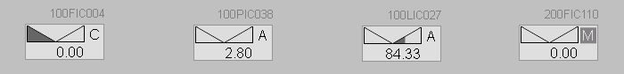

---

`(4)` - **Auxiliary Component** - These components perform a variety of support functions.

- **Parameter Container**

This `Base Component` does not have a graphical presentation on the front-end. It is used to collect dynamic variables that can be used in custom functions to animate certain elements in the shape.

Image library view:
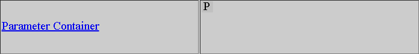

Component configuration view:
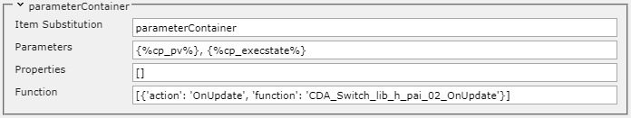

| Name              | Descriptor                                                                                                                                                                                                                             |
| ----------------- | -------------------------------------------------------------------------------------------------------------------------------------------------------------------------------------------------------------------------------------- |
| Item Substitution | Component name (unique to the shape).                                                                                                                                                                                                  |
| Parameters        | Dynamic parameters. It is good practice to assign the parameters to a variable via <br>the `ng-init` directive ``, ``. The first parameter monitors <br>the `PV` of the control entity. The second parameter monitors the `EXECSTATE`. |
| Properties        | Parameters that will be gathered from the server via the `OPC XML DA GetProperties` <br>method.   |
| Function          | Allows a custom function to be called when a certain event has occurred.|


<br> 
The function configuration has the following syntax:

```
[{'action': 'OnUpdate', 'function': 'Some_Function'}]
```

- **Base Label**


This `Base Component` provides the user with the ability to visualize text on the front-end. It is, usually, used to attach a label to a shape.

Image library view:
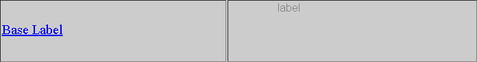

Component configuration view:
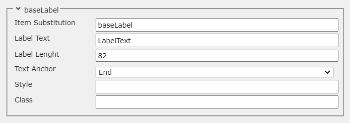

| Name              | Descriptor                                                                                              |
|-------------------|---------------------------------------------------------------------------------------------------------|
| Item Substitution | Component name (unique to the shape).                                                                   |
| Label Text        | The text that will be displayed on the front-end.                                                       |
| Label Length      | The length of the text.                                                                                 |
| Text Anchor       | Determines the direction of the text. There are three available options <br>("Start", "Middle", "End"). |
| Style             | CSS styles used for direct styling.                                                                     |
| Class             | CSS classes used for styling via the theme.                                                             |

  
<br> 
Style and class configuration has the following syntax:

```
[{'style' : 'cursor', 'value' : 'pointer'}]
```

```
['class1', 'class2']
```
  
Front-end example of the **Base Label** component:  
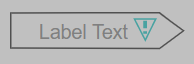


- **Base Label R500**

The new version of the `Base Label` component supports theming. In regards to functionality, the main difference between the R500 and R400 versions is the way the text is positioned. In the R500 version, the `Label Length` field is replaced with two new fields (`Text Width`, `Text Pos`).

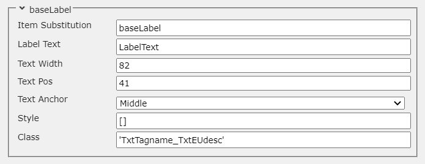

| Name              | Descriptor                                                                                              |
|-------------------|---------------------------------------------------------------------------------------------------------|
| Item Substitution | Component name (unique to the shape).                                                                   |
| Label Text        | The text that will be displayed on the front-end.                                                       |
| Text Width        | Determines the width of the text in pixels.                                                                                 |
| Text Pos          | Determines the position of the text in pixels.                                                                                 |
| Text Anchor       | Determines the direction of the text. There are three available options <br>("Start", "Middle", "End"). |
| Style             | CSS styles used for direct styling.                                                                     |
| Class             | CSS classes used for styling via the theme.                                                             |

<br> 

- **Button**

This `Base Component` is used to perform a predefined action. When the button is clicked, a function is called. This function provides the ability to attach a specific functionality to the display.

Image library view:
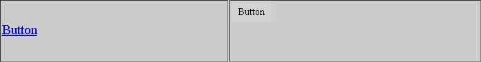

Component configuration view:  
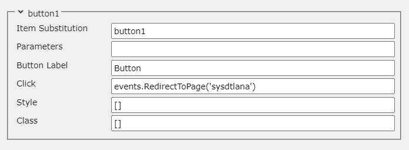
  
| Name              | Descriptor                                                                                                                                                                |
|-------------------|---------------------------------------------------------------------------------------------------------------------------------------------------------------------------|
| Item Substitution | Component name (unique to the shape).                                                                                                                                     |
| Parameters        | Dynamic parameters. It is good practice to assign the parameters to a variable via <br>the `ng-init` directive. directive.                                                               |
| Button Label      | The label of the button.                                                                                                                                                  |
| Click             | The function that will be called when the button is pressed. A predefined list of <br>functions, suitable for this button, is available, as well as a custom function option. |
| Style             | CSS styles used for direct styling.                                                                                                                                       |
| Class             | CSS classes used for styling via the theme.                                                                                                                               |

  
<br> 
Function, style, and class configuration has the following syntax:

```
events.RedirectToPage('Some_Page')
```


```
[{'style' : 'cursor', 'value' : 'pointer'}]
```

```
['class1', 'class2']
```

Front-end example of the **Button** component:   
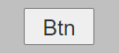

- **Button R500**

The `Button R500` component is `SVG` based, unlike the old R400 version, which is `HTML` based. This means that the new version supports scaling, and styling is done in a manner compliant with the `SVG` standard. The other difference is in the visual aspect of the component. The new version supports a *3D* effect when clicked.
 
Component configuration view:  

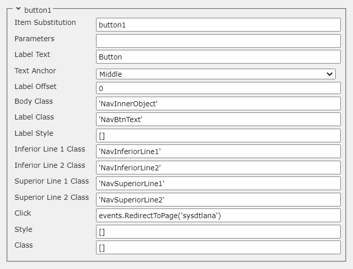

| Name              | Descriptor                                                                                                                                                                |
|-------------------|---------------------------------------------------------------------------------------------------------------------------------------------------------------------------|
| Item Substitution | Component name (unique to the shape).                                                                                                                                     |
| Parameters        | Dynamic parameters. It is good practice to assign the parameters to a variable via the `ng-init` directive. directive.                                                               |
| Label Text      | Sets the text that will be displayed on the button.                                                                                                                                                   |
| Text Anchor     | Sets the direction of the text.                                                                                                                                                   |
| Label Offset      | Sets the offset of the text.                                                                                                                                                   |
| Body Class      | Sets the class for the background of the button.                                                                                                                                                   |
| Label Class      | Sets the class for the text of the button.                                                                                                                                                   |
| Label Style      | Sets the style for the text of the button.                                                                                                                                                   |
| Inferior Line 1 Class      | Sets the class for the Inferior Line 1 element (intended to provide a *3D* effect).                                                                                                                                                   |
| Inferior Line 2 Class      | Sets the class for the Inferior Line 2 element (intended to provide a *3D* effect).                                                                                                                                                   |
| Superior Line 1 Class      | Sets the class for the Superior Line 1 element (intended to provide a *3D* effect).                                                                                                                                                   |
| Superior Line 2 Class      | Sets the class for the Superior Line 2 element (intended to provide a *3D* effect).                                                                                                                                                  |
| Click             | The function that will be called when the button is pressed. A predefined list of <br>functions, suitable for this button, is available, as well as a custom function option. |
| Style             | CSS styles used for direct styling.                                                                                                                                       |
| Class             | CSS classes used for styling via the theme.         

<br> 

Front-end example of the **Button R500** component: 

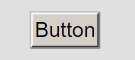

- **Custom Selection Box**

This `Base Component` is used to select a shape on the page. This functionality allows the user to access options from the context menu.
  
Image library view:
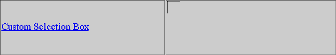

Component configuration view:
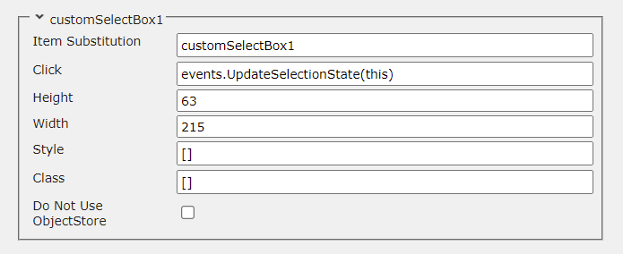
  
  

| Name              | Descriptor                                                       |
|-------------------|------------------------------------------------------------------|
| Item Substitution | Component name (unique to the shape).                            |
| Click             | The function that will be called when they shape is clicked on.  |
| Height            | The height of the Selection Box.                                 |
| Width             | The width of the Selection Box.                                  |
| Style             | CSS styles used for direct styling.                              |
| Class             | CSS classes used for styling via the theme.                      |
| Do Not Use ObjectStore           | If the checkbox is set to **true** (checked), the shape will try to gather data from the source provided in the `ItemName` field instead of the data in the `ObjectStore`. This is usually done when the server of the data source is different than the server of the provider, in which case visualizing trends will not be possible. This option provides a convenient solution to this problem.                  |
  
<br> 
Function, style, and class configuration has the following syntax:  
  

```
events.UpdateSelectionState(this)
```

```
[{'style' : 'cursor', 'value' : 'pointer'}]
```

```
['class1', 'class2']
```

Front-end examples of the **Custom Selection Box** component:  

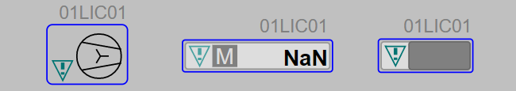

- **Custom Selection Box R500**

The new version of the `Custom Selection Box` component supports theming and contains an additional field that provides the user with the ability to change the radius of the component.

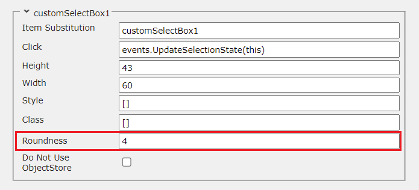

- **TxtName**

This `Base Component` is used to show the name of the `point` which is used to animate the shape. The component can also show a different name that is provided by the user.

Image library view:
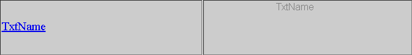 
  
Component configuration view:
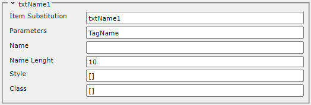


| Name              | Descriptor                                                                                                                                                                                     |
|-------------------|------------------------------------------------------------------------------------------------------------------------------------------------------------------------------------------------|
| Item Substitution | Component name (unique to the shape).                                                                                                                                                          |
| Parameters        | Dynamic parameters. It is good practice to assign the parameters to a variable via <br>the `ng-init` directive (`` in this case).                                                                                              |
| Name              | The name/text that is entered in this field will be displayed. If this field is left <br>blank, the value of the dynamic parameter that represents the name of the point <br>(`TagName`) is going to be displayed. The user can hide the name of the point by <br>manually writing `-` in this field.|
| Name Length       | The maximum number of characters that will be displayed.                                                                                                                                                                 |
| Style             | CSS styles used for direct styling.                                                                                                                                                            |
| Class             | CSS classes used for styling via the theme.                                                                                                                                                    |

  
<br>
Style and class configuration has the following syntax:

```
[{'style' : 'cursor', 'value' : 'pointer'}]
```

```
['class1', 'class2']
```

Front-end examples of the **TxtName** component:

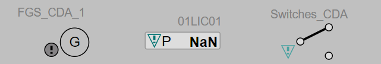

- **TxtName R500**

Visually identical to the classic `TxtName` component with the exception of provided theme support.

- **TxtNameEu**

This `Base Component` provides the same functionality as the `TxtName` component, but it also has the ability to display the engineering units of the point. There is usually a button on the display that allows to user to switch between the names and engineering units of the shapes or hide them.  
  
Image library view:
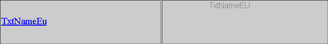
  
Component configuration view:
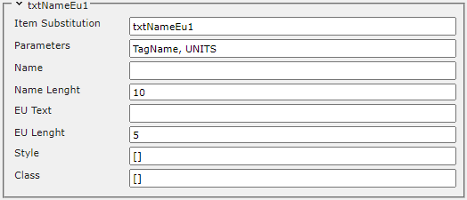

  
| Name              | Descriptor                                                                                                                                                                                                                                                                                                                  |
|-------------------|-----------------------------------------------------------------------------------------------------------------------------------------------------------------------------------------------------------------------------------------------------------------------------------------------------------------------------|
| Item Substitution | Component name (unique to the shape).                                                                                                                                                                                                                                                                                       |
| Parameters        | Dynamic parameters. It is good practice to assign the parameters to a variable via <br>the `ng-init` directive (``, ``  in this case).                                                                                                                                                               |
| Name              | The name/text that is entered in this field will be displayed. If this field is left <br>blank, the value of the dynamic parameter that represents the name of the point <br>(`TagName`) is going to be displayed. The user can hide the name of the point by <br>manually writing `-` in this field.                                   |
| Name Length       | The maximum number of characters that will be displayed for the name of <br>the point.                                                                                                                                                                                                                                          |
| EU Text           | The engineering units that are entered in this field will be displayed. If this field is <br>left blank, the value of the dynamic parameter that represents the engineering <br>units of the point (`UNITS`) is going to be displayed. The user can hide <br>the engineering units of the point by manually writing `-` in this field. |
| EU Length         | The maximum number of characters that will be displayed for the engineering <br>units of the point.                                                                                                                                                                                                                             |
| Style             | CSS styles used for direct styling.                                                                                                                                                                                                                                                                                         |
| Class             | CSS classes used for styling via the theme.                                                                                                                                                                                                                                                                                 |
  

<br>
Style and class configuration has the following syntax:

```
[{'style' : 'cursor', 'value' : 'pointer'}]
```

```
['class1', 'class2']
```


Front-end examples of the **TxtNameEU** component:
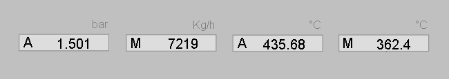
  
- **TxtNameEu R500**

Visually identical to the classic `TxtNameEu` component with the exception of provided theme support.


## Display Configuration

This tool is used to edit the global display configuration. Every zone that contains a `Svg-Editor` has its own configuration that is responsible for the shapes in the respective area.

---

#### General

General tab view:
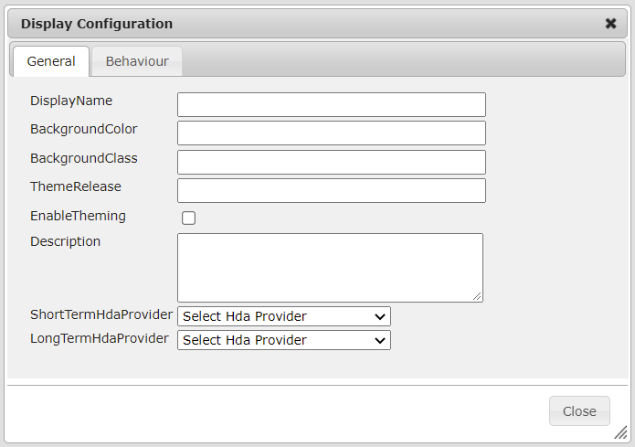


| Name                    | Descriptor                                                                                                                                                                                                               |
|-------------------------|--------------------------------------------------------------------------------------------------------------------------------------------------------------------------------------------------------------------------|
| DisplayName            | Sets an additional property to the display object.                                                                                                                                                                                                     |
| BackgroundColor        | Sets the background color of the canvas.                                                                                                                                                                                          |
| BackgroundClass        | Sets the background class of the canvas.                                                                                                                                                                                          |
| ThemeRelease        | Sets the theme release for the display. This field determines the version of the css classes that will be applied.                                                                                                                                                                                          |
| EnableTheming        | This option enables and disables theming. When the checkbox is set to **true** (checked), the theming for the display is enabled.                                                                                                                                                                                          |
| Description             | Sets a description for the display.                                                                                                                                                                                                          |
| ShortTermHdaProvider | Sets one of the `HDA Providers` that were added to the corresponding <br>`Content Type` as the **short-term** provider for the display. The chosen <br>provider will be used to retrieve historical data from the **short-term history** <br>server. |
| LongTermHdaProvider  | Sets one of the `HDA Providers` that were added to the corresponding <br>`Content Type` as the **long-term** provider for the display. The chosen <br>provider will be used to retrieve historical data from the **long-term history** <br>server.                                                                                  |

---

#### Behavior

General tab view:
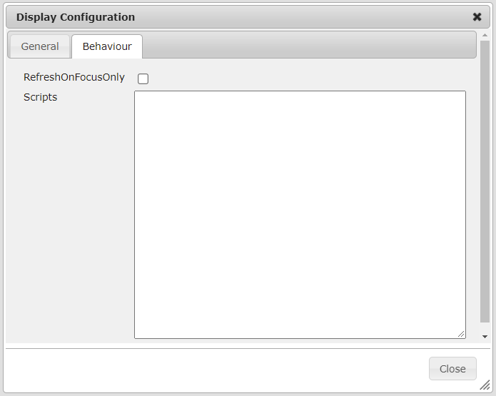

`RefreshOnFocusOnly` - If the browser supports the `Page Visibility API`, this method checks if the user is currently on the corresponding tab, if the user has switched to another tab in the browser, this method will stop sending requests. This functionality reduces the number of requests to the server, and provides greater responsiveness. When the user returns to the corresponding tab - requests to the server will be resumed.

`Scripts` - This field can hold standard *JavaScript* code. After the page is loaded, this code will be added to the page *scope*, and will be accessible to all page components. Usually, this field is used for *JavaScript* functions, which can be called from the page components and dynamic shapes.

---

## Display Diagnostic

The `Diagnostic` tool is used for analysis and diagnostics of standard errors that may occur when working with the editor. For each error or warning that is found, there is a corresponding row in the panel, which provides the results of the analysis. One or more rows can be present for each shape, as there can be more than one error in different parts of the shape, as well as more than one parameters.

For each error found, a `ShapeId` button is added (unique identifier for the shape in the
editor). When clicked, it will directly select the shape. This is done so that the user does not have to look for the exact location of the shape on the
page. The `Error` column contains the error code. It may be different for each type of error that is analyzed by the tool. The `Status` column provides a description for the error or warning. The description is as detailed as possible. It can help the user decide how to handle the error. For some errors, there is a repair mechanism, which is available via the `Repair` button, located in the last column. The `Repair All` button will clear all errors.

Diagnostic Panel views:


The analysis of each display can be started via the `Diagnostic` button, and presents the data in the following order: `Opc Da` related data,
`Context Menu` related data, `MiniTrend` related data, and `Navigation` related data.

---

#### Opc Da

The `Opc Da` section analyzes errors that would occur when the display is started on the client side(invalid parameters or points). These errors are analyzed according to the `Opc Xml Da` specification. Some errors can occur as a result of the absence of the parameter / the point from `POS` (Persistent Object
Store). Another reason may be that the server to which points are directed is unavailable etc. Some of these errors can be easily analyzed and handled via the `Repair` button, when this is not possible, information is displayed in the dialog box, allowing the user to decide on whether and how the errors should be handled.

After analyzing all the errors, they are synthesized into several types, and
the user will be able to see some of the following messages:

| Name                                                                  | Descriptor                                                                                                                                                                                                                                                                                               |
|-----------------------------------------------------------------------|----------------------------------------------------------------------------------------------------------------------------------------------------------------------------------------------------------------------------------------------------------------------------------------------------------|
| `{PARAM}` must be removed                                             | The parameter must be deleted (the parameter is not needed <br>or not used). This can be done safely through the REPAIR button.                                                                                                                                                                              |
| `{PARAM1}` must be replaced with `{PARAM2}`.                          | The analysis has detected an invalid parameter (`PARAM1`) that must <br>be replaced with a valid parameter (`PARAM2`). This can be done <br>safely through the REPAIR button.                                                                                                                                    |
| Try to replace `{PARAM1}` with `{PARAM2}`.                            | The analysis has detected a problem with this parameter. <br>A possible reason is that the parameters for the execution state for <br>**CDA** and **SCADA** points (respectively `EXECSTATE` and `ONSCAN`) have <br>been switched. The `REPAIR` button will safely replace the invalid <br>parameter with the valid one. |
| POINT is not available in `POS` <br>(maybe TagName != ItemName)       | The point is not found in the `POS`. A possible reason may be that <br>it is available under another key.                                                                                                                                                                                                    |
| PARAMETER is not available                                            | The point is available on the server from which the data is being <br>read, but there is a problem with the parameter. A possible reason <br>may be an invalid parameter.                                                                                                                                        |
| POINT server is not reachable, <br>but it's in `POS`                  | The server from which the point is being read is not available. <br>Possible reasons may be: the server has been stopped, the server <br>address is incorrect, restrictions that are related to access rights, <br>other server related issues.                                                                      |
| POINT is not available                                                | The point is not available on the server. A possible reason may be <br>that the entered point name is incorrect.                                                                                                                                                                                             |
| Unspecified error                                                     | Unknown error.                                                                                                                                                                                                                                                                                           |

---

#### Context Menu

The `Context Menu` section analyzes context menu related errors. The context menu is programmatically tested for errors that would be returned during a normal operation on the client side (with the current configuration of the shape).
The analysis checks if the context menu can be opened, and if
all of its options are available. If an option is not
enabled this may indicate that it is not configured correctly, or there is a
problem with some of the components it works with.

The possible errors are described below:

| Name                                                 | Descriptor                                                                                                                                          |
|------------------------------------------------------|-----------------------------------------------------------------------------------------------------------------------------------------------------|
| Context Menu <br>{Menu Element Name} <br>is disabled | Unspecified error.                                                                                                                                  |
| Broken context menu                                  | The menu is broken and will not open, a possible reason may be that the <br>configuration of one of the menu elements is broken or entered incorrectly. |

---

#### MiniTrend
 
The `Mini Trend` section analyzes errors related to a mini trend, which is an option in the context menu. The system checks if the parameters exist in their respective servers, as well as the availability of any historical data for the parameters. Each parameter is checked for available historical data in the `STH` (Short
Term History Server) and `LTH` (Long Term History Server). `ItemName's` that will be read are taken from the `POS` (Persistent Object Store).

The possible errors are described below:

| Name                                                                        | Descriptor                                                                                                                                                                                                                                                       |
|-----------------------------------------------------------------------------|------------------------------------------------------------------------------------------------------------------------------------------------------------------------------------------------------------------------------------------------------------------|
| Parameter is not available <br>in `STH/LTH` server.                         | The parameter is not   found on the servers that read from the `STH` or <br>`LTH` servers.                                                                                                                                                                           |
| Parameter is not available <br>in `POS`.                                    | The parameter is not available in the `POS`. This means that the <br>`ItemName` of this parameter cannot be found, and the `MiniTrend` <br>cannot be displayed.                                                                                                          |
| Communication error                                                         | Unspecified communication error.                                                                                                                                                                                                                                 |
| Point have no history data. <br>Try to replace it with: `{PARAM}`.          | This parameter has no historical data, but a compatible parameter <br>was found in the `POS` (Persistent Object Store). It can be replaced via <br>the `REPAIR` button.                                                                                                  |
| Point have no history data. <br>Both `STH` and `LTH` <br>ItemName are same. | This parameter has no historical data, and the `ItemNames` for the `STH` <br>and `LTH` are the same. A possible reason may be that the historical <br>data of this parameter is not configured to be archived in the `STH` <br>and `LTH`. The `Opc Xml Da ItemName` is used. |

---

#### Navigation

The `Navigation` section analyzes errors related to the navigations of the
display. The validity of all navigations is checked, as well as if the resource they lead to is available. The path to each new display can be written in 2 ways:

| Name                             | Descriptor                                                                                                                                                                                                                                      |
|----------------------------------|-------------------------------------------------------------------------------------------------------------------------------------------------------------------------------------------------------------------------------------------------|
| relative / absolute path (URL)   | Example: `/process/overview`. In this case, the display will be redirected <br>to the specified resource.                                                                                                                                           |
| `POS` key                        | Example: `OVERVIEW`, where `OVERVIEW` is a key in the `POS`, and the path <br>to the desired resource (in this case - display `/process/overview`) is <br>adjacent to it. The display will take the display URL from the `POS` and <br>then redirect to it. |

<br>  

The possible errors are described below:

| Name                                      | Descriptor                                                                                                                                                                                     |
|-------------------------------------------|------------------------------------------------------------------------------------------------------------------------------------------------------------------------------------------------|
| Display {DISPLAY} is <br>not available in `POS` | The navigation to this display uses a `POS` key but it is not found. In this case, the navigation will not redirect to the desired display.                                                    |
| {DISPLAY URL} is not available            | The navigation to this display uses the display URL, but an error `404 Not Found` is returned when access is attempted. In this case, the navigation will not redirect to the desired display. |

---

#### Summary

In this chapter, we have learned about the use of the **HMI EDITOR** and its essential components. It is a vital tool for display building, and provides a variety of built in options and components that provide convenient functionality.
