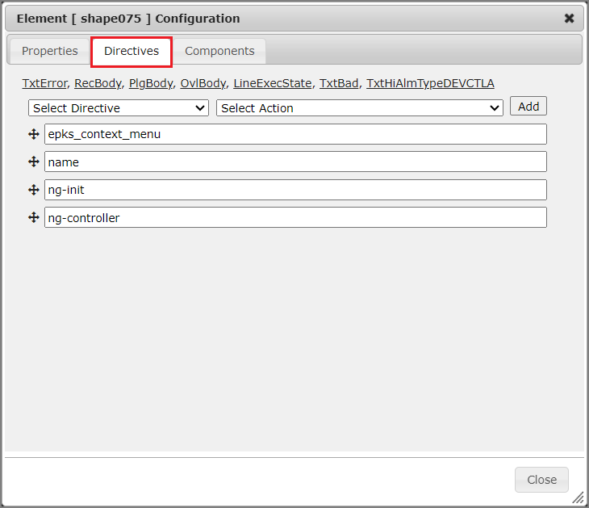

#

**SmartWEB** includes a built-in, web-based graphics editor (`SVG Editor`) for creating and editing Scalable Vector Graphics (`SVG`). These graphics are essential for building Human Machine Interface (`HMI`) pages as well as other types of web pages. The pages created can be animated using data provided by **SmartWEB** `Data Providers`. This feature allows users to design and view `HMI` pages similar to those used in operator stations within control rooms. 

This chapter will guide you through the process of creating and managing graphical displays to achieve a dynamic visual representation of your process. You will learn how to: 

> -  Working with the editor tools to create static `SVG` graphics.  

> -  Use dynamic elements (`Shapes`) from **SmartWEB** shape library to render basic `HMI` elements such as `Valves`, `Motors`, `Regulators`, etc.  

Below is an example of a data-driven **SmartWEB** `HMI` graphic page.


The graphical editor is also used for the development of individual `shapes`. **SmartWEB** provides a library of pre-built shapes that are ready for use. Additionally, users can create **custom** shapes to meet specific project requirements and extend the built-in library. The [Dynamic Shapes Development](../dynamic-shapes-development) chapter details how to create **custom** shapes.

---

## Editor Features

The `Smartsys Svg Editor` module provides a graphical editor. The module brings a new  
`Content Field` to the fieldset that can be attached to every `Content Type`. The following image shows the configuration of a `Content Type` with an embedded `Svg Field`. Visit the  
[Content Anatomy](../content-anatomy) chapter for additional information on `Content Types`, `Content Parts`,  
and `Content Fields`. 


There are a number of `Svg Field` configurations available on the `Content Type` page. The user can set the default dimensions of the drawing area and select whether the `SVG` content needs to be indexed. The default size of the drawing area for each `Content Item` can be changed at a later time. Indexing will allow the user to search for items inside the graphical content.

!!!note "Note:"
      Note that there are three vital parts added to the `Content Type`: `Opc Da access`, `Opc Hda access` and a common `Opc Xml` client library. The web page is animated thanks to the data provided by these parts. The [Access to OPC Data](../access-to-opc-data) chapter covers `Opc Da` and `Opc Hda` data providers.

The following image is an example of `HMI` content loaded inside the editor in the `Content Item` configuration page. In this section we will go over the available tools and functionality. 


---

#### Menu Edit

The `SVG-Edit` button in the top left corner of the editor displays a drop-down menu with several options.


> -  `New Image` - Create a new document.

> -  `Import Display` - Upload an `SVG` document (display) to the canvas area.

> -  `Export Display`- Download the current `SVG` document **with** the `Opc Xml Data Providers`.

> -  `Export Display (portable)`- Download the current `SVG` document **without** the  
`Opc Xml Data Providers`.

> -  `Shape Library` - Access the library of available shapes. The shapes are organized in folders according to their purpose. The following example shows a few of the default analog shapes included in **SmartWEB**.


> -  `Import Image` - Import a standard `SVG` image to the canvas area. 

> -  `Document Properties` - By default, the new display inherits the canvas dimensions from its  
`Content Type` configuration. This option allows the user to change the width and height of the drawing area.


> -  `Fast Publish` - Executes `Unpublish` and `Publish Now` commands sequentially for the current `Content Item`. This functionality provides a convenient way to publish an edited/updated  
`Content Item` with one operation. The chapter [Manage Content](../manage-content) provides a complete explanation of content publishing and content versioning.

!!!warning "Important"
    The `Fast Publish` option will publish the `Content Item` **without** updating its version in the database. It is good practice to use it over the standard `Publish Now` functionality.

    A good alternative to the `Fast Publish` option is the `Re-publish` option:
    

---

#### Basic Tools


`(1)` - **Selection Tool** - Allows the user to select and move items in the editor. The user has the ability to select multiple items by holding `Shift` and left-clicking on the items.

`(2)` - **Pencil tool** - Allows the user to draw a custom figure. The size and color of the stroke are adjustable via the `Color Platte Tools` (21-25).

`(3)` - **Line tool / Connect two objects** - Holding down the left mouse button on the icon will allow the user to select one of two tools. The first tool (Line tool) provides the ability to draw a straight line from point A to point B. The second tool (Connect two objects) allows the connection of two objects with a straight line.

`(4)` - **Rectangle / Square / Free hands rectangle** - Holding down the left mouse button on the icon will allow the user to select one of three tools: `Rectangle`, `Square`, and  
`Free hands rectangle`. The first two options allow the user to draw a rectangle and a square. The third option (Free hands rectangle drawing) allows the user to draw any shape, which will be redrawn by the editor as a rectangle (according to the height, width, and position of the shape).

`(5)` - **Ellipse / Circle / Free hands ellipse** - Holding down the left mouse button on the icon will allow the user to select one of three tools: `Ellipse`, `Circle`, and `Free hand ellipse`. The first two options allow the user to draw an ellipse and a circle. The third option (Free hands ellipse) allows the user to draw any shape, which will be redrawn by the editor as an ellipse (according to the height, width, and position of the shape).

`(6)` - **Path tool** - Allows the user to draw a free hand shape.

`(7)` - **Static Shape Library** - Allows the user to add static shapes to the canvas. The shapes are organized by type.


`(8)` - **Text tool** - Allows the user to place text on the canvas.

`(9)` - **Image tool** - Allows the user to insert an image (pnt, jpeg, jpg, and more).

`(10)` - **Zoom tool** - Allows the user to zoom in on a certain area.

`(11)` - **Diagnostic** - Allows the user to analyze dynamic elements. A more detailed explanation of this functionality will be provided in the [Display Diagnostic](#display-diagnostic) section of this chapter.

`(12)` - **Item Configuration** - Allows the user to edit the parameter settings of dynamic elements.

`(13)` - **Display Behaviour Configuration** - Allows the user to configure the short and long term `Opc Xml HDA Providers` of the display (page), as well as the styling of the document. A more detailed explanation of this functionality will be provided in the [Display Configuration](#display-configuration) section of this chapter.

`(14)` - **Full Screen** - Toggle full-screen mode.

`(15)` - **Eye dropper tool** - Provides the color of the selected element.

`(16)` - **Edit Source** - Provides the source code of the canvas content.

`(17)` - **Wireframe Mode** - Renders the canvas elements in black and white mode.

`(18)` - **Show / Hide Grid** - Toggle the grid view.

`(19)` - **Undo** - Undo the last action.

`(20)` - **Redo** - Redo the last action.

`(21)` - **Change Zoom Level** - Change the canvas zoom level.

`(22)` - **Change fill color** - Allows the user to change the color and opacity of the element background.


`(23)` - **Change stroke color** - Allows the user to change the size, style and color of the element border.

`(24)` - **Change selected item opacity** - This tool changes the transparency of the selected element.

`(25)` - **Default color palette** - Provides the user with a default color palette.

Upon selection of an element, a toolbar with additional instruments will appear at the top of the editor, as shown on next picture.


`(1)` - **Duplicate Element**- Duplicate all selected elements in the canvas.

`(2)` - **Delete Element** - Delete all selected elements in the canvas.

`(3)` - **Bring to front** - Bring the selected element to the front.

`(4)` - **Bring to back** - Bring the selected element to the back.

`(5)` - **Hyperlink** -Allows the user to create a link to an external resource.

`(6)` - **ID** - Allows the user to change the ID of the element. Each page element has a **unique** identifier (ID).

`(7)` - **Change rotation angle** - Allows the user to change the rotation angle of the selected element.

`(8)` - **Change Gaussian blur value** - Allows the user to change the blur of the selected element.

`(9)` - **Align element to page** - This tool provides several options which allow the user to align the selected item to the page.

`(10)` - **X and Y** - Allows the user to change the horizontal and vertical coordinates of the selected element.

When two or more items on a page are selected, the following tools will appear at the top of the editor.


`(1)` - **Group Elements** - Group all selected elements.

`(2)` - **Align Menu** - This set of tools provide the user with the ability to align the selected elements.

`(3)` - **Relative to** - Allows the user to configure the `Align Menu` (selected objects, largest object,
smallest object, page).

When a static element is selected that is **not** a `path`, the `Convert to Path` option becomes available. This option will transform the element into a `path` element.


When a static element is selected that **is** a `path`, the `Reorient Path` option becomes available. This option will recalculate the points of the `path` and remove the rotation attribute from the element. 


---

#### Shape Library

The `SVG Editor` contains dynamic base components (directives), which are used as the **basic building blocks** for rendering dynamic information. These base components can work independently, but can also be grouped into one element (`Shape`), which utilizes their separate functionalities. By consolidating the base components, different shapes can be built that vary in features and complexity. The [Dynamic Shapes Development](../dynamic-shapes-development) chapter explains the development process of such custom `shapes`.

---

## Shape Configuration

This section covers all the details you need to know about configuring and customizing existing `shapes` in your dynamic pages. The `Item Configuration` tool in the editor provides the user with the ability to change the configuration of the `shapes`. This tool is accessed via the cogwheel icon on the toolbar, and becomes available after an element is selected.


The configuration options are spread into three separate tabs in the configuration panel: 

* `Properties`
* `Directives`
* `Components`

---

#### Properties


The `Properties` tab contains the data sources for the parameters of the `shape`. In **SmartWEB** these sources are known as `points`. A `point` is a data structure comprised of parameters of specific data types. Every `shape` uses an `Opc Xml Da Data Provider` to request and receive data. Available providers can be selected from the `DataProviderKey` field. For more information - see chapters [Access to OPC data](../access-to-opc-data) and [Content Anatomy](../content-anatomy). 


!!!note "Note:"
    The fields following the `DataProviderKey` field are hidden until a provider is selected. 

The `ItemName` field and corresponding subfields allow the user to enter one or more data sources (`points`) that are related to the behaviour of the `shape`. The expected input for each field is an `Opc Xml Item Name`, according to the  
`Opc Xml Da Specification 1.0`. This is how specific `points` from the namespace of the server is accessed. Each of the subfields provides a data source for a specific `base component`. The label on the left side of each subfield is the `Item Substitution` (name) of the component referencing that data source. Visit the [Dynamic Shapes Development](../dynamic-shapes-development) chapter for more information on  
`Base Components` and `Item Substitutions`.

!!!note "Note:"
     If a subfield is left blank, the corresponding `base component` will use the `point` of the `ItemName` field.

The `Browse` button, to the right of the `ItemName` field, opens an `Opc Xml Da Browser` window, allowing an `Opc Xml Item Name` to be selected from the address space that corresponds to the chosen data provider. The `Add` button will add the selected item name to the `ItemName` field.

---

#### Directives



The `Directives` tab allows the user to assign specific directives to the `shape`. The directives are added to the elements as `HTML` attributes, and used to extend the functionality of standard `HTML`. The `AngularJS` framework processes these attributes.

Directives can be assigned to the `shape` via the `Select Directive` menu. The following options are available:


---

- `ng-init` - Allows the scope of the shape controller to be extended with new fields (variables). All custom parameters of the `shape` are declared and defined in this directive. `Base Components` and custom scripts will have access to these variables. This makes then an essential part of the configuration of the `shape`. 


---

- `ng-class` - This directive is used for styling. It is equivalent to the `class attribute` in `HTML`. In addition, the `ng-class` directive can also contain a condition that will determine which class should be added.


---

- `i-ng-class` - In **SmartWEB**, this directive provides a style with theming functionality to an element. It takes a function (`ApplyNgTheme()`) with one parameter - the name of the class that will be applied.


---

- `ng-click` - This directive is equivalent to the `onclick` event in `HTML`, and triggers when the user clicks on the element. In the example below, the directive is configured to call the `RedirectToPage` function when the `shape` is clicked.

```javascript
events.RedirectToPage("/unit1/hmi/100p01");
```


---

- `ng-controller` - The value of this directive is the name of the controller which will initialize the `shape`.


---

- `ng-style` - This directive allows the addition of standard `CSS` styles. The styles must be in the following syntax:

```javascript
{cursor: "pointer"}
```

```javascript
{css_property: "css_property_value"}
```


---

- `name` - This directive adds a standard `HTML` attribute to the element. It is commonly used for shape naming, but it can also add other `HTML` attributes.


---

- `sw-onready-function` - This directive allows the user to execute a function once after the page has been loaded.


The following function declaration must be provided in the *JavaScript* source file -  
`smartsys-opcxmlda-custom-all-4xx.min.js` (or another file that is loaded inside the page).  
This file is located in the following directory - `\Modules\Smartsys.OpcXmlDa\Scripts`.

```javascript

window.my_function = function (me) {
...
}

```

The [Dynamic Shapes Development](../dynamic-shapes-development) chapter explains *JavaScript* custom functions.

---

- `epks_base_element` - This directive provides a unique name for the `svg` element within the `shape` scope and is usually used in `shape` development.


References to the configuration of each `base element` are located at the top of the `Directives` tab. 


The user can access the configuration of a `base element` by selecting the label with the name of that element. The label for that element will be highlighted in *red* (`(1)` in the image below). To return to the main configuration window of the `shape`, the `Root` option can be selected (`(2)` in the image below). This option is visible only when a `base element` has been selected.


---

- `еpks_context_menu` - This directive creates the context menu of the `shape`. The editor has a set of actions that can be added to the context menu with the `+` button, located in the lower-left corner of the directive. 


The following image presents the context menu on the web page.


The available context menu actions are the following:

`(1)` - **Faceplate** - This action will open a popup window with essential information about the system `point` (entity) behind the selected `shape` (Process measurement, PID Controller, Motor Control, etc.). The `Name` field allows the user to provide the context menu label for this option. In this example it is configured as `Faceplate`. The faceplate is an independent page in the CMS and has its own address. The address of the faceplate is entered in the `Url` field, as it is shown in the following image.


The following image presents an example faceplate for the Honeywell EPKS - **PID controller**.


`(2)` - **Detail** - This action will redirect the user to the detail display page of the `point`. The page presents detailed `point` information. The configuration of the `detailDisplay` action is the same to that of a faceplate, but unlike the faceplate, the detail display opens in a new page.


The following image presents an example detail display for the Honeywell EPKS - **PID controller**.


`(3)` - **Faceplate from ObjectStore** - This action has the same behaviour as the faceplate option, with the exception that the address to the faceplate page is not entered. It is stored in [Object Store](../object-store), and taken automatically by the system. If the `point` does not exist in the `Object Store`, the menu link will be inactive.


`(4)` - **Detail display from ObjectStore** - The behaviour of this action is similar to the `Detail display` option, with the exception that the address of the detail display page is taken automatically from the `Object Store`. If the `point` does not exist in the `Object Store`, the menu link will be inactive.


!!!note "Note:"
    **SmartWEB** provides pre-built `Faceplates` and `Detail displays` for all `point` types used in **Honeywell EPKS**. For other DCS, such system pages need to be additionally developed.

`(5)` - **Associated Displays** - This action will open a dialog box with a list of links to `content items` in which the selected `point` is present. There are two configurable fields for this action - `Url` and `Parameter`. The expected input of the `Url` field is a pre-created `Smart Search Template`. This template handles the indexing of `content items`, taking into account user permissions. The expected input for the `Parameter` field is an `Item Substitution`, which is configured in the `Properties` tab. The [Site Settings](../site-settings) chapter provides a detailed explanation of `Smart Search Templates`.


Example of the `Associated Displays` action on the web page:


`(6)` - **Associated Trends** - The configuration and usage of this action is the same as the  
`Associated Displays` action, with the difference that the system returns a list of associated trends instead of associated `content items`.


`(7)` - **Mini Trend** - This action invokes a popup window that visualizes a trend. The expected input for the `Url` field is the address of the trend `content item`. The `Parameters` field allows the user to determine which parameters will be displayed on the trend. The [Dygraph Trend](../dygraph-trend) chapter describes the configuration and features of the trend.


The expected input for the `mini trend` parameters is in *JSON* format. The user must provide an  
`item substitution` and a parameter name for each of the trend traces. The `Parameters` field supports custom parameters defined in the `ng-init` directive of the `shape` (Example: `cp_pv` = `pid_pla.pv`). Both of the following examples are viable.

Custom parameters example:  
`[ 
    {'itemSubstitution':'item','parameter':''}, 
    {'itemSubstitution':'item','parameter':''}, 
    {'itemSubstitution':'item','parameter':''} 
]`

Original parameter names example:  
`[ 
    {'itemSubstitution':'item','parameter':'pid_pla.pv'}, 
    {'itemSubstitution':'item','parameter':'pid_pla.sp'}, 
    {'itemSubstitution':'item','parameter':'pid_pla.op'} 
]`  

Example of a `mini trend` on the web page:


`(8)` - **Custom Trend** - This action invokes a popup window that allows the user to select specific parameters from multiple `shapes` on multiple pages. The left column of the panel (`Available Parameters`) lists the parameters of the current `shape`(from which the panel was invoked). The right column of the panel (`Trend Parameters`) lists the parameters that will be displayed on the trend. The parameters in this list will be saved and available to the user across multiple pages every time he invokes the custom trend panel. Parameters can be moved between the two columns by clicking on the parameter names. Optionally, the user can provide a title for the `custom trend` in the input field at the top of the panel. The trend window can be invoked via the `Trend` button in the bottom right corner of the panel. 

!!!note "Note:"
    The parameters listed in the `Available Parameters` column are the `mini trend` parameters configured for the shape.

 There are two configuration fields for the `custom trend` action (`Url`, `Configurator`). The expected input for the `Url` field is the address of the trend `content item`. Usually, the same trend `content item` is used for both `mini trends` and `custom trends`. The expected input for the `Configurator` field is the address of the custom trend configurator `content item`.


Example of a `custom trend configuration panel` on the web page:


`(9)` - **Properties** - This action executes the `OPC XML DA - GetProperties` method for the `ItemName` and returns the result in a popup window. The result can be exported in *Excel* format via the `Export` button in the bottom right corner of the panel.

There is one configuration field (`Parameter`) for the `properties` action. The expected input is in *JSON* format. The expected key value pairs follow the same principals as the `mini trend` configuration.


Example of a `properties` panel on the web page:


---

The context menu can be triggered by a left or right mouse click. This option is configurable from the `Trigger` setting, as shown in the image below:


---

#### Base Components

Every `Shape` is a group of standard `svg` elements (line, polyline, rectangle, circle, etc.)  
and `base components`. Currently, in **SmartWEB**, there are two separate libraries. One for  
older `base components` and one for newer versions that support theming (EPKS release 500 and up) and may provide additional functionality.


Each `Base Component` is configurable. The configuration of the individual components is done through the `Components` tab in the configuration panel.
The `Base Components` in the editor are divided into four categories (`Alarm Components`, `Analog Components`, `Digital Components`, `Auxiliary Components`). Their respective configurations are explained below. This section will go through the configuration of each component.


---

`(1)` - **Alarm Components** - The components from this category are designed to animate alarm states.

- **Alarm Basic**

This `Base Component` represents a standard `Honeywell EPKS` alarm icon with three different priorities (`Urgent`, `High`, and `Low`), and two unacknowledged states for each property (`Active` and `Inactive`).

Shape library view:


Component configuration view:


| Name              | Descriptor                                      |
| ----------------- | ------------------------------------------------|
| Item Substitution | Component name (unique inside the shape scope).           |
| Parameters        | Data parameters used to determine behaviour. |
| Style             | CSS properties used for styling.             |
| Class             | CSS classes used for styling.     |  
   
<br>
Style and class configuration has the following syntax:
```javascript
[{ style: "cursor", value: "pointer" }]
```

```javascript
[("class1", "class2")]
```

Front-end examples of the **Alarm Basic** component:


<br>

- **Alarm Basic R500**

Visually identical to the classic `Alarm Basic` component. In regards to functionality, the `R500` version supports theming and *critical* alarm priority (`Critical`, `Urgent`, `High`, and `Low`). The `Class` and `Style` fields have been removed, and a new option for scaling has been added, which will keep the original size of the component or allow it to be stretched, depending on the setting.

  

| Name              | Descriptor                                      |
| ----------------- | ------------------------------------------------|
| Item Substitution | Component name (unique inside the shape scope).           |
| Parameters        | Alarm parameters used to determine behaviour.      |
| Disable Scaling   | Determines whether the alarm will be scaled.  |

The final difference between the two variants is that with the updated `R500` version, the order of the parameters does not matter, which makes the component easier to use.

<br>

- **Passive Alarm R500**

This is a unique `R500` component and does not have an older predecessor. It is visually identical to the classic `Alarm Basic` component. The main difference comes from the functionality it provides. The `Alarm Basic` has specific behaviour which is dependent on data parameters. The `Passive Alarm` is designed to work in conjunction with a custom function, where the alarm state will be set manually by the script, based on specific logic.


| Name              | Descriptor                                      |
| ----------------- | ------------------------------------------------|
| Item Substitution | Component name (unique inside the shape scope).           |
| Priority          | The alarm priority that will be displayed.      |
| Acknowledged      | Determines whether the alarm will indicate the acknowledged state.  |
| Returned          | Determines whether the alarm will indicate the returned state.  |  

<br>

- **Text Alarm**

This `Base Component` symbolizes a single priority alarm with two unacknowledged states for an `Active` and `Inactive` alert. The component also shows the number of active alarms from the configured priority.

Shape library view:


Component configuration view:


| Name              | Descriptor                                                                                                                                                 |
| ----------------- | ---------------------------------------------------------------------------------------------------------------------------------------------------------- |
| Item Substitution | Component name (unique inside the shape scope).                                                                                                                      |
| Parameters        | Alarm parameters used to determine behaviour. |
| Alarm Priority    | The alarm priority that will be displayed.                                                                                                         |
| Style             | CSS properties used for styling.                                                                                                                        |
| Class             | CSS classes used for styling.                                                                                                                |

<br>
Style and class configuration has the following syntax:
```javascript
[{ style: "cursor", value: "pointer" }]
```

```javascript
[("class1", "class2")]
```

Front-end examples of the **Text Alarm** component:


---

`(2)` - **Analog Components** - The components from this category animate analog measurements.

- **Alphanumeric**

This `Base Component` presents alphabetical and numerical characters. It is widely used in most shapes that present analog data.

Shape library view:


Component configuration view:


| Name               | Descriptor                                                                                                                                                                                                                                                                                                                                                         |
| ------------------ | ------------------------------------------------------------------------------------------------------------------------------------------------------------------------------------------------------------------------------------------------------------------------------------------------------------------------------------------------------------------ |
| Item Substitution  | Component name (unique inside the shape scope).                                                                                                                                                                                                                                                                                                                              |
| Parameters         | Data parameters used to determine behaviour. The default values are <br> `['PV', 'OnScan']`. It is good practice to assign the parameters to a <br> variable via the `ng-init` directive (``, ``). <br> The second parameter is used in conjunction with the `Off-scan State` option. This functionality animates the bahaviour of the `EXECSTATE` and `ONSCAN` parameters (from `Honeywell EPKS`). |
| Number Of Decimals | The number of digits after the decimal point. Applicable for numeric values.                                                                                                                                                                                                                                                                                       |
| Fill Color         | Background color. The default value is `transparent`.                                                                                                                                                                                                                                                                                                              |
| Line Color         | Border color. The value must be a valid `HEX` color (example: #ff0000). <br>The default value is **transparent**.                                                                                                                                                                                                                                                  |
| Text Color         | Text color, the value must be a valid `HEX` color (example: #ff0000).                                                                                                                                                                                                                                                                                              |
| Line Width         | Border width.                                                                                                                                                                                                                                                                                                                                                      |
| Off-scan State     | This option instructs the component to animate the `Active/Inactive` state, <br>according to the value of the second data parameter.                                                                                                                                                                                                                            |
| Alarm State        | Not used.                                                                                                                                                                                                                                                                                                                                                          |
| Bad value          | Not used.                                                                                                                                                                                                                                                                                                                                                          |
| NaN                | Not 
used.                                                                                                                                                                                                                                                                                                                                                          |
| Type of breakpoint | There are three available choices (Continuous, Discrete, None). <br>With this option, it is possible to add an additional animation, depending <br>on the value of the variable. The following two configuration options <br>(`Discrete States`, `Continuous States`), depending on the type of variable, <br>determine the type of the animation.                 |
| Discrete States    | If a `Discrete` value is selected for the `Type of breakpoint` option, <br>then the animation for several discrete states will be configured here e.g. <br>`[{ state: 0, color: '#ff0000', inverse: true }`, <br> `{ state: 1, color: '#0000ff', inverse: true }]`. <br> Other discrete states can be described similarly.                                                     |
| Continuous States  | If `Continuous` is selected for the `Type of breakpoint` option, <br> then the animation characterization will be configured here e.g. <br>`[{ rangeFrom: 0, rangeTo: 50, color: '#ff0000' }`, <br> `{ rangeFrom: 50, rangeTo: 100, color: '#0000ff' }]`. <br> The range can be divided into more intervals, providing <br>different animations.                                |
| Alignment          | This option provides three choices for text alignment (Start, Middle, End).                                                                                                                                                                                                                                                                                        |
| Size               | Text size.                                                                                                                                                                                                                                                                                                                                                         |
| Font               | Font family e.g. `Arial`, `Times New Roman`, etc.                                                                                                                                                                                                                                                                                                                  |
| Bold               | Apply a **bold** style to the text.                                                                                                                                                                                                                                                                                                                                |
| Italic             | Apply an _italic_ style to the text.                                                                                                                                                                                                                                                                                                                               |
| Underline          | Apply an `underline` style to the text.                                                                                                                                                                                                                                                                                                                            |
| Strikeout          | Apply a `strikethrough` style to the text.                                                                                                                                                                                                                                                                                                                         |
| Max Characters     | The maximum number of displayed characters, regardless of the length of <br> the variable.                                                                                                                                                                                                                                                                          |
| Display As         | Instructs the `Base Component` to display the value in a specific way: <br>(Numeric, Enumeration, Text).                                                                                                                                                                                                                                                           |
| Class              | CSS classes used for styling (through the theme).                                                                                                                                                                                                                                                                                                                  |
| Function           | Allows a custom function to be called when the data has updated.                                                                                                                                                                              |


<br>
Function and class configurations have the following syntax:
```javascript
[{ action: "OnUpdate", function: "Function_Name" }]
```

```javascript
["class1", "class2"]
```

!!!note "Note"
     The built-in custom functions can be located in the following source file - `smartsys-opcxmlda-all-4xx.min.js`. Additional custom functions with specific/custom behaviour can be created in the second available file - `smartsys-opcxmlda-custom-all-4xx.min.js`. Both files are located in the following directory - `\Modules\Smartsys.OpcXmlDa\Scripts`.

Front-end examples of the **Alphanumeric** component:


<br>

- **Alphanumeric R500** 

The new version of the `Alphanumeric` component supports theming and contains an additional field that provides the user with the ability to change the radius of the component.


<br>

- **Indicator Bar**

This `Base Component` provides a graphical representation of a variable in a given range. There are a number of ways to present data graphically (horizontal, vertical, line pointer, triangular pointer).

Shape library view:


Component configuration view:


| Name              | Descriptor                                                                                                                                                                                                                                                                                                                                                                                                                                                                                                                                                             |
| ----------------- | ---------------------------------------------------------------------------------------------------------------------------------------------------------------------------------------------------------------------------------------------------------------------------------------------------------------------------------------------------------------------------------------------------------------------------------------------------------------------------------------------------------------------------------------------------------------------- |
| Item Substitution | Component name (unique inside the shape scope).                                                                                                                                                                                                                                                                                                                                                                                                                                                                                                                                  |
| Parameters        | Data parameters used to determine the behaviour. The default values are <br> `['PV', 'OnScan', 'EUHI', 'EULO']`. It is good practice to assign the parameters to <br> a variable via the `ng-init` directive (``, ``, ``, <br>``). The value of the first parameter will be animated on the bar. <br>The second parameter is not mandatory and can be omitted <br> (the space between the parentheses is left blank). This parameter is commonly <br> used to animate the behaviour of the `EXECSTATE` and `ONSCAN` parameters <br> (from `Honeywell EPKS`). The values ​​of the last two parameters represent the upper <br> and lower values (the range) of the bar. |
| Indicator Type    | Determine the appearance of the bar. The following options are available:<br>`Vertical Bar`, `Vertical Pointer`, `Vertical Line`, `Horizontal Bar`, `Horizontal Pointer`, `Horizontal Line`. This option should be set during shape development <br>(before the components are grouped), and should not be changed in <br> the shape's component configuration tab.                                                                                                                                                                                                                                                  |
| Range High        | A default value of type `double` that acts as the highest value that can be <br>reached on the bar, when the third parameter (``) is not provided.                                                                                                                                                                                                                                                                                                                                                                                                                                                        |
| Range Origin      | A default value of type `double` that is considered the point from which the bar will <br>start to fill up. The bar will fill up starting from this origin position value to the <br>value of the first data parameter (``). This option is only taken into <br>consideration when the `IndicatorType` option is set to `Vertical Bar` or <br> `Horizontal Bar`.                                                                                                                                                                                                                                                                                                     |
| Range Low         | A default value of type `double` that acts as the lowest value that can be <br>reached on the bar, when the fourth parameter (``) is not provided.                                                                                                                                                                                                                                                                                                                                                                                                                                                        |
| Fill Color        | Background color of the indicator. The value must be a valid `HEX` color.                                                                                                                                                                                                                                                                                                                                                                                                                                                                                              |
| Level Fill Color  | Fill color of dynamic part (the animated part that will visualize the bar being <br> filled). The value must be a valid `HEX` color.                                                                                                                                                                                                                                                                                                                                                                                                                                                                                                     |
| Mirror Pointer    | Applicable when the `Vertical Pointer` or `Horizontal Pointer` options are <br>selected for the `Indicator Type`. The pointer will be displayed in a mirrored <br>fashion.                                                                                                                                                                                                                                                                                                                                                                                                         |
| Style             | CSS properties used for styling.                                                                                                                                                                                                                                                                                                                                                                                                                                                                                                                                    |
| Class             | CSS classes used for styling.                                                                                                                                                                                                                                                                                                                                                                                                                                                                                                                        |
| Function          | Allows a custom function to be called when the data has updated.                                                                                                                                                                                                                                                                                                                                                                                                                                                                            |
  
<br> 
Style, class, and function configuration has the following syntax:

```javascript
[{ style: "cursor", value: "pointer" }]
```

```javascript
[("class1", "class2")]
```

```javascript
[{ action: "OnUpdate", function: "Some_Function" }]
```

Front-end examples of the **Indicator Bar** component:


<br>

- **Indicator Bar R500**

Visually identical to the classic `Indicator Bar` component with the exception of provided theme support. In regard to functionality, the `R500` version has a key difference from its classic counterpart. The `Range High`, `Range Origin`, and `Range Low` fields in the configuration panel of the component have a higher priority in the `R500` version. Their values will be considered over the ranges provided in the `Parameters` field, whereas in the classic version, it is the other way around. Additionally, the `R500` version has a `Mirror Bar` option. When enabled, the bar will be mirrored in the opposite direction.

!!!note "Note:" 
    It is a common practice to provide the range parameters as values for the `Range High`,  
    `Range Origin`, and `Range Low` fields when there are no custom ranges. That way, the functionality will be the same as the classic version.

---

`(3)` - **Digital Components** - The components from this category animate discrete variables.

- **Txt Mode One Letter**

This `Base Component` represents the first letter of the operation mode abbreviation of DCS control entities. It is used in some built-in `Honeywell EPKS` shapes, which have the following abbreviations: `MAN`, `AUTO`, `CASC`, `COMP`, `S-MAN`, `S-AUTO`, `S-CASC`, `S-COMP`. The component also monitors the **normal mode** of the control entity, and represents the mode letter and mode letter background with different colors if the **normal mode** is active.

Shape library view:


Component configuration view:


| Name              | Descriptor                                                                                                                                                                                                                                                           |
| ----------------- | -------------------------------------------------------------------------------------------------------------------------------------------------------------------------------------------------------------------------------------------------------------------- |
| Item Substitution | Component name (unique inside the shape scope).                                                                                                                                                                                                                                |
| Parameters        | Data parameters. The default values are `['Mode', 'NORMALMODE']`. It is good <br>practice to assign the parameters to a variable via the `ng-init` directive <br>(``, ``). The first parameter monitors the `MODE` of the control <br>entity. The second parameter monitors the `NORMAL MODE`. |
| Normal Mode       | When the checkbox is checked, the component takes into account the normal <br>mode parameter, and changes the colors of the letter and its background when <br>the mode value differs from the normal mode value.                                                                                                         |
| Style             | CSS properties used for styling.                                                                                                                                                                                                                                  |
| Class             | CSS classes used for styling.                                                                                                                                                                                                                      |
<br> 

Style and class configuration has the following syntax:

```javascript
[{ style: "cursor", value: "pointer" }]
```

```javascript
[("class1", "class2")]
```

Front-end examples of the **Txt Mode One Letter** component:


---

`(4)` - **Auxiliary Components** - These components perform a variety of support functions.

- **Parameter Container**

This `Base Component` does not have a graphical presentation on the front-end. It is used to collect dynamic data that can be used in custom functions to animate certain elements in the shape.

Shape library view:


Component configuration view:


| Name              | Descriptor                                                                                                                                                                                                                             |
| ----------------- | -------------------------------------------------------------------------------------------------------------------------------------------------------------------------------------------------------------------------------------- |
| Item Substitution | Component name (unique inside the shape scope).                                                                                                                                                                                                  |
| Parameters        | Data parameters. It is good practice to assign the parameters to a variable <br> via the `ng-init` directive ``, ``. The first parameter <br> monitors the `PV` of the control entity. The second parameter monitors <br> the `EXECSTATE`. |
| Properties        | Parameters that will be gathered from the server via the `OPC XML DA GetProperties` method.   |
| Function          | Allows a custom function to be called when the data has updated.|


<br> 
The function configuration has the following syntax:

```
[{'action': 'OnUpdate', 'function': 'Some_Function'}]
```

<br>

- **Base Label**

This `Base Component` provides the user with the ability to visualize text on the front-end. It is commonly used to attach a label to a shape.

Shape library view:


Component configuration view:


| Name              | Descriptor                                                                                              |
|-------------------|---------------------------------------------------------------------------------------------------------|
| Item Substitution | Component name (unique inside the shape scope).                                                                   |
| Label Text        | The text that will be displayed on the front-end.                                                       |
| Label Length      | The length of the text.                                                                                 |
| Text Anchor       | Determines the direction of the text. There are three available options <br>("Start", "Middle", "End"). |
| Style             | CSS properties used for styling.                                                                     |
| Class             | CSS classes used for styling.                                                             |

  
<br> 
Style and class configuration has the following syntax:

```
[{'style' : 'cursor', 'value' : 'pointer'}]
```

```
['class1', 'class2']
```
  
Front-end example of the **Base Label** component:  


<br>

- **Base Label R500**

The new version of the `Base Label` component supports theming. In regards to functionality, the main difference between the `R500` and classic versions is the way the text is positioned. In the `R500` version, the `Label Length` field is replaced with two new fields (`Text Width`, `Text Pos`).


| Name              | Descriptor                                                                                              |
|-------------------|---------------------------------------------------------------------------------------------------------|
| Item Substitution | Component name (unique inside the shape scope).                                                                   |
| Label Text        | The text that will be displayed on the front-end.                                                       |
| Text Width        | Determines the width of the text in pixels.                                                                                 |
| Text Pos          | Determines the position of the text in pixels.                                                                                 |
| Text Anchor       | Determines the direction of the text. There are three available options <br>("Start", "Middle", "End"). |
| Style             | CSS properties used for styling.                                                                     |
| Class             | CSS classes used for styling.                                                             |

<br> 

- **Button**

This `Base Component` is used to perform a predefined action. When the button is clicked, the function in the `Click` field is called. This allows the user to attach additional functionality to the display.

Shape library view:


Component configuration view:  

  
| Name              | Descriptor                                                                                                                                                                |
|-------------------|---------------------------------------------------------------------------------------------------------------------------------------------------------------------------|
| Item Substitution | Component name (unique inside the shape scope).                                                                                                                                     |
| Parameters        | Data parameters. It is good practice to assign the parameters to a variable via <br> the `ng-init` directive. directive.                                                               |
| Button Label      | The label of the button.                                                                                                                                                  |
| Click             | The function that will be called when the button is pressed. A predefined list of <br> functions, suitable for this button, is available, as well as a custom function <br> option. |
| Style             | CSS properties used for styling.                                                                                                                                       |
| Class             | CSS classes used for styling.                                                                                                                               |

  
<br>

Function, style, and class configuration has the following syntax:

```
events.RedirectToPage('Some_Page')
```


```
[{'style' : 'cursor', 'value' : 'pointer'}]
```

```
['class1', 'class2']
```

Front-end example of the **Button** component:   


<br>

- **Button R500**

The `Button R500` component is `SVG` based, unlike the classic version, which is `HTML` based. This means that the new version supports scaling, and the styling is done in a manner compliant with the `SVG` standard. The `R500` version also supports *3D* effects when clicked.
 
Component configuration view:  


| Name              | Descriptor                                                                                                                                                                |
|-------------------|---------------------------------------------------------------------------------------------------------------------------------------------------------------------------|
| Item Substitution | Component name (unique inside the shape scope).                                                                                                                                     |
| Parameters        | Data parameters. It is good practice to assign the parameters to <br> a variable via the `ng-init` directive. directive.                                                               |
| Label Text      | Sets the text that will be displayed on the button.                                                                                                                                                   |
| Text Anchor     | Sets the direction of the text.                                                                                                                                                   |
| Label Offset      | Sets the offset of the text.                                                                                                                                                   |
| Body Class      | Sets the class for the background of the button.                                                                                                                                                   |
| Label Class      | Sets the class for the text of the button.                                                                                                                                                   |
| Label Style      | Sets the style for the text of the button.                                                                                                                                                   |
| Inferior Line 1 Class      | Sets the class for the Inferior Line 1 element (intended to provide <br> a *3D* effect).                                                                                                                                                   |
| Inferior Line 2 Class      | Sets the class for the Inferior Line 2 element (intended to provide <br> a *3D* effect).                                                                                                                                                   |
| Superior Line 1 Class      | Sets the class for the Superior Line 1 element (intended to provide <br> a *3D* effect).                                                                                                                                                   |
| Superior Line 2 Class      | Sets the class for the Superior Line 2 element (intended to provide <br> a *3D* effect).                                                                                                                                                  |
| Click             | The function that will be called when the button is pressed. |
| Style             | CSS properties used for styling.                                                                                                                                       |
| Class             | CSS classes used for styling.         

<br> 

Front-end example of the **Button R500** component: 


<br>

- **Custom Selection Box**

This `Base Component` is used to highlight the `shape` on the page when it is selected. 
  
Shape library view:


Component configuration view:

  
  

| Name              | Descriptor                                                       |
|-------------------|------------------------------------------------------------------|
| Item Substitution | Component name (unique inside the shape scope).                  |
| Click             | The function that will be called when they shape is clicked on.  |
| Height            | The height of the Selection Box.                                 |
| Width             | The width of the Selection Box.                                  |
| Style             | CSS properties used for styling.                                 |
| Class             | CSS classes used for styling.                                    |
| Do Not Use ObjectStore           | If the checkbox is set to **true** (checked), the shape will try to gather data <br> from the source provided in the `ItemName` field instead of the data in the <br> `ObjectStore`. This is usually done when the server of the data source is <br> different than the server of the provider, in which case visualizing trends <br> will not be possible. This option provides a convenient solution to this <br> problem.                  |
  
<br> 

Function, style, and class configuration has the following syntax:  
  

```
events.UpdateSelectionState(this)
```

```
[{'style' : 'cursor', 'value' : 'pointer'}]
```

```
['class1', 'class2']
```

Front-end examples of the **Custom Selection Box** component:  


<br>

- **Custom Selection Box R500**

The new version of the `Custom Selection Box` component supports theming and contains an additional field that provides the user with the ability to change the radius of the component.


- **TxtName**

This `Base Component` is used to show the name of the `point` that is used to animate the shape. The component can also show a different name that is provided by the user.

Shape library view:
 
  
Component configuration view:


| Name              | Descriptor                                                                                                                                                                                     |
|-------------------|------------------------------------------------------------------------------------------------------------------------------------------------------------------------------------------------|
| Item Substitution | Component name (unique inside the shape scope).                                                                                                                                                          |
| Parameters        | Data parameters. It is good practice to assign the parameters to a variable via <br> the `ng-init` directive (`` in this case).                                                                                              |
| Name              | The name/text that is entered in this field will be displayed. If this field is left <br> blank, the value of the data parameter (`TagName` in this case) <br> will be displayed instead. The user can hide the text by manually writing `-` <br> in this field.|
| Name Length       | The maximum number of characters that will be displayed.                                                                                                                                                                 |
| Style             | CSS properties used for styling.                                                                                                                                                            |
| Class             | CSS classes used for styling.                                                                                                                                                    |  

<br>

Style and class configuration has the following syntax:

```
[{'style' : 'cursor', 'value' : 'pointer'}]
```

```
['class1', 'class2']
```

Front-end examples of the **TxtName** component:


<br>

- **TxtName R500**

Identical to the classic `TxtName` component with the exception of provided theme support.

<br>

- **TxtNameEu**

This `Base Component` provides the same functionality as the `TxtName` component, but it also has the ability to display the engineering units of the point. There is usually a button on the display that allows to user to switch between the names and engineering units of the shapes or hide them.  
  
Shape library view:

  
Component configuration view:


  
| Name              | Descriptor                                                                                                                                                                                                                                                                                                                  |
|-------------------|-----------------------------------------------------------------------------------------------------------------------------------------------------------------------------------------------------------------------------------------------------------------------------------------------------------------------------|
| Item Substitution | Component name (unique inside the shape scope).                                                                                                                                                                                                                                                                                       |
| Parameters        | Data parameters. It is good practice to assign the parameters to a variable via <br>the `ng-init` directive (``, ``  in this case).                                                                                                                                                               |
| Name              | The name/text that is entered in this field will be displayed. If this field is left <br>blank, the value of the data parameter that represents the name of the point <br>(`TagName`) is going to be displayed. The user can hide the name of the point by <br>manually writing `-` in this field.                                   |
| Name Length       | The maximum number of characters that will be displayed for the name of <br>the point.                                                                                                                                                                                                                                          |
| EU Text           | The engineering units that are entered in this field will be displayed. If this field <br> is left blank, the value of the data parameter that represents the engineering <br>units of the point (`UNITS`) is going to be displayed. The user can hide <br>the engineering units of the point by manually writing `-` in this field. |
| EU Length         | The maximum number of characters that will be displayed for the engineering <br>units of the point.                                                                                                                                                                                                                             |
| Style             | CSS properties used for styling.                                                                                                                                                                                                                                                                                         |
| Class             | CSS classes used for styling.                                                                                                                                                                                                                                                                                 |
  

<br>
Style and class configuration has the following syntax:

```
[{'style' : 'cursor', 'value' : 'pointer'}]
```

```
['class1', 'class2']
```


Front-end examples of the **TxtNameEU** component:


<br>
  
- **TxtNameEu R500**

Visually identical to the classic `TxtNameEu` component with the exception of provided theme support.

<br>

- **UserInput R500**

This component allows the user to attach an input field on the page with various functionalities.  

Shape library view:

  
Component configuration view:
 

| Name              | Descriptor                                                                                                                                                                                     |
|-------------------|------------------------------------------------------------------------------------------------------------------------------------------------------------------------------------------------|
| Item Substitution | Component name (unique inside the shape scope).                                                                                                                                                          |
| Parameters        | The user has the option to set data parameters which will be used in the <br> functionality of the input.                                                                                              |
| Display Data | When this option is enabled, the input will update its value every time <br> the value of the parameter is updated on the server.|
| Class | CSS classes used for styling.                                                                                                                                                                 |
| Function | Allows the user to attach a custom function that will determine the functionality <br> of the input when a value is submitted (`Enter` key is pressed) and/or the <br> data has been updated on the server. <br> There are two supported events - `OnSubmit` and `OnUpdate`. Functions for **both** <br> events can be attached to the same input.  |

Class configuration syntax example:
```
['class1', 'class2']
```

Function configuration syntax example:
```
//OnSubmit event
[{'action': 'OnSubmit', 'function': 'submitFunction'}]

//OnUpdate event
[{'action': 'OnUpdate', 'function': 'updateFunction'}]

//both events
[
    {'action': 'OnSubmit', 'function': 'submitFunction'},
    {'action': 'OnUpdate', 'function': 'updateFunction'}
]
```
Front-end example of the **UserInput** component:
 


- **EmbeddedTrend R500**

This component allows the user to embed a trend in the display. The trend will run when the page loads and will remain in static position.

Shape library view:
 
  
Component configuration view:
 

| Name              | Descriptor                                                                                                                                                                                     |
|-------------------|------------------------------------------------------------------------------------------------------------------------------------------------------------------------------------------------|
| Item Substitution | Component name (unique inside the shape scope).                                                                                                                                                          |
| Trend Parameters        | The parameters that will be visualized on the trend.                                                                                              |
| Y Axis Units  | Enables the trend toolbar **Y Axis Units** option button.|
| Relative | Enables the trend toolbar **Relative** option button.                                                                                                                                                               |
| Full Range | Enables the trend toolbar **Full Range** option button.  |
| Range Selector | Enables the trend toolbar **Range Selector** option button.  |
| Hairline | Enables the trend toolbar **Hairline** option button.  |
| Export | Enables the trend toolbar **Export** option button.  |
| Snapshot | Enables the trend toolbar **Snapshot** option button.  |
| Time Frame | Enables the trend toolbar **Time Frame** option button.  |
| Sample Rate | Enables the trend toolbar **Sample Rate** option button.  |
| Reload | Enables the trend toolbar **Reload** option button.  |
| Precise | Enables the trend toolbar **Precise** option button.  |
| Legend | Enables the trend toolbar **Legend** option button.  |
| Real Time Mode | Enables the trend toolbar **Real Time Mode** option button.  |

Trend parameters configuration syntax example:
```
//single parameter

//point in object store
[{point:'100FI001', parameter:'DACA.PV'}]

//point not in object store
[{point:'VIRTUALIZE.PLANT.ASSETS.UNIT1.100FI001', parameter:'DACA.PV'}]


//multiple parameters

//points in object store
[
    {point:'100FI001', parameter:'DACA.PV'}, 
    {point:'100FIC022B', parameter:'PID_PLA.PV'}
]

//points not in object store
[
    {point:'VIRTUALIZE.PLANT.ASSETS.UNIT1.100FI001', parameter:'DACA.PV'}, 
    {point:'VIRTUALIZE.PLANT.ASSETS.UNIT1.100FIC022B', parameter:'PID_PLA.PV'}
]
```

Front-end example of the **Embedded Trend** component:
 

---

## Display Configuration

This tool is used to edit the global display configuration. Every zone that contains an `Svg Editor` has its own configuration that is responsible for the `shapes` in the respective area.

---

#### General

General tab view:


| Name                    | Descriptor                                                                                                                                                                                                               |
|-------------------------|--------------------------------------------------------------------------------------------------------------------------------------------------------------------------------------------------------------------------|
| DisplayName            | Sets an additional property to the display object.                                                                                                                                                                                                     |
| BackgroundColor        | Sets the background color of the canvas.                                                                                                                                                                                          |
| BackgroundClass        | Sets the background class of the canvas.                                                                                                                                                                                          |
| ThemeRelease        | Sets the theme release for the display. This field determines the version of <br> the css classes that will be applied.                                                                                                                                                                                          |
| EnableTheming        | This option enables and disables theming. When the checkbox is set <br> to **true** (checked), the theming for the display is enabled.                                                                                                                                                                                          |
| Description             | Sets a description for the display.                                                                                                                                                                                                          |
| ShortTermHdaProvider | Sets one of the `HDA Providers` that were added to the corresponding <br> `Content Type` as the **short-term** provider for the display. The chosen <br>provider will be used to retrieve historical data from the <br> **short-term history** server. |
| LongTermHdaProvider  | Sets one of the `HDA Providers` that were added to the corresponding <br> `Content Type` as the **long-term** provider for the display. The chosen <br>provider will be used to retrieve historical data from the <br> **long-term history** server.                                                                                  |

---

#### Behaviour

General tab view:


`RefreshOnFocusOnly` - If the browser supports the `Page Visibility API` and this functionality is enabled, **SmartWEB** will track whether the browser tab is in focus. When the user switches to another tab, the page will stop sending data requests, resulting in faster response times and reducing the number of requests sent to the server. The data requests will resume when the user returns to the tab.

`Scripts` - This field can hold standard *JavaScript* code. After the page is loaded, this code will be added to the page *scope*, and will be accessible to all page components. Usually, this field is used for *JavaScript* functions, which can be called from the page components and dynamic shapes.

---

## Display Diagnostic

The `Diagnostic` tool is used for analysis and diagnostics of standard errors that may occur when working with the editor. For each error or warning that is found, there is a corresponding row in the panel, which provides the results of the analysis. One or more rows can be present for each shape, as there can be more than one error in different parts of the shape, as well as more than one parameters.

For each error found, a `ShapeId` button is added (unique identifier for the shape in the
editor). When clicked, it will directly select the shape. This is done so that the user does not have to look for the exact location of the shape on the
page. The `Error` column contains the error code. It may be different for each type of error that is analyzed by the tool. The `Status` column provides a description for the error or warning. The description is as detailed as possible. It can help the user decide how to handle the error. For some errors, there is a repair mechanism, which is available via the `Repair` button, located in the last column. The `Repair All` button will clear all errors.

Diagnostic Panel views:


The analysis of each display can be started via the `Diagnostic` button, and presents the data in the following order: `Opc Da` related data,
`Context Menu` related data, `MiniTrend` related data, and `Navigation` related data.

---

#### Opc Da

The `Opc Da` section analyzes errors that would occur when the display is started on the client side(invalid parameters or points). These errors are analyzed according to the `Opc Xml Da` specification. Some errors can occur as a result of the absence of the parameter / the point from `POS` (Persistent Object
Store). Another reason may be that the server to which points are directed is unavailable etc. Some of these errors can be easily analyzed and handled via the `Repair` button, when this is not possible, information is displayed in the dialog box, allowing the user to decide on whether and how the errors should be handled.

After analyzing all the errors, they are synthesized into several types, and
the user will be able to see some of the following messages:

| Name                                                                  | Descriptor                                                                                                                                                                                                                                                                                               |
|-----------------------------------------------------------------------|----------------------------------------------------------------------------------------------------------------------------------------------------------------------------------------------------------------------------------------------------------------------------------------------------------|
| `{PARAM}` must be removed                                             | The parameter must be deleted (the parameter is not needed <br>or not used). This can be done safely through the REPAIR button.                                                                                                                                                                              |
| `{PARAM1}` must be replaced with `{PARAM2}`.                          | The analysis has detected an invalid parameter (`PARAM1`) that <br> must be replaced with a valid parameter (`PARAM2`). This can be <br> done safely through the REPAIR button.                                                                                                                                    |
| Try to replace `{PARAM1}` with `{PARAM2}`.                            | The analysis has detected a problem with this parameter. <br> A possible reason is that the parameters for the execution state <br> of **CDA** and **SCADA** `points` (respectively `EXECSTATE` and `ONSCAN`) have <br> been switched. The `REPAIR` button will safely replace the invalid <br> parameters with the valid ones. |
| POINT is not available in `POS` <br>(maybe TagName != ItemName)       | The point is not found in the `POS`. A possible reason may be that <br>it is available under another key.                                                                                                                                                                                                    |
| PARAMETER is not available                                            | The point is available on the server from which the data is being <br> read, but there is a problem with the parameter. A possible <br> reason may be an invalid parameter.                                                                                                                                        |
| POINT server is not reachable, <br>but it's in `POS`                  | The server from which the point is being read is not available. <br>Possible reasons may be: the server has been stopped, the server <br>address is incorrect, restrictions that are related to access rights, <br>other server related issues.                                                                      |
| POINT is not available                                                | The point is not available on the server. A possible reason may be <br>that the entered point name is incorrect.                                                                                                                                                                                             |
| Unspecified error                                                     | Unknown error.                                                                                                                                                                                                                                                                                           |

---

#### Context Menu

The `Context Menu` section analyzes context menu related errors. The context menu is programmatically tested for errors that would be returned during a normal operation on the client side (with the current configuration of the shape).
The analysis checks if the context menu can be opened, and if
all of its options are available. If an option is not
enabled this may indicate that it is not configured correctly, or there is a
problem with some of the components it works with.

The possible errors are described below:

| Name                                                 | Descriptor                                                                                                                                          |
|------------------------------------------------------|-----------------------------------------------------------------------------------------------------------------------------------------------------|
| Context Menu <br>{Menu Element Name} <br>is disabled | Unspecified error.                                                                                                                                  |
| Broken context menu                                  | The menu is broken and will not open, a possible reason may be that the <br>configuration of one of the menu elements is broken or entered incorrectly. |

---

#### MiniTrend
 
The `Mini Trend` section analyzes errors related to a mini trend, which is an option in the context menu. The system checks if the parameters exist in their respective servers, as well as the availability of any historical data for the parameters. Each parameter is checked for available historical data in the `STH` (Short
Term History Server) and `LTH` (Long Term History Server). `ItemName's` that will be read are taken from the `POS` (Persistent Object Store).

The possible errors are described below:

| Name                                                                        | Descriptor                                                                                                                                                                                                                                                       |
|-----------------------------------------------------------------------------|------------------------------------------------------------------------------------------------------------------------------------------------------------------------------------------------------------------------------------------------------------------|
| Parameter is not available <br>in `STH/LTH` server.                         | The parameter is not   found on the servers that read from the `STH` or <br>`LTH` servers.                                                                                                                                                                           |
| Parameter is not available <br>in `POS`.                                    | The parameter is not available in the `POS`. This means that the <br>`ItemName` of this parameter cannot be found, and the `MiniTrend` <br>cannot be displayed.                                                                                                          |
| Communication error                                                         | Unspecified communication error.                                                                                                                                                                                                                                 |
| Point have no history data. <br>Try to replace it with: `{PARAM}`.          | This parameter has no historical data, but a compatible parameter <br>was found in the `POS` (Persistent Object Store). It can be replaced via <br>the `REPAIR` button.                                                                                                  |
| Point have no history data. <br>Both `STH` and `LTH` <br>ItemName are same. | This parameter has no historical data, and the `ItemNames` for the `STH` <br>and `LTH` are the same. A possible reason may be that the historical <br>data of this parameter is not configured to be archived in the `STH` <br>and `LTH`. The `Opc Xml Da ItemName` is used. |

---

#### Navigation

The `Navigation` section analyzes errors related to the navigations of the
display. The validity of all navigations is checked, as well as if the resource they lead to is available. The path to each new display can be written in 2 ways:

| Name                             | Descriptor                                                                                                                                                                                                                                      |
|----------------------------------|-------------------------------------------------------------------------------------------------------------------------------------------------------------------------------------------------------------------------------------------------|
| relative / absolute path (URL)   | Example: `/process/overview`. In this case, the display will be <br> redirected to the specified resource.                                                                                                                                           |
| `POS` key                        | Example: `OVERVIEW`, where `OVERVIEW` is a key in the `POS`, and the <br> path to the desired resource (in this case - <br> display `/process/overview`) is adjacent to it. The display will take the <br> url from the `POS` and then redirect to it. |

<br>  

The possible errors are described below:

| Name                                      | Descriptor                                                                                                                                                                                     |
|-------------------------------------------|------------------------------------------------------------------------------------------------------------------------------------------------------------------------------------------------|
| Display {DISPLAY} is <br> not available in `POS` | The navigation to this display uses a `POS` key but it is not found. <br> In this case, the navigation will not redirect to the desired display.                                                    |
| {DISPLAY URL} is not available            | The navigation to this display uses the display URL, but an error <br> `404 Not Found` is returned when access is attempted. <br> In this case, the navigation will not redirect to the desired display. |

---

## Data Presentation

This section will go over the structure of the data flow in **SmartWEB**, which allows data to be taken from the server and visualized in the browser. The following image is an example of a dynamic web page that was created with the use of the `SVG Editor`.


There are multiple components which are responsible for retrieving, handling and visualizing data in order to create the dynamics of the SVG content in the web page. The following block diagram represents the interaction between these components. 


**SmartWEB** utilizes `AngularJS` as its front-end framework. This framework is a crucial component of the system, responsible for bootstrapping HTML, delivering application data, and binding HTML elements to the data model. Each of the controller blocks incorporates `AngularJS` functionality.

The `CORE` block contains references to all dynamic elements. These elements are registered in the following controllers: `Requester Controller`, `DataProvider Controller`,  
`Statistics Controller`, `Display Behaviour Controller`. The `CORE` block is also responsible for data requests from the page to the web server. These requests can be enabled or disabled through the functionality of the block.

The `Requester Controller` block is responsible for registering all dynamic elements configured in the `SVG Editor` as `requesters` on the front-end. Each dynamic element is registered in the controller with a local `Initialize` function. The function uses the references from the `CORE` block for each element to register them as a `requester`. The `requesters` are then prepared for data requests. The `Requester Controller` block ensures that each `requester` on the page visualizes the data from the server accurately.

The `Directives` block contains `AngularJS` directives (alphanumeric, parameter container, etc.). It is responsible for the behaviour of each directive and the way it visualizes data. Working with directives is explained later in this chapter.

The `Display Behaviour Controller` contains functionality and information relevant to the page. This includes the display id and name, options and settings for the `Opc Xml Data Providers`, bootstrapping of `Opc Xml Data Providers`, page styling, references to relevant items (`requesters`, item paths etc.) and browser information.   

The `DataProvider Controller` is responsible for the communication between the page and the server, adhering to the `OPC XML Specification DA 1.0` standards.
Every **SmartWEB** page that visualizes data from a server is an `Opc Xml client`. The `DataProvider Controller` formats the request and submits it to the `Sent Request / Get Response` block. The only purpose of the block is to send the request to the server and wait for a response. The data from every response is sent back to the `DataProvider Controller`. This updates the `Value Model` in the `ValueModel Factory` block. An `OnDataChange` event is triggered after the model values update. The `Requester Controller` listens for this event and updates all directives in its scope.

The `Statistics Controller` takes care of communication statistics. Tracks response times, number of requests per every method, etc.

---

#### Summary

In this chapter, we have learned about the use of the **HMI EDITOR** and its essential components. It is a vital tool for display building, and provides a variety of built-in options and components that provide convenient functionality.
