#
`The Honeywell EPKS` (Experion® Process Knowledge System) is
integrated in SmartWEB via the OPC (Open Platform Communications)
specifications for process data. The `HMI2SmartWebConvertor` tool helps
with the `HMI` (Human-Machine Interface). It converts HMI displays in a
suitable format for the [Svg-Editor module](../hmi-editor-in-depth) 
and support configurations.

##Prerequisites

-   HMI2SmartWebConvertor is a portable application (doesn't have
    installer).

-   Operating system: `Windows 7` / `Windows 2008 Server` or newer.

-   `.NET Framework 4.5.1` - [download and installation](https://www.microsoft.com/en-us/download/details.aspx?id=40779) / [web installer](https://www.microsoft.com/en-us/download/details.aspx?id=40773).

-   Pre-installed HMI Display Builder - used for processing HMI
    displays.

-   HMIWeb Display Builder version 5 or newer.

##Select HMI displays 

When the `HMI2SmartWebConvertor`is open, the following window should
be available:

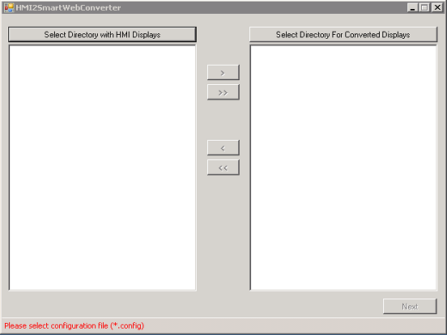

`Select Directory with HMI Displays` - opens a dialog box that will
allow the user to select a folder that contains HMI displays (with the `htm` 
extension). All displays in the selected folder will appear in the
white area under the button.

`Select Directory For Converted Displays` - opens a dialog box that
will allow the user to select the folder where the converted displays
will be stored. If a folder is not selected, a `ConvertedDisplays`
folder will be created automatically within a folder with HMI displays.
The converted displays will then be stored in the `ConvertedDisplays`
folder.

`Button >` - this button will become active when a display is selected
from the left side (HMI display). When the button is clicked, the
selected display will be moved to the right side.

`Button >>` - this button will become active when a folder with HMI
displays is selected. When it is clicked - all displays from the left
panel will move to the right panel, which means they are selected for
converting.

`Button <` - this button will become active when selecting a display
from the right side (list of displays for converting). When clicking on
it selected display will be removed from the list of displays for
converting.

`Button <<` - this button will become active when there is at least one
display on the right side (list of displays for converting). When it is
clicked, it will remove all displays from the list of displays for
converting.

`Next` - this button will become active if there is at least one
selected display for converting. When this button is clicked, the user
can proceed to the compatible shapes configuration.

The image below shows an example with a selected folder with HMI
displays (6 displays and 3 of them are added for converting).

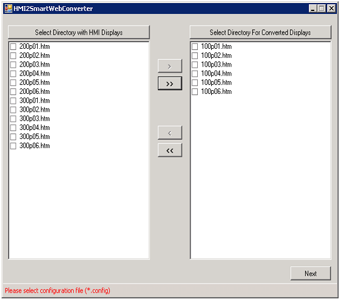

##Analyzing Shapes

`Compatible shapes` are shapes that are developed in SmartWEB to have
the same behavior and view as EPKS shapes. Visit the [Dynamic Shapes Development](../dynamic-shapes-development) chapter for more information on shapes.

When the desired HMI displays are selected, the next stage is to
configure the shapes. By clicking on `Next` the following window will appear.

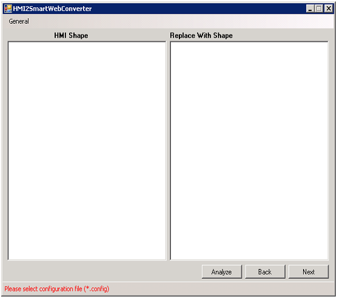

On the `Compatible Shapes` screen the following buttons are available:

`Analyze` - this button will analyze displays. It will look for new
shapes and their custom parameters.

`Back` - this button will return the previous screen.

`Next` - this button leads to the the next screen.

After clicking on the `Analyze` button, a new dialog window with a
progress bar will appear (see the image below).

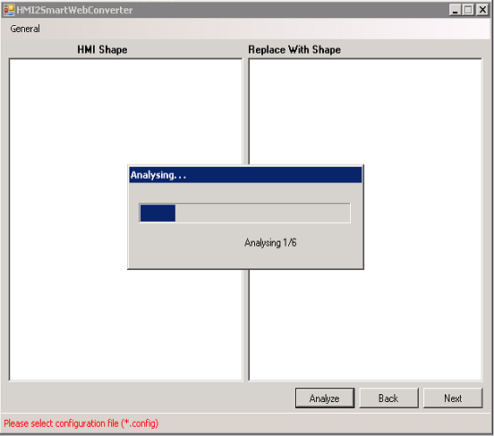

When the analyzing process has finished, this new window will close
automatically. The result of the process is shown below.

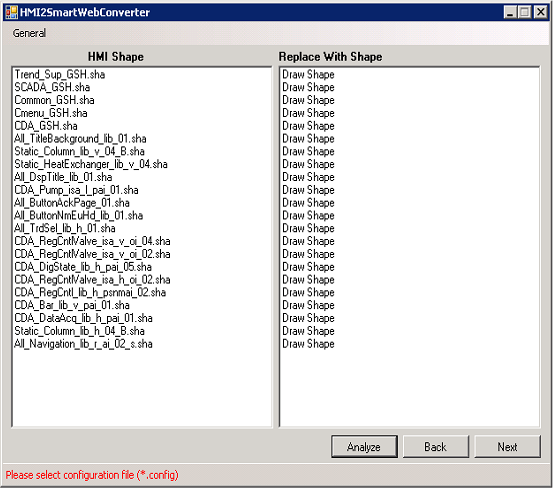

The EPKS HMI shapes from selected displays are located on the left side
of the window - in the  
`HMI Shape` panel. The `Replace With Shape`
panel is located on the right side of the panel, and there are three
possible options on each line.

-   `Draw Shape` - this shape will be drawn static.

-   `Skip Shape` - this shape won't be drawn.

-   `Compatible Shape Name` - the name of the shape which is
    configured to replace an EPKS HMI shape.

Before selecting a configuration file all EPKS HMI shapes will be drawn
statically. In the upper left side of the panel, there is a menu
`General` with three options:

-   `Open Config` - this option will open a dialog box that will allow
    the selection of a configuration file (file with extension
    `config`).

-   `Save Config` - this option will save the current state in the
    configuration file. If a configuration file is not provided it may
    create a new one.

-   `Open Shapes ` - this option will open a dialog box that will allow
    the selection of a folder with SmartWeb shapes. In most cases, this
    is necessary when creating a new configuration file. After saving,
    this information is stored in the configuration file.

After a configuration file is loaded, some of EPKS HMI shapes will have
alternatives in `SmartWEB`, and the bottom tooltip bar label will be
replaced with a config name.

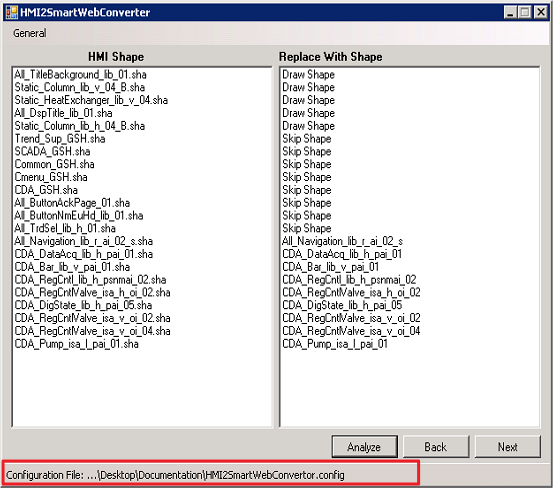

##Compatible shapes configuration

When displays are being converted, the SmartWEB Converter replaces each
EPKS HMI shape with an explicitly defined SmartWeb shape. A dynamic
configuration like `TagName`, `Parameter`, `States` etc. is replaced by
the rules described below.

To edit a row consisting of an EPKS shape and its equivalent SmartWEB
shape - click on the row itself. A `Compatible Shapes` window will
appear with the configuration options.

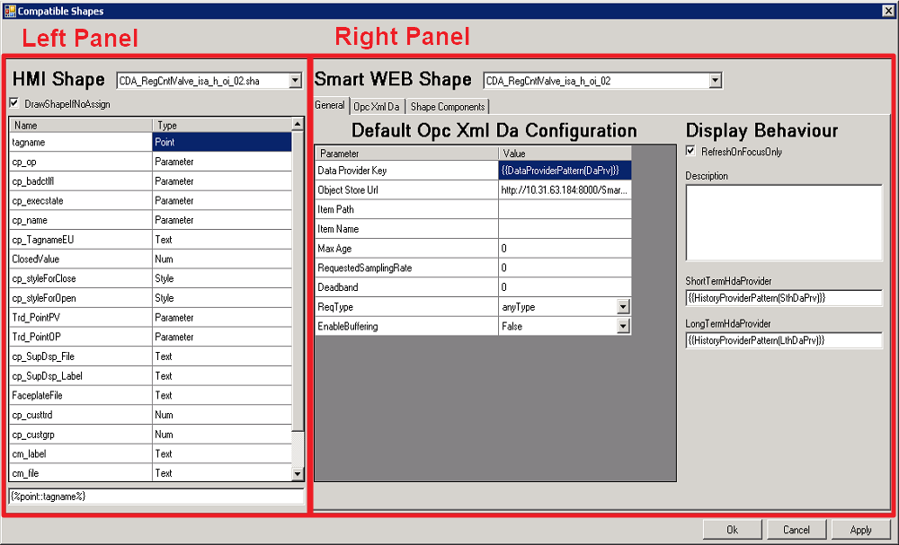

The left panel shows the selected EPKS HMI Shape and its available
properties. If the checkbox `DrawShapeIfNoAsign` is not checked, and a
SmartWeb Shape is not selected, this shape will be skipped in the
conversion process. This functionality is often used for shapes that
only provide scripts or functionalities that are not supported in
SmartWEB (Script holders).

In the list with available properties, for each property, there are two
columns. The first is the exact property name, and the second is its
type (Point, Parameter, Text, Style, Num). Below the list, there is a
field with an automatically generated pattern. The pattern will be
generated for each property when the user clicks on it in the list.

Pattern:



Where `param_type` is the parameter type for EPKS HMI Shapes - Point,
Parameter, Text, Style, Num, and `param_name` is the unique parameter
name.

Example:



This pattern is automatically generated if the user clicks on the first
line in the list.

The idea behind the property pattern is that it can be put where it is
required by the user to get the respective value. For example, if it is
put somewhere in the SmartWeb Shape pattern - , it will be replaced with its value (for example
"FIC153") in the conversion phase.

The right panel shows `SmartWEB Shape` information. The selected
SmartWEB shape is shown in the dropdown list at the top. Below the
selected shape, there are three configuration tabs.

#### General Tab

The General Tab provides common configuration for the entire display
(not for individual shapes). There are two main sections -
`Opc Xml Da` and `Display`.

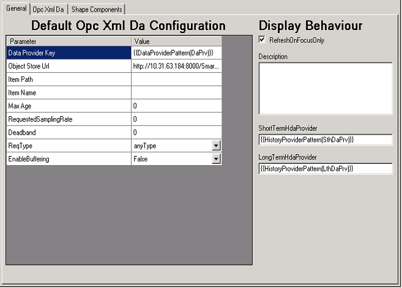

The available fields in the `Default Opc Xml Da Configuration`
section are:

-   `Data Provider Key` - explicitly defined DataProvider key. Also
    used to attach the shape to the first available DataProvider on the
    page by a pattern:

> {{DataProviderPattern(DaPrv)}}
>
> Where DaPrv must be part of the DataProvider key.

-   `Object Store Url` - service URL to the `Persistent Object Store`.
    Permissions for Anonymous users must be added In SmartWEB
    (Deprecated).

-   Properties according to the `Opc Xml Da Specification`.

In the `Display Behaviour` section, the shown configuration consists
of:

-   `RefreshOnFocusOnly` - if this checkbox is checked, the display in
    SmartWEB will be updated only when the user is on the current tab.
    This functionality uses a new browser feature called  
    `Page Visibility API`. If the browser doesn't support this
    functionality, it will be skipped.

-   `Description` - display description.

-   `ShortTermHdaProvider` - explicitly defined STH key. Also used to
    attach the display to the first available STH provider on the page
    via a pattern:

> {{HistoryDataProviderPattern(SthDaPrv)}}
>
> Where SthDaPrv must be part of the SthDataProvider key.

-   `LongTermHdaProvider` - behavior is the same as
    `ShortTermHdaProvider`.

#### OpcXmlDa Tab

Properties for the selected shape are shown in this tab. If you leave
empty fields, they will use values defined in the `General` tab.

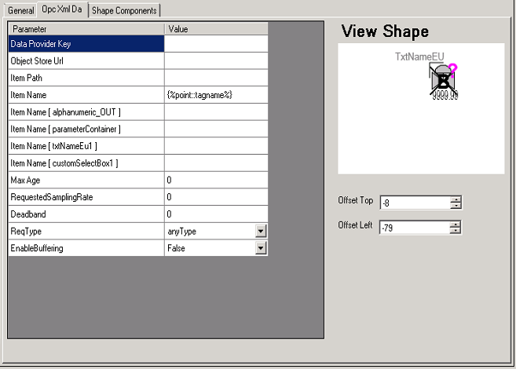

The available properties on the left side are the same as in
the `General` tab, but here they are related to the current shape
only. The shape view is shown in the `View Shape` area. The user may
specify a horizontal and a vertical offset in the fields that follow.

#### Shape Components Tab

In this tab, the user will be able to see all of the information
provided by directives and base elements ([Svg Editor](../hmi-editor-in-depth)).

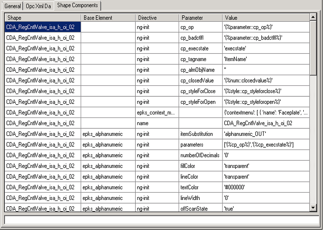

The first column contains the shape name. The `Base Element` column is
second and it contains the component name. The cells are empty for
directives which are applied directly to the shape. The third column
contains the directive name. Some directives have additional parameters
and they are shown in the fourth column. The first four columns are
read-only. The users can manipulate only the last column.

To edit a row from the last column, the user can click on it once. The
cell text will be displayed in the wide field at the bottom. The idea
behind this is to have more space for editing because some of the
directive values are long. For values, the user can provide - String,
Numeric, Boolean, JSON and so on, it depends on what the directives
expect as a value. In addition to the primitive types, patterns formed
from EPKS HMI Shapes are also allowed (example: ). In
this case, directives will receive their values in the conversion
phrase. In this column, only single quotes are allowed.

##Converting

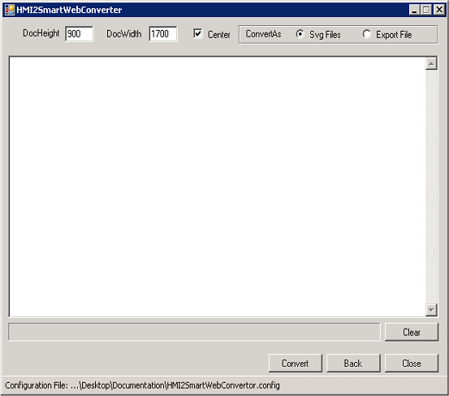

There are a few final properties to tune before converting:

-   `DocHeight` - document/display height in pixels.

-   `DocWidth` - document/display width in pixels.

-   `Center` - if this checkbox is checked all display elements will be
    centralized.

> Example: If `DocWidth` is 1700 and the display width is 1500, all
> elements on the page will be redrawn with an offset of 100 (pixels)
> from the left and the right side

-   `ConvertAs` - provide two options. The `Svg Files` option will save
    each display in a separated file(recommended). The `Export File`
    option will combine all converted displays in one export
    file(deprecated).

-   `Button Back` - navigate to the previous panel.

-   `Button Close` - close the program.

-   `Button Convert` - start converting.

When the conversion process has started, it will write information in
the highlighted log zone shown below. It will log each processed
element, how many elements are left, and converting time for each
display. If there are multiple(more than one) selected displays for
converting, the convertor will process them in parallel.

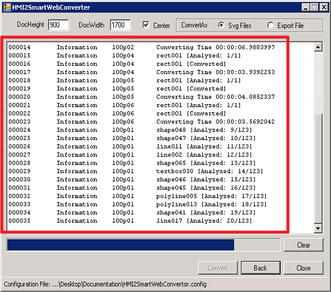

There is a progress bar which shows how many displays are left for
conversion. If the progress bar is full, the conversion process has
finished. This will be indicated by the last log:

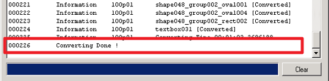

The result will be a set of `SVG` files for each display. These files
are compatible with the [Svg Editor](../hmi-editor-in-depth), and can be used after they are
imported.
