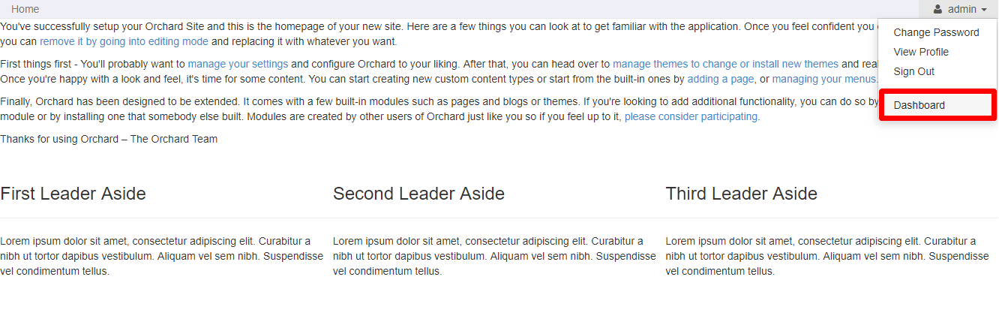
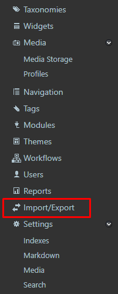
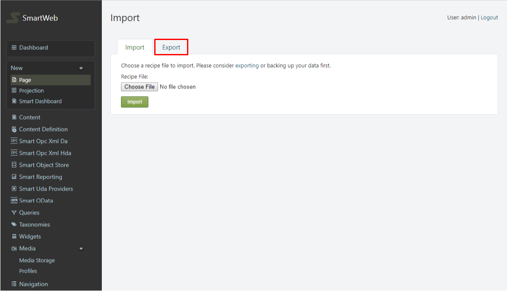
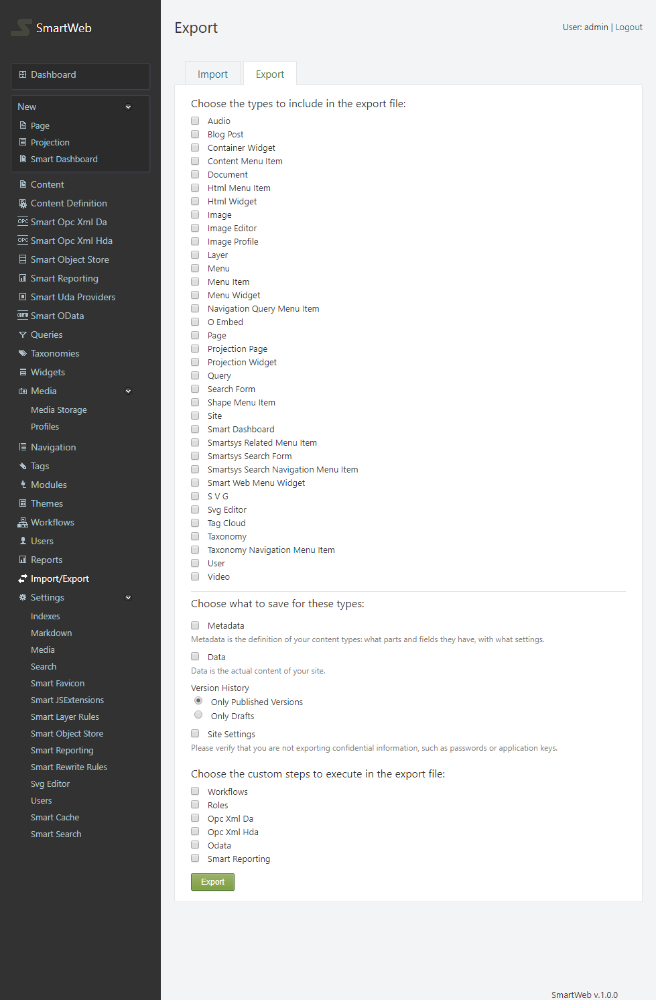
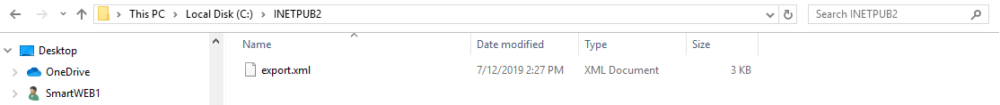
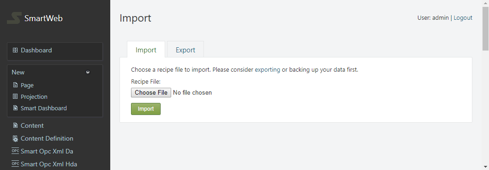
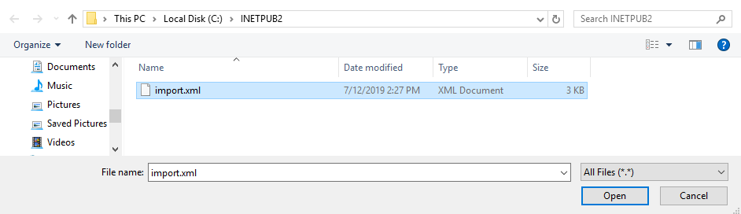
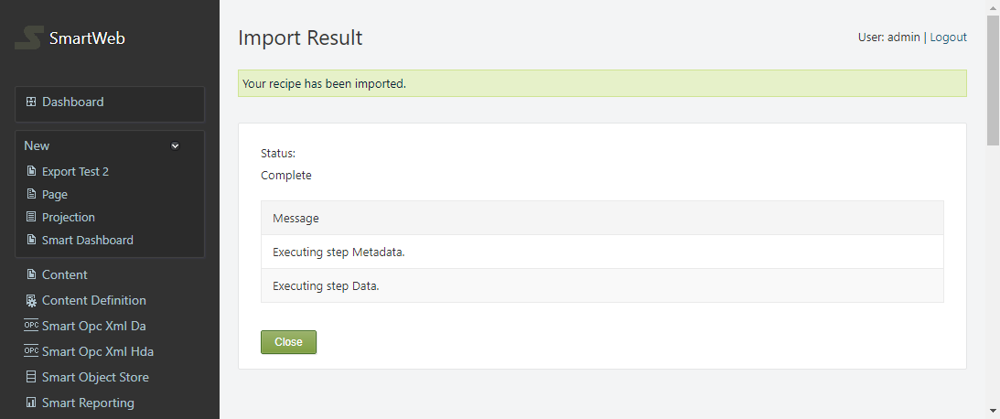

#
The following chapter will explain the process of exporting and importing data in **SmartWEB**. This allows for flexible data distribution on different instances of the system, as well as storing content. The procedure is done trough the Admin interface - `Dashboard`. The selected data is exported and stored in an `XML Document` that is used to recover the data at a later time via import. The only requirement is:

* administrator rights on **SmartWEB**.

##Exporting Content

Navigate to the admin panel - `Dashboard`.

From the menu on left, find and select `Import/Export`.

Select the `Export` tab.

On the `Export` screen you can select the `Content Types` you want to export, as well specific elements that are part of them, such as:

* `Metadata` - Metadata is the definition of your content types: what parts and fields they have, with what settings.
* `Data` - Data is the actual content of your site.

Version History:

* Only Published Versions 
* Only Drafts

!!!attention "Attention:"
     When content is being exported, you can select `Metadata` and/or just `Data`. In order for them to be imported correctly at a later date, it is good practice to export them together. In the case where they are separate,
     the `Metadata` should be imported first, and the `Data` after that. While importing, if there is inactive module data in the files, their contents may not be imported. There is an exception where the data is located in an `InfoSet` record. In this case when the specific module is enabled, the data will be available.

The site settings can also be exported via the `Site Settings` option, which verifies that you are not exporting confidential information, such as passwords or application keys. You can create a more custom export file by selecting one or more of the following options:

* `Workflows` - workflows will be exported.

* `Roles` -  roles will be exported.

* `Opc Xml Da` -  Opc Xml Da gateways and providers will be exported.

* `Opc Xml Hda` -  Opc Xml Hda gateways and providers will be exported.

* `Odata` - Odata gateways and providers will be exported.

* `Epks Event Collector` - Epks event collectors and statistics estimators will be exported. Before this element can be imported, Odata gateways and providers must be imported first, if they are available.

* `Smart Reporting` - gateways will be exported to `Smart Reporting` services. Settings and reports will not be exported.

!!!warning "Important:"
     It is good practice to export every `Content Type` individually.

After you have selected the content you want to export, click the `Export` button at the bottom of the page. The browser will download a `XML Document` to your chosen directory.

Example:

##Importing Content

To import content in **SmartWEB**, head back to `Dashboard` > `Import/Export`. Select the file you want to import via the `Choose File` button. 

Example:

After the file is selected, press the `Import` Button. If the content was imported successfully, the following screen should be visible:

Content that already exists will be updated. `Opc Xml Da`, `Opc Xml Hda`, `Odata`, `Epks Event Collector`, and `Smart Reporting` are exceptions where the content wont be updated if a match is found, i.e only new content is imported.