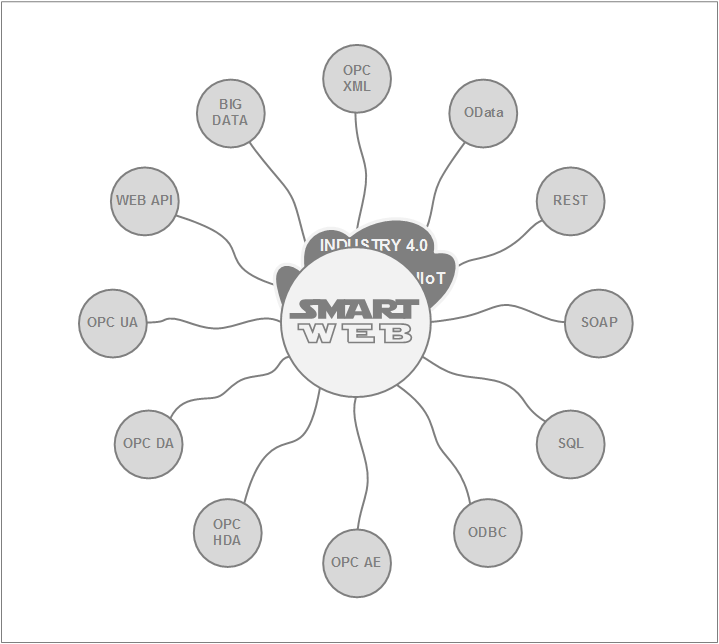

#
## About
In today's process industries, smarter decision-making enabled by greater insight into operations and enterprise collaboration is crucial. SmartWEB allows users to visualize and explore all process data, alarms, and events at anytime and anywhere in the same way as seen on operator stations. By using built-in reach computing capabilities and 
visualization libraries, the users can create and share with co-workers KPI dashboards, production reports and many more. It's a highly scalable infrastructure designed with cybersecurity in mind, which empowers enterprises in real-time and transforms operational data into actionable knowledge. By utilizing state-of-the-art technologies for
interoperability with any installed based control system, SmartWEB acts as a single data hub between the factory floor and decision-makers.

SmartWEB and all its services are designed to operate with security as  core consideration. Along with the flexible architecture, the system enables enterprises for Industry 4.0 and digital transformation.

## Acknowledgments
Our team every day uses high-quality software that is developed and maintained by people who respect freedom and who are generous with their time and energy. We sincerely thank the teams and individuals who develop the following open-source products. $$$

#### Orchard CMS
Orchard is a free, open-source, community-focused Content Management System built on the ASP.NET MVC platform. Orchard is built on a modern architecture that puts extensibility up-front, as its number one concern. All components in Orchard can be replaced or extended. Content is built from easily composable building blocks. Modules extend the system in a very decoupled fashion. A rich UI composition system completes the picture. Orchard is delivered under the .NET Foundation and licensed under a `New BSD license`, which is approved by the OSI.

#### Redis
Redis is an open-source (`BSD licensed`), in-memory data structure store, used as a database, cache and message broker. It supports data structures such as strings, hashes, lists, sets, sorted sets with range queries, bitmaps, hyper logs, and more.

#### jQuery
jQuery is a fast, small, and feature-rich JavaScript library licensed under the `MIT license`. It makes things like HTML document traversal and manipulation, event handling, animation, and Ajax much simpler with an easy-to-use API that works across a multitude of browsers.

#### AngularJS
AngularJS is a JavaScript-based open-source front-end web framework licensed under the `MIT license`. It is mainly maintained by Google and by a community of individuals and corporations to address many of the challenges encountered in developing single-page applications. It aims to simplify both the development and the testing of such applications by providing a framework for client-side model-view-controller (MVC) and model-view-view-model (MVVM) architectures, along with components commonly used in rich Internet applications.

#### SVG-Edit
SVG-edit is a fast, web-based, JavaScript-driven SVG drawing editor that works in any modern browser. SVG-edit is releasing under the `MIT license`.

#### Dygraphs
Dygraphs is a fast, flexible open-source JavaScript charting library available under the `MIT license`. It allows exploring, interpreting and visualization of data sets.

#### D3
D3 or (Data-Driven Documents) is a JavaScript library for manipulating documents based on data. D3 helps bring data to life using HTML, SVG, Canvas, and CSS. Its emphasis on web standards gives the full capabilities of modern browsers. D3 combines powerful visualization components and a data-driven approach to DOM manipulation. The library is releasing under the `BSD-3 license`.

#### Bootstrap
Bootstrap is a free and open-source CSS framework directed at responsive, mobile-first front-end web development. Created by a designer and a developer at Twitter, Bootstrap is one of the most popular front-end frameworks and open source projects in the world. Bootstrap is currently releasing under the `MIT license`.

## License
Copyright (c) 2019 Smartsys Ltd.

Permission is hereby granted, free of charge, to any person obtaining a copy of this software and associated documentation files (the "Software"), to deal in the Software without restriction, including without limitation the rights to use, copy, modify, merge, publish, distribute, sublicense, and/or sell copies of the Software, and to permit persons to whom the Software is furnished to do so, subject to the following conditions:

The above copyright notice and this permission notice shall be included in all copies or substantial portions of the Software.

THE SOFTWARE IS PROVIDED "AS IS", WITHOUT WARRANTY OF ANY KIND, EXPRESS OR IMPLIED, INCLUDING BUT NOT LIMITED TO THE WARRANTIES OF MERCHANTABILITY, FITNESS FOR A PARTICULAR PURPOSE AND NONINFRINGEMENT. IN NO EVENT SHALL THE AUTHORS OR COPYRIGHT HOLDERS BE LIABLE FOR ANY CLAIM, DAMAGES OR OTHER LIABILITY, WHETHER IN AN ACTION OF CONTRACT, TORT OR OTHERWISE, ARISING FROM, OUT OF OR IN CONNECTION WITH THE SOFTWARE OR THE USE OR OTHER DEALINGS IN THE SOFTWARE.
