#

To help you learn the material covered in this chapter, it is a good idea to read the [Architectural Considerations](../architectural-considerations) and [Multitenancy](../multitenancy) chapters first. These chapters provide the background knowledge necessary to understand the material in this chapter. The [Architectural Considerations](../architectural-considerations) chapter describes the modes and architectures in which **SmartWEB** operates.  The [Multitenancy](../multitenancy) chapter describes how to set up and manage tenants in `Мultitenancy` mode. The two modes, `Multitenancy` and `Load Balancing`, are complementary and almost always work together. They can work independently, but working together makes the system a `Cloud-Ready Enterprise System` with excellent utilisation of server computing power and providing the desired level of application redundancy.  

---

## Overview

The following diagram illustrates how the two `Multitenancy` and `Load Balancing` modes work together.
  
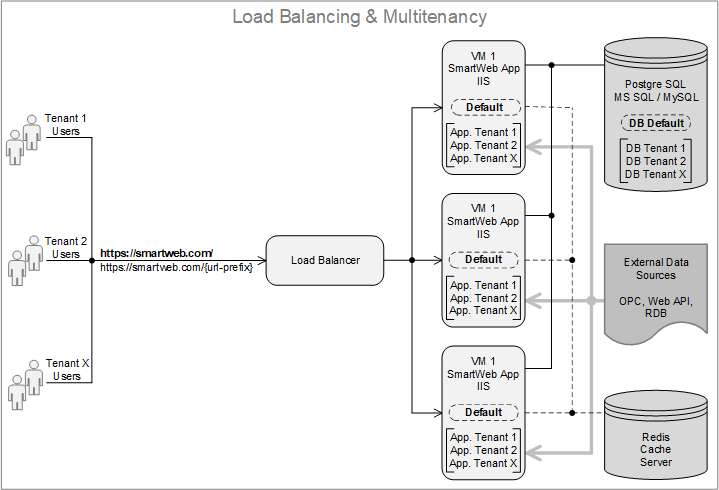

As mentioned earlier, using both modes together is the typical case, so we will discuss it in this chapter. If you want to use `Load Balancing` without `Multitenancy`, it is like having multiple **SmartWEB** applications on multiple server platforms that only work with the `Default Tenant`.  

The overall system in `Load Balancing` mode consists of the following components:  
> -  Two or more **SmartWEB** Application servers 
> -  Database server
> -  Redis Cache server
> -  Load Balancer server
> -  External Data Sources (Not the subject of this chapter)

The `Database` server, `Redis Cache` server and `Load Balancer` server must be on different machines from those used for the **SmartWEB** applications. They can be deployed on a single server or on separate servers and can also be part of a cloud services ecosystem. In other modes, `Redis Cache` is used to cache content and other commonly used components and is not a required component. In `Load Balancing` mode, `Redis Cache` is a required component. Using `Redis Cache`, the tenant instances of all **SmartWEB** application servers exchange messages with each other using the `Pub/Sub` services provided by `Redis Cache`.  

To illustrate the configuration and operation of `Load Balancing` mode, we will use three Windows servers. The first server will host the `Load Balancing` server, the `Database Management` server and the `Redis Cache` server. The other two servers will be **SmartWEB** application servers as a redundant pair of servers hosting the tenants.  

---

## Database Preparation

 We need to create a separate database for each tenant and we also need to create one database for the `Default Tenant`.  Databases and database users are configured in the same way as described in the [Multitenancy](../multitenancy/#database-preparation) chapter. You can use the information in this chapter to create your databases and users.  

 Also, using a text editor, open the `pg_hba.conf` file in the `data` directory of the `PostgreSQL` server. Add a configuration line for each application server you want to connect to the database, replacing `A.B.C.D` with the `IP address` of the server.  

```
host	all				all				A.B.C.D/32			scram-sha-256
```

---

## Redis Cache Preparation

We will not describe how to install the `Redis Cache` server here. This information can be found on the official `Redis Cache` website. We assume that the `Redis Cache` server is installed. Now we need to check the server configuration file to see if it is allowed to connect to the server from other machines, and we also need to check which `TCP` port the server is listening on for client connections. Go to the installation directory of the `Redis Cache` server and open the file `redis.windows-service.conf`. Look for the following parameters:  

```
bind 0.0.0.0
port 6379
```

> -  The `bind` parameter allows `Redis Cache` clients to connect to the server from external IP addresses. Specific addresses can be listed here, or filters can be applied. A value of `0.0.0.0` means all IP addresses.  
> -  The `port` parameter specifies the port on which the `Redis Cache` server listens for client connections. The default port is `TCP/6379`.  


!!!attention "Firewall Configuration"
    If you have a firewall running on the server, make sure that there are firewall rules that allow external clients to access the `Database` and `Redis Cache` servers.  

!!!note "Using the Cloud Ecosystem"  
    If you are running in a cloud environment and using `Database` and `Redis Cache` as services from the cloud ecosystem, you won't be able to check the server configuration because the hosting administrators take care of that. Instead, you must follow the cloud provider's instructions for connecting to the servers.  

---

## Application Servers Preparation

Once we have prepared the necessary databases and installed and configured the `Redis Cache` server, we can proceed to configure the **SmartWEB** application servers. In this chapter we will not describe how to install a **SmartWEB** server. This is done in the [Getting Started](../getting-started) chapter. Here we assume that you have installed **SmartWEB** on both machines, i.e. that you have installed and configured `IIS` on them, and that you can browse and login to `http://localhost` locally from both servers.   

---

#### IIS Setup

When preparing application servers to participate in the load balancing scheme, you will need to make some additional settings on the `IIS server`. Start the `IIS Server Manager` and open the `Advanced Settings` of the **SmartWEB** application pool. Configure `Start Mode = AlwaysRunning` and `Idle Timeout (minutes) = 0` parameters as shown in the following figure.  

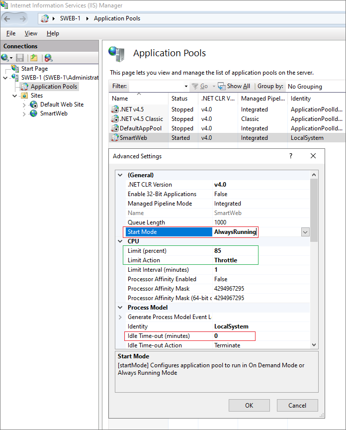


There are two other parameters in the CPU section which are useful when working in a heavily loaded environment. These are `Limit (Percent)` and `Limit Action`. You can set them as shown in the figure.  
Now open the `Advanced Settings` of the **SmartWEB** site and configure the `Preload Enabled = True` parameter as shown in the following picture.  

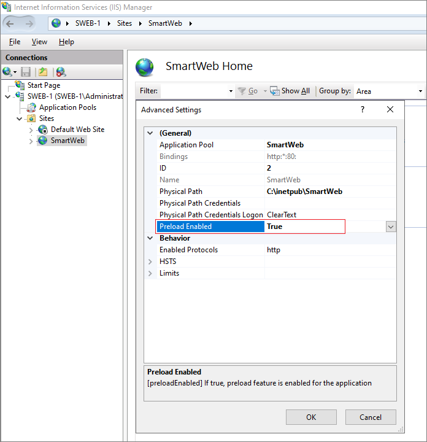

In order for this parameter to take effect, you must install an additional operating system feature. To do this, open the `Add Roles and Features Wizard` and install the `Application Initialisation` feature as shown in the following figure.  

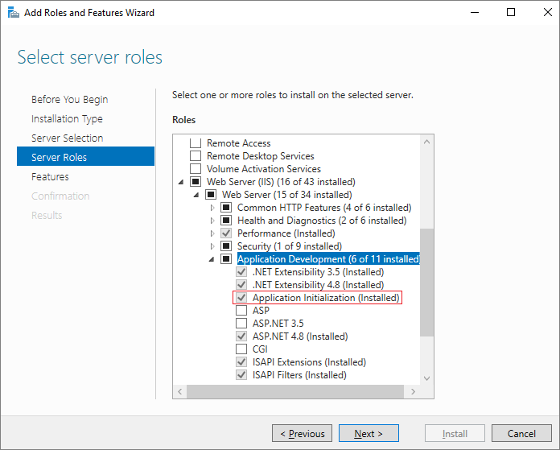

Do these `IIS` configurations on all application servers. A description of the configuration parameters can be found in the official Microsoft documentation.  

In order to have one-time authentication of users on all application servers, the machine keys of the **SmartWEB** sites on all application servers must be the same. To configure them, open the `Machine Key` configuration panel of the **SmartWEB** site on the first application server and deselect both the `Automatically generate at runtime` options. Generate new keys using the `Generate Keys` action link on the right hand side of the panel.  

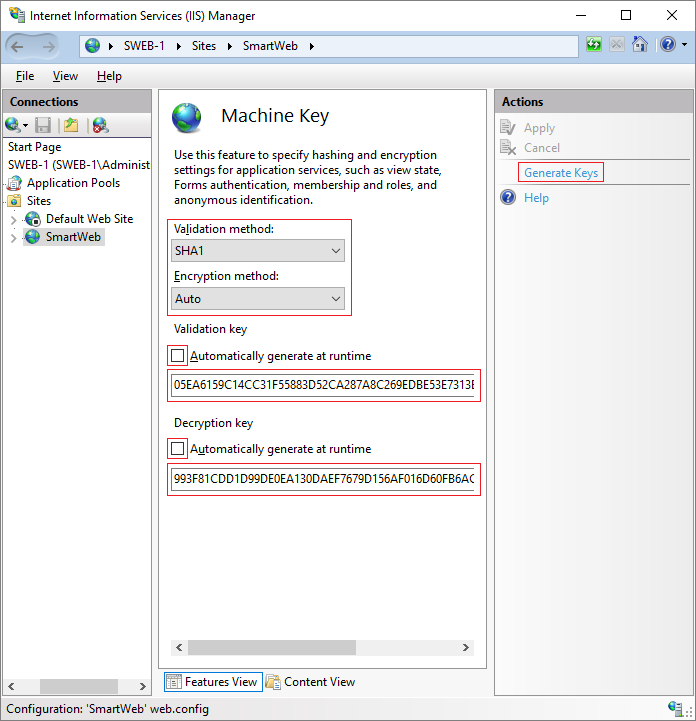

Copy these keys and place them on all the application servers. The other two options, `Validation method` and `Encryption method` should also be the same on all servers.  If the `Machine Key` configuration is the same on all application servers, then users are authenticated without having to provide credentials when their requests are routed by the `Load Balancer` between different application servers.  

---

#### Default Tenant Instalation

The initial installation of **SmartWEB** on the application servers may have been done using a local database or another database. It is also possible that the installation was done with an inappropriate recipe. In order to make sure that the sites are running with the correct database and that the correct recipe has been used during the installation, we are going to perform an initial initialisation. To do this we need to stop the **SmartWEB** application pool on both servers and delete the contents of the `inetpub>SmartWeb>App_Data>Sites>` folder on both application servers.  

Before proceeding with the initialisation of **SmartWEB**, we also need to configure `Redis Cache` client to connect to the `Redis Cache` server we prepared in the previous section. To do this, go to the `inetpub>SmartWeb>Modules>Smartsys.Redis>` folder and open the `redis.config` file with a text editor. Configure all lines as follows, replacing `A.B.C.D` with the actual `Redis Cache` server address. Do this for all application servers.  

```
<configuration>
	<connectionStrings>
		<add name="Smartsys.Redis.OutputCache" connectionString="A.B.C.D:6379, 
                syncTimeout=10000, abortConnect=false, cid=0" providerName="0" />
		<add name="Smartsys.Redis.Cache" connectionString="A.B.C.D:6379, 
                syncTimeout=10000, abortConnect=false, cid=1" providerName="1" />
		<add name="Smartsys.Redis.DataCache" connectionString="A.B.C.D:6379, 
                syncTimeout=10000, abortConnect=false, cid=2" providerName="2" />
		<add name="Smartsys.Redis.ObjectCache" connectionString="A.B.C.D:6379, 
                syncTimeout=10000, abortConnect=false, cid=3" providerName="3" />
		<add name="Smartsys.Redis.NHibernateCache" connectionString="A.B.C.D:6379, 
                syncTimeout=10000, allowAdmin=true, useQueryCache=false, 
                abortConnect=false, cid=4" providerName="4" />
		<add name="Smartsys.Redis.UserCache" connectionString="A.B.C.D:6379, 
                syncTimeout=10000, abortConnect=false, cid=5" providerName="5" />
		<add name="Smartsys.Redis.MessageBus" connectionString="A.B.C.D:6379, 
                syncTimeout=10000, abortConnect=false, cid=6" providerName="6" />
	</connectionStrings>
</configuration>
```

You are now ready to run the **SmartWEB** application pool on the first server. If you navigate to `http://localhost` on the first server, an initialisation page will open.  The initialisation process is described in the [Multitenancy](../multitenancy/#creating-a-default-tenant) chapter. Follow the steps in that chapter and fill in the required information. The first tenant to be created is the `Default Tenant` and in the `Connection string` field you must specify the database intended for the `Default Tenant`. In the `Recipe` field you must select `SmartWeb Web Farm Core`. Click on the `Finish Setup` button  to start cooking the recipe. The recipe used will enable the modules required for the application server to operate with  `Load Balanser` at front. Once you have successfully cooked the recipe, you can log in to the `Admin Panel` and you will see the `Default Tenant` in the list of tenants.  

!!!error "Installation Errors Handling" 
    If **errors** occur and you are unable to cook the recipe, you should go to the `inetpub>SmartWeb>App_Data>Logs` folder and investigate the reasons for the failure using the error records in the log files.  
    
You already have the `Default Tenant` installed on the first application server that is connected to the database and to the `Redis Cache` server. You need to do the same initialization of `Default Tenants` on the other application servers. Since the `Default Tenants` on the other application servers must connect to the same database and the same `Redis Cache` server, you can make your job easier by grabbing the `redis.config` configuration file from the directory `inetpub>SmartWeb>Modules>Smartsys.Redis>` and copy it to the other application servers. This way you will be sure that all servers are using the same configuration on their `Redis Cache` client. You can do the same with the site configuration. Get the `Default` folder from the `inetpub>SmartWEB>App_Data>Sites>` directory and copy it over all the other application servers while the `IIS` application pool is stopped.  

To test your environment run application pools and **SmartWEB** sites on all application servers. To ensure that all **SmartWEB** sites are working correctly, browse to `http://localhost` from each application server individually. If you can successfully login to all sites, this means that you have multiple `Default Tenants` running. All of them are using the same database and exchanging messages with each other using the `Pub/Sub` feature provided by the `Redis Cache` server.  

---

#### Application Tenants Instalation

Once you have managed to run `Default Tenant` on all application servers, you can start creating the application tenants. To do this, browse to `http://localhost/Admin/MultiTenancy` on any of the the application servers and create a new tenant using the `Add a Tenant` button. Follow the steps described in the [Multitenancy](../multitenancy/#creating-application-tenants) chapter to create a new application tenant.  

!!!note "Tenant Management Module" 
    When we installed the `Default Tenant` above, we used the `SmartWeb Web Farm Core` recipe. This recipe enables the  `Multi Тenancy` module and you don't need to do this manually.  

Fill in the required information. For `Database`, select one of the databases you prepared for the аpplication tenant. Click the `Save` button to create the tenant. Once you have successfully created the tenant, you will need to initialise it. Again, follow the steps described in the [Multitenancy](../multitenancy/#creating-application-tenants) chapter. Fill in the required information. In the Recipe field, you must select `SmartWeb Web Farm Tenant`. This recipe will enable the necessary modules to run the tenant behind a `Load Balancer` where there are multiple active instances of the tenant deployed on different application servers.  

Once you have successfully cooked the recipe, you now have your first application tenant. However, this tenant is only running on the application server where you ran the recipe. Its instances on the other application servers are still in the `Uninitialised` state. This is done so that you can finish building content or other necessary settings before all instances of the application tenant are started. You can access the tenant from the application server on which you created it by browsing to `http://localhost/tenant1`, where `tenant1` is the tenant prefix you configured when you created the tenant.  If you have content ready, you can load it or start creating it.  
For demonstration purposes, let's load the demo content using the embedded recipes. Browse to the `Modules` link in the `Admin Panel` and open the `Recipes` tab.  Run the two recipes one after the other:  
> -  Smart Web Preconfigured Content  
> -  Smart Web Demo Content  

You can find out more about the recipes in the [Modules](../modules) chapter. Once you have successfully cooked both recipes, browse to the tenant's home page `http://localhost/tenant1`. Your browser will load a page similar to the one shown below.  


Suppose you have built required content of your new tenant. You are now ready to initialise the tenant instances on the other application servers. To do this, go to `http://localhost/Admin/MultiTenancy`. Trigger `Suspend/Resume` sequentially for the specified tennant. This will start the tenant instances on all application servers. From this point on, the tenant instances on all application servers are synchronised and are always in the same state.  This action is performed once after the initial initialisation of the application tenant. After this initial startup, the instances start synchronising automatically via the `Pub/Sub` feature. If you now browse the tenant home pages on the other application servers, the browser will display the same page.  

!!!attention "Lucene Indexing Considerations" 
    If you are building content for a tenant while its peers on other application servers are not yet initialised, you will need to rebuild the indexes after all instances have been initialised. This is necessary because **SmartWEB** uses the `Apache Lucene Engine` to index the content and the indexes are stored locally in the tenant's folder and each tenant creates its own indexes.  Instances do not receive indexing and synchronisation messages prior to initialisation.  A one-off rebuild of the indexes is required from the instance in which we created the content. Now that the other instances are initialised, they will receive an indexing messages and build their indexes. To rebuild the indexes, browse to `http://localhost/tenant1/Admin/Indexing` from the application server where you created the tenant and click on the `Rebuild` action for all available indexes. This will cause the indexes to be created on all tenant instances.   
 

!!!attention "Media Content Considerations" 
    If your tenant uses `Media Content`, you should ensure that the tenant instances' `Media Folders` are synchronised across the application servers. You can automate this process by using a third-party application to synchronise files and folders.  The tenant `Media Folder` is located at `inetpub>SmartWEB>Media>TenantName` where `TenantName` is the name of the tenant you configured during installation. If the tenant doesn't use any `Media Content`, you don't need to do anything.   

It is a good practice to configure `IIS` on each application server to add a `Custom HTTP Response Header` to the `HTTP` responses. This way, if you are working behind a `Load Balancer`, you will be able to identify which application server responded to а request. To do this, open the `HTTP Response Headers` configuration panel in `IIS Manager`. Using the `Add` link on the right hand side, add `X-Served-By = NODE1` as shown in the image below.  

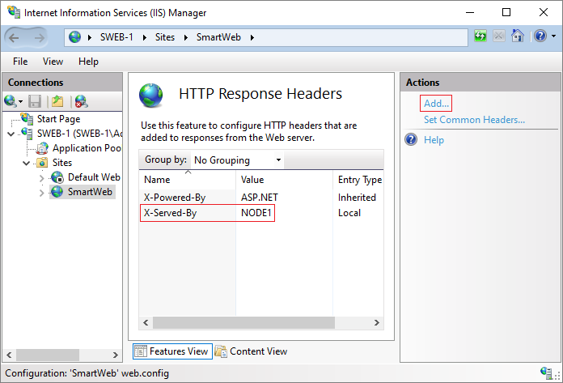

Do this for all application servers by replacing the node number with the appropriate one for the given application server. This way each **SmartWEB** application will respond with a unique response header. If you now make a request to the `WEB Server` and open the browser inspection, in the `Response Headers` section you will see the header we added, as shown in the following image.   

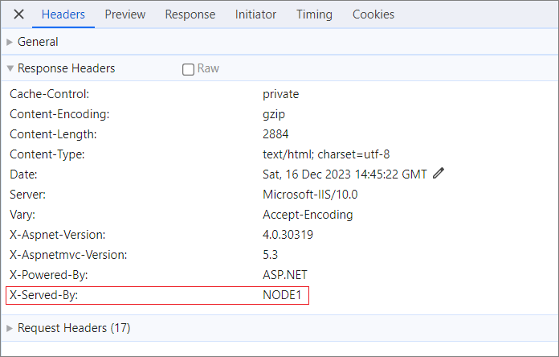

Once we configure `Load Balancer` and browse through it, we can do such inspection and this way we will see which application server is responding to our requests.  

---

## Load Balancer Configuration

As mentioned in the [Overview](#overview) section, we will use an `MS IIS` server as a `Load Balancer`, installed on the same machine as the `PostgreSQL` and `Redis Cache` servers. 

!!!tip "Selecting Load Balancer" 
    You can use a different `Load Balancer` that allows you to configure the `Client Affinity` and `Preserve Host Header` options.   

In order for `IIS` to work as a `Load Balancer`, two additional `IIS` modules need to be installed. These are the `URL Rewrite` module and the `Application Request Routing` module. Both modules can be downloaded from Microsoft. Once the two modules have been installed, an additional node called `Server Farms` will appear in the `IIS Manager` tree.  

Create a new `Server Farm` using right mouse click. The wizard will ask you for the `IP Аddresses` of your application servers and then ask you to create a rule to route traffic to the servers. Answer `Yes`to this question.  

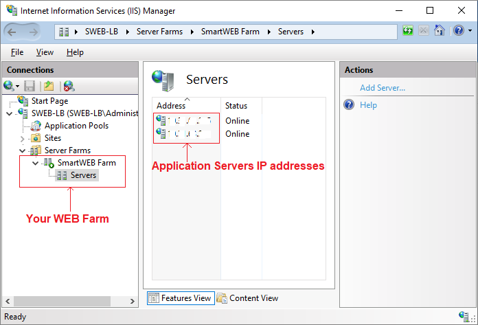

The next thing to configure is the `Server Affinity`. To do this, select the new farm and double-click on the `Server Affinity` icon. You will see the screen shown in the next image. Enable the `Client affinity` option.  

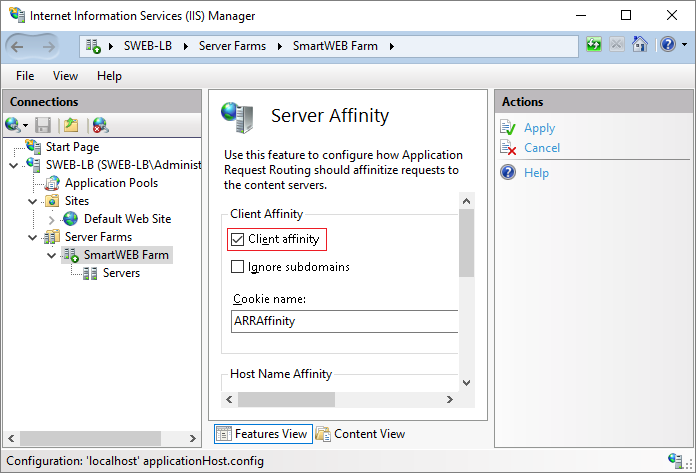

We also need to configure the `Load Balancer` algorithm. Double-click the `Load Balance` icon. Make sure the settings are as shown in the next screen.  

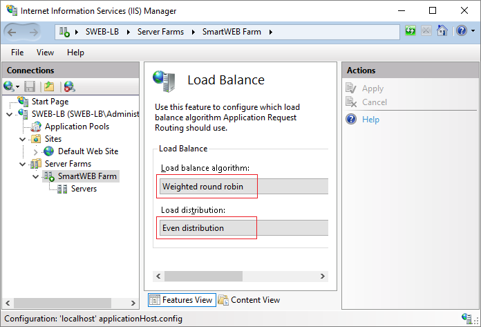


!!!attention "Default Web Site Considerations" 
    When the MS IIS server is installed, a `Default Web Site` is configured. This site should not be removed because the `Application Request Router` uses this default site to route requests to the farm.  

You have made the basic settings, and now you can test `Load Balancer` behaviour. To do this, browse to `http://localhost` from the server where `Load Balancer` is installed. You will see the `Default Tenant` home page.  If you browse to `http://localhost/tenant1` you will see the home page of `Tenant 1`.  

Once you have successfully opened the page through the load balancer, open a browser inspection and look for `X-Served-By` in the response headers as you did above. Identify which application server is serving your requests. Reload the page several times or browse to different pages. Make sure that all your requests are being served by the same application server. Now change the status of the application server serving your requests from `Online` to `Offline`. To do this, select `Servers` in the `Load Balancer` tree and then select the required application server. Click the `Take Server Offline` action link on the right hand side.  

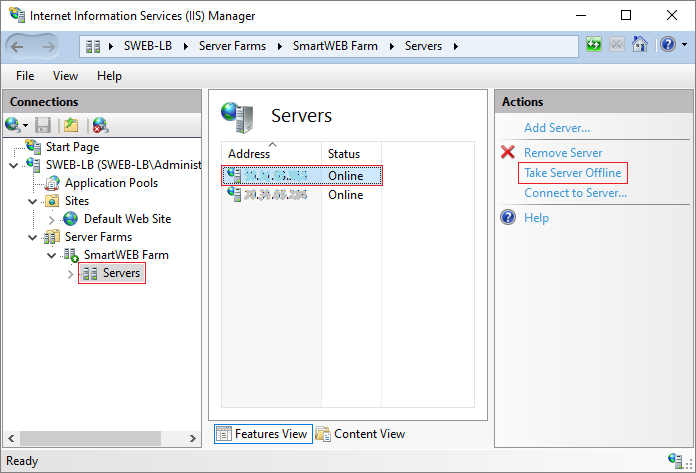

The application server that served your requests is now `Offline`. Reload the browser page. Your page should open smoothly and the browser should not ask for authentication. If you now check `X-Served-By` in the response headers, you will see that your requests are being served by a different application server. From here on you can start accessing the `Default Tenant` and your application tenants through the `Load Balancer`. You can test the `round-robin` algorithm yourself by configuring different users in your tenants and logging in from different computers or different browsers. You will see that `Load Balancer` will assign different application servers to serve different users using the `round-robin` algorithm.  

---

#### Summary

In this chapter we have discussed in detail the configuration of **SmartWEB** in `Load Balancing` mode. If you have followed all the steps described here, you have now an environment that runs in both `Multitenancy` and `Load Balancing` modes. To configure an environment to run in `Multitenancy` mode only, refer to the [Multitenancy](../multitenancy) chapter. The [Architectural Considerations](../architectural-considerations) chapter briefly describes all modes of operation, along with their pros and cons.  