#

This chapter describes the admin interface related to content management. The **SmartWEB** admin interface, also known as the `Back-End` or `Admin Panel`, is essentially the control panel for the entire website. The `Admin Panel` is the interface where administrators and other site officials with appropriate privileges can create and manage content, change functionality and styling and etc. The [Admin Interface Overview](../admin-interface-overview) chapter provides a brief overview of all the administration options, with links to chapters with in-depth descriptions.  

## Content Management

Navigate to the `Dashboard` via the user options in the top-right of the page.  

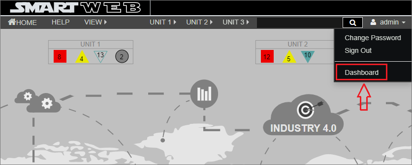

All of the `Content Types` that the current user can use to create content are on the left side of the page, located under the `NEW` dropdown list. The administrator of course sees all `Content Types`. In the picture below, there are only four `Content Types` that the current user can use to create `Content Items`. The [Content Anatomy](../content-anatomy) chapter describes what the `Content Types` is and what the `Content Item` is. The [Users and Roles](../users-and-roles) chapter describes how to create user roles with limited access to the site's administrative options and also limited access to the content.  

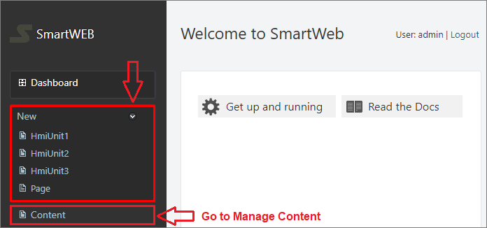

Below the available content types, there is a `Content` link as shown in the previous picture. This link leads to the `Manage Content` section shown in the next screenshot. Here content can be viewed, searched, created and edited. All available content items (Pages) can be found here.  

Let's now describe the information fields that `Manage Content` view provides for each content item. For simplicity, the fields are numbered on the next picture, and here follow their descriptions.  

`(1)` - Content item Title.  
`(2)` - The content type from which the content item is derived. For a more detailed description of these interrelationships, please refer to the [Content Anatomy](../content-anatomy) chapter.  
`(3)` - Unique ID of the content item.  
`(4)` - Version of the content item. This is actually а `link` that leads to a page where all versions of the given content item are listed and also some actions can be performed on them. This is covered in more detail later in this section.  
`(5)` - The timestamp of the last modification of the content item.  
`(6)` - The owner of the given content item. This is the user who created the content item.  

On the right of each content item is a `list of actions` allowed to the current user for that content item. In the picture above these actions are highlighted with a solid red line. The allowed actions a user can perform on a content item depend on the permissions granted by the roles assigned to the user. This is described in detail in the chapter [Users and Roles](../Users-and-Roles). Users who have been assigned the `admin` role have full permissions on all content and can therefore perform all available actions. The possible actions you can see to the right of the content items are:  

- `View` –  View a published version of the content item. The published version of the content is what users see.  
- `Preview` – Preview an draft version of the content item. The draft version of the content item is a version that is usually in preparation or being edited, but is still being worked on and is not ready for publication. This version is not available to users.  
- `Publish` – Publication of the draft version of the content item, so that it becomes the published version.  
- `Publish Draft` –  If this link is present it means that the content has a draft and a published version. It publishes the draft, turning it into the published version.  
- `Unpublish` – It turns the published version into a draft version.    
- `Clone` – Creates a copy of the content item. The current user becomes the owner of the new content item.  
- `Edit` – Opens a page where the content item can be edited.  
- `Delete` – Delete the content item.  

!!!tip "Note"
    If the `View` link is displayed along with the `Preview` link, you will also see the `Publish Draft` link. This means that the content item has a published version and a draft version that is newer than the published version. The draft in this case is the `latest version`. If you click on `Publish Draft` link, then the draft will be published and will become available to the users. Further explanations can be found further down in this section.  

There are two ways to create new content item. By using the `Create New Content` option in the top right corner of the `Manage Content` view and by cloning an existing content item using the `Clone` action. You can also import content items, but this topic is covered in the [Import and Export](../import-and-export) chapter. The following image illustrates the content management flow.  

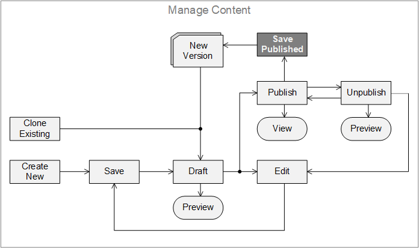

!!! attention "Attention:"  
     When a content item is published, the `Edit` option is not available to **users**. If a user needs to edit a published content item, it must first be converted to a draft using  `Unpublish` action. The user will then be able to edit the content item. **Administrators** are able to `Edit`, `Save` and `Publish` content without having to `Unpublish` it first. This is represented in the image above by the `Save Published` element. Each `Save Published` action creates a new version of the content item.  

`Content Items` to which the user has no access will not have any actions displayed. If a short description can be seen, but there are no available actions, this means that the author of the `Content Item` does not have a published version, just a draft. When the draft is published, the user will be able to view the page and clone it. When a page is cloned, the user will receive a copy, which he is the author of. The user can then edit this copy and publish it under his own name.

 
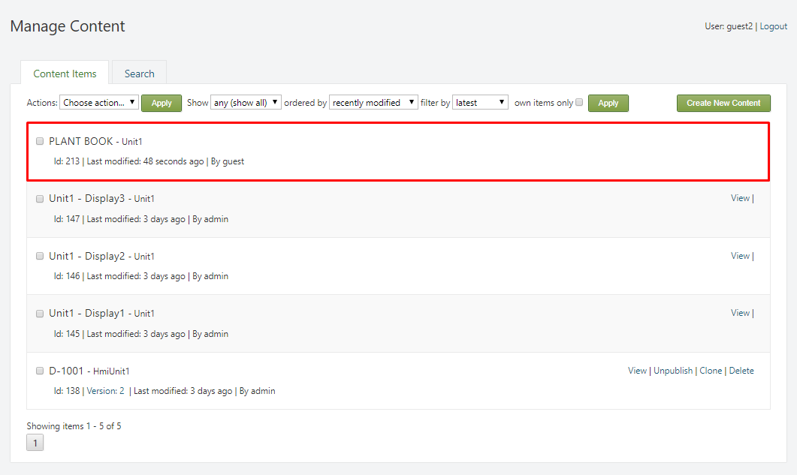

In the case where only the `View` action is available, the content author has a published version of the page, but has started editing a new draft, which is not published yet. In this case, the user can only view the last published version. When the author publishes the draft, the user will be able to clone the latest version.

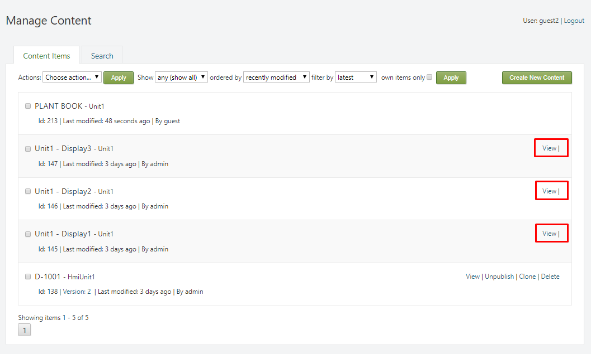

At the top of the `Manage Content` section, there is toolbar that is used to filter search results. The search results will strictly depend on the user's role. If the role is not authorized to create pages from a specific `Content Type`, results from that `Content Type` will not be returned.

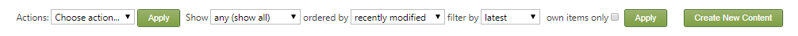

The options that are provided by the toolbar consist of:

* `Show` – filter the pages by `Content Type`. 

* `ordered by` –  select the order in which the search results are returned:

     * `recently created` –  show the most-recently created pages first.

     * `recently modified` – show the most-recently edited pages first.

     * `recently published` – show the most-recently published pages first.

* `filter by` – filter the results by: 

     * `latest` – returns the latest version for each of the pages.

     * `published` –  return only the published versions of the pages.

* `own items only` – (if checked) return only the pages created by the user.
 

## Searching

The system has built-in functionality that provides the ability to index and search `Content Items` (pages) in the application. In the admin panel, navigate to `Content` and select the Search `Tab`.

!!! note "Note:"
      The indexing functionality is provided by enabling the Indexing feature, along with a specific implementation of indexing (Lucene-based is included by default). In addition to the Indexing, the Search feature provides the ability to query the index (by keyword or using Lucene query syntax) to return a list of content items. Visit the [Site Settings](../Site-Settings) chapter for more information on indexing.

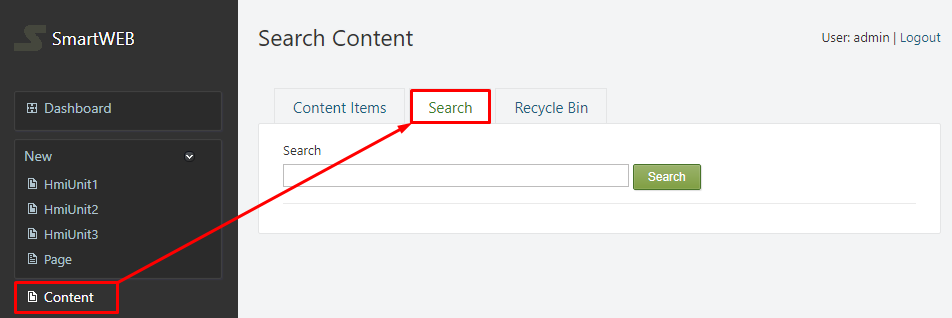

There is a selection of ways to search for a `Content Item` (page). The specific fields which represent the search criteria are configured within an index ([Site Settings](../Site-Settings)). For demonstration purposes, some of the ways to search for content will be shown:

!!!note "Note:"
          Due to the nature of indexing, it's good practice to use lowercase when searching for an item.

To look for a  `Content Item` page by its title, simply enter the title in the search box and press the `Search` button. This will return all items that have a title that corresponds to the search criteria. 

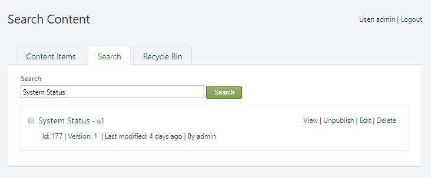

Additionally, specific words or phrases, found within a `Content Item` (page), can also be used to locate the specific item. In the example, all of the returned pages contain the word "**report**".

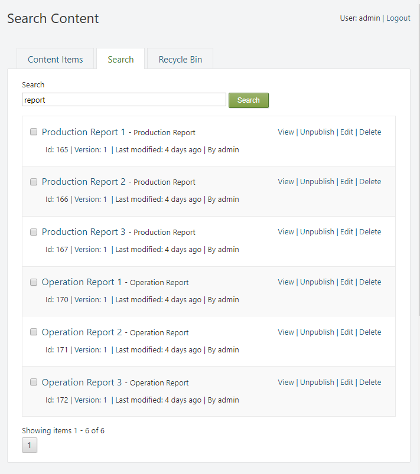

Searching for `Content Items` (pages) can also be done by using the technical name of their `Content Type`. This will return every available item from that **specific** `Content Type`. Example: **unit3**.

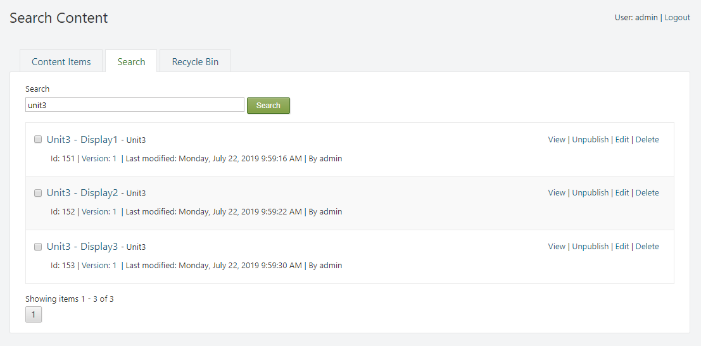

Using the authors name as the search criteria is also an option. This will return all available `Content Items` (pages) that are owned by the author, whos name was used in the search. Example: **admin**.

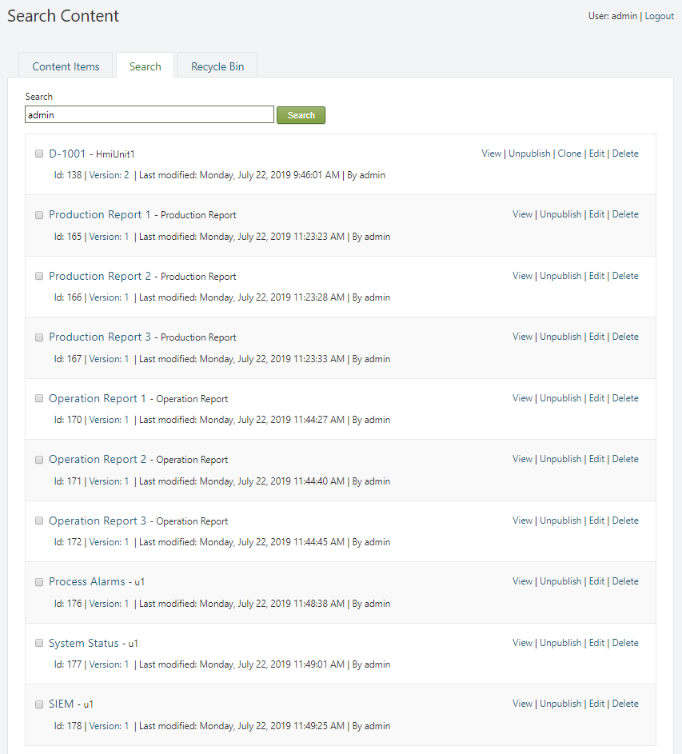

 The [lucene query syntax](https://lucene.apache.org/core/2_9_4/queryparsersyntax.html) can be used to specify the index field that is being used as a search criteria. This will ensure that a specific criteria will be used in the search. In the example, we will search for pages that belong to the `Content Type` with the technical name - unit2. Example: **ltype:unit2**.

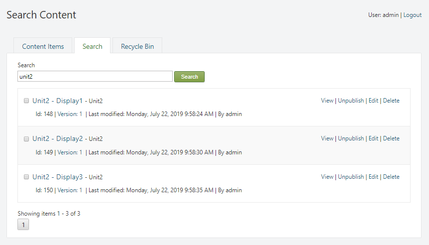

!!! attention "Important:"  
      In order for the [lucene query syntax](https://lucene.apache.org/core/2_9_4/queryparsersyntax.html) to be used in the search, the `Do Not Escape Query` option must be checked ([Site Settings](../Site-Settings)).

##Recycle Bin
The `Recycle Bin` tab is an administrator feature that displays the items that are marked for deletion. When a `Content Item` (page) is deleted via the `Delete` action, it is not immediately destroyed, rather, it is moved to the `Recycle Bin` tab, where it can be viewed and restored later. In the admin panel, navigate to `Content`. Then select the `Recycle Bin` tab.

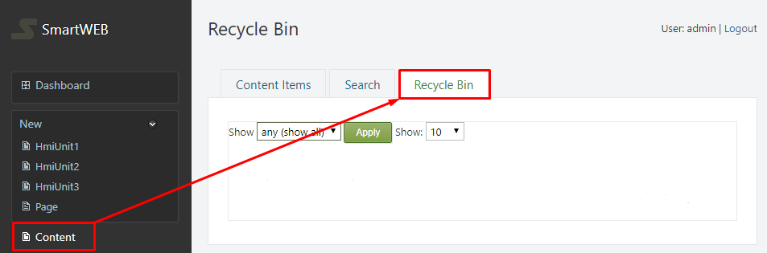

At the top of the tab, there is toolbar that is used to filter search results by `Content Type`. Additionally, the number of items returned can also be selected.
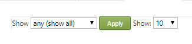

The pages are presented with a brief description, consisting of:

* `Id` - represents the position of the page in the database.

* `route` - the route of the page (used in `urls`).

* `owner` - the owner of the page.

* `date deleted` - the date and time when the page was deleted.

Only two actions are available for the deleted pages:

* `Undelete` -  undelete the page.

* `View` - view the deleted page.

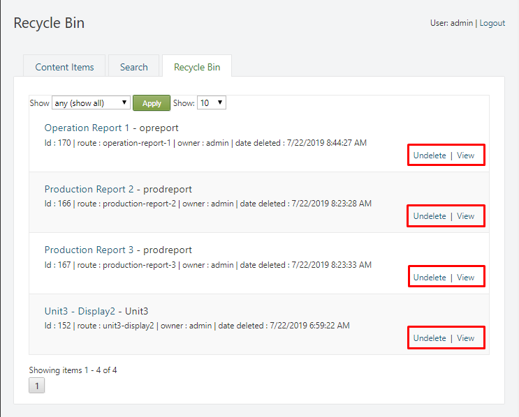

!!!warning "Important"
         When a `Content Item` is undeleted, the system will automatically generate a new `Id` for that item. This will cause changes in indexing, and in the database.