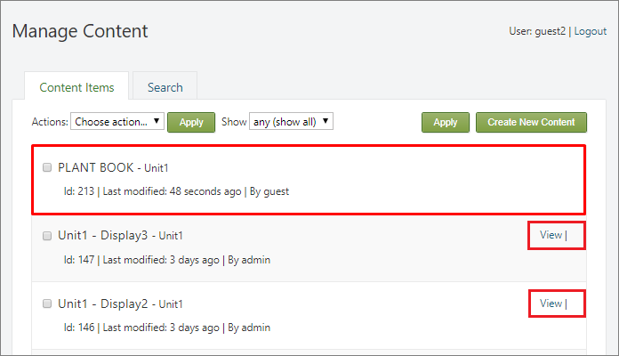

#

This chapter covers the admin interface related to content management in **SmartWEB**. Known as the `Back-End` or `Admin Panel`, this interface serves as the control panel for the entire website. It allows administrators and other privileged site officials to create and manage content, adjust functionality among other tasks. The [Admin Interface Overview](../admin-interface-overview) chapter offers a summary of all administrative options, providing links to more detailed descriptions in subsequent chapters.  

---

## Content Management
Navigate to the `Dashboard` via the user options in the top-right of the page.  

On the left-hand side of the page, below the New dropdown list, all the `Content Types` available for content creation by the current user are listed. Administrators have visibility of all `Content Types`. In the image below, only four `Content Types` are accessible for creating `Content Items` by the current user. The [Content Anatomy](../content-anatomy) chapter explains the nature of `Content Types` and `Content Items`. The [Users and Roles](../users-and-roles) chapter details the process of creating user roles with restricted access to administrative features and limited content access.    

Below the available content types, there is a `Content` link, as shown in the previous image. Clicking this link navigates to the `Manage Content` page, as shown in the next screenshot. 

This page allows the users to view, search, create, and edit content. All available content items (pages) can be accessed here. Now, let's detail the information fields provided for each content item in the `Manage Content` view. For clarity, the fields are numbered on the image and their description is below:    

`(1)` - Title of the content item.  
`(2)` - Content type from which the content item is derived. More detailed descriptions of these relationships can be found in the [Content Anatomy](../content-anatomy) chapter.  
`(3)` - Unique `ID` of the content item.  
`(4)` - Version of the content item. This is a `link` that directs to a page listing all versions of the content item, where various actions can be performed on them. Further details are discussed later in this section.  
`(5)` - Timestamp indicating the last modification of the content item.  
`(6)` - User who last modified the content item.  
`(7)` - Owner of the content item, which is the user who initially created it.  

On the right of each content item is a `list of actions` allowed to the current user for that content item. In the image above these actions are highlighted with a solid red line. The allowed actions a user can perform on a content item depend on the permissions granted by the roles assigned to the user. This is described in detail in the chapter [Users and Roles](../Users-and-Roles). Users who have been assigned the `admin` role have full permissions on all content and can therefore perform all available actions. The available actions are displayed to the right of the content items:  

- `View` – View a published version of the content item. The published version of the content is what users see.  
- `Preview` – Preview a draft version of the content item. The draft version of the content item is a version that is usually in preparation or editing, but is still being worked on and is not ready for publication. It is not available to users.  
- `Publish` – Publish the draft version of the content item so that it becomes the published version.  
- `Publish Draft` – If this link is present it means that the content item has a draft and a published version. It publishes the draft, turning it into the published version.  
- `Unpublish` – Turns the published version into a draft version.    
- `Clone` – Creates a copy of the content item. The current user becomes the owner of the new content item.  
- `Edit` – Opens a page where the content item can be edited.  
- `Delete` – Deletes the content item.  

!!!tip "Relations between actions"
    If the `View` link is visible along with the `Preview` link, you will also see the `Publish Draft` link. This indicates that the content item has both a published version and a draft version, with the draft being more recent. In this scenario, the draft is the `latest version`. When you click the `Publish Draft` link, the draft is published and becomes available to users. Further details are provided below in this section.  

There are two ways to create new content item. Using the `Create New Content` option in the top right-hand corner of the `Manage Content` view or by cloning an existing content item using the `Clone` action. You can also import content items, but this topic is covered in the [Import and Export](../import-and-export) chapter. The following flowchart illustrates the content management process.  

!!!tip "Edit Published Content"  
     When a content item is published, the `Edit` option is not available to **users**. To edit a published content item, users must first convert it to a draft using the `Unpublish` action. Once the item is in draft form, users can make edits. **Administrators**, on the other hand, can `Edit`, `Save`, and `Publish` content without needing to `Unpublish` it first. This capability is represented in the image above by the `Save Published` element. Each `Save Published` action creates a new version of the content item.  

No actions will be displayed for `Content Items` that the user does not have access to. If a short description is visible, but no actions are available, it means the `Content Item` author has only a draft version, not a published one. This is illustrated in the next image. Once the draft is published, the user will be able to view and clone the page. When the page is cloned, the user gets a copy of the page, becoming its author. The user can then edit this copy and publish it under their own name.
 

If only the `View` action is available, it means the content author has a published version of the page but is working on a new draft that is not yet published. In this situation, the user can only view the most recently published version. Once the author publishes the draft, the user will be able to clone the latest version.  

At the top of the `Manage Content` section, there is toolbar that is used to filter search results as depicted in the image below.    

The toolbar provides the following options:

* `Show` – Filters the pages by `Content Type`. 

* `ordered by` – Allows selection of the order in which search results are returned:

     * `recently created` – Displays the most recently created pages first.

     * `recently modified` – Displays the most recently edited pages first.

     * `recently published` – Displays the most recently published pages first.

* `filter by` – Filters the results by: 

     * `latest` – Returns the latest versions of the pages.

     * `published` – Returns only the published versions of the pages.

* `own items only` – If selected, returns only the pages created by the current user.
 
When a user opens a content item for editing, there are two or three buttons at the bottom of the editor page, as shown in the following image.  

The `Save` button saves the changes made to the database. The `Publish Now` button saves the changes to the database and then publishes the content item. If the content item already has a published version, using the `Save` or `Publish Now` buttons will create a new version of the content item. The `Save` button will create a new version that remains in the draft state until it is published, while the `Publish Now` button will first create a new version and then publish it. In other words, the `Publish Now` button first performs a `Save` action and then immediately performs a `Publish` action. When the content item does not have a published version, the `Re-publish` button will not be available. Pressing this button will first unpublish the content item, then save the new changes to the database, and finally republish the content item. This process does not create a new version of the content item. Instead, the changes are applied to the current published version. In other words, the `Re-publish` button performs three actions: `Unpublish`, `Save`, and `Publish`. As previously mentioned, users will not be able to open a content item for editing if it is published. However, this restriction does not apply to administrators. Administrators can use the `Re-publish` button to make changes and easily publish them without creating a new version of the content item. When administrators want to create a new version of the content item, they can use the `Save` and `Publish Now` buttons.  

As previously mentioned, below the title of each content item on the `Manage Content` page, there is a `link` that leads to the version management page for that particular content item. The content item version management page is shown in the following image.  

The important attributes of the versions are numbered in the image above:

`(1)` - Title of the content item.  
`(2)` - Permalink of the content item. This is the final part of the `URL`.  
`(3)` - Published flag. The flag indicates whether the version is published. If the flag is green, it means the content item version is published. Only one of all the versions can have an active `Published` flag, when the content item is in published state.  
`(3)` - Latest flag. The flag indicates whether the version is the latest. If the flag is green, it means the content item version is the latest. Only one of all the versions can have an active `Latest` flag, and this is the most recently edited version.  

Additionally, three timestamps indicate the creation, last modification, and last publication times for each version. Each version also has a unique `Version Record` in the database.  

On the right side of each version, the possible actions are displayed.  All unpublished versions can be published using the `Publish` action. The version marked as `Latest` can be edited by using `Edit` action. Each version can be viewed on the front-end by using `View` action. The system allows publishing a version that is not latest. In this scenario front-end users will start seeing this version of the content item, and the latest version will become a draft. In the `Manage Content` page, a `Publish Draft` option will appear for the given content item. For all versions that are not marked as `Latest`, the action `Promote to version X` is available, where `X` is the next sequential version number. After performing `Promote` action, the given version becomes the latest and can be edited and published accordingly.

!!! attention "Too many versions of Content Items"  
     Each new version of a content item creates a new copy in the database for that content item and represents a backup of that content item. In some cases this is useful, but if too many versions are created it will result in the database management server needing more computing resources. It is advisable to be cautious and not to create new versions without a clear reason and need for doing so. Any of the content export options can be used to create individual backups of a content item. The system does not provide a user interface for deleting old versions of content items.   

---

## Searching
The system provides functionality for indexing and keyword searching within the content. To access the search page, navigate to the admin panel, select `Content` link, and then choose the `Search Tab`, as shown in the next image.  

The indexing and search capabilities are provided by the modules (`Lucene`, `Indexing`, and `Search`) that need to be enabled. The [Modules](../modules) chapter explains how to `Enable` and `Disable` modules. By default, the system uses the `Lucene` module for searching indexed content. The [Content Anatomy](../content-anatomy) chapter describes the content hierarchy and the definitions of `Content Types` and `Content Items`. Any `field` or `part` of the content can be indexed.  

In the `Search` field, enter a keyword or expression that follows the [Apache Lucene Query Syntax](https://lucene.apache.org/core/2_9_4/queryparsersyntax.html). After clicking the `Search` button, the system returns a list of content items that match the search criteria.  For more complex criteria, the system sorts the results based on the degree to which they meet the search criteria, with the most relevant results appearing at the top. In the following example, the search criteria look for the words **"oil"** and/or **"pump"** either as standalone words or as parts of other words. The search results are sorted in descending order of relevance.  

The following table shows two more queries using the same words (**"oil"** and **"pump"**) but returning different results.

| Query                 | Description                                                      |
|-----------------------|------------------------------------------------------------------|
| **"oil pump"**        | Searching for results that contain the phrase **"oil pump"**.   In this case, the system will return only   one result (Content Item with `Id:115`).                                              |
| **"oil" - "pump"**    | Searching for results that contain the word **"oil"** but do not   contain the word **"pump"**. In this case, the system will return   two results (Content Items with `Id:113` and `Id:114`).  |

Search can be performed on all fields and parts of content items that are included in the indexing. If a specific field needs to be targeted, use the field name followed by a colon, e.g., `title:"oil pump"`. Logical operators such as `AND`, `OR`, and `NOT` can also be used. More information about the capabilities of the Apache Lucene query syntax can be found [here](https://lucene.apache.org/core/2_9_4/queryparsersyntax.html). The [Site Settings](../site-settings) chapter explains how to configure `fields` and `parts` of content types to be indexed and included in the search functionality.  

!!! attention "Using Lucene query:"  
      To use the Apache Lucene query syntax in the search, the `Do Not Escape Query` option must be active. This option is located in the [Site Settings, under the Search section](../site-settings#search).

---

## Recycle Bin
The `Recycle Bin` is a feature that displays items marked for deletion. When a content item is deleted using the `Delete` action, it is not immediately destroyed. Instead, it is moved to the `Recycle Bin`, where it can be viewed and restored later. To access the `Recycle Bin`, go to the admin panel, select the `Content` link, and then choose the `Recycle Bin Tab`, as shown in the next image.

At the top, there is a filter that allows content items to be filtered by Content Type. In the list, content items are displayed with basic information such as `Title`, `Id`, `URL`, `Owner`, and a `Timestamp` indicating the time of deletion. The allowed actions for these content items are `View` and `Undelete`. When the `Undelete` action is performed, the content item is moved back to the main content page, and the system automatically generates a new `Id` for it. Additionally, if the original `URL` of the content item has been taken by another content item, the system will generate a new `URL` by appending `"-2"` or a higher number to the original `URL`.

!!!tip "Permanent Content Deletion:"  
     It should be noted that the system does not provide an interface for permanently deleting content items. Once a content Item is created, it remains in the system indefinitely and can only be moved to the `Recycle Bin` and restored back to active content. Content items located in the `Recycle Bin` are not accessible to the users. Only the **Administrators** can view them using the `View` action from the `Recycle Bin`.  

---

#### Summary 
In this chapter, we have covered the most important aspects of content management in **SmartWEB**. To fully grasp the anatomy of content and the principles of its management, we recommend reading the [Content Anatomy](../content-anatomy) chapter if you haven't already done so. Once you have absorbed the information from these two chapters, you can further enrich your knowledge by reading the [Custom Content in-depth](../custom-content-in-depth) and [Widgets](../widgets) chapters.  