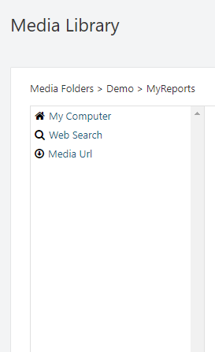
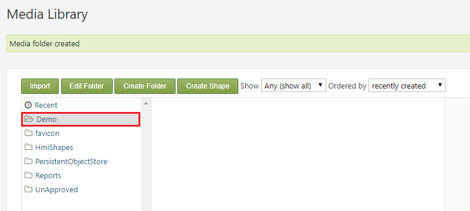

#
The Media module, in **SmartWEB**, provides a UI to upload and organize binary files that can be used while creating content. It is used to upload a resource that can be accessed anywhere in the system. 

---

##Media Library

The Media Library can be accessed via `Dashboard` > `Media`. Here the user is be able to see and utilize media files, which are stored in specific folders in a tree-like structure. 

!!!warning "Important:"
     In order for a user to be able to manage media in the `Media Library` - his assigned role must have the respective permission checked. For more information on users and roles visit the  
     [Users and Roles](../users-and-roles) chapter.

!!!warning "Important:"
     Note that a file that is not imported via the `Media Library` does not have a content item created for it, and is not visible.

!!!note "Note:"
      The `Import` and `Edit Folder` options will be displayed after the user has selected a folder.

* 1) The files are stored in folders in a tree-like structure. 
* `Recent` - displays the most recent files.
* `favicon` - web icon.
* `Hmi Shapes` -  stores the shapes that are in use ([HMI Editor in-depth](../hmi-editor-in-depth)).
* `PersistentObjectStore` - contains Excel (`.xlsx`) files regarding - `DISPLAYS`, `PARAMETERS`, `POINTS`, `SERVERS`.
* `Reports` - stores the server reports in `.xlt` format.
* `UnApproved` - stores shapes that are in development (therefor are not accessible in the editor). It is not advisable to import anything into this folder, because it is a system folder, and newly created shapes are automatically stored in it.

* 2) `Import` - the user can import files from an external source. There are three import options available:

*  `My Computer` - import a files from the computer on which the system is running.
*  `Web Search` - import files via web search.
*  `Media Url` - import files via a media url.

* 3) `Edit Folder` - edit the selected folder.

* The text field in which a new name for the folder can be provided if necessary.
* `Save` - save the new changes.
* `Delete` - delete the folder and all sub-folders that it contains. 
* `Cancel` - cancel editing. 

* 4) `Create Folder`- create a new folder. In order to create a folder within another folder, you must first select the folder in which you want to create the new sub-folder by clicking on it.

* 5) `Create Shape` - this option is used for creating `shapes`. Visit the [Dynamic Shapes Development](../dynamic-shapes-development) chapter for more information on `shapes`. 

* 6) `Show` - this dropdown list allows the user to filter the files by their type: `Any`, `Audio`, `Document`, `External Media`, `Image`, `SVG`, `Video`.

* 7) `Order by` - this dropdown list allows the user to sort the files by: `recently created`, `recently published`, `recently modified`.

* 8) This panel displays the property data of the selected file.

*  `id` - The `id` of the file in the database.

*  `Version` - The version of the file (`content item` that is created for it).

*  `Last modified` - The time at which the file was last modified.

*  `By` - The owner of the file.

*  `Title` - The title of the file.

*  `Filename` - The file name/extension.

*  `Mime Type` - The mime type of the file.

*  `Status` - The current status of the file.

*  `Size` - The size of the file.

*  `Edit` - allows the user to edit the `Title` of the file and provide a caption and/or alternate text.

*  `Delete` - delete the file.

####Example

The following example in intended to show the user how to create and structure files in the `Media Library`.

The first step is to create a folder, which for the purposes of this example will be named `Demo`, so it it can then be used to store files. This is done via the `Create Folder` button **4)**, as explained above.

Enter the specific name in the `Folder name` field and click `Save`.

A *Media folder created* message can then be seen at the top of the page, and the recently created folder will be visible in the tree-like folder structure of the `Media Library`. We will then repeat the same process to create a sub-folder named - `MyReports`. Select the `Demo` folder with a left click to target that specific directory, and create the new sub-folder.

If the process was completed successfully there should be a *Media folder created* message at the top of the page, and the new sub-folder will be visible inside the `Demo` parent folder.

The folders are now created, but they are empty. To import files simply use the `Import` button **2)** as shown above. For the purpose of this example we will import a report file from the local machine.

If the process was successful the file will be visible in the respective folder in the `Media Library`.

##Media Storage

The `Media Storage` is used to browse the physical files of the items that are present in the `Media Library`. The main purpose of the `Media Storage` in **SmartWEB** is to provide the url of a resource.

In order to be able to get the `url` of a resource, the user needs to navigate to its directory via the `Media Storage` section. For the purpose of this tutorial we will use the example that was given above - *MyReport*.

Navigate to `Demo`>`MyReports`>`MyReport.xlt`.

On this page the user will be provided with a link to the respective resource - in this case `MyReport.xlt` via the `Embed` field. The link can then be copied and placed where necessary in order to be utilized.

