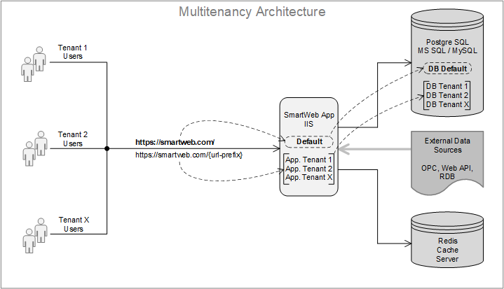

#

The [Architectural Considerations](../architectural-considerations) chapter describes what multitenancy is. In this chapter, we will describe how to configure **SmartWEB** to operate in `Multitenancy Mode` and also show how to manage individual tenants. We will consider the case where the **SmartWEB** application and the database are hosted on different servers. This is a typical case for production systems and also for cloud based systems where `Database` and `Redis Cache` server are used as external services provided by third parties.  

---

## Overview
The following figure illustrates the multitenancy architecture.  



As discussed in the [Architectural Considerations](../architectural-considerations) chapter, there are two ways to isolate the data of each tenant.  

> -  A separate database is created for each tenant.  
> -  A separate set of tables is created for each tenant with the tenant name as a prefix to the original table name, but all tables for all tenants are stored in a single database.  

We recommend using the first option, because the database in this case is better structured and easier to manage in this case. Further in this chapter will consider this way of configuring multitenancy mode. As shown in the architecture above, addressing the tenants is done by adding the `url-prefix` as an additional segment to the base `URL` of the **SmartWEB** application. Addresses without this additional segment are addressed to the `Default Tenant`. The `Default Tenant` is the tenant that is used to manage the other tenants. Later in this chapter we will explain how this mechanism works.  

!!!attention "Default Tenant Best Practice"
    The `Default Tenant` is like any other tenant and can be used as a regular **SmartWEB** site. However, best practice is to not create users or build content in the `Default Tenant` and use it only to manage the other tenants.  

---

## Database Preparation
To illustrate multitenancy configuration, we will use a `PostgreSQL` server and configure two tenants. We need to create a separate database for each tenant and we also need to create one database for the `Default Tenant`. The only thing we need to do is create three empty databases and three users who are owners of the databases or have permissions to create and delete tables. This is shown in the next screenshot.  


!!!attention "Database User Privileges"
    When creating the users make sure that the `Can login?` property from the user `Privileges` tab is enabled.  

We now have three databases and three users who own each database. We also need to check that `PostgreSQL` server allows connections from `external IP addresses`. To do this, locate the `postgresql.conf` file in the `data` folder of the `PostgreSQL` server. Open the file and look for the `listen_addresses` parameter. With this parameter you can specify a list of IP addresses that can connect to the server or you can allow all IP addresses with the value `*`.  

```
listen_addresses = '*'		# what IP address(es) to listen on;
					        # comma-separated list of addresses;
					        # defaults to 'localhost'; use '*' for all
					        # (change requires restart)  
```  

In the same `data` folder, locate and open the `pg_hba.conf` file. Ensure that the file contains the following line.  

```
host        all         all         0.0.0.0/32          scram-sha-256  
```

After modifying the configuration files, the `PostgreSQL` server must be restarted for the new configuration parameters to take effect.  

!!!note "Database Considerations"  
    All databases do not need to reside on a single `Database Management Server`. They can be distributed across different servers.  

!!!attention "Firewall Configuration"
    If `Windows Firewall` is enabled on the server, you should also check if there are access rules configured for the `PostgreSQL` server and the `Redis Cache` server if it is also installed on the same machine. The defautl port for the `PostgreSQL` server is `TCP/5432` and the defautl port for the `Redis Cache` server is `TCP/6379`. The ports that both servers listen on are configured with the `port` parameter in their configuration files.


---

## Creating a Default Tenant  
Once we have prepared the databases for the each tenant, we can move on to configuring the tenants themselves. We will do this on the server where the **SmartWEB** application is installed. We will not cover the installation of the **SmartWEB** application in this chapter as this is covered in the [Getting Started](../getting-started) chapter. In order for **SmartWEB** to initialise and connect to the newly created database, we will go into the **SmartWEB** installation directory, navigate to the `App_Data` folder, and delete the `Sites` folder from there. Now we will create the `Default Tenant` which will be used to create and manage the other tenants. You can browse to `http://localhost` and you will see the following screen.  


Enter the site name, superuser name and password and select `Use an existing PostgreSql database`. Leave the `Database Table Prefix` field blank, because we are looking at an example where we are using separate databases for each tenant and do not need to prefix the tables. Select `Smart Web light recipe`. Use the following connection string by entering the correct `IP Address` or `Domain Name` of the server where the `PstgresSQL` database is located. Also enter the `Database name`, `User` and `Password` as we created them in the previous section.  The connection port should be the one configured in the `postgresql.conf` file of the `PostgreSQL` server.  

```
Host=A.B.C.D; Port=5432;Database=_sw_default_db; UserName=_sw_default_user; Password=******  
```

In most cases, this connection string will be sufficient to connect to the database. However, if you are working in an `Azure` environment and using a `PostgreSQL` server as an external service you will need to use the following connection string.  

```
Host=A.B.C.D; Port=5432;Database=_sw_default_db; UserName=_sw_default_user; Password=******;  
Persist Security Info=true; Keepalive=15; Timeout=30; Command Timeout=90  
```

Click on the `Finish Setup` button and the selected **SmartWEB** recipe will be cooked. If you now look into the database using the `pgAdmin` tool you will see that the `Default Tenant` database is no longer empty. Also in the `App_Data` folder we now have a `Sites` folder and within that folder is a `Default` folder which contains service information for the `Default Tenant`.  

!!!error "Installation Errors Handling" 
    If **errors** occur and you are unable to cook the recipe, you should go to the `inetpub>SmartWeb>App_Data>Logs` folder and investigate the reasons for the failure using the error records in the log files.  

Now that we have successfully cooked the recipe, we can move on to creating `Application Tenants` which you can use to create **SmartWEB** sites with users and content.

---

## Creating Application Tenants
First you need to check if the `Multi Tenancy` module is enabled. You can do this by navigating through the `Modules` link in the `Admin Panel`. All **SmartWE**B modules and their current status are displayed here. Type `Multi Tenancy` in the filter box and you will see a view as shown in the following image.  


If the `Multi Tenancy` module is not enabled, you  will need to enable it by clicking on the `Enable` link on the right hand side of the module box. For more information on managing modules, refer to the [Modules](../modules) chapter.  

!!!note "Multitenancy Management Module"  
    Module `Multi Тenancy` can be enabled or disabled after the recipe has been executed. This depends on how the recipe itself is designed. There are recipes that enable the module and others that do not. In the previous section, we selected a `Smart Web Light` recipe and that recipe does not automatically enable the `Multi Тenancy` module, so we need to enable it manually. In the [Load Balancing](../load-balancing) chapter, we will look at other recipes that automatically enable the `Multi Тenancy` module.  

After activating the `Multi Тenancy` module, a `Tenants` link will appear in the `Admin Panel Tree`. This link opens the `Tenant Management` page. Until you create your own `Application Tenants` you will only see the `Default Tenant` there. Adding a new tenant is done via the `Add a Tenant` button as shown in the image below.  


When you create a new tenant, you need to specify the `Site Name`, the `URL` prefix for the new tenant, and the `Connection String` for the database. You can also specify which modules and themes should be available in the tenant. If you do not explicitly specify modules and themes, by default all available modules and themes will be available in the new tenant. This is illustrated below.  


Once you have filled in the details required to create the tenant, click the `Save` button at the bottom of the page. The new tenant you have just created will now appear in the list of tenants.  


If you go to the `App_Data>Sites>` folder, you will see that a new folder has been created with the name of the tenant. In this folder there is a file called `Settings.txt`. If you open this file with a text editor, you will see that the state of the tenant is `Uninitialised`. Now we need to initialise the tenant by clicking on the `Set Up` link shown in the image above, then you will see the page shown in the next image.   


You will need to answer a few questions similar to those you answered when creating the `Default Tenant` and then complete the tenant creation by clicking the `Finish Setup` button. Once you have successfully cooked the recipe of your choice, you will now have your first `Application Tenant`. You can access the new tenant by adding the `URL` prefix you configured as an additional segment to the `URL` of your `Default Tenant`. A new folder will also be created in the `inetpub>SmartWEB>Media>` folder with the name of the tenant you have created. This will contain the media files available to the tenant. You can now continue to create content, roles and users in your `Application Tenant`. You can create as many tenants as you like in the same way.  There is no limit to the number of tenants that the **SmartWEB** platform can serve. The limitation comes from the performance of the server platform, which depends on the number of concurrent users served by the tenants.

## Tenant Management
As mentioned above, the default tenant is used to manage tenants. The `Tenant Management` page displays a list of all tenants. Actions that can be performed on the tenant are listed on the right, as shown in the following image. 


The first action toggles between the `Suspended` and `Resume` states of the tenant. If the tenant is in `Suspended` state, you have the option to `Resume` the tenant. When tenant is in `Suspended` state, the option to `Reset` the tenant will appear. When resetting the tenant, the system will give you the option to choose whether to delete the tables from the database as well. After resetting, all data is deleted from the database and the tenant must be re-initialised.  

To delete a tenant, you must do the following:
> - Stop the **SmartWEB** application pool from the `IIS Management Console`.  
> - Delete the coresponding to the tenant folder from `inetpub>SmartWEB>App_Data>Sites>`.  
> - Optionally, you can also delete the tenant media files by deleting the coresponding to the tenant folder from `inetpub>SmartWEB>Media>`.  
> - Optionally, you can also delete the tenant database.  

---

#### Summary
In this chapter we learned how to configure **SmartWEB** to run in `Multitenancy Mode`. The different modes of operation are discussed in the [Architectural Considerations](../architectural-considerations) chapter. The [Load Balancing](../load-balancing) chapter describes the configuration and management when the system is working with `Load Balancer` at the front. The two modes of operation `Multitency` and `Load Balancing` complement each other and optimize the server resources used and at the same time provide a good level of redundancy.  