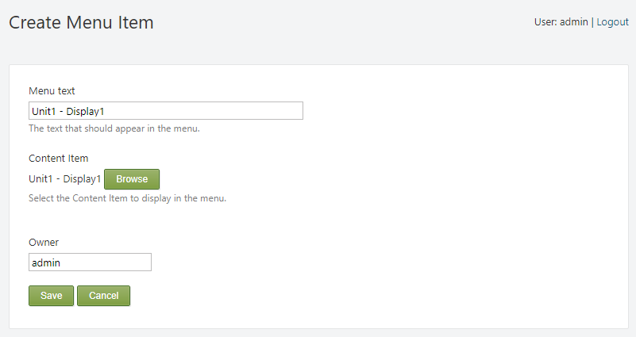
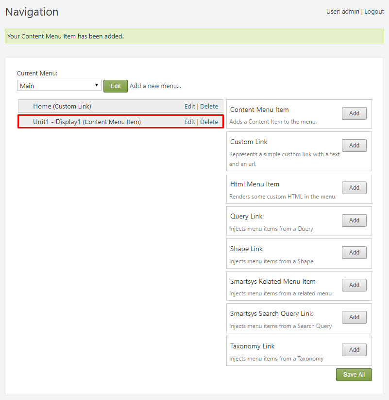
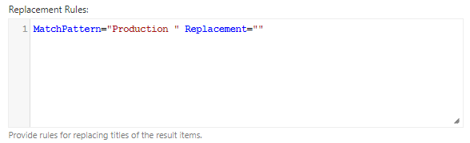

#
Navigation menus are a section of a graphical user interface intended to aid
visitors in accessing information. Menus are a collection of links (menu items)
used to navigate a website. Menus can be "flat", or may be hierarchical
(multilevel). A multilevel menu has one or more submenu items. In essence, a
submenu is a term used to describe a menu that is contained within another menu.

Menus provide the users with the means of navigating trough website in quick
succession. The hierarchical structure allows fast access to the different
sections of the site, which are represented in their own menus and submenus.

It's important to note that menus are contained in `Widgets`. This allows for
flexible placement in the site's structure, and provides even greater
flexibility when it comes to menu permissions.

Visit the [Widgets](/Widgets) chapter for more information on `Widgets`.

In the following chapter, the way of creating menus in **SmartWEB** will be
discussed, as well as their components.

##Menu Links

Menu links (Menu items) are the smallest element of a menu. They point to
specific content, and are basically a representation of the content page's
`url`. Menu links come together for form the structure and hierarchy of a menu.

In the `Navigation` section in the admin panel. You will see that there is a
list of menus available. The right side contains all types of menu items that
you can add:

-   `Content Menu Item` - Adds a Content Item to the menu.

-   `Custom Link` - Represents a simple custom link with a text and an `url`.

-   `Smartsys Related Menu Item` - Injects menu items from a related menu.

-   `Smartsys Search Query Link` - Injects menu items from a Search Query.

-   `Taxonomy Link` - Injects menu items from a Taxonomy.

Each of these menu options is, in essence, a `Content Type`. As a result, menu
links will have the same `Content Type` as the option via which they were
created. Depending on the menu link's type, it can point to a `Content Item`,
point to a `url`, filter the results of a query, display a taxonomy, or contain
an entirely separate menu.

!!!attention "Important:" 
      In order for a `Content Type` to be used as a means of
      creating menu items, it must contain the `Menu` part.

!!!attention "Important:"
     Additionally, it must be of `Stereotype`: MenuItem.

Visit the [Content Anatomy](/Content-Anatomy) chapter for more information on
`Content Types` and `Content Items`.

## Menu Permissions
Menu permissions manage the level of access, which different roles have to each individual menu item. Each role has a set of permissions assigned to it, and these permissions indicate which actions a user in that role can perform on the specific menu item. Visit the [Users and Roles](/Users-and-Roles) chapter for more information on user `Roles`.

Menu permissions create a way to filter and customize menus, depending on the role of the user. A user with low access permissions will have access to a lower number of menus and submenus, as opposed to a user with high access permissions, who is given a more complete version of the menu. This method alleviates the need to create separate menus for each role,providing a flexible way of managing `Content Item access control`.

On the `Create Menu Item` page, there should be check box with the name  
`Enable Content Item access control`, as shown in the following image:

By default, the menu item types that come with the `Enable Content Item access control` option already enabled are:

* `Custom Link`
* `Smartsys Related Menu Item`
* `Taxonomy Link`

If the option needs to be enabled for another menu item type, it can be done by navigating to the `Content Definition` section in the admin panel, and locating the `Content Type` of the menu item that needs to have its permissions enabled. On its `Edit Content Type` page, you can navigate to the `Parts` section and click the `Add Parts` button.

Select the `Content Permissions` option and click `Save`.

Once the `Content Permissions` part has been added to the `Content type`, it can be selected in the `Create Menu Item` page, and the permissions can be managed.

#### Menu Permissions Structure

Menu permissions are divided into two levels of security - `Widget permissions` and `Menu Item permissions`. This creates a structure where the widget is used as a container for the menu and its items. This hierarchy provides a high level of customization, that determines the way a menu will be displayed for different roles. Depending on the role of the user, some menu items, submenus or entire menus may be hidden.

`Widget permissions` represent the first level of security. They act as containers for the menus. The permissions, which a specific user has, determine if the widget will be displayed, otherwise the menu that is contained inside the widget will not be available. 

In the following example - the first user has no permissions on the `U1` menu widget. The second user has adequate permissions on the `U1` menu widget, and can access the menu contained by the widget:

User with no access to the `U1` menu widget:

User with complete access to the `U1` menu widget:

`Menu Item permissions` represent the second level of security. Each menu item can have its own individual permissions. Each menu item can be hidden or displayed, depending on the user role. This differs from the `Widget permissions`, where changes are made on a much bigger scale, i.e the entire menu being hidden or displayed. `Menu Item permissions` issue changes on a much lower scale, where the menu's size and structure may change, without it being removed entirely. This level of permissions allows for more in-depth menu customization.

!!!attention "Important:"
    Menu items will not be displayed, if the user does not have permissions on the `Content Items`, which they represent.

In the following example - the first user has limited permissions on the `VIEW` menu. The second user has adequate permissions on the `VIEW` menu, and can access more of the menu's contents:

User with limited access to the `VIEW` menu:

User with complete access to the `VIEW` menu:

##Menu Examples

To create a menu item head to `Navigation` in the admin panel menu.

On the left side of the `Navigation` page, there should be a `Current Menu:`
dropdown list with all the available menus, as well as the specific menu items
of the currently selected menu located underneath. The menu item types are
located on the right side of the page, and can be added via their respective
`Add` button.

!!!attention "Warning:"
     Before you add a menu item, make sure that the correct
     menu on which it will be displayed is selected.

#### Content Menu Item

`Content Menu Items` add a `Content Item` to the menu. Click the `Add` button on the `Content Menu Item` in the `Navigation` section to access their creation page.

-   `Menu text` - used to set the text of the menu item that should appear in
    the menu.

-   `Browse` button - selects the `Content Item` that will be shown on the menu
    (If the `Menu text` box is left empty, the name of the selected `Content Item` will be used for the menu item. Additionally, `Content Items` to which
    the user does not have access will not be available for selection).

After the `Content Menu Item` is saved, it will appear in the `Navigation`
section under the menu it was created on. In this example, the **Unit1 -
Display1 (Content Menu Item)** was created in the `Main` menu.

The new `Content Menu Item` should now be displayed on the menu with all its
contents.

Menu items can also be configured, while creating a `Content Item`. This is done
via the `Show on a menu` option.

Select the menu on which the menu item will appear and enter the `Menu text`.

!!!warning "Warning:" 
        The `Show on a menu` option will not be available if the
        `Menu` part is not present in its `Content Type`.

After the `Content Item` is saved, it will appear in the Navigation section
under the menu it was assigned to on creation.

#### Custom Link

`Custom Links` represent a simple custom link with a text and an url, and
display it on a menu as a menu item. Click the `Add` button on the `Custom Link` in the `Navigation` section to access their creation page.

-   `Menu text` - used to set the text of the menu item that should appear in
    the menu.

-   `Url` - the url of a content item or web page can be entered. The menu item
    will point to the content of the url.

After the `Custom Link` is saved, it will appear in the `Navigation` section
under the menu it was created on. In this example, the **HELP (Custom Link)**
was created in the `Main` menu.

The new `Custom Link` should now be displayed on the menu with all its contents.

#### Submenu

Submenus make menu structure possible. Rules are in place to determine which
menu items should be subitems of other menu items.

Navigate to the `Navigation` section. If you hover over an already added menu
item with your mouse, you'll see that you can drag and drop the menu item. Drag
the menu item under another menu item that you have chosen to be the "parent"
item, and to the right until it snaps to a sub container. If a menu item is
further to the right than the item above it, that means that it is a subitem of
the menu item above. Changes you make here won't be updated until you click the  
`Save All` button in the bottom-right side of the page.

!!!tip "Tip:" 
    `Custom Links` can also be used as wrappers. You can leave the
    `url` empty when you are creating the menu item.

!!!tip "Tip:"
    As a result, it will lead nowhere, and will only be used as a container for other menu items.

Result:

#### Smartsys Related Menu Item

`Smartsys Related Menu Items` allow for convenient menu placement, and save a
lot of time. Using this feature, entire menus can be duplicated and represented
as submenu items in different menus. Click the `Add` button on the `Smartsys Related Menu Item` in the `Navigation` section to access their creation page.

This will display the `Create Menu Item` page. From here a few options will be
available:

-   `Menu text` - used to set the text of the menu item that should appear in
    the menu.

-   The specific menu that you want to inject in the current one can be selected
    via the dropdown list underneath the `Menu text` box.

-   `Show As Subitems` - this option can be checked if the the related menu
    items are required to be rendered as subitems of this menu item.

After the `Smartsys Related Menu Item` is saved, it will appear in the
`Navigation` section under the menu it was created on. In this example, the
**Operation Reports (Smartsys Related Menu Item)** was created in the `Main`
menu, and was placed under `REPORTS` as its subitem.

The new `Smartsys Related Menu Item` should now be displayed on the menu with
all its contents.

#### Smartsys Search Query Link

`Smartsys Search Query Links` filter specific `Content Items` based on their
characteristics, which are specified in the query. These `Content Items` are
then shown on a menu as menu items. Click the `Add` button on the `Smartsys Search Query Link` in the `Navigation` section to access their creation page.

From here a few options will be available:

-   `Menu text` - used to set the text of the menu item that should appear in
    the menu.

-   `Indexes` - this will allow you to specify which index to use in search
    queries. For this example we will use: *SchemeIndex*.

-   `Fields` - this will allow you to select the lucene terms to be used in
    Lucene Query. (You can learn more about Lucene Query and its syntax here:
    [Apache
    Lucene](https://lucene.apache.org/core/2_9_4/queryparsersyntax.html)).

-   `Lucene Query:` - here you can provide a `Lucene query` expression to select
    items. In this example we will search for `Content Items` with the  
    `Content Type Id`: productionreports.

-   `Do Not Escape Query` - when this option is enabled, queries will not be
    automatically escaped for special characters of Lucene syntax.

-   `Top:` - determines the number of items that will be returned. Setting it to
    (**0**) will return all items.

-   `Narrow Search To Current Culture Only` - when this option is enabled,
    returned items will be additionally filtered by user ViewContent permission.

-   `Disable Cache` - when this option is enabled, menu item will not be cached
    by Search Navigation Cache.

-   `Replacement Rules` - here you can provide rules for replacing titles of the
    result items. Each rule must be on a separate line and is executed in the
    same order in which it was created. In this example we will remove the
    "Production " part of the titles that are filtered by the query.

!!! tip "Tip:"
     If you want to add parts from the titles, you can do so by simply
     entering the additional word or phrase in the `Replacement=""` quotation marks.

After the `Smartsys Search Query Link` is saved, it will appear in the
Navigation section under the menu it was created on. In this example, the
**Production Reports (Smartsys Search Query Link)** was created in the `Main`
menu, and was placed under `REPORTS` as its subitem.

Additionally, we created wrapper for the `Smartsys Search Query Link` results
with the help of a `Custom Link` that takes on the role of a container.

The new `Smartsys Search Query Link` should now be displayed on the menu with
all its contents.

#### Taxonomy Link

`Taxonomy Links` create menu items from `Taxonomies` and their terms. Click the `Add` button on the `Taxonomies Link` in the `Navigation` section to access their creation page.

From here a few options will be available:

-   `Taxonomy` - selects the taxonomy whose terms will be rendered in the menu.

-   `Root Term` - select the root term to display. For this example we will set
    it as *Parent Taxonomy*.

-   `Display top level menu item` - when this option is enabled, the selected
    term to display will be rendered as a root element in the menu.

-   `Levels to display` - this option determines the number of levels to display
    in the hierarchy. Setting it to (**0**) will display all levels.

-   `Hide empty entries` - when this option is enabled, any term which has no
    content item associated to it won't be rendered.

-   `Display content count` - when this option is enabled, the number of content
    items is rendered following the term name.

-   `Menu text` - the text that should appear in the menu.

After the `Taxonomy Link` is saved, it will appear in the Navigation section
under the menu it was created on. In this example, the **Plant (Taxonomy Link)**
was created in the `Enterprise Model` menu.

The new `Taxonomy Link` should now be displayed on the menu with all its
contents.

!!!note "Note that:"
    This form of representing menu items is done with the help
    of the `Smart Web Menu Widget`. Visit the [Widgets](/Widgets) chapter for more
    information on `Widgets`.
