#

This chapter describes how to create WEB pages with **SmartWEB** built-in functionality for the [OData](https://www.odata.org/) queries. The `Smartsys OData Query Builder` module provides a `Content Part`, with the same name that may be attached to every `Content Type`. This provides a user interface for building `OData` queries without the need for prior knowledge of [OData's syntax and rules](https://www.odata.org/documentation/odata-version-2-0/uri-conventions/).

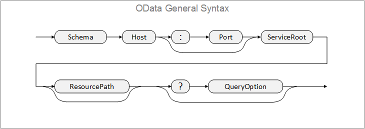

---

## Query Builder in Content Types

Query Builder, in the context of the `Content Types` configuration, gives an option for pre-configuration of all query properties discussed later in this chapter. Values that are configured here will be inherited as default settings by newly created `Content Items`.

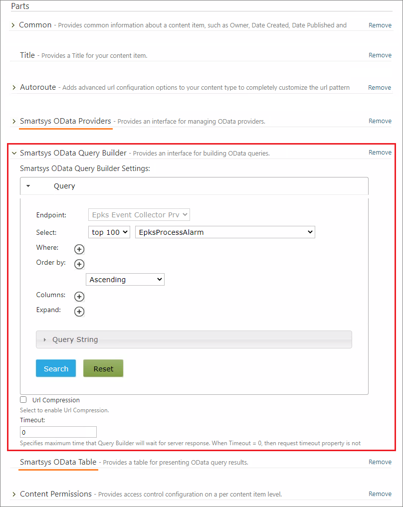

!!!note "Note"
    Note that besides the `Smartsys OData Query Builder`, there are two other essential content parts configured in this content type - `Smartsys OData Providers` and `Smartsys OData Table`. Their role is to provide OData endpoints and skin for data presentation. For more details, see chapters [Access to Relational Data](/access-to-relational-data) and [OData Table](/odata-table). General knowledge about `Content Type` concepts is available in chapter [Content Anatomy](/content-anatomy/#content-type).

---

## Query Builder in Content Items

Query builder, in the context of `Content Items`, is available, when creating or editing a content item from a content Type, where the `Query Builder part` is present.

The following image presents the look of the `Content Item` configuration.

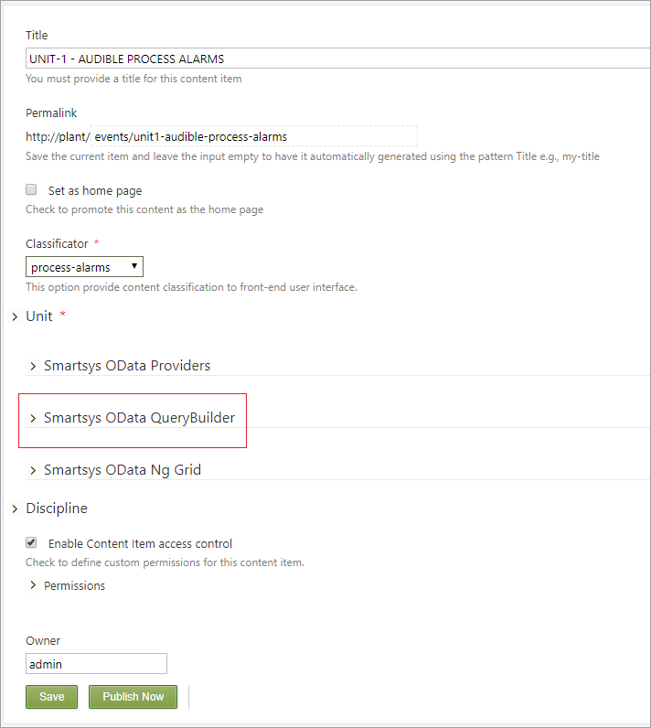

To begin the configuration, open the `Smartsys OData QueryBuilder` configuration container, then open the `Query accordion`, as shown on the next screenshot.

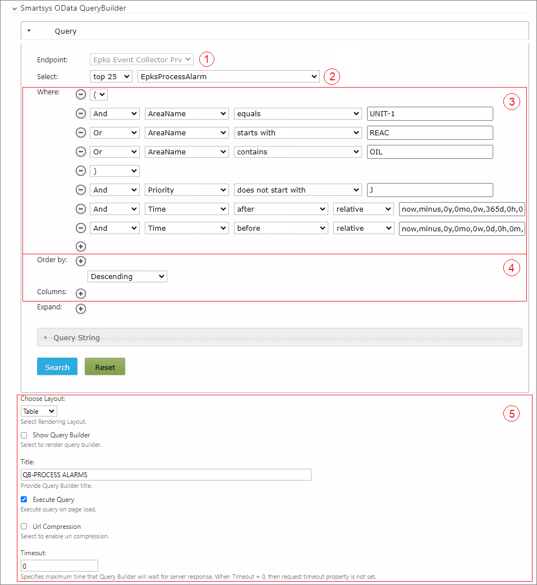

The description of the configuration steps is as follows:

`(1)` - Select the `OData Endpoint`. You can select from a list of connection points provided by the `Smartsys OData Providers` part.  
`(2)` - Select the entity that you want to query, as well as, the number of results needed. Every endpoint service provides one or more
entities. The entity often corresponds to the relational database table.  
`(3)` - Configure the search terms according to the information that needs to be displayed for the given `Content Item`. The system
provides an intuitive interface for building relatively complex where clauses.  
`(4)` - Sort the results and select the columns whose values you want to display in the report.  
`(5)` - Additionally, you can setup the following query properties, usually preconfigured during `Content Type` configuration:  

> - `Choose Layout` - Select one of the available skins for front-end data presentation.  

> - `Show Query Builder` - Enabling this checkbox will instruct the system to render query builder on the front-end page, thus allowing the users to change the default query. The users can set their own queries and execute them against the endpoint. It is convenient when the administrator prepares the query, and the user can change any part, then submit the query and get a new result.

> - `Title` - You can provide a title for the query builder. The title will be visible in the front-end and will toggle the builder state **(open/close)** when you click it.  

> - `Execute Query` - If this checkbox is selected, then the query is executed immediately after the page loads and the result is displayed. Otherwise, the query execution must be triggered manually by the user or another component on the page.

> - `Url Compression` - Enabling this checkbox will instruct the query builder to compress the `Url` request before submitting it to the server.

> - `Timeout` - This value specifies the maximum time to wait for a response from the server before displaying an error message. If the value is **zero**, then the timeout is not monitoring.

---

## OData Query Stepwise

After you configuring the endpoint and entity fields, the next step is to build a conditional `Where Clause` to filter out the results. The where clause can be combined with `AND`, `OR` and `NOT` logic operators, as well as with parentheses to control the execution priority. To add a new row to the condition, click `(+)` as shown in the image below, and then select a logic operator from the first drop-down selector.

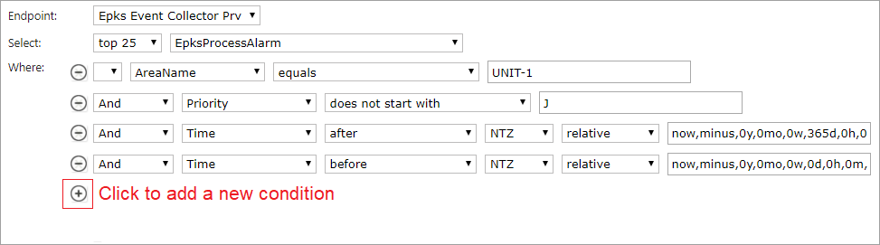

The query builder uses entity metadata to discover entity columns and **primitive datatypes**. The second drop-down selector lists all available columns, where you can select one for the current logic row. Depending on the datatype, the third drop-down automatically suggests possible **condition operators** for the given datatype. In the last field, you have to provide an **operand** value according to your selected requirements. The following example uses a column named `Id`, which has a datatype `Integer`. The query builder automatically proposes the allowed logic operators for this datatype.

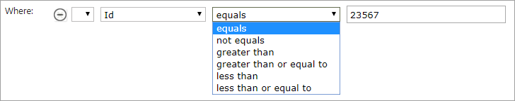

Another commonly used data type is the **string** data type. The following snippet adds a data selection condition where the `Action` column is a string with value `NULL` and the `Source` column is a string containing one of the substrings `_FG` or `:DGM`. The drop-down list shows the operators that are available for the string data type.

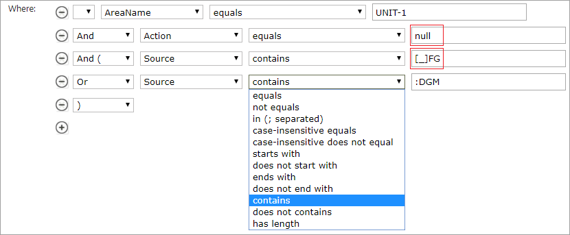

!!!attention "Attention"
    When the condition involves selecting records where the string has a `NULL` value, use `null` as the operand value. When the operand substring contains the underscore character, use square brackets to enclose the `[_]` character.

In the case where the operand column has a **date-time** datatype, a more interesting scenario occurs. The following image shows the operators available for this data type.

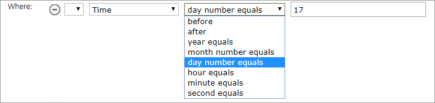

With the exception of the first two operators, the configuration of the others is very similar to that of any other data type. It consists of selecting a logical operator and providing an operand value. When you select `before` or `after`, then the interface automatically displays additional drop-down selectors.

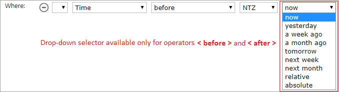

The first options on the list are aliases for relative time. For example, if **now**, the time is `07/07/2019 15:20:16`. The time aliases will point to the following times:

> - `yesterday` - 06/07/2019 15:20:16

> - `a week ago` - 06/30/2019 15:20:16

> - `tomorrow` - 07/08/2019 15:20:16

The last two options provide the possibility of precise selection of relative and absolute time. When one of these options is selected, the interface displays an additional box on the right. Clicking this box will display the calendar for either `relative` or `absolute` time.

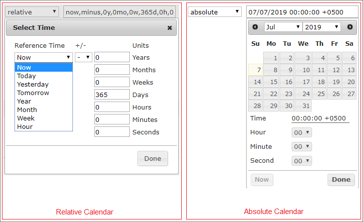

The time reference in the relative calendar provides a list of time aliases. For example, if the current time is `06/28/2019 15:20:16`, the meaning of the time aliases would be:
> - `Now` - 06/28/2019 15:20:16

> - `Today` - 06/28/2019 00:00:00

> - `Yesterday` - 06/27/2019 00:00:00

> - `Tomorrow` - 06/28/2019 00: 00: 00

> - `Year` - 01/01/2019 00: 00: 00

> - `Month` - 06/01/2019 00: 00: 00

> - `Week` - 06/24/2019 00: 00: 00

> - `Hour` - 06/24/2019 15: 00: 00

In addition, you can add a `+/-` time offset by entering the required values in the corresponding cells of the right column.

To sort the results and prepare the data for front-end presentation - click on the `(+)` in the `Ordered By` section. This will add an interface for data ordering. In the `Columns` section, click on the `(+)` to add an interface for column selection.

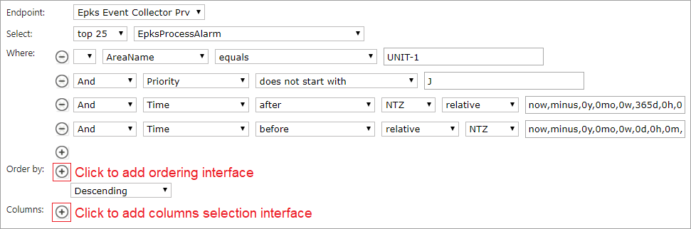

The query builder lists all available entity columns in the `Ordering by` and `Columns` areas.

By selecting the checkboxes in the `Ordering by` area, you instruct the server to sort the results by the data coming from the corresponding columns. Several ordering criteria are available, and they will execute in the same order as they were selected during configuration. You can also choose between `Ascending` and `Descending` order criteria from the drop-down selector on the bottom of `Ordering by` area. In the next example, the returned data is sorted by **Time** in **Descending** order.

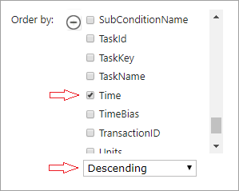

In the `Columns` area, all columns from the current entity are available on the left side. You can move the columns by drag and drop to the container on the right side under the title `Selected Columns`. To remove the column from selected columns, drag and drop them from the right side to the left side. The columns on the right appear with their original names. You can rename them by double clicking on the cell. You can also order the selected columns within the container by vertical drag and drop. Data presentation skin will collect this configuration information and render only the selected columns in the same order on the front-end.

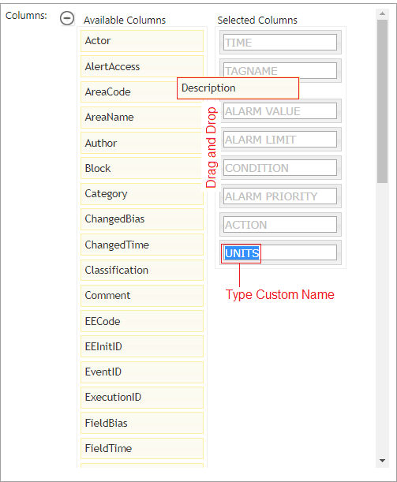

At the bottom of the query builder area, you will see a part of an accordion with the name `Query String`, as well as, the `Search` and `Reset` buttons. Inside the accordion area, a `Url` request that is  automatically prepared by the query builder is ready to be sent to the endpoint. You can even execute this OData query in the browser and obtain raw data. This data is an input for the presentation skin that wraps it and then presents the final layout to the users.

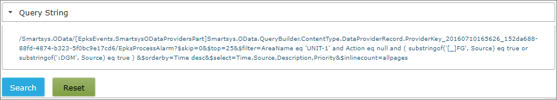

The **`Search`** button is for testing purposes of the query from the back-end. The button will execute the query and then render the results using simple skin below the buttons. The **`Reset`** button will clear all current query configurations.

---

## OData Query Archetype

Now let’s take a look at an example.

!!!tip "The Mission"  
    We have to create a content item that presents the results for annunciated process alarms generated by tags with the parent asset `UNIT-1`. The page has to be able to query the events for the last day, and list a maximum of `25` results. The results must be ordered by timestamps in descending order. The users must be able to see: `TIME`, `TAGNAME`, `DESCRIPTOR` and `ALARM PRIORITY`. The users must not be able to change the query.

The following image shows `OData` query configuration that complies with the task description.

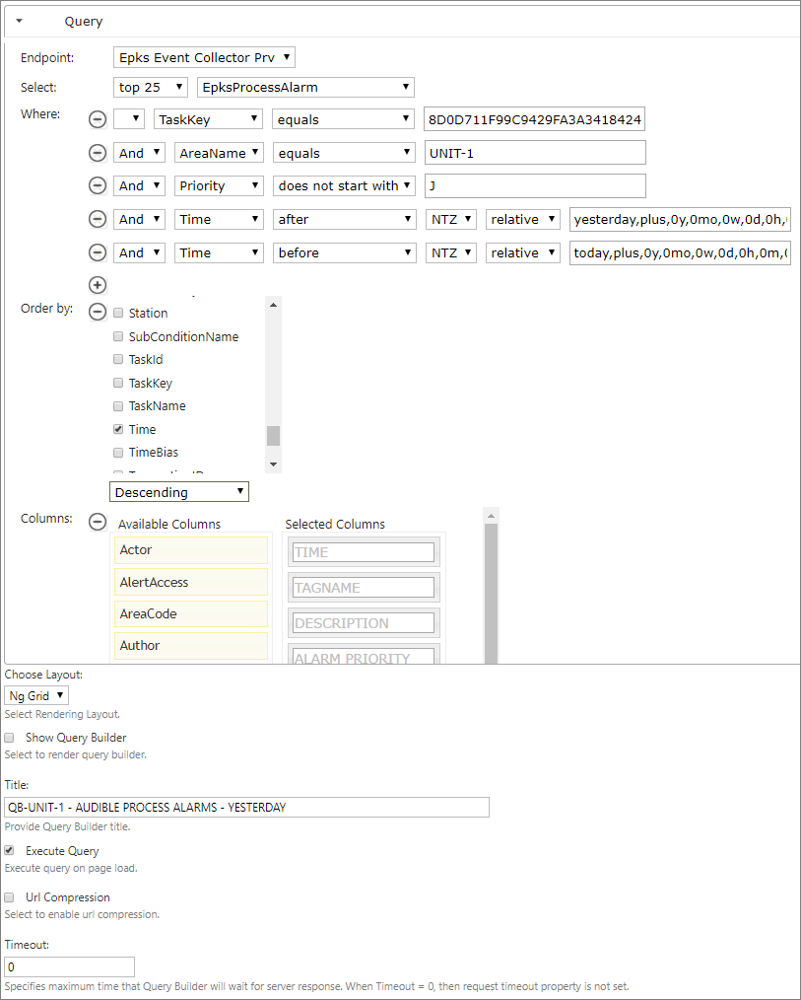

!!!note "Note"
    It's good practice to add a column included in the `entity index` in the search criteria when dealing with large databases. This can improve endpoint performance. In the example above - `TaskKey` is included in the index of `EpksProcessAlarm` entity. The [Access to Relational Data](/access-to-relational-data) chapter explains `TaskKeys`.

---

#### Summary

In this chapter, we have learned how to configure the `OData Query Builder` in the contexts of `Content Types` and `Content Items`. To gain a complete understanding of the entire process of setting up endpoints and rendering the results to the front-end, read the chapters [Access to Relational Data](/access-to-relational-data) and [OData Table](/odata-table). The [Content Anatomy](/content-anatomy/#content-item) chapter contains a more detailed view of `Content Item` and `Content Type` concepts.
