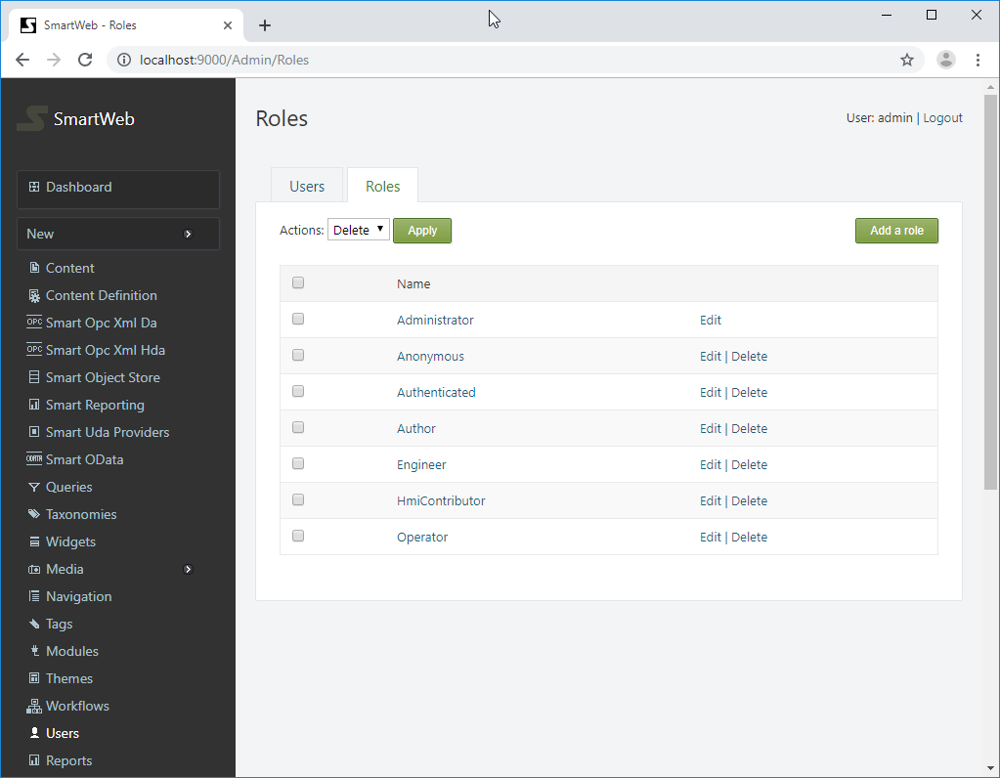

#
**SmartWEB**'s `Smartsys Reporting` module executes and visualizes
reports. Reports represent Excel spreadsheets that contain a special
syntax interpreted by a reporting service. The reporting service delivers the 
requested data through `Uniformance PHD`.

####Preconditions

1.  Administrator rights on the **SmartWEB** application.

2.  Enabled `Smartsys Reporting` module.

---

##Changing report's template folder

By default, reports are placed in a tenant's `Media` folder by the
**SmartWEB** application. The reports location can be changed. Open
`File Explorer` and navigate to the **SmartWEB**'s application path
(e.g. `c:\inetpub\SmartWeb`), then to the tenant's `Media` subfolder (e.g.
C`:\inetpub\SmartWeb\Media\Default`). Create a new subfolder with the name
`Reports`. Sign in the **SmartWEB** site. Navigate to the admin's
`Dashboard`. Expand `Settings` in the  navigation menu and
click the `Smart Reporting` link.

Press the `Browse` button and select the `Reports` folder. Optionally, you
can change, execute, download, or evict button's text. Press `Save`.

Report templates will now be placed in the `Reports` subfolder of the
tenant's `Media` folder (e.g.
`c:\inetpub\SmartWeb\Media\Default\Reports`).

!!! note "Note:" 
     The **SmartWEB** application has one permanent tenant that exists under the `Default` name.

---

##Configuring Report Service

Navigate to the admin's `Dashboard`. Click the
`Smart Reporting` link in the navigation menu. This will display the 
the page for managing `Report Services`. Press the `Add New` button to
create a new one.

Provide name of the report service and press the `Save` button.

The new report service was created. From the `Properties` link, the name of the service can be edited. It can also be deleted via the `Delete` link.

!!! note "Note:"
     You cannot delete the report service if there are related
     report templates.

Press the `Edit` link to configure the service.

A service URL must be provided for the Smart Reporting server (use the 
`net.tcp` protocol prefix for TCP message transport or `http(s)` for
others). A description may be set. The `Enable` checkbox 
enables communication through this service. The following three
checkboxes allow specific operations through this service.

`Service Timeout` - specifies service response timeout in seconds.

The next four settings must be configured the same way, as those on the Smart
Reporting server.

`Security Mode` - defines how the communication to the
service is secured. There are four available options:

`None` - no security.

`Transport` - uses transport security for mutual authentication and
message protection. The transport security is - SSL over HTTP or HTTPS,
when connecting to services that implement WS-* specifications, or TLS
(implementation is provided by the operating system) over TCP for binary
message channels.

`Message` - uses message security for mutual authentication and message
protection.

`TransportWithMessageCredential` - credentials are passed with the
message. Message protection and server authentication are provided by
the transport layer.

`Tcp Transport Client Credential Type` - defines the credential type used
for authentication when TCP is used for message transport (ignored if the 
`Security Mode` is set to `TransportWithMessageCredential`).

The available options are:

`None` - specifies anonymous authentication.

`Certificate` - specifies client authentication using an X.509
certificate.

`Windows` - specifies client authentication using Windows.

`Http Transport Client Credential Type` - defines the credential type
used for authentication, when HTTP/HTTPS is used for message transport
(ignored if the `Security Mode` is set to `TransportWithMessageCredential`).

The available options are:

`None` - specifies anonymous authentication.

`Basic` - basic authentication is used. For more information, see RFC
2617 - HTTP.

`Ntlm` - specifies client authentication using NTLM.

`Windows` - specifies client authentication using Windows.

`Certificate` - specifies client authentication using an X.509.
certificate

`Message`` Client Credential Type` - defines the credential type used for
authentication when using message security.

The available options are:

`None` - specifies anonymous authentication.

`Windows` - specifies client authentication using Windows.

`UserName` - allows the service to require that the client be
authenticated with a user name credential.

`Certificate` - specifies client authentication using an X.509
certificate.

If the `Use Authentication` option is checked, the subsequent four
options are taken into account. These options are applicable only when the 
client credential type is `Basic`, `Ntlm`, `Windows` or `UserName`.

`Use Default Credentials`- if checked, enables authentication with
default network credentials (applicable only for NTLM and Kerberos
credential types).

`Domain `- optionally set domain (applicable for Windows and NTLM
credential types)

If `Use Authentication` is checked, a username and password must be provided in their respective fields, or the `Use Default Credentials` option must be checked. In the case of default credentials - the **SmartWEB** application credential will be used.

`Client Certificate Hash` - client certificate thumbprint (applicable
only when the `Certificate` credential type is used)

`Server Certificate Hash` - server certificate thumbprint (applicable
only when the security mode is `Transport` or
`TransportWithMessageCredential`). If set, the server certificate
thumbprint will be tested for a match.

The client certificate must be installed on the same machine as the 
**SmartWEB** application. If the certificate is installed in the
personal certificate store of the credential under - **SmartWEB**, then the `Personal Certificate Store` option must also be checked.

!!! note "Note:" 
     You will not be able to save the settings if the 
     `Client Certificate Hash` is provided and the certificate is not found on
the machine.

!!! note "Note:"
      When installing a client certificate, it is better to use
     `Local Machine` as the store location.

!!! warning "Warning:"
     The certificate thumbprint that is displayed in MMC
     certificate snap-in has an extra invisible unicode character. Do NOT copy the 
     "extra space" that appears before the certificate thumbpint from the
     Richedit control. If you copy and paste the thumbprint with the extra
     (invisible) character, this will lead to errors like - unable to find
     client's certificate, or unable to validate the server's certificate.

`Dns Identity` - If you are accessing the server through an IP or a name that
differs from the server's certificate `Common Name`, set the 
`Dns Identity` to that CN (applicable only with TCP transport
(`net.tcp`)). If you are using HTTPS transport, you have to access the server with the `Common Name` specified in
the certificate (you can map that name in your hosts file).

!!! note "Recommendation:" 
Use `Security Mode` - `Transport` and
`Tcp Transport Client Credential Type` - `Certificate`. Provide server
and client certificate thumbprints. Set `Dns Identity` to the 
`Common Name` of the server certificate.

Finally, save the configuration. Press the
`Test connection` button to check if the application connects to the
Smart Reporting server.

If the connection succeeded, a green message at the top of the
page will be visible.

####Smart Report Service Role Permissions

There are role permissions for the entire reporting module. Navigate to
the `Users` section via the navigation menu on the admin dashboard.
Click on the `Roles` tab.

The available roles can be seen here. Click on the desired role 
scroll down to the `Smartsys.Reporting` permissions.

The available permissions are shown on the left side. The right side
has two columns - `Allow` and `Effective`. The `Effective` column shows the current 
estimated permissions for that role. In the `Allow` column, the 
role permission can be set. If a given role does not have permission over
specific action, regardless of the security policy of a given report, the 
user that has that role will not be able to execute such
operations. **Manage permissions** must not be granted to regular users,
they are only for administering reporting services. In order for a given role to be able to administer reporting services, **manage permission** must be granted
to that role.

---

##Creating Report Template

Click on the `Templates` tab (next to the `Services` tab).

The reports folder is located on the left side. 
The report templates must be placed in that folder. As mentioned before, reports
represent Excel spreadsheets that contain a special syntax that is interpreted
by a reporting service. The extensions of the files are xls(x) or xlt(x).
Click on file from the expanded reports folder.  
A configuration form for that report will be shows on the right side.

`Name` - provide a unique name for that report.

`Description` - a description can be set (optional).

`Service Provider` - select one of the available service
providers from the dropdown list (mandatory).

`Cache` - How long the report will be cached for (in minutes). 0 means no
cache.

`Offset Seconds` - an integer value. Each report is executed for a
particular date. If an offset (in seconds) is specified, it will be
added/subtracted to the date argument.

`Min Confidence` - The minimum percentage confidence (0 - 100%) below
which the value will be considered bad. If not specified, the report
server value will be used instead.

`Enable Report Template` - check to enable the report, otherwise it
can't be executed.

The final section is `Permissions`.

This section configures the security policy for the report. The roles are shown on the left-most
column of the table. On the right side, there are columns with available actions. Below each action there is a
checkbox determining if the action is allowed or not.

Finally, you can press the `Save` button to save the report
configuration. There is a caching mechanism for the reports, the `Evict`
button flushes all available caches for that date/report.

On the left side, under the reports folder there is a calendar control. From the calendar control, a date can be selected. Select a date and press the `Execute` button to
test the report.

The report can be downloaded via the `Download button`. The following 
notification from `Excel` might appear:

Press the `Yes` button to open the report.

On the right side of the `Execute` button, there is a `CleanUp`
button. If that button is pressed, all configurations of reports with
missing (deleted) files will be deleted.

##Attaching Reports in Content Items

The `Smartsys Reporting Predefined Report` part must be attached to the
`Content Type` (navigate to `Dashboard>Content Definition`,
open the appropriate `Content Type` and press the `Add Parts `button. Find the 
`Smartsys Reporting Predefined Report` part and add it 
to the `Content Type`).

Create or open an existing `Content Item` and attach the report template.

Press the `Browse` button and find a configured report template.
Additional CSS styles or classes can be defined to the report container by
filling the appropriate `Style` and/or `Class` fields.

`Immediate execution` - if set, the report is executed when a page with the
`Content Item` is requested and the result is shown immediately within the
page. The date argument passed during this execution is configured
further. If not set, the page is loaded without a result and waits for
user interaction to run the report (to press the `Execute` button).

`Datetime picker` - specifies what kind of UI control to be displayed.
There are three options available: `Invisible` (hides UI date control),
`Date` (shows the UI control for selecting days only), and
`DateTime` (shows UI control for selecting date and time).

`Show report download link` - if set, a download link will be shown
when the report is executed.

`Show report evict cache link` - if set, an evict link will be shown, via which the 
report cache for a particular date can be flushed.

`Relative time` - a dropdown list with a presets of relative base
times. The relative time is estimated when a report page is being loaded. If
`None` is selected, then the absolute time is taken into account.

`Years offset` - an integer value which will be added/subtracted as
years.

`Months offset` - an integer value which will be added/subtracted as
months.

`Days offset` - an integer value which will be added/subtracted as
months.

The next offsets are shown only if `Datetime picker` is set to
`DateTime`.

`Hours`` offset` - an integer value which will be added/subtracted as
hours.

`Minutes`` offset` - an integer value which will be added/subtracted as
minutes.

`Seconds`` offset` - an integer value which will be added/subtracted as
seconds.

These offsets are applied to the date argument of the report,
regardless if it is `Relative` or `Absolute` time.

`Absolute time` - specifies the report absolute time, which is taken into
account if the `Relative time` is set to `None`.

The following formula can be summarized:

*Estimated Report Date (ERD) = Relative/Absolute time +/- Years offset +/- Months offset +/- Days offset +/- Hours offset +/- Minutes offset +/- Seconds offset +/- Offset seconds (from the configuration of the report template – see Creating Report Template).*

`Go Back Time` - if the `Estimated Report Date(ERD)` is greater than
current time, this value (in seconds) is subtracted from the `ERD`.

`Go Back Time` is very useful when there is a report set to
show the results at 02:00 a.m. (The `Relative time` is set to
`Today` and the `Hours` offset to 2).  Set `Go Back Time` to 86400
seconds (1day). If the user executes the report at 01:30 a.m., but
the `Estimated Report Date` is 02:00 a.m., which is in the future, the 
`Go back time` will be subtracted from the `Estimated Report Date` and
the report will show the results for yesterday at 2:00 a.m. When the
user calls the report after 02.00 a.m. (the requested time will not be in the future,), `Go back time` will not be applied and the
report will show the results for today at 02.00 a.m.

##Reports in Workflows

The `Smartsys Reporting` module has workflow activity named - 
`Execute Report`. Before we continue, the `Scheduler`
module must be enabled. Go to the `Dashboard`, navigate to the 
`Modules` section. Find the `Scheduler` module and click on `Enable` link to
enable it. Find the `Email Messaging` module and enable it.
Navigate to `Dashboard>Settings>Email` to configure it.

After configuring the `Email` module, press `Save`. The `Email` module is used to `Send` report results.

!!! note "Note:" 
     The `Email` module requires the `Base URL`
     (`Dashboard>Settings`) of the site to be set, otherwise a warning
     message will be displayed when accessing site setting on the dashboard.

!!! note "Note:" 
     The `Email` module only supports explicit SSL. Explicit
     SSL starts as unencrypted on port 25, then issues a STARTTLS and
     switches to an encrypted connection (see RFC 2228).

Navigate to `Dashboard>Scheduler` and add a new schedule.
Set it's `Signal(s) to trigger` to `DemoReport`. Configure other
schedule settings and enable it.

Navigate to `Dashboard>Workflows` (`Workflows` module must be enabled)
and create a new workflow named `Demo Workflow`. Add `Signal`,
`Execute Report`, and `Send Mail` activities to the workflow.

On the `Signal` activity, configure the `Name of the signal` to be
`DemoReport`. Connect the `DemoReport Signal` activity with the
`Execute Report` activity.  Open the `Execute Report` activity to configure it.

In the `Report` field, enter the path to the configured report (you can see
the path from the report templates tab - `Dashboard>Smart Reporting`). This
activity supports only relative time, so configure it. If the report
template is not found, an error will be shown. Connect the `Done` output of
the `Execute Report` activity with the `Send Mail` activity. Open the `Send Mail`
activity and configure it.

Subject/body tokens can be used, such as:
`{Workflow.SmartWeb.Reporting.ReportPath}`,
`{Workflow.SmartWeb.Reporting.ReportName}`,
`{Workflow.SmartWeb.Reporting.ReportTime}`, and
`{Workflow.SmartWeb.Reporting.ReportExecutionTime}`, which comes with the
`Smartsys Reporting` module.

Optionally, an e-mail notification can be sent when the report has 
failed. Exception tokens can be included, such as:
`{Workflow.SmartWeb.Exception.Message}` and
`{Workflow.SmartWeb.Exception.Stack}`.

Finally, activate the `DemoReport Signal` activity to enable the
workflow. When the set time is reached, a report will be executed, and the
result will be emailed.

