#
## Working with Certificates

This chapter is intended to show the user how to create certificate authority (CA), client
and server certificates and how to sign them with the CA. For this
purpose, we will use a tool named XCA -- free application for
certificate and key management (<https://hohnstaedt.de/xca/>).

####Installing XCA

The latest version of XCA can be downloaded here:  
<https://hohnstaedt.de/xca/index.php/download>.

Run the installation package and follow the instructions.

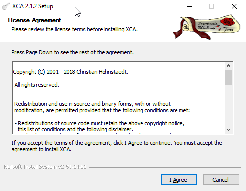

Accept the license agreement and press `I Agree`.

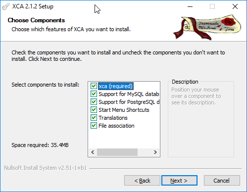

Leave the defaults as shown above and press `Next`.

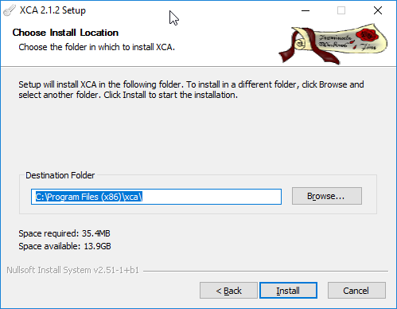

Press `Install` and wait.

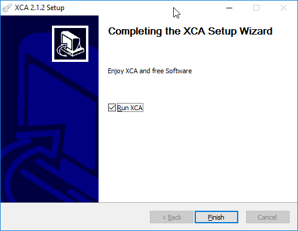

Press `Finish`.

The `X Certificate Key Management` tool is now installed.

####Creating New XCA Database

The newly installed XCA tool needs a database where it can store certificates.
If one is not available, it must be created. From the menu, click on
`File>New Database` (or use the Ctrl+N shortcut if you wish), choose where
to store the database and press `Save`.

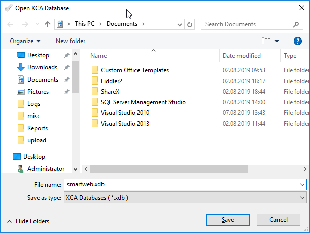

A password to secure the database will then be requested. The password is optional. For this demo we'll leave it without a password.

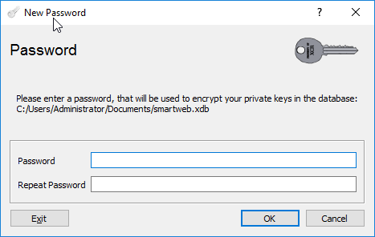

After pressing the `OK` button, the database will be created.

####Creating New Private Keys

In order to create a certificate, the user needs to create private keys for it first. This can be done by navigating to the 
`Private Keys` tab. The private key can then be created via the `New Key` button.

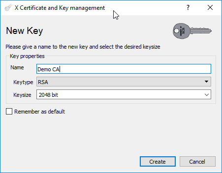

From here, fill in the name of the key (the type must be RSA and the key size not
lower than 2048) and press the `Create` button. Using the same approach create
keys with the names - `Demo Server` and `Demo Client`. These
three keys are needed for the CA, server and client certificates
accordingly.

####Creating Certificate Authority (CA) Certificate

Navigate to the `Certificates` tab. From the menu on the right side - press
the `New Certificate` button.

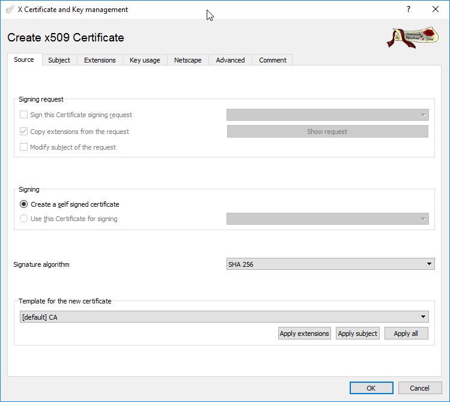

In the `Source` tab, choose the `[default] CA` template for the new
certificate and press the `Apply extensions` button. Ensure that the
`Signature algorithm` is at least `SHA 256`. Navigate to the `Subject` tab and, in the `commonName` field, enter the common name of the CA's certificate
(e.g. DemoCA).

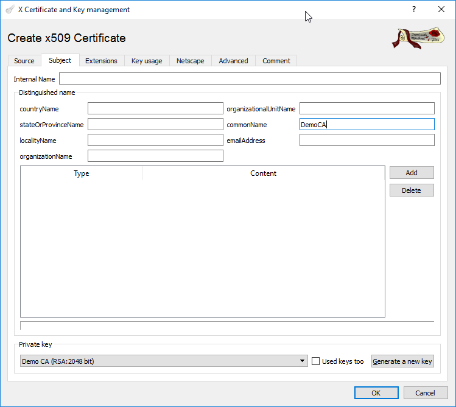

Ensure that the `Demo CA` key is selected in the `Private key` dropdown. Navigate to the
`Extensions` tab and specify the `Validity` of the certificate. For this example, 
we will set the `Time range` to 20 years - `Midnight`.
Once the desired `Time range` has been entered, click the `Apply` button.

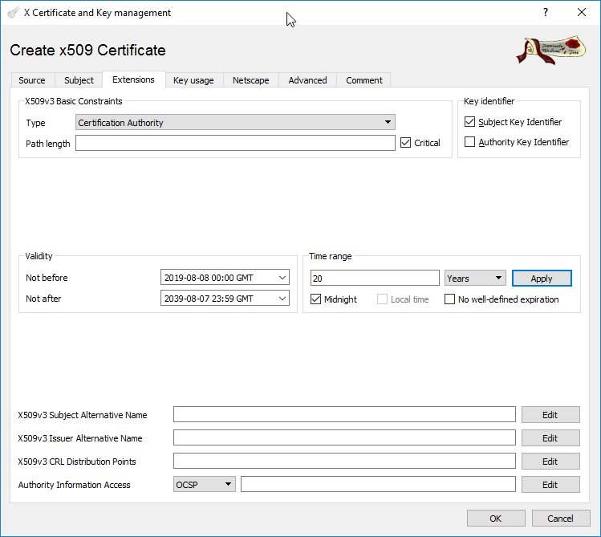

To create the DemoCA certificate, press the `OK` button.

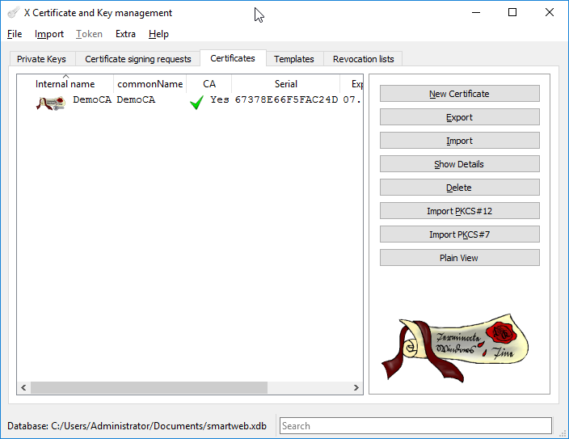

####Creating A New Certificate Signed with CA

Navigate to the `Certificates` tab. From the menu on the right side, press
the `New Certificate` button.

In the `Signing section`, choose `Use this Certificate for signing` and
select the newly created CA certificate (DemoCA) from the dropdown list.
Ensure that the `Signature algorithm` is at least `SHA 256`.

Navigate to the `Subject` tab. In the `commonName` field, enter the common
name of the certificate (e.g. DemoServer). Ensure that the `Demo Server` key is selected in the `Private key` dropdown.

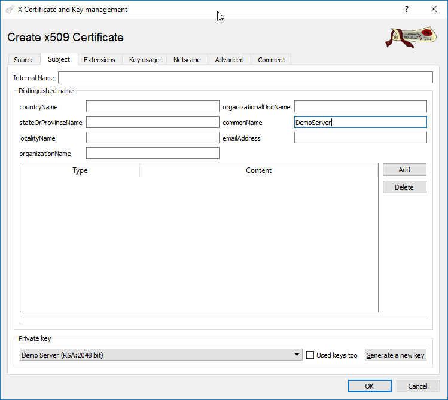

Navigate to the `Extensions` tab. Specify the `Validity` of the certificate.For this example, 
we will set the `Time range` to 20 years - `Midnight`.
Once the desired `Time range` has been entered, click the `Apply` button.

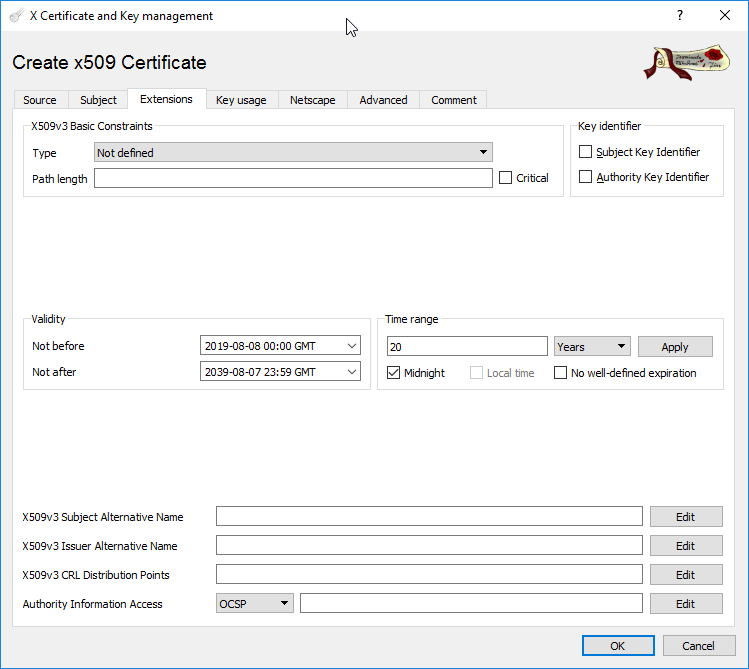

To create the DemoServer certificate, press the `OK` button.
The following message may appear:

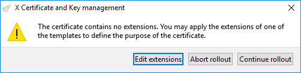

In this case, press the `Continue rollout` button. The DemoServer certificate will then be
created.

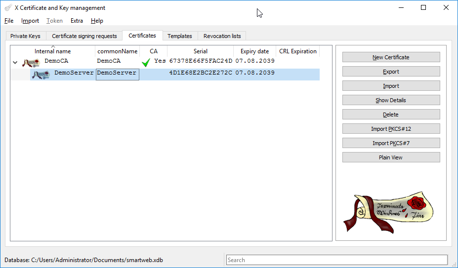

Using the same approach, the client certificate can be created(`commonName` DemoClient and   
`Private key` Demo Client).

####Exporting Certificates

Right click on the newly created DemoCA certificate. From the context
menu, choose `Export>File`.

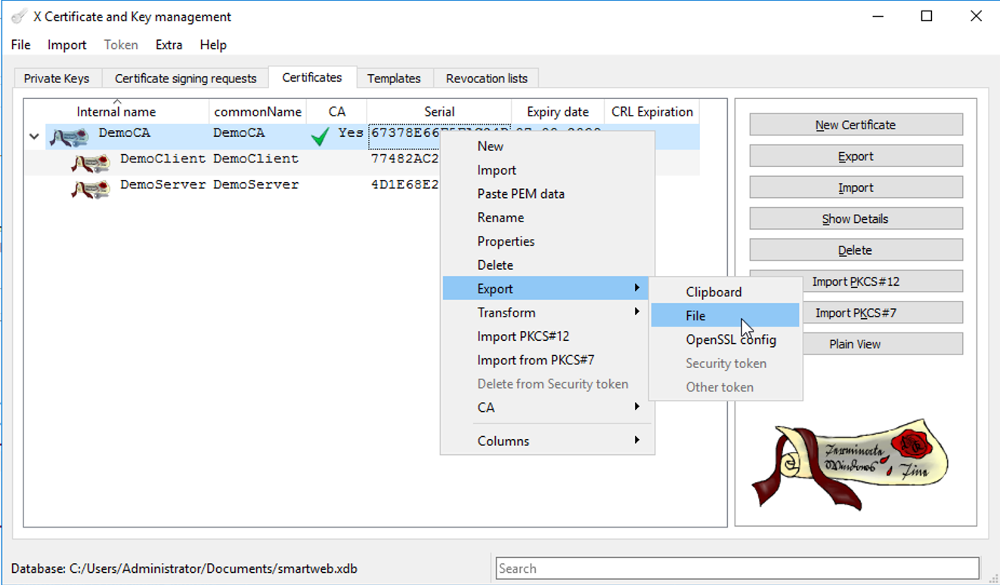

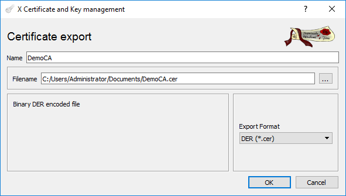

Choose the location where the file will be stored. In the `Export Format`, choose
`DER(*.cer)`. This format is suitable for exporting CA certificates
without private keys.

Right click on the newly created DemoServer certificate. From the
context menu, choose `Export>File`.

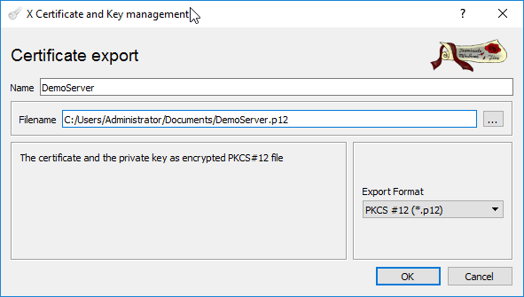

Choose the location where the file will be stored. In the `Export Format`, choose
`PKCS #12``(*.``p12``)`. This format exports certificates with the
private keys, that's why a password can be set to protect them. If a password is set, the user will be asked for it when importing. For the purposes of this demo,  we'll leave the password empty. Press the `OK` button.

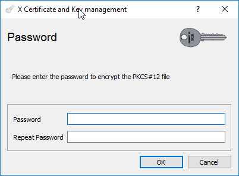

Use the same approach to export the DemoClient certificate.

####Importing Certificates in Windows

Before certificates are able to be used by the **SmartWEB** solution, they
must be imported into the operating system. Open `File Explorer` and
navigate to the exported certificates from the previous section. Double
click on the DemoCA.cer.

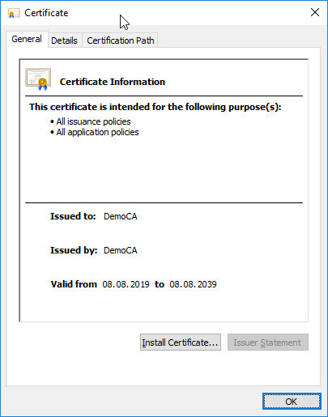

Press `Install Certificate`.

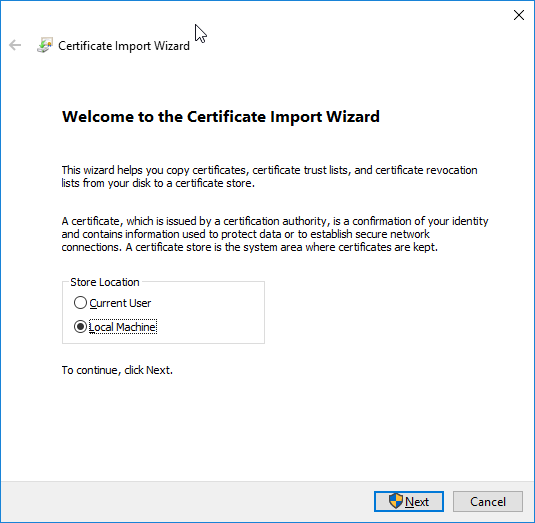

Choose `Local Machine` and press `Next`.

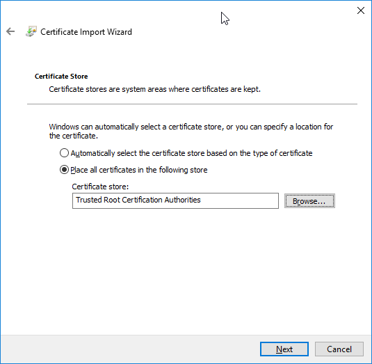

Choose `Place all certificates in the following store` and press the
`Browse` button to select
`Trusted Root Authorities Certification Authorities`. Press `Next`.

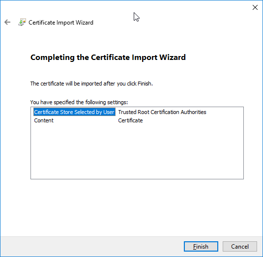

Press `Finish`.

Now double-click on the DemoServer.p12 certificate. The **Certificate
Import Wizard** will appear.

Choose `Local Machine` and press `Next`.

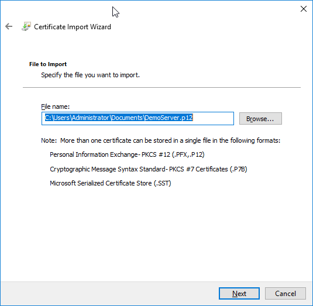

Press `Next`.

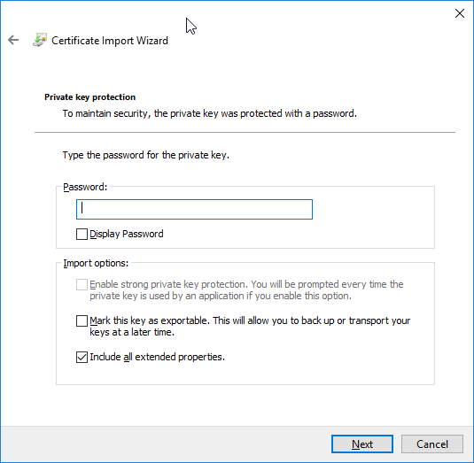

If your certificate is password protected, enter the password or leave
it empty if not. Press `Next`.

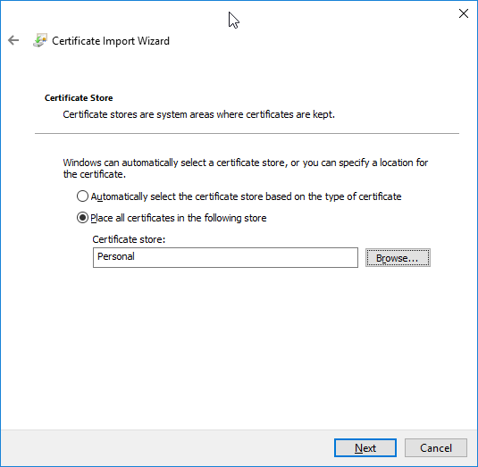

Choose `Place all certificates in the following store` and press the
`Browse` button to select `Personal`. Press `Next`.

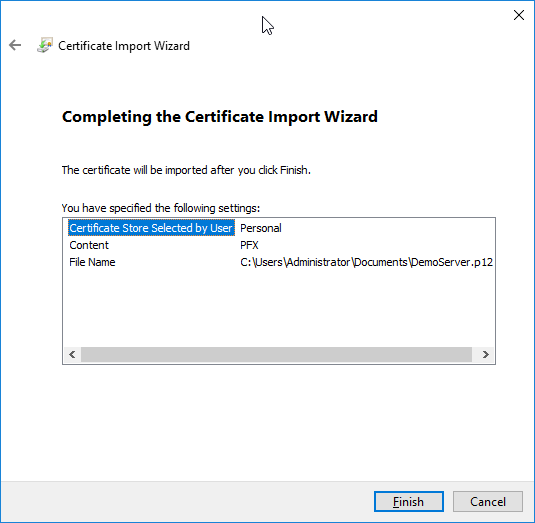

Press `Finish`.

Use the same approach to import the DemoClient certificate.

Press the **Win+R** shortcut. Enter `certlm.msc` and press the
`OK` button to run it.

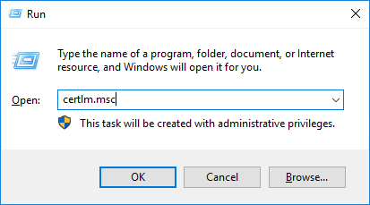

A Local Computer - Certificates MMC snap-in will be shown. You can find the newly
imported DemoCA certificate by navigating to `Trusted Root Certification Authorities`.

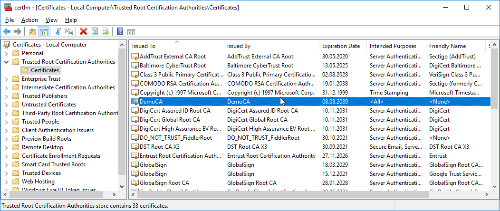

By navigating to the `Personal` branch, the
DemoServer and DemoClient certificates can be found. Double click on the DemoServer
and then go to the `Certification Path` tab.

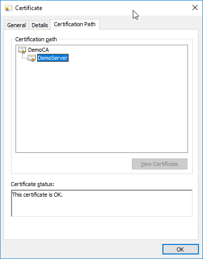

You can see the certification path and DemoCA as the root, the CA that has
signed the DemoServer certificate.

####Creating Self-Signed Certificate

Self-signed certificates can be used on an intranet. When clients only
have to go through a local intranet to get to the server, there is
virtually no chance of a man-in-the-middle attack. You can use it on a
development sever, there is no need to spend funds on a trusted
certificate when you are just developing or testing an application. Also
self-signed certificate can be used on a small site that transfers
non-critical information.

Open the **XCA tool**. Create new RSA key pairs (as shown in the begging)
named Self-Signed Demo Server. Go to the `Certificates` tab and click on
the `New Certificate` button. In the `Signing` section choose
`Create a self signed certificate`.

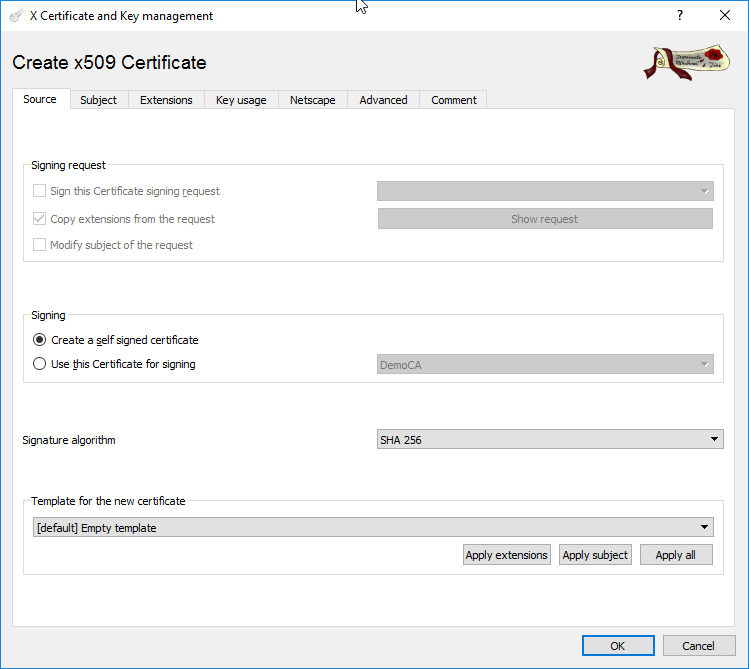

Navigate to the `Subject` tab. Enter `SelfSignedDemoServer` in the
`commonName` field. Ensure that the selected `Private key` is
`Self-Signed Demo Server`.

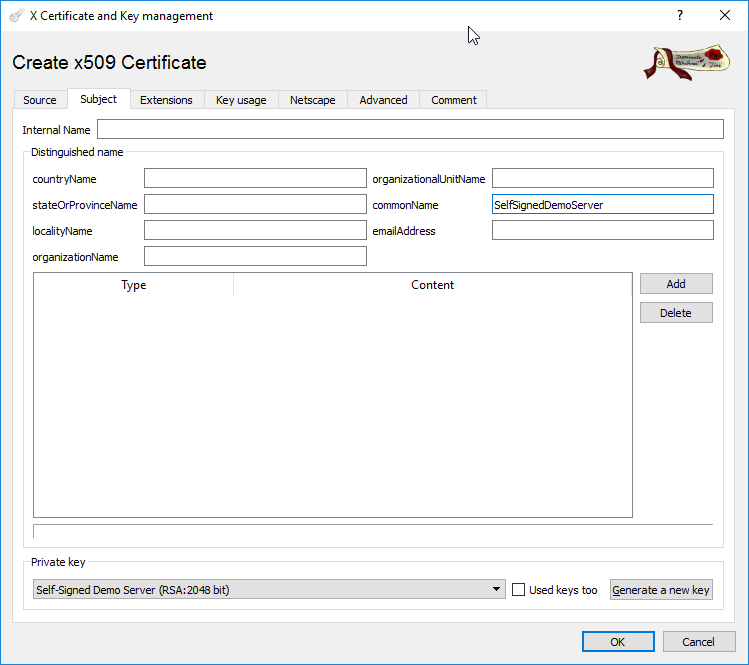

Navigate to the `Extensions` tab and set the `Validity` to 10 years (for example purposes).

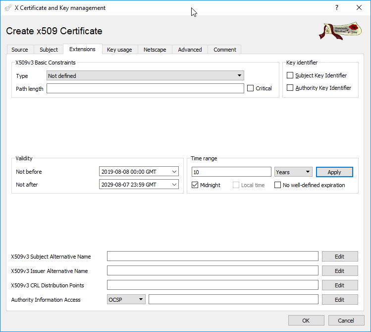

Navigate to the `Key usage` tab and select TLS Web Server Authentication and TLS Web Client Authentication in `X509v3 Extended Key Usage` section.

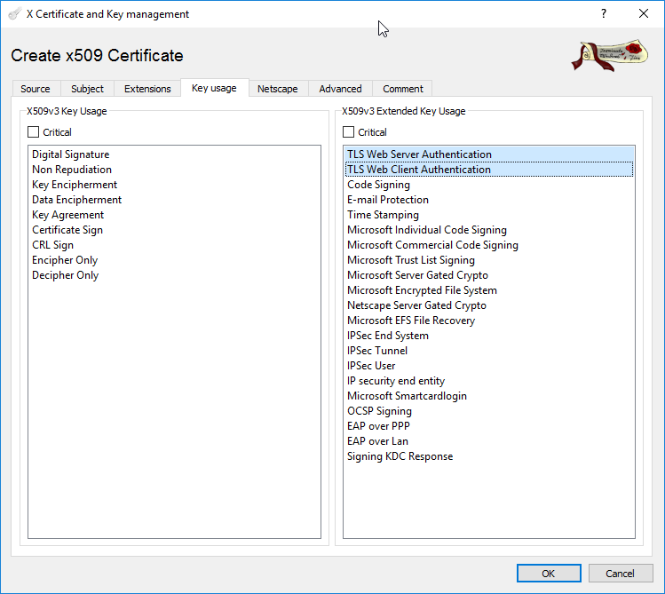

Press `OK` to finish.

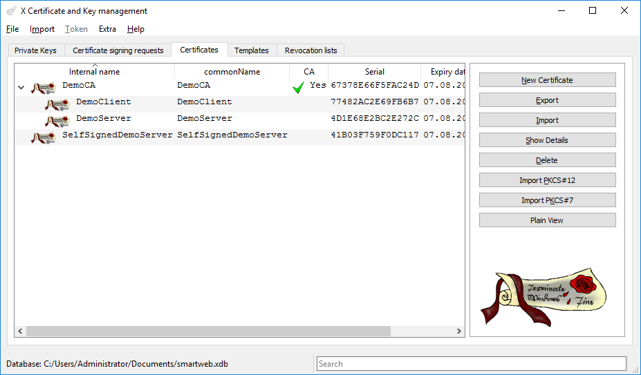

Now export the newly created self-signed certificate in **PKCS #12** format
and import it in the Local Computer certificates (in the `Personal` folder as
explained before).

!!! note "Note:"
     You can use it as a certificate for binding HTTPS in IIS,
     just keep in mind that visitors will see a warning in their browsers
     when connecting to an IIS site that uses a
     self-signed certificate until it is permanently stored in their
     certificate store in `Trusted Root Certificate Authorities`.
