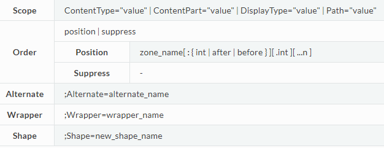
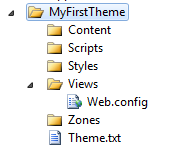
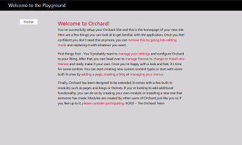
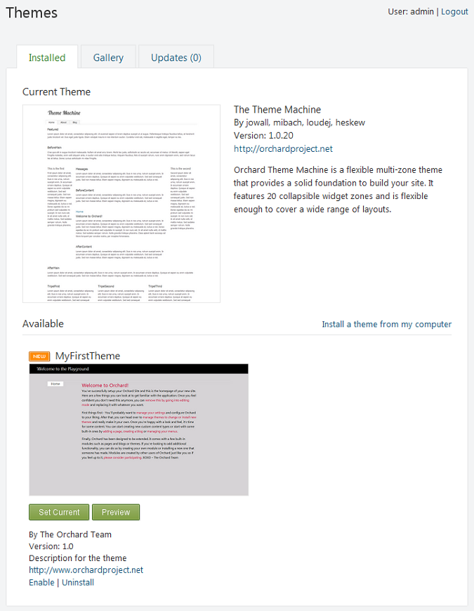

#
**SmartWEB** allows for customization of the design and overall appearance of the application. Each element's style can be created or altered to suit specific requirements by creating and using **Themes**.

##Understanding Placement.Info
When rendering the collections of parts and fields -or any other shapes- that compose a page or content item, the Content Management System needs to know in what order to do so. `Placement.info` files are XML files with rules that can be used to determine what shapes go into what zones and in what order. This enables not only the rendering of each shape to be customized, but also the order in which they get rendered.

In the CMS (Content Management System), used by **SmartWEB**, content is built as a composition of arbitrary parts. Some of them are, for example: route (`Autoroute` Part), title (`Title` part), contents (`Body` part), tags (`Tags` part), comments (`Comment` part), and a few additional technical parts (`Common` and `PublishLater`) etc.

Adding a new part and displaying it can be done without touching the templates that render objects. This is possible because the CMS separates `layout` into two stages:

* `Rendering` - performed by generating HTML from templates or shape methods.
* `Placement` - done through the `Placement.info` file.

This way, parts can not only specify their default rendering, which can be overridden by themes, they can also specify where they prefer to be rendered relative to other parts (which can also be overridden by themes).

!!!note "Best Practice:"
      Avoid creating templates for high level Content Types. Instead, create templates for Content Parts and Content Fields then change their order with placement.

!!!note "Note that:"
     * Placement works only on parts (and some fields) of content items.
     * Place element attributes are shape names (not alternate names).
     * You can find shape names via shape tracing or in driver code.
     * Match element attributes include ContentType, DisplayType, and Path.
     * Path can include a * to represent all child paths.
     * You can override module placements in the theme


####Syntax Overview

```
<Placement>
    [ <Match scope> ]
        <Place Shape_Name="order[;alternate][;wrapper][;shape]" />
    [ </Match> ]
</Placement>
```
 

####The `Placement.info` File
Most modules and themes have a `Placement.info` file at their root. This is an XML file that specifies the placement of each part of a content item.

Example of a placement file:

```
<Placement>
    <Place Parts_Tags_Edit="Content:7"/>
    <Match DisplayType="Detail">
        <Place Parts_Tags_ShowTags="Header:after.7"/>
    </Match>
    <Match DisplayType="Summary">
        <Place Parts_Tags_ShowTags="Header:after.7"/>
    </Match>
    <Match DisplayType="SummaryAdmin">
        <Place Parts_Tags_ShowTags="-"/>
    </Match>        
</Placement>
```
#### Placement Scope
A placement file acts at the Content Item level. This means that you can use it to reorder the display of the parts of anything that is a content item, but not necessarily arbitrary shapes. If a shape that is not representing a content part needs placement, it is up to you to provide a placement mechanism for that shape.

####Comments
Comments can be included in the `Placement.info` using normal `<!-- comment -->` syntax.

####The `Placement` Element
The Placement element must be present at the root of the Placement.info document. It is a simple container.

####The `Place` Element
The Place element is the main entity in a Placement.info file. It can have any number of attributes, although it's recommended for readability to have only one shape place defined per Place element. For additional shapes, you can add more Place tags, one per line.

Single shape per line example:
---

##Understanding Alternates

Alternates are a set of related shapes with corresponding templates or layout files that enable you to control how different types of content are rendered within a theme. For example, you can use alternates to apply one layout file for the home page but another layout file for subpages, or you can use alternates to render elements one way when the elements are in a detailed view but a different way when they are in a summery view. Alternates are particularly useful when you have different types of content and you want to customize the appearance of these different types of content.


---
##Generating a New Theme
There are two ways of creating a theme for **SmartWEB**.

To start building a new theme, you could simply copy the directory structure for the
`TheThemeMachine` theme(found in the **Themes** folder of the solution), which comes installed by default, and paste it into a new sibling directory.

!!!note
     This is a preferred way of creating a theme due to it's simplicity, overall effectiveness and flexibility.

The second way of creating a theme is by using the `Command-line Interface`.
`Orchard CLI` offers quick access to many common admin
functions without the need to open up a browser and navigate to different property
pages. 

Open up a command window (or PowerShell) and
navigate to the bin directory of the system. There you’ll find a file named `Orchard.exe`.
Execute that file. After a few moments, you’ll see an Orchard prompt.
Enter the following command:

```
orchard> feature enable Orchard.CodeGeneration
```

Once the code generation tools are enabled, they will provide useful shortcuts for creating and managing themes and modules.

There are three available options for 
new theme creation:
CreateProject
Whether to create new project for this theme. The default is false.
IncludeInSolution
Include this theme in the solution. The default is true.
BasedOn
Inherit default templates from an existing theme.

The following example will neither inherit from an existing theme nor create a
new project. The theme code generation will be ran without any arguments:

```
orchard> codegen theme MyFirstTheme
```

The `codegen` command creates the code structure for a new theme and sets the name of the theme to MyFirstTheme. The command generates the following folder structure:

  

The only files created are the Theme.txt and Views\Web.config files. The Theme.txt file is the theme manifest and is where the `Admin Panel` (dashboard) looks for information such as the name of the theme. Web.config is a configuration file that ASP.NET MVC requires for rendering any views that are in the Views folder. You seldom have to make changes in the Web.config file.

####Creating Styles for Your Theme

In the Styles folder, create a file named Site.css. (You can name the file anything you want as long as it has a .css extension.)

Example:
```
/*
Theme: My First Theme
Author: 
Copyright: 
*/

/* Colors Palette
Background: #d3d3d3
Text: #000
Main Accent: #999
Links: #c03
*/

/* Reset
***************************************************************/
html, body, div, span, applet, object, iframe,
h1, h2, h3, h4, h5, h6, p, blockquote, pre,
a, abbr, acronym, address, big, cite, code,
del, dfn, em, font, img, ins, kbd, q, s, samp,
small, strike, strong, sub, sup, tt, var,
dl, dt, dd, ol, ul, li,
fieldset, form, label, legend,
table, caption, tbody, tfoot, thead, tr, th, td {
    margin: 0;
    padding: 0;
    border: 0;
    outline: 0;
    font-weight: inherit;
    font-style: inherit;
    font-size: 100%;
    font-family: inherit;
    vertical-align: baseline;                                       
}

header, footer, aside, nav, article { display: block; }

/* Clearing Float
***************************************************************/
group:after {
    content: ".";
    display: block;
    height: 0;
    clear: both;
    visibility: hidden;
}

.group {display: inline-block;}  /* for IE/Mac */

/* General
***************************************************************/
body {
    font: normal 100% Segoe UI,Trebuchet,Arial,Sans-Serif;
    height: 100%;
    text-align:left;
    color:#000;
    background: #d3d3d3;
}


/* Headings */
h1,h2,h3,h4,h5,h6,legend {font-weight:normal; font-style: normal;}

h1 {font-size: 160%;}
h2 {font-size: 145%;}
h3 {font-size: 130%;}
h4 {font-size: 120%;}
h5 {font-size: 105%;}

p           { margin: 0 0 1em; line-height: 1.538em; }
p img.left  { float: left; margin: 0.923em 0.923em 0.923em 0; padding: 0; }
p img.right { float: right; margin: 0.923em 0 0.923em 0.923em; }

a:focus, 
a:hover     { text-decoration: underline; }
a           { color: #c03; text-decoration: none; }

#header {
    background:#000;
    color: #000;
    width:100%;
    height:50px;
    margin-bottom:40px;
}

#branding h1{
    font-size: 140%;
    color:#fff;
    padding:8px 0 0 40px;
}

/* Structure
***************************************************************/
#layout-navigation 
{
    width: 960px;
    margin: 0 auto;
    display: block;
    border-bottom: 1px solid #dbdbdb;
}

nav ul 
{
    padding: 0px;
    margin: 0px;
}
    nav ul li
    {
        border:1px solid #dbdbdb;
        background:#f6f6f6;
        display:block;
        float:left;
        margin:0 2px -1px 0;
    }
    nav ul li.current 
    {
        border-bottom: 1px solid #fff;
        background:#fff;
    }
    nav ul a 
    {
        padding:0 18px;
        display:block;
        float:left;
        color: #333;
        font-size: 1.077em;
        text-decoration:none;
        line-height:24px;
    }

/* Main
***************************************************************/
#main {
    margin:0 auto 40px;
    width:600px;
}

/* Secondary
***************************************************************/

/* Forms
***************************************************************/

/* Misc
***************************************************************/

```

####Adding a Layout to Your Theme
In the `Views` folder of the theme directory, there must always be a layout file. If one is not already present, it needs to be created. (Layout.cshtml)
Layouts are the outermost shape that is rendered within the `body` element. For example, this is typically where you define the main widget zones.

Example:

```
@{
    Script.Require("ShapesBase");
    Style.Include("site.css");
}

<div id="header">
    <div id="branding">
        <h1>@T("Welcome")</h1>
    </div>
</div>
<div id="layout-navigation" class="group">
    @Display(Model.Navigation)
</div>
<div id="main">
@Display(Model.Content)
</div>
```

This file defines the basic structure of the `url` that is rendered.

####Adding a Theme Image

You can provide a thumbnail image that represents your new theme, which will be displayed in the `Admin Panel`. The image file must be named _Theme.png_ and it must be placed in the theme's root folder. The following image represents this new theme.

  


####Applying a New Theme
To apply a theme, in the Dashboard, click Themes. Under Available, select the new theme and then click Set Current.

 