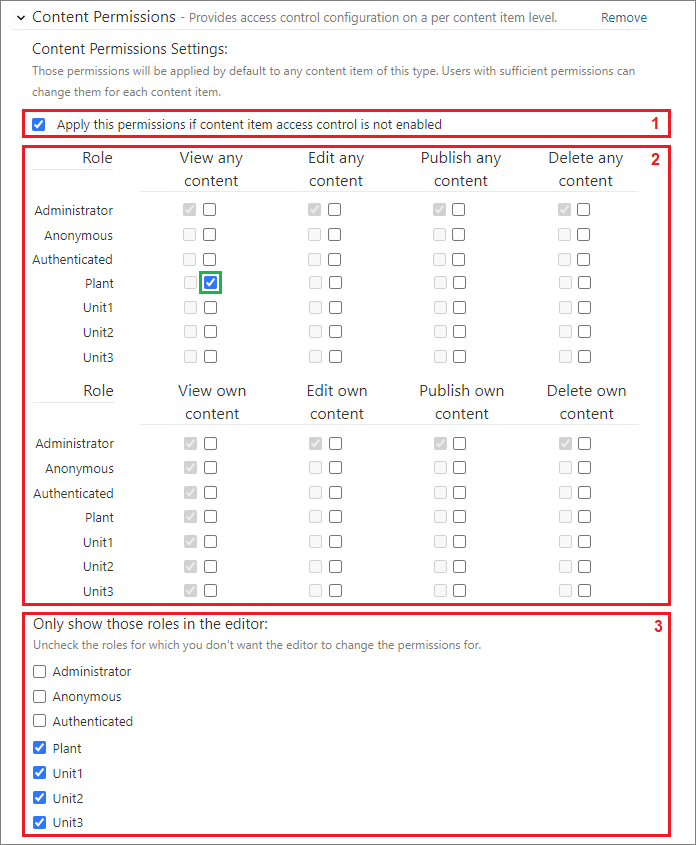
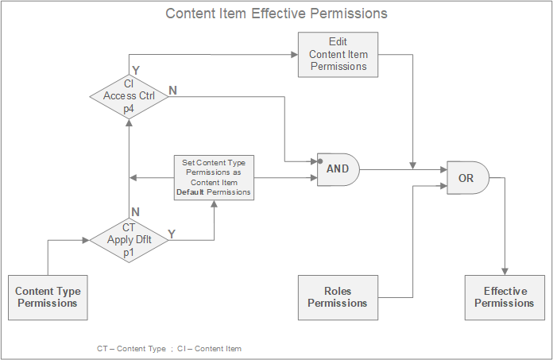

#

This chapter discusses methods for granting users access rights to front-end content, as well as rights for managing content from the administrative interface. In this chapter, you will learn how to manage user access to content by creating custom roles tailored to your specific case and content. You will also understand the origins and significance of permissions, which are the fundamental units for granting rights.  

---

## Configuring Users

In **SmartWEB**, users gain access rights to system resources through assigned roles. System administrators create roles and delegate permissions to these roles, which are then inherited by users when a role is assigned to them. There are three ways to create users in **SmartWEB**:  

> - Import Users  
> - Automatic User Creation  
> - Manual User Creation  

Like any content, users can be exported and subsequently imported into another system. This is discussed in the chapter [Import and Export](../import-and-export).  

Automatic user creation is facilitated by some of the `QuickLogOn` modules. These modules allow users to authenticate via an external authentication system. **SmartWEB** supports authentication with `Google`, `Microsoft`, `Facebook`, `X` and others. This is discussed in more detail in the [Modules](../modules) and [Security Considerations](../security-considerations) chapters.  

Manual users are created and managed by navigating to the `Users` link in the `Admin Panel`. The system displays user management page. Next to the `Users Tab` is the `Roles Tab`, which leads to the role management page. This is illustrated in the following image.  

Similar to other item management pages, users are displayed in rows with their properties shown in separate columns. To the right of each row are `Actions` that can be taken for each user. The information displayed for the users includes their username, email address, the timestamp of when the user was created, the timestamp of the user's last authentication, and whether the user was created manually or automatically via `QuickLogOn` processes.  

The available actions on the right are:  

> - `Edit` - Directs to the user edit page.  
> - `Delete` - Deletes the user.  
> - `Disable` - Disables the users, preventing them from authenticating to the system. This action is available only for `active` users.  
> - `Approve` - Reactivates inactive users.  

A graphical icon next to the username indicates the user's status. A green icon signifies that the user is `approved`, while a red icon indicates that the user is `disabled`.  

On the right-hand side of the `User Management` page, there is a `Add a New User` button that opens a form for creating a new user, as shown in the image below.  

In this form, enter the user information and select the roles to be assigned to the user. Users can have one or more roles assigned to them. If the `Change Password` checkbox is selected, the users will be prompted to change their password the next time they authenticate. After clicking the `Save` button, the system will create the new user.  

The `User Edit` form is similar in appearance to the `New User Creation` form. It is accessed via the `Edit` link associated with the specific user.  

---

## Configuring Roles

As previously mentioned, the `Role Management` page is accessed by navigating to the `Roles Tab`. The following image shows what this page looks like.  

Similar to other pages, we have a list of items, which in this case are the roles available in the system. On the right-hand side, as usual, are the `Actions` that can be taken on the roles. In this case, there are only two actions:  

> - `Edit` - For editing a role.  
> - `Delete` - For deleting a role.  

 The system has several service roles that are created during installation. These roles are described in the following table.  

| Role                  | Description                                                      |
|-----------------------|------------------------------------------------------------------|
| Administrator         | Have full control over the site's settings and contents. This role is assigned to all   Administrators.                                                                            |
| **Anonymous**         | This role cannot be manually assigned to users. It is automatically assigned by   the system to users who attempt to access system resources without authenticating   themselves.                 |
| **Authenticated**     | This role cannot be assigned to users manually. It is automatically assigned by   the system to users who attempt to access system resources after authentication.                                   |
| Author                | The idea is to configure this role so that users assigned to it can create content   for themselves only. In other words, they are the only consumers of the content   they create.                  |
| Contributor           | The idea is to configure this role so that the users it is assigned to can create content   that is available to other users. Finally, this content may be validated   by `Moderators` and edited by `Editors`, in which case contributors should not have   publishing permissions to the content.                                |
| Editor                | If such a role is used, it must be configured so that it cannot create new content and   can only edit/publish content created by `Contributors`.                                                 |
| Moderator             | If such a role is used, it must be configured to be able to validate and publish content   created by `Contributors` and/or `Editors`.                                                           |

The `Anonymous` and `Authenticated` roles are important because they are automatically assigned to users and can be used to delegate rights for a wide range of services and content. For this reason, great care must be taken with the permissions assigned to these roles. The other service roles are optional. In most cases an implementation of `Author` and `Contributor` will be sufficient.  

Оn the right-hand side of role management page, there is a `Add a Role` button for adding a new role. Roles can be manually configured and can also be exported and then imported into other systems. When adding a role manually, configure `Rome Name` and select the role's permissions from a `List of Permissions` as shown in the next image.  

The next section discusses permissions in more detail. The `Role Edit` form is similar in appearance to the `New Role Creation` form. It is accessed via the `Edit` link associated with the specific role.  

---

## Understanding Permissions

The `list of permissions` is generated dynamically from the modules running in the system. When a module exposes a resource, it can also define permissions that govern access to that resource. These permissions appear in the `list of permissions` and can be assigned to roles. On the `front-end`, when a user attempts to access a resource, the request is processed by the module that manages the resource. The module first checks if the user has the necessary permissions to perform the requested operation. If the permissions are verified, the module proceeds with executing the request. If the user does not have the required permissions, the module generates an error and returns an **"Access Denied"** service response to the request.  

The equivalent set of permissions for each user is the unique set of permissions provided by all assigned roles. The following diagram illustrates this process.  

Four roles are considered, each with different set of permissions. The first user is assigned all four roles, while the second user is assigned only the first and fourth roles. Consequently, the first user inherits all permissions from all four roles, while the second user inherits only the permissions associated with the first and fourth roles.  

!!! attention "Grant Permissions:"  
      In **SmartWEB**, permissions are granted to roles, but not explicitly denied. In other words, if a user belongs to a role that has a given permission, he has that permission. To revoke a permission, you must either remove a user from the role to which the permission was granted, or remove the permission from the entire role.  

Some permissions are `Effectively` granted. This means that they are not explicitly granted, but are implied by another permission. For example, assigning the `Authenticated` role to a particular resource illustrates this concept. As this role is automatically assigned to any user who has authenticated, it follows that any user can access this resource. If we look carefully at the image in the previous section, we will notice that there are three permissions surrounded by green boxes that are `Effectively` granted, but not enabled by the permission configuration for the given user. These permissions are a consequence of being activated in the `Authenticated` and `Anonymous` roles. A possible scenario is that the `Access site front-end` permission is activated in the `Anonymous` role and the `View own page` and `View page by others` permissions are activated in the `Authenticated` role. With such a configuration, all users will effectively have these three permissions granted, without the ability to disable them for a specific user. In the next chapter we will look at configuring permissions in roles in more detail.  

---

## Role Permissions

In this section we will deepen our knowledge of the permissions assigned to roles. As mentioned earlier, permissions are defined by modules that provide content or services to which access needs to be controlled. There are two groups of permissions that appear in the list of permissions:  

> -  Core Module Permissions  
> -  Custom Module Permissions  

---

#### Core Modules Permissions

These are permissions managed by the core of the `CMS` (Content Management System). These permissions cannot be managed by administrators because when the site is launched, core is running and these permissions are present in the permissions list. Core also consists of modules, but these modules cannot be disabled. The following image shows an example of the permissions defined by the `Core Contents` module.  

We will look at these permissions in detail because they enable other content permissions and it is important to understand them properly. Their purpose is as follows:  

> - `Edit own content` - The user can edit content created by himself.  
> - `Edit content for others` - The user can edit content that has been created by other users.  
> - `Publish or unpublish own content` - The user can publish content created by himself.  
> - `Publish or unpublish content for others` - The user can publish content that has been created by other users.  
> - `Delete own content` - The user can delete content created by himself.  
> - `Delete content for others` - The user can delete content that has been created by other users.  
> - `View all content` - Allow the user to access and view all content.  
> - `View own content` - The user can only access and view content created by himself.  
> - `Edit pusblished content` - Allows the user to edit published content.  

For all content types, similar permissions are automatically created when the content type is created. This is managed by the `Core Content` module. If a particular permission for a role needs to be configured across all existing and future content types, this permission can be placed in the `Content Feature` section. In this way, the permission is automatically propagated as a `Effective` permission across all content types for the given role.  

!!! tip "Propagating Content Permissions:"  
        If a specific permission needs to be configured for all roles and all content types, it can be configured in the `Content Feature` section of the `Authenticated` role.  
        If it needs to be done for a specific content type only, but still for all roles, then the permission should be applied in the permissions section of that content type for the `Authenticated` role.  

        As a `Best Practice` for propagating content permissions, which is almost always applicable, we recommend the following:  
        > - For the `Anonymous` role, enable the `Access site front-end` permission, as users will need to access the site before they can authenticate.  
        > - For the `Authenticated` role, enable the `View own content`, `Publish or unpublish own content` and `Edit own content` permissions in the `Content Feature` section, as in most cases users will need to be able to view and edit their own content.  

---

#### Custom Modules Permissions

These are the permissions managed by the custom modules. These permissions are only available in the `permissions list` when the corresponding module is running. The following image shows an example of the permissions defined by **SmartWEB** module `Smartsys OPC XML DA Gateway`.  

The first two permissions, `Manage OPC XML DA Gateways` and `Manage OPC XML DA Data Providers` grant rights to configure `OPC DA Gateways` and `OPC DA Providers`. Detailed information about these gateways and providers can be found in the chapter [Access to OPC Data](../access-to-opc-data). The remaining six permissions (`Execute *`) grant access to use each of the methods provided by the DA Providers. Each configured gateway has a `Permissions Section` on its configuration page where access to the methods of the respective gateway must be granted and quotas configured for each role. In other words, the permissions for the roles provide global access to the gateways, while access to the methods of each gateway is granted within the configuration of that gateway. Two approaches can be used:   

> - Grant access to methods to all roles via configuration in the `Authenticated` role.  
> - Grant access to the methods by configuring permissions for each role individually.  

The advantage of the first approach is that it saves the effort of configuring methods for each role, as they are inherited from the `Authenticated` role. The disadvantage of this approach is that if a method needs to be prohibited for a particular role, this must be done separately for each gateway, as it is not possible to manipulate the permission through the role. Such manipulation is only possible through the `Authenticated` role, but prohibiting it there will result in the method being prohibited for all roles.  

With regard to the first two permissions for configuring `DA Gateways` and `DA Providers`, it is recommended that this remains an administrator-only privilege.  

There are other `Custom Module Permissions` that are exposed by specialized modules. Their names are descriptive, and once you become familiar with the specifics of each module, you will be able to easily identify the purpose of each permission.  

---

#### Other CMS Permissions

Other interesting role permissions provided by the `CMS` framework are listed in the table below. Some of these permissions are exposed by `Core Modules`, while others are exposed by `Custom Modules` that are also part of the `CMS` framework.  

| Permission                              | Description                                                         |
|-----------------------------------------|---------------------------------------------------------------------|
| Access admin panel                      | Allows users to access the `Admin Panel`. It is recommended that this   permission is only used for users who will be creating or editing content   and media, and for those who will be performing system configuration.                                                                                                  |
| Access site front-end                   | Allows access to the front-end interface of the site. It is recommended   that this permission be assigned to the `Anonymous` role. This way,   all users will be able to access the site front-end and then authenticate.                                                                                                   |
| Manage Settings                         | Allows configuration of [Site Settings](..\site-settings). It is strongly recommended that this   permission is only enabled for the `Administrators` role.                                             |
| Apply a Theme                           | Allows configuration of the site's `Default Theme`. It is strongly   recommended that this permission is only enabled for the `Administrators`   role.                                                  |
| Managing Widgets                        | Allows the creation and configuration of [Widgets](..\widgets).   Typically, this permission is granted to `Administrators` and `Contributors`.                                                   |
| Change Widgets Position   And Layer  | Allows configuration settings related to the appearance of widgets.   Typically, this permission is granted to `Administrators` and `Contributors`.                                                   |
| Set Home Page                           | Allows changing the `Home Page`. It is strongly recommended that this   permission is only enabled for the `Administrators` role.                                                                          |
| Managing Media                          | Allows access to `Media` resources. Typically, this permission is granted   to `Administrators` and `Contributors`.                                                                            |
| Manage main menu                        | Allows the creation of [Navigation and Menus](..\navigation-and-menus). It is strongly recommended   that this permission is only enabled for the `Administrators` role.                            |
| Managing Users                          | Allows role members to create and modify users. Typically, this permission   is granted to `Administrators` and other groups with the authority to create   new users.                                       |
| Managing Own Users                      | Allows role members to create and modify users, but does not allow them   to modify users created by others.                                                                                              |
| Managing Roles                          | Allows role members to create new roles and modify existing ones.   This permission is typically reserved for `Administrators`.                                                                        |
| Assign Roles                            | Allows role members to assign roles to users. This privilege is typically   granted along with the `Manage Users` permission.                                                                             |
| Grant permissions   for others       | Users with this permission can configure the `Content Permissions`   part, which is described in the next section.                                                                                  |
| Grant permission   for own content   | Users with this permission can configure the `Content Permissions`   part, but only for content they have created.                                                                                      |
| View content types                      | Allows users with this permission to view the `Content Types` configuration.   For more information on `Content Types`, see the [Content Anatomy](..\content-anatomy) chapter.                          |
| Edit content types                      | Allows users with this permission to create and edit `Content Types`.   Typically this permission is reserved for `Administrators`.                                                                    |
| Import Data                             | Allows users with this permission to import content. This is normally   a privilege reserved for `Administrators`. See the [Import and Export](..\import-and-export)   chapter for more details. |
| Export Data                             | Users with this permission can export content. In addition to   `Administrators`, this permission can be assigned to users responsible for   system backups.                                        |
| Managing Media Files                    | Allows users to upload, download and delete files from the **SmartWEB**   `Media Library`. This privilege is typically granted along with   the `Managing Media` permission.                            |
| Manage tags                             | Allows users to create, edit and delete `Tags`. For more information   on `Tags`, see the [Content Classification](..\content-classification#tags) chapter.                                               |
| Manage Layer Rules                      | Allows users to create and apply layout management rules. For more   information on `Layer Rules`, see the [Widgets](..\widgets) chapter.                                                                  |    

Some of these permissions are dependent on others and are automatically assigned as `Effective` permissions. An example of such a relationship is between the `Managing Roles` and `Assign Roles` permissions. When the `Managing Roles` permission is enabled, the `Assign Roles` permission is automatically activated as a `Effective` permission. The reverse is not true. In other words, users who have the right to create and configure roles are automatically given the right to assign those roles to users. However, users who have the right to assign roles do not necessarily have the right to create and configure roles, unless explicitly granted.  

!!! attention "Overriding Inherited Role Permissions:"  
    Note that if a permission is propagated through the `Anonymous` or `Authenticated` roles, or if its `Effective` activation results from a relationship with other permissions, it can be overridden by its own setting within the role. Therefore, to disable this permission, it must be disabled in both the `Effective` interactions and the role-specific settings.  
    
    For example, if the `Access Site Front-end` permission is enabled in the `Anonymous` role and is also enabled in the `AlwaysAccess` role, then if the administrator disables the `Access Site Front-end` permission in the `Anonymous` role, all users who do not have the `AlwaysAccess` role will lose access to the site front-end. However, users with the `AlwaysAccess` role will still have access.  

---

## Content Permissions

So far we have explored ways of configuring access control to content through delegated permissions for user roles on an entire content type. This means that these permissions apply to all content items of a given content type. However, there are cases where a content type is used for a wide range of content items, and it is necessary to apply access control to each content item individually. For this purpose there is a special content part called `Content Permissions`. This part needs to be included in the content type composition, where it can be configured according to the needs of the specific scenario. For more information about `Content Parts` and composing `Content Types`, refer to the [Content Anatomy](../content-anatomy) and [Custom Content In-depth](../custom-content-in-depth) chapters.  

Once the `Content Permissions` part has been added to the content type, you will have an interface for configuring the part within the content type, as shown in the following image.  

We can divide this configuration panel into three sections:  
> `(1)` - Selection box to apply default permissions.  
> `(2)` - Configuration of default permissions for content items that inherit this content type.  
> `(3)` - Configuration of user roles available for configuration in content items. Only the roles selected here will be displayed in the configuration panel at the content item level.  

The next image shows the `Content Permissions` configuration panel, now viewed from the `Content Item` perspective.  

We can divide the configuration panel into two sections:  
> `(4)` - Enable Content Item access control.  
> `(5)` - Configure Content Item permissions.  

Let's look at the whole process of creating permissions for content items. At `Content Type` level there are two possible scenarios:  

> - The checkbox at `position 1` is **Selected**: In this case, any permissions configured in the panel at `position 2` will be applied as defaults to the configuration of newly created content items.  
> - The checkbox at `position 1` is **Deselected**: In this case, the permissions configured in the panel at `possition 2` are not transferred when a new content item is created.  

There are also two possible scenarios at the `Content Item` level:  

> - The checkbox `position 4` is **Selected**: In this scenario, the panel at `position 5` is enabled, allowing the final configuration of content item permissions. As mentioned above, if the checkbox at `position 1` is enabled, the corresponding configurations from the panel at `position 2` will be transferred here. In our example, the `View this item` permission is transferred for the `Plant` role. This configuration is highlighted with a green square in both images above. In this panel, permissions can be further customized. New permissions can be added, and default permissions can be removed. In our example, the `View this item` permission has been added for the `Unit2` role.  

> - The checkbox `position 4` is **Deselected**: In this scenario, the panel at `position 5` will not be visible, and therefore no settings can be made at content item level. However, if the checkbox at `position 1` is enabled, the default permissions configured at the content type level are still transferred to the content item, but they are not visible because the panel at `position 5` is hidden. If the user who creates the content item does not have the permissions to `grant permission for own content` or `grant permission for others`, then the user will not be able to select the checkbox at `position 4`. In this case, the default permissions configured at the content type level will always be used.  

This process is illustrated in the next flowchart.  

The `Effective` permissions are formed as a `OR` condition on the process described above and the permissions of the roles with respect to the given `Content Type`. There is a specific case where both checkboxes (`positions 1 and 4`) are **NOT** selected. In this case, the permissions from the content type and content item are not applied and the resulting set of permissions is formed only from the permissions configured on the roles with respect to the given content type.  

!!! tip "Propagating Default Permissions:"  
    Default permissions can be configured for any role in `position 2`, but then that role may not be allowed for the content item editor in `position 3`. In this scenario, the default permissions are applied but cannot be changed at content item level. This is appropriate if we want to configure permissions for some of the roles that should not be modifiable by users creating content items. In such a scenario, users creating content items can only change permissions for the enabled roles, but some hidden roles may inherit default permissions that cannot be manipulated.  

---

#### Summary

In this chapter we learned how to configure **SmartWEB** sites where users have restricted access to resources based on their roles. We have also seen how to create custom roles tailored to the specific content of a site, and how to inherit permissions from built-in roles `Anonymous` and `Authenticated`. We also explored the possibility of creating `Content Types` where access to their items could be controlled on a per-item basis, depending on the current user's role. It is recommended that you read the chapter [Custom Content In-depth](../custom-content-in-depth) and then create several `Content Types` and several roles with different levels of access. Experiment with what you have learned in this chapter by creating various access scenarios.  