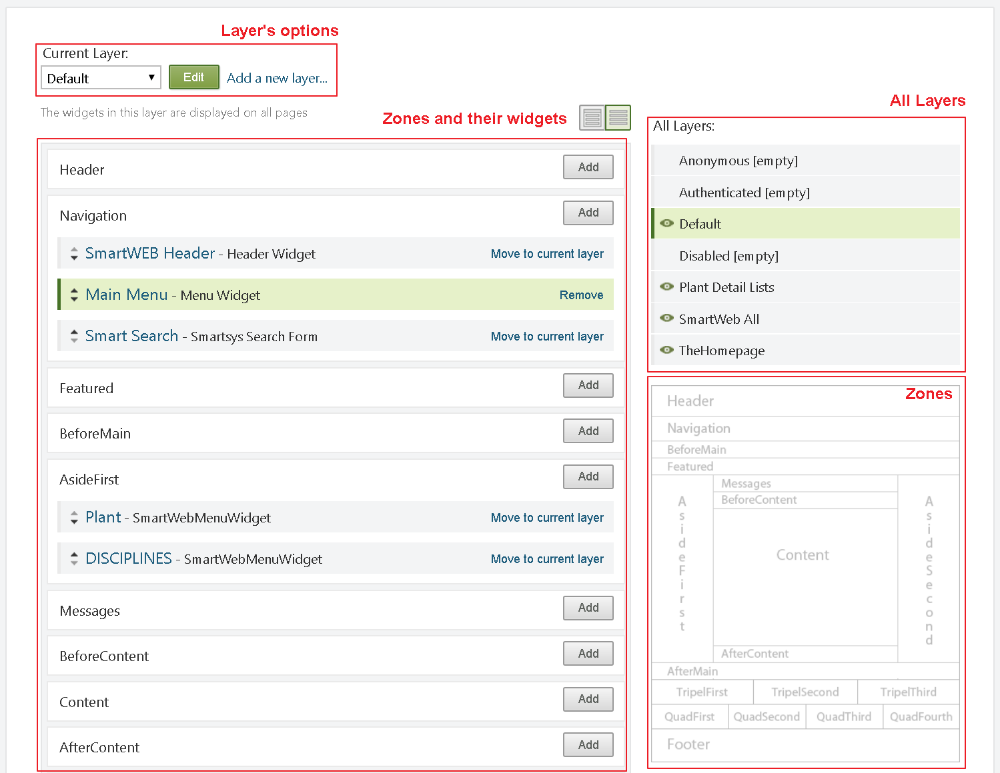
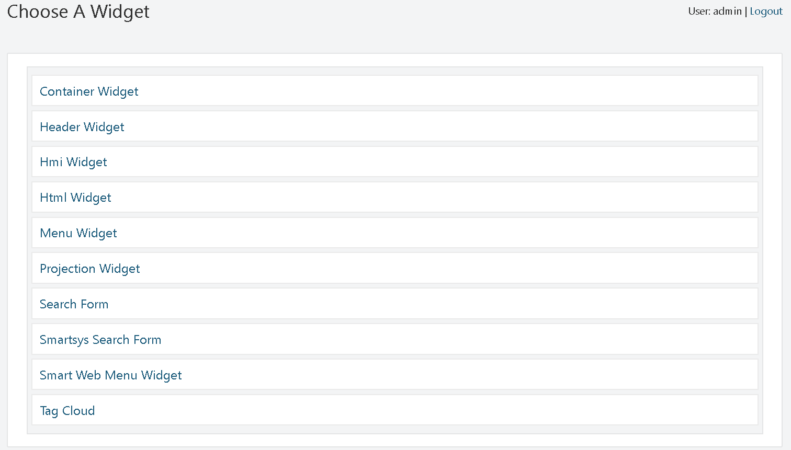
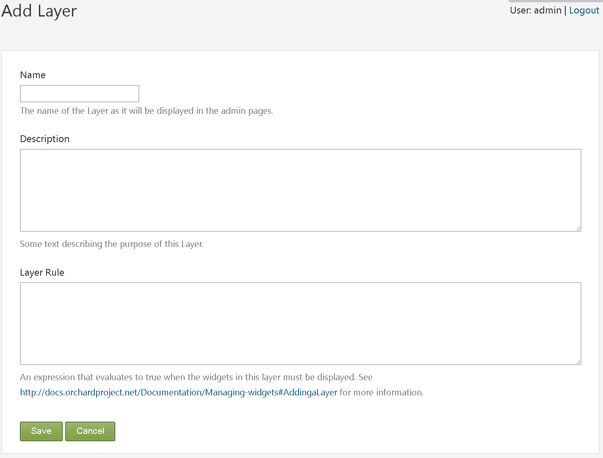
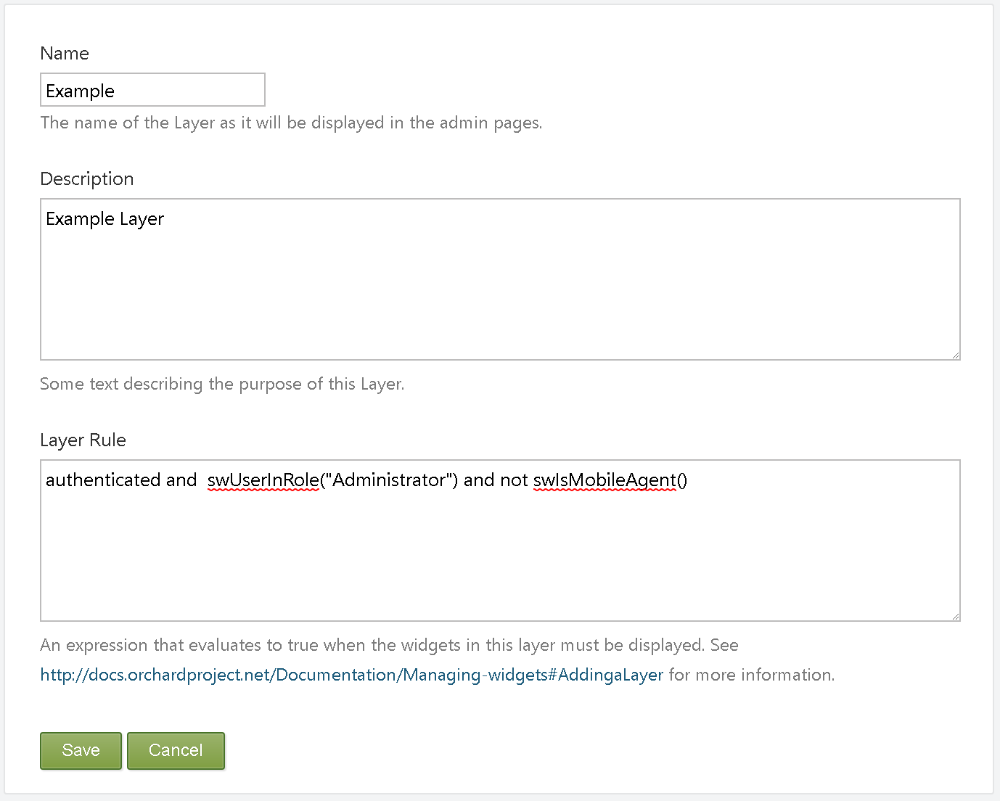
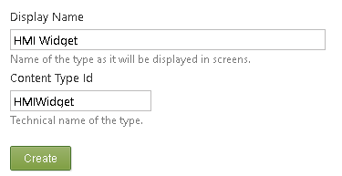
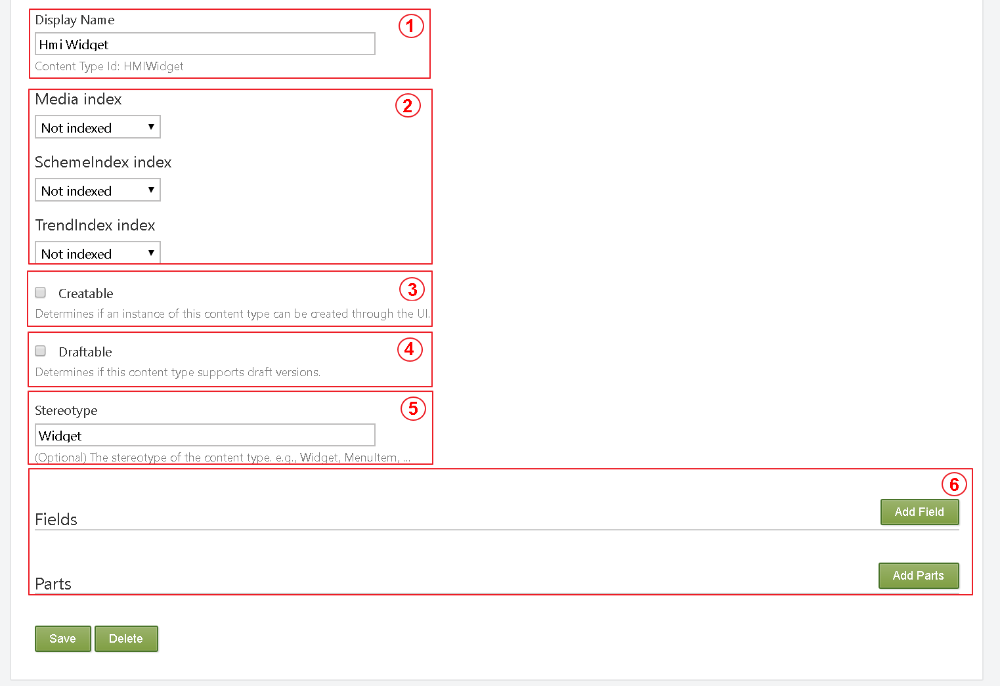
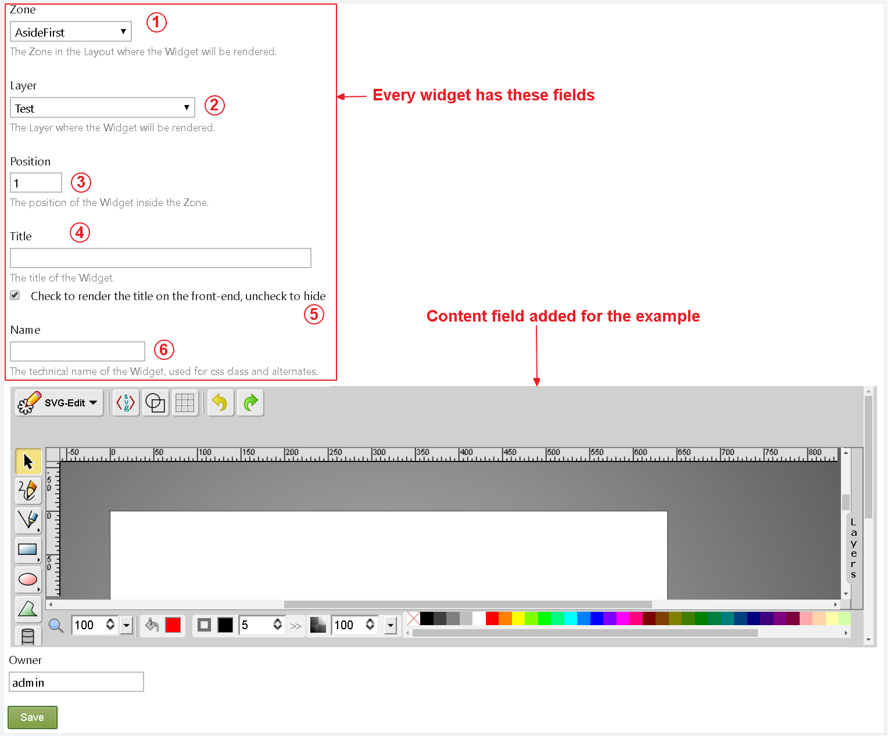
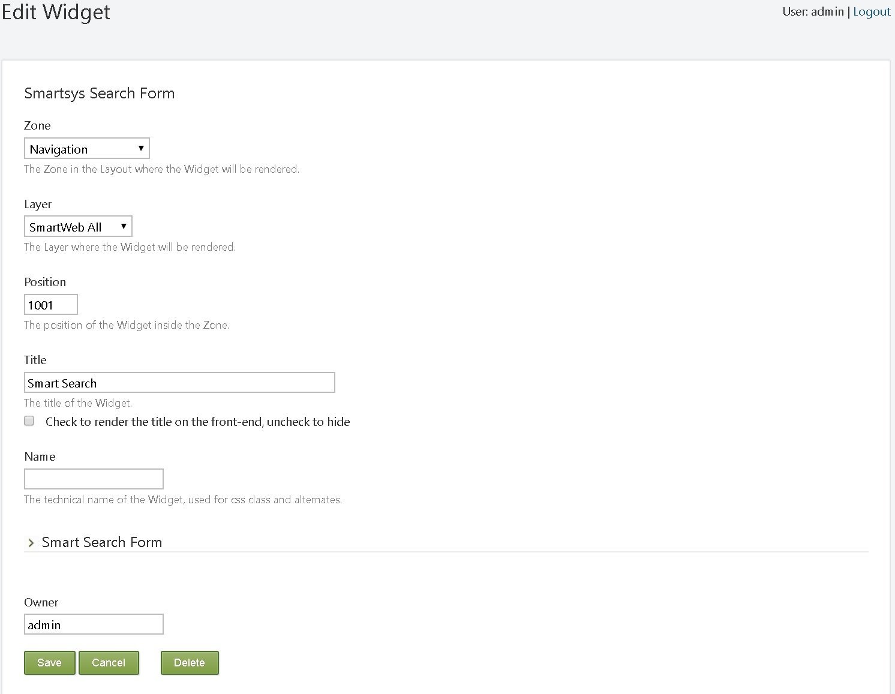

#

In **SmartWEB**, a widget is a fragment of UI (such as `HTML`) and code (such
as a [content part](...)) that can be easily mapped to any
location or zone in the active [theme](...), such as a `sidebar` or
`footer` zone. Examples of widgets include: `navigation menus`, `HMI displays`, 
and others.

To manage widgets in **SmartWEB**, navigate to `Dashboard`>`Widgets` . The
`Widgets` page presents the available widgets, and can be used to assign a
`widget` to a `layer` and a `zone`.

A `layer` can be defined as a set of rules for displaying a `widget` (or a 
group of `widgets`). In other words, a `widget` can be displayed by a `layer` on a specific page, only for users that have access to the content on that page. The `zone` dictates where the widget will be positioned on the page.

The following is an image depicts the `Widgets` section.

Whenever a `widget` becomes available (usually by enabling another feature
in the `Features` tab in the `Modules` section), **SmartWEB**
will add it to the list of available `widgets` that can be added to `zones` in
the current theme. To see the list of available `widgets` in a `zone`, click the `Add` button on one of the listed zones in
the `Widgets` section.

For example, to add a header, click the `Add` button for the `Header zone`. A
screen is displayed that allow you to choose one of the available
`widgets`.

The following table describes the `widgets` that are available by default
in **SmartWEB**:

|     Layer           |     Rule                |     Description                                                                                                             |
|---------------------|-------------------------|-----------------------------------------------------------------------------------------------------------------------------|
|    Default          |    true                 |    Always displayed on every page.                                                                                          |
|    Authenticated    |    authenticated        |    Displayed if the user is authenticated.                                                                                  |
|    Anonymous        |    not authenticated    |    Displayed if the user is anonymous.                                                                                      |
|    Disabled         |    false                |    Not displayed. This layer is provided as way to save the configuration of widgets that are not currently displayed.    |
|    The Homepage     |    url("~/")            |    Displayed on the home page.                                                                                              |
|    SmartWeb All     |    true                 |    The widgets in this layer are displayed on all pages.                                                                     |
|    Default          |    true                 |    The widgets in this layer are displayed on all pages.  

**SmartWEB** comes with a number of `layers` already defined. You can define
additional `layers` as needed, as discussed later in Adding a Layer. In
the Widgets screen, you can edit the existing layers by selecting a
`layer` in the Current Layer drop-down list, or you can add new `layer` by
clicking `Add a new layer`. The following table lists the default layers,
shows the `rule` that defines the `layer`, and describes the effect of the
`layer`.

|     Layer           |     Rule                |     Description                                                                                                             |
|---------------------|-------------------------|-----------------------------------------------------------------------------------------------------------------------------|
|    Default          |    true                 |    Always displayed on every page.                                                                                          |
|    Authenticated    |    authenticated        |    Displayed if the user is authenticated.                                                                                  |
|    Anonymous        |    not authenticated    |    Displayed if the user is anonymous.                                                                                      |
|    Disabled         |    false                |    Not displayed. This layer is provided as way to save the   configuration of widgets that are not currently displayed.    |
|    The Homepage     |    url("~/")            |    Displayed on the home page.                                                                                              |
|    SmartWeb All     |    true                 |    The widgets in this layer are displayed on all pages                                                                     |
|    Default          |    true                 |    The widgets in this layer are displayed on all pages  

In **SmartWEB**, a web page is divided into `zones` (regions). The available
`zones` are defined by the website\'s [theme](...). In the `Widgets`
section, the user has access to a list of all `zones` available for the currently
selected `layer`. The list also shows the widgets assigned to each `zone`
for the selected `layer`.

#### Adding a Layer {#adding-a-layer .Style4}

To add a `layer`, navigate to the `Widgets` section. Click the `Add a new layer` link. The `Add Layer` screen will then be displayed:

To create the new `layer`, enter the name of the `layer`, a `description`, and
the `rule` that defines the `layer`. Finally, click `Save`.

The `Layer Rule` value is an expression that resolves to either `true` or
`false`. If it resolves to `true` - the widget is displayed, otherwise the
widget will remain hidden.

The following table summarizes the syntax for building `Layer Rules`.

|    Rule Syntax                                   |    Module                 |    Description                                                                                                                                                                                                        |
|--------------------------------------------------|---------------------------|-----------------------------------------------------------------------------------------------------------------------------------------------------------------------------------------------------------------------|
|    url("<url path>")                             |    Orchard.Conditions     |    True if the current URL matches the   specified path. If an asterisk (\*) is added to the end of the path, all pages   found in subfolders under that path will evaluate to true (for example,   url("~/home*")).    |
|    authenticated                                 |    Orchard.Conditions     |    True if the user is logged in.                                                                                                                                                                                     |
|    ContentType("<Type>")                         |    Orchard.Widgets        |    True if the content type that is being viewed   matches the content type specified e.g. Content Type("Page")                                                                                                                 |
|    swMatchUserAgent(params object[] patterns)    |    Smartsys.LayerRules    |    Matches user agent header against   provided patterns. Operation returns true if one of the patterns has a match                                                                                                     |
|    swIsMobileAgent()                             |    Smartsys.LayerRules    |    Matches user agent name and version   against default and custom patterns if provided. Operation returns true if   one of the patterns (default or custom) has a match                                               |
|    swMatchRegex(string input, string pattern)    |    Smartsys.LayerRules    |    Matches provided input against   provided pattern                                                                                                                                                                  |
|    swUserInRole(params object[] roles)           |    Smartsys.LayerRules    |    Checks if user belongs to one of   the provided roles. Operation returns true if the user belongs to one of the   roles                                                                                            |
|    swUrl(string pattern)                         |    Smartsys.LayerRules    |    Matches url against provided   pattern                                                                                                                                                                             |
|    not (!)                                       |    n/a                    |    Logical Not                                                                                                                                                                                                        |
|    and (&)                                       |    n/a                    |    Logical And                                                                                                                                                                                                        |
|    or \(\)                                       |    n/a                    |    Logical OR                                                                                                                                                                                                         |
|    null (nil)                                    |    n/a                    |    null                                                                                                                                                                                                               |
|    >,<,>=,>=,==                                  |    n/a                    |    Comparison operators                                                                                                                                                                                               |

!!!note "Example"
    Create a `layer`that will have its elements be visible once the user is
    `authorized`, his `role` is `Administrator`, and does not use a mobile
    device.

!!!note "note"
    In **SmartWEB**, the widgets within the `zone` can come from multiple `layers`,
    but one `widget` can only be assigned to a single `layer` and if you want to use any
    conditions, the `module` responsible for it must be enabled.

#### Create custom widget {#create-custom-widget .Style4}

The process of creating a custom widget is demonstrated by creating a `Hmi
Widget`. Since the widgets are [Content Items](...), the first step in their
creation is to create a [Content Type](...). From the `Dashboard` click on the `Content`
`Definition` link, and click the `Create new type` button. Set a 
suitable name, and a `technical name` for the `Content Type`. The `technical`
`name` of the `Widget` is used for CSS classes and alternates. Finally, click the 
`Create` button. For more information about [Content Type](...).

You will then be given an option to select the `parts` for your `Content Type`.
For the example, click `Save`. The `parts` will be added in the next stage.

The following screen should now be visible:

(1) `Content Type` Id

(2) Choose where and if the content should be indexed, and which version should 
    be indexed. Two versions are available: the latest version, and the
    published version.

(3) Determines if an instance of this `Content Type` can be created
    through the UI.

(4) Determines if this `Content Type` supports draft versions.

(5) (Optional) The stereotype of the `Content Type`. e.g., `Widget`,
    `MenuItem`, ...

(6) [Fields](...) and [Pars](...)-- add Fields and Parts

Once the widget has been configured and saved, it can then be used.

#### Assigning a Widget to a Zone

To assign a widget to a `zone`, click the `Add` button on the  `zone` that you
want to add the widget to, and then select the widget that you want to add.

For example, click the `Add` button for the `Header zone` and select `Html Widget`.

The screen for adding a widget should now be available.

1.  The `Zone` in the Layout where the `Widget` will be rendered.

2.  The `Layer` where the `Widget` will be rendered.

3.  Position of the `Widget` inside the `Zone`.

4.  The `title` of the `Widget`.

5.  Check to render the `title` on the `front-end`.

6.  The `technical name` of the `Widget`, used for CSS classes and alternates.

The `fields` that need to be configured depend on the widget.
However, all widgets have: `Zone`, `Layer`, `Title`, and `Position` fields. The
`Position` field determines the relative position of all widgets within
the `zone` (in effect, z-order). Keep in mind that the widgets within the
`zone` can come from multiple `layers`. For example, two different `layers`
may have widgets assigned to the same `zone`.

The value of the `Position` field can be an `integer` or a sequence of
`integers`, separated by dots. For example, the following values are all
valid: 5, 10.1, 7.5.3.1. Widgets with lower position values will be
rendered before those with higher values.

After setting the values of the fields, click `Save`.

#### Editing or Deleting a Widget {#editing-or-deleting-a-widget .Style4}

To `edit` or `delete` a widget, in the `Widgets` section, use the `Current Layer`
drop-down list to select the `layer` that the widget is assigned to. In
the list of `zones`, displayed for the `layer`, click the widget you want to
`edit`. The the following screen should then be displayed:

